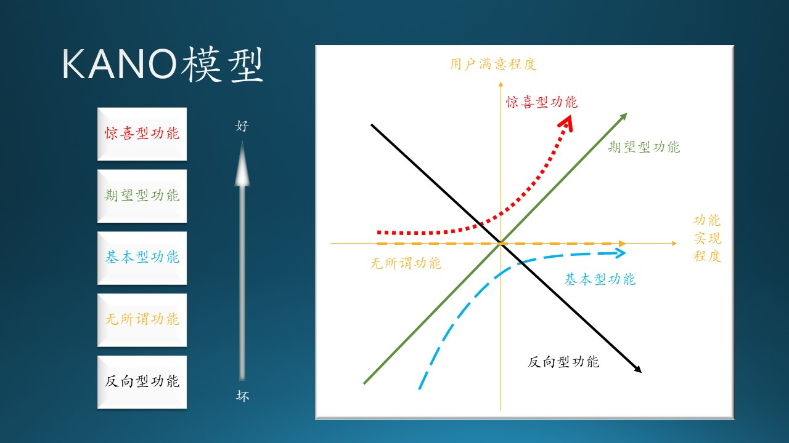
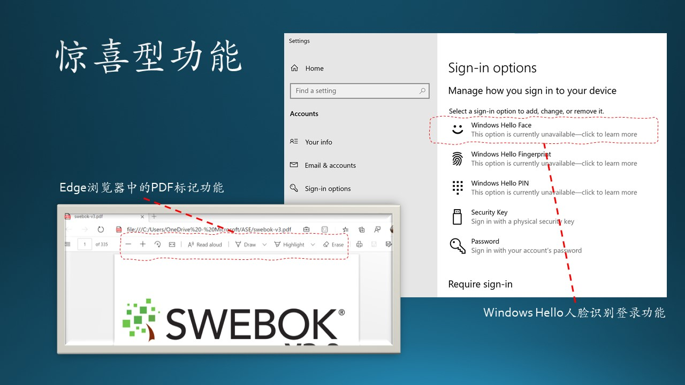
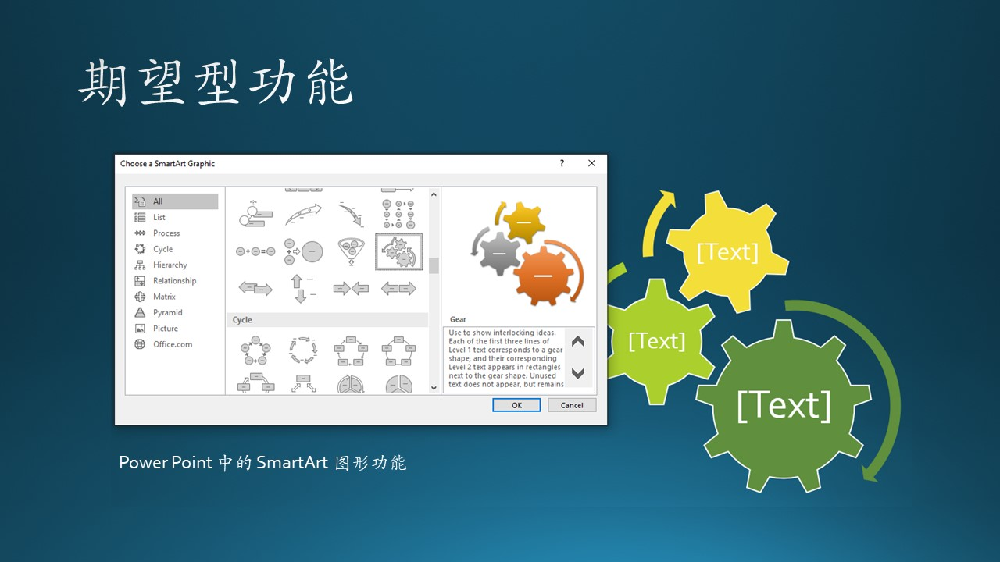
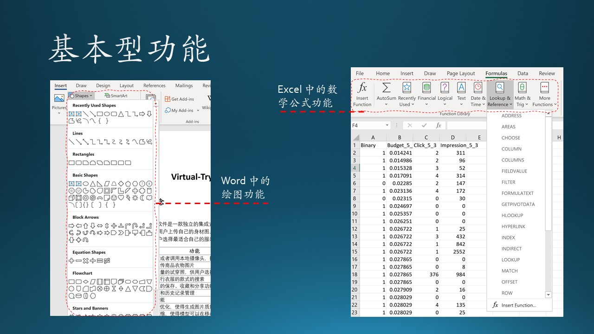
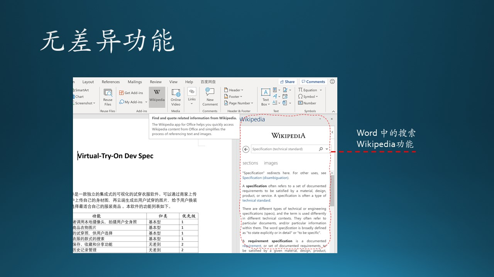
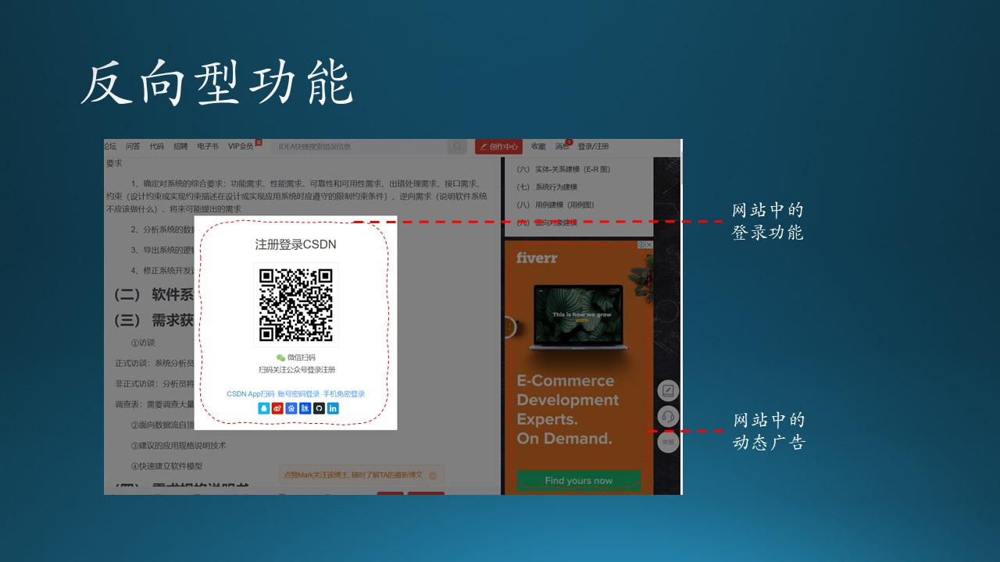

## 8.1 KANO模型

KANO$^{[1]}$ 模型是东京理工大学教授狩野纪昭（Noriaki Kano）发明的对用户功能分类和优先排序的有用工具，以分析用户功能对用户满意的影响为基础，体现了产品功能和用户满意之间的非线性关系。图 8.1.1 展示了这种模型。

图 8.1.1 - KANO 模型

原文中使用了 Quality 这个词，即产品的品质。很多资料中都有不同的翻译，笔者认为翻译成“功能”比较符合软件行业的概念，当然 KANO 模型是通用的用户满意度模型，不是为软件行业定制的。表 8.1.1 是笔者的理解。

表 8.1.1 - KANO 模型的五类功能定义

|类|原文|中文|用户要求|
|--|--|--|--|
|1|Attractive Quality|惊喜型功能，兴奋点|快上线，麻利儿的|
|2|One-dimensional Quality|期望型功能，痒点|点个赞，越多越好|
|3|Must-be Quality|基本型功能，痛点|别废话，必须可用|
|4|Indifferent Quality|无差异功能，尿点|无所谓，放那儿吧|
|5|Reverse Quality|反向型功能，吐槽点|窝心呀，赶紧撤掉|

以上类别是从好到坏（对用户来说）排列的。

### 8.1.1 惊喜型功能

又称兴奋型、魅力型功能，指不会被用户过分期望的，或者是用户没有想到的功能。

比如 Edge 浏览器在打开 PDF 格式的文件时，会自动在上方出现一个功能条，内含放大、缩小、旋转、全屏、朗读、画笔、高亮、删除、打印、保存等一系列操作 PDF 文档的功能，相当于内置一个基本的 PDF 阅读器软件，这是一个非常好的功能。

再比如 Windows 10 的人脸识别登录功能，不用记密码了，安全性也更高了，防止密码泄露。

图 8.1.2 - 惊喜型功能

图 8.1.2 左侧子图是 Edge 浏览器内置的 PDF 阅读器功能，可以做标记并保存；右侧的子图是 Windows 10 的人脸识别登录选项的设置。

对于惊喜型功能，随着满足用户期望程度的增加，用户满意度也会急剧上升，但一旦得到满足，即使表现并不完善，用户表现出的满意状况则也是非常高的。反之，即使在期望不满足时，用户也不会因而表现出明显的不满意。

比如，人脸识别功能可能会比较慢，十次里有一次不能正确识别，但这不会带来用户的不满，最多会自嘲地说一句“先进的技术还是不可靠呀”，然后会继续尝试登录。

惊喜型功能往往是以技术导向为主的功能，即计算机科技水平的发展会实现以前人们不曾/不敢想到的功能。

### 8.1.2 期望型功能

也称为意愿型功能，是指用户的满意状况与功能的满足程度成比例关系的功能，此类功能得到满足或表现良好的话，用户满意度会显著增加。当此类功能得不到满足或表现不好的话，用户的不满也会显著增加。

比如初期的 Power Point 中的图形绘制功能，让用户可以方便地绘制自己想要的图形，以丰富演示稿的视觉效果。不但基本图形数量众多，还有线型选择、颜色填充、平面旋转、立体化等多种效果。

随着版本迭代，Power Point 中又增加了 SmartArt 图形功能，提供了一系列的视觉表现形式，原本枯燥的文字信息列表，可以变成生动的结构化图形，让用户有耳目一新的体验，最关键的是它可以帮助用户传达给听众更准确的、容易记忆的信息，对商业演讲或者学校教学很有帮助。

图 8.1.3 - 期望型功能

图 8.1.3 展示了 SmartArt 图形功能，本书中的 PPT 就使用了这个功能，非常方便，并且可以充分表达笔者的意图。

这些不断进化的功能，会持续地提高用户对 Power Point 的满意程度。相反，如果不提供这些功能，用户会转而选择其它产品。

### 8.1.3 基本型功能

也称为必备型功能、理所当然功能，是用户对产品或服务的基本要求。是用户认为产品“必须有”的属性或功能。当其不满足用户功能时，用户很不满意；当其满足用户功能时，用户也可能不会因而表现出满意。

图 8.1.4 - 基本型功能

如图 8.1.4 左侧子图所示，在 Word 编辑器中绘图成为了一种基本型功能，当年的 Word 还只能编辑文字，现在可以做到图文并茂。虽然很多人不需要画图，大概只有 20% 的用户需要此功能，但是如果缺失此功能，会带来强烈的不满，即使是那些不需要画图的用户也会说“Word 连图都不能画”。

如图 8.1.4 右侧子图所示，Excel 中的表格数学计算，提供了非常多的公式、函数，这也是 Excel 当初占领市场的基础。假设它提供了其它 1000 多个函数，但是没有提供计算方差的函数，那么用户会抱怨；反过来说，它提供了计算方差的函数，用户会认为这是应该具备的功能，并不会因为有了这个函数就给微软写感谢信。

### 8.1.4 无差异功能

也称为无所谓型功能，不论提供与否，对用户体验无影响。

图 8.1.5 无差异功能

我们以 Word 为例，用三个例子来说明：

 - Word 中提供了一个 Wikipedia 功能，其实就是 APP 内搜索，在不离开 Word 的情况下，可以在 Wikipedia 上搜索名词并以友好格式返回。如图 8.1.5 所示。

 - Word 支持了一个开放的 Blog 博客协议，可以把 Word 文档上传到 cnblogs.com 即时发布。
  
 - Word 提供了一个 Transform 功能，可以把 Word 文档发布为一个网页。

在网页开发和使用如此便利的今天，这几个功能都显得有点儿多余了，即使没有它们的存在，用户还是会继续使用 Word 来写文档。

### 8.1.5 反向型功能

又称逆向型功能，指引起强烈不满的功能，因为并非所有的消费者都有相似的喜好。许多用户根本都没有此功能，提供后用户满意度反而会下降，而且提供的程度与用户满意程度成反比。

- 公共交通 APP

  笔者乘城铁上下班，使用手机 APP 亿通行的二维码方式进出检票口。有那么一段时间，这个亿通行忽然做起广告来了，而且把广告做到了二维码前面，也就是用户必须先看广告，关闭它，再扫二维码。

  于是检票口前面堆满了人：因为广告需要下载时间，城铁站里信号不好，半天下载不出来；然后还需要关闭广告，很多人是单手操作手机，手指头够不着关闭按钮。

  笔者怒不可遏地在 APP 里提交了一条反馈，表达了强烈的不满。好在这种“逆天”的功能很快就取消了，不知道是不是因为 APP 的开发商收到了很多负面反馈。

- CSDN 博客网站
  
  CSDN 是一个非常好的网站，大家可以在这里学习交流知识。但是其中有两个特性，笔者感到不满意，如图 8.1.6 所示。

  一是在浏览时，经常弹出登录提示窗口，其实是一个假窗口（浮层），上面没有关闭按钮，好像要强制用户登录似的（其实只要用鼠标点击周围阴影处就可以关掉这个浮层）。

  二是在窗口右侧，经常会有动态广告出现，五张图片来回换，造成视觉干扰，使得用户无法专心读博客内容。

图 8.1.6 - 反向型功能

归纳起来，没有人会傻到做反向型功能来恶心用户。所有的反向型功能，都是由于经济利益问题造成的，想放广告挣钱，必然会影响用户体验。
