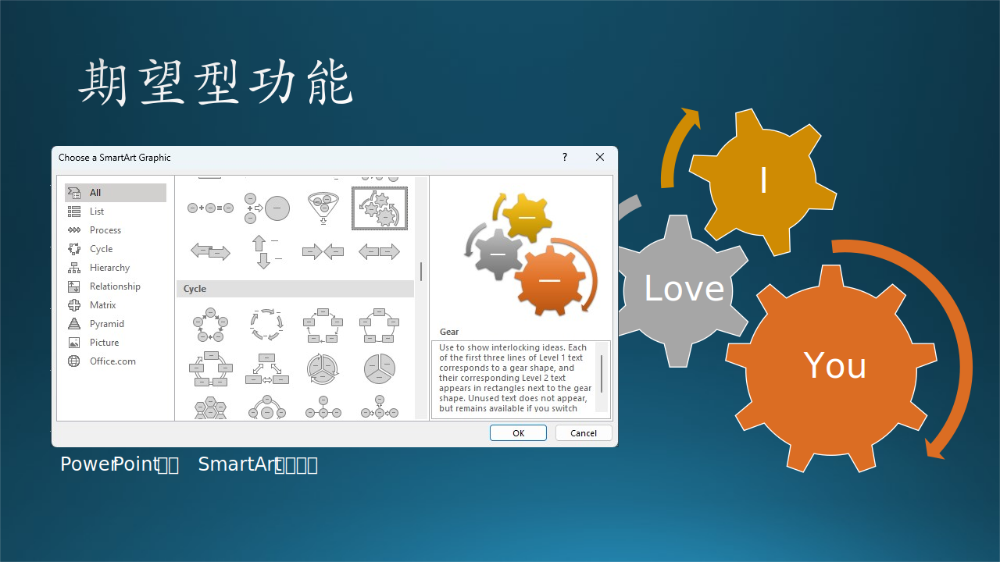
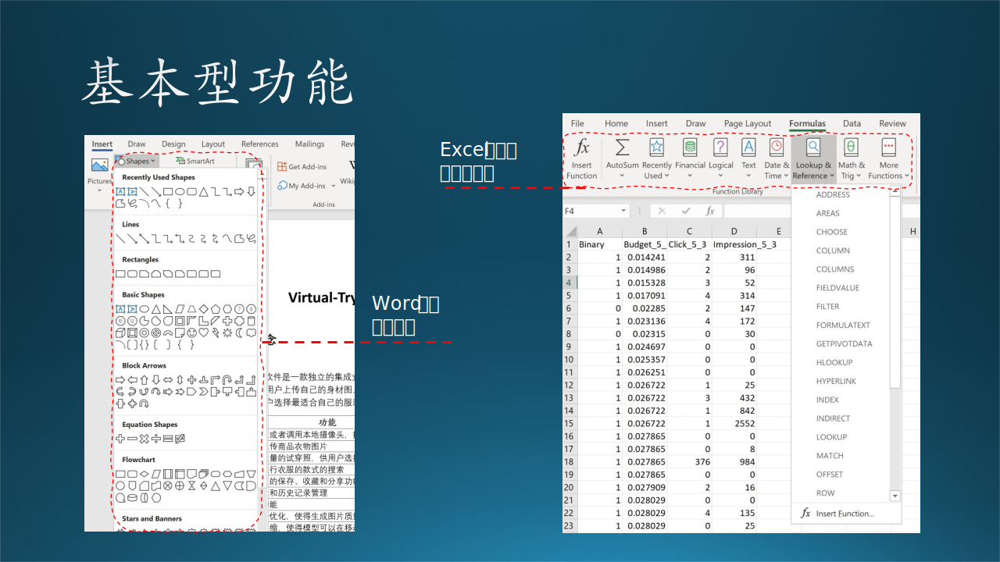
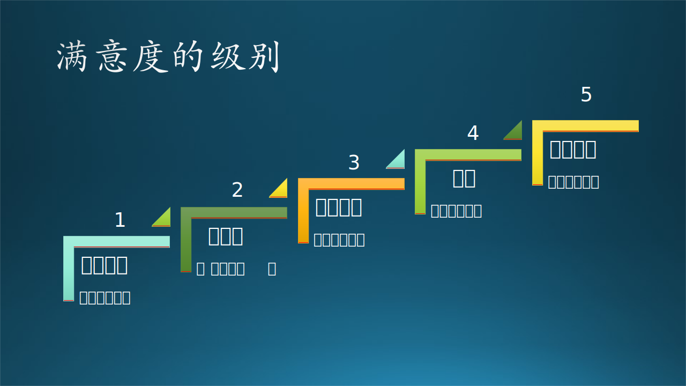

## 8.1 KANO 模型与用户满意度

### 8.1.1 KANO 模型

KANO$^{[1]}$ 模型是东京理工大学教授狩野纪昭（Noriaki Kano）发明的对用户功能分类和优先排序的有用工具，以分析用户功能对用户满意的影响为基础，体现了产品功能和用户满意之间的非线性关系。图 8-1 展示了这种模型。

图 8-1 KANO 模型

因为 KANO 模型是通用的用户满意度模型，不是为软件行业定制的，所以原文中使用了 Quality 这个词，即产品的品质。很多资料中都有不同的翻译，笔者认为翻译成“功能”比较符合软件行业的概念。表 8-1 是笔者的理解。

表 8-1 KANO 模型的五类功能定义

|类|原文|中文|用户要求|
|--|--|--|--|
|1|Attractive Quality|惊喜型功能，兴奋点|快上线，麻利儿的|
|2|One-dimensional Quality|期望型功能，痒点|点个赞，越多越好|
|3|Must-be Quality|基本型功能，痛点|别废话，必须可用|
|4|Indifferent Quality|无差异功能，尿点|无所谓，放那儿吧|
|5|Reverse Quality|反向型功能，吐槽点|窝心呀，赶紧撤掉|

以上类别是从好到坏（对用户来说）排列的。

#### 1. 惊喜型功能

又称兴奋型、魅力型功能，指不会被用户过分期望的，或者是用户没有想到的功能。

比如 Edge 浏览器在打开 PDF 格式的文件时，会自动在上方出现一个功能条，内含放大、缩小、旋转、全屏、朗读、画笔、高亮、删除、打印、保存等一系列操作 PDF 文档的功能，相当于内置一个基本的 PDF 阅读器软件，这是一个非常好的功能。

再比如 Windows 10 的人脸识别登录功能，不用记密码了，安全性也更高了，防止密码泄露。

图 8-2 惊喜型功能

图 8-2 左侧子图是 Edge 浏览器内置的 PDF 阅读器功能，可以做标记并保存；右侧的子图是 Windows 10 的人脸识别登录选项的设置。

对于惊喜型功能，随着满足用户期望程度的增加，用户满意度也会急剧上升，但一旦得到满足，即使表现并不完善，用户表现出的满意状况则也是非常高的。反之，即使在期望不满足时，用户也不会因而表现出明显的不满意。

比如，人脸识别功能可能会比较慢，十次里有一次不能正确识别，但这不会带来用户的不满，最多会自嘲地说一句“先进的技术还是不可靠呀”，然后会继续尝试登录。

惊喜型功能往往是以技术导向为主的功能，即计算机科技水平的发展会实现以前人们不曾/不敢想到的功能。

#### 2. 期望型功能

也称为意愿型功能，是指用户的满意状况与功能的满足程度成比例关系的功能，此类功能得到满足或表现良好的话，用户满意度会显著增加。当此类功能得不到满足或表现不好的话，用户的不满也会显著增加。

比如初期的 Power Point 中的图形绘制功能，让用户可以方便地绘制自己想要的图形，以丰富演示稿的视觉效果。不但基本图形数量众多，还有线型选择、颜色填充、平面旋转、立体化等多种效果。

随着版本迭代，Power Point 中又增加了 SmartArt 图形功能，提供了一系列的视觉表现形式，原本枯燥的文字信息列表，可以变成生动的结构化图形，让用户有耳目一新的体验，最关键的是它可以帮助用户传达给听众更准确的、容易记忆的信息，对商业演讲或者学校教学很有帮助。

图 8-3 期望型功能

图 8-3 展示了 SmartArt 图形功能，本书中的 PPT 就使用了这个功能，非常方便，并且可以充分表达笔者的意图。

这些不断进化的功能，会持续地提高用户对 Power Point 的满意程度。相反，如果不提供这些功能，用户会转而选择其它产品。

#### 3. 基本型功能

也称为必备型功能、理所当然功能，是用户对产品或服务的基本要求。是用户认为产品“必须有”的属性或功能。当其不满足用户功能时，用户很不满意；当其满足用户功能时，用户也可能不会因而表现出满意。

图 8-4 基本型功能

如图 8-4 左侧子图所示，在 Word 编辑器中绘图成为了一种基本型功能，当年的 Word 还只能编辑文字，现在可以做到图文并茂。虽然很多人不需要画图，大概只有 20% 的用户需要此功能，但是如果缺失此功能，会带来强烈的不满，即使是那些不需要画图的用户也会说“Word 连图都不能画”。

如图 8-4 右侧子图所示，Excel 中的表格数学计算，提供了非常多的公式、函数，这也是 Excel 当初占领市场的基础。假设它提供了其它 1000 多个函数，但是没有提供计算方差的函数，那么用户会抱怨；反过来说，它提供了计算方差的函数，用户会认为这是应该具备的功能，并不会因为有了这个函数就给微软写感谢信。

#### 4. 无差异功能

也称为无所谓型功能，不论提供与否，对用户体验无影响。

图 8-5 无差异功能

我们以 Word 为例，用三个例子来说明：

 - Word 中提供了一个 Wikipedia 功能，其实就是 APP 内搜索，在不离开 Word 的情况下，可以在 Wikipedia 上搜索名词并以友好格式返回。如图 8-5 所示。

 - Word 支持了一个开放的 Blog 博客协议，可以把 Word 文档上传到 cnblogs.com 即时发布。
  
 - Word 提供了一个 Transform 功能，可以把 Word 文档发布为一个网页。

在网页开发和使用如此便利的今天，这几个功能都显得有点儿多余了，即使没有它们的存在，用户还是会继续使用 Word 来写文档。

#### 5. 反向型功能

又称逆向型功能，指引起强烈不满的功能，因为并非所有的消费者都有相似的喜好。许多用户根本都没有此功能，提供后用户满意度反而会下降，而且提供的程度与用户满意程度成反比。

- 公共交通 APP

  笔者乘城铁上下班，使用手机 APP 亿通行的二维码方式进出检票口。有那么一段时间，这个亿通行忽然做起广告来了，而且把广告做到了二维码前面，也就是用户必须先看广告，关闭它，再扫二维码。

  于是检票口前面堆满了人：因为广告需要下载时间，城铁站里信号不好，半天下载不出来；然后还需要关闭广告，很多人是单手操作手机，手指头够不着关闭按钮。

  笔者怒不可遏地在 APP 里提交了一条反馈，表达了强烈的不满。好在这种“逆天”的功能很快就取消了，不知道是不是因为 APP 的开发商收到了很多负面反馈。

- CSDN 博客网站
  
  CSDN 是一个非常好的网站，大家可以在这里学习交流知识。但是其中有两个特性，笔者感到不满意，如图 8-6 所示。

  一是在浏览时，经常弹出登录提示窗口，其实是一个假窗口（浮层），上面没有关闭按钮，好像要强制用户登录似的（其实只要用鼠标点击周围阴影处就可以关掉这个浮层）。

  二是在窗口右侧，经常会有动态广告出现，五张图片来回换，造成视觉干扰，使得用户无法专心读博客内容。

图 8-6 反向型功能

归纳起来，没有人会傻到做反向型功能来恶心用户。所有的反向型功能，都是由于经济利益问题造成的，想放广告挣钱，必然会影响用户体验。

### 8.1.2 满意度分析

#### 1. 用户满意度的五种级别

对任何事物的好坏的判断，用户的态度一般不是非此即彼的0/1问题，而是有一个过渡。在微软面试中，要求面试官给“Hire”或“No hire”，但有时候太难选择了，所以会出现一个“Weak hire”的选择，尽管不是官方要求的。

由于笔者喜欢流行音乐（还在微软内部组建了一支乐队），所以经常看一些音乐节目，如《歌手》、《乐队的夏天》。节目组通常让普通观众选择“是否喜欢一个歌手或一支乐队”，其实这非常的不合理。观众并非总是理智的，往往凭借一些非常奇怪的原因决定“喜欢”还是“不喜欢”，比如“我不喜欢那个贝斯手的发型”，这就偏离了比赛的本来用意。

但是另一方面，在《乐队的夏天》中，节目组会给专业乐迷五分制的投票权力。同理，在调查用户的满意度时，一般也会使用五种级别作为一个平滑过渡的设计。图 8.1 就是五种级别和对应的口语化形象描述。

图 8-7 满意度级别

在使用 KANO 模型时，一般采用调查问卷的形式，即正反两个方向的问题：

- 正向问题 A：如果Word可以保存为PDF格式，用户的感觉是什么？
- 反向问题 B：如果Word不能保存为PDF格式，用户的感觉是什么？

我们在表 8-2 中记录下这两个问题的答案，一个是第 2 行，一个是第 5 行。

表 8-2 A/B 两个问题的答案

|级别|描述|正向问题 A|反向问题 B|
|:--:|--|:--:|:--:|
|1|太激动了||
|2|比较不错|$\sqrt{}$|
|3|说不上来||
|4|不怎么样||
|5|太差劲了||$\sqrt{}$|

然后我们在图 8-8 中的坐标（2，5）做一个标记，表示问题 A 和问题 B 的交点位置。

图 8-8 KANO 模型中的类别判别方法

#### 2. 定性分析

再进一步，通过对问题 A 和 B 的分析，结合上一节所述的产品的五类功能，我们认为“Word 可以保存为 PDF 格式”这个功能是一个期望型功能。这样，就可以得到一个功能的分类了。

为什么定位为“期望型”功能呢？我们看看“期望型”功能的定义：

*也称为意愿型功能，是指用户的满意状况与功能的满足程度成比例关系的功能，此类功能得到满足或表现良好的话，用户满意度会显著增加。当此类功能得不到满足或表现不好的话，用户的不满也会显著增加。*

再看一下本例：

- 问题 A 的用户反馈是“比较不错”，即“此类功能得到满足或表现良好的话，用户满意度会显著增加”；

- 问题 B 的用户反馈是“太差劲了”，即“当此类功能得不到满足或表现不好的话，用户的不满也会显著增加”。

正反两个方面的回答完全符合期望型功能的定义。

通过对不同的问题得到的交点位置做分析，我们可以得到图 8-9 中所有25个交点所属的功能分类。

图 8-9 功能类别坐标

可以看到：
- 中间有两个红色的“惊喜型”；
- 右上角是绿色的“期望型”；
- 右侧有两个蓝色的“基本型”；
- 对角线上有三个黄色的“无差异型”；
- 左下角是一堆“反向型”。

以此方法，我们就得出了每个功能所属的分类。

还有几个问号所处的位置，是不可能出现的分类。比如左上角的那个问号，相当于问：
- A-如果有功能F，用户满意吗？用户答“太激动了”；
- B-如果没有功能F，用户满意吗？用户答“太激动了”。

从逻辑上分析，如果问题 A 得到肯定的回答，那么不可能也会对问题 B 有肯定的回答。其它几个问号都是类似的情况。

不同的人对图中交叉点的位置所属的类型持有不同的观点，见图 8-10。

图 8-10 其它分类标准

#### 3. 定量分析

KANO 图还可以有定量分析，但是需要大量的调查问卷数据，比较难以实现，所以我们在此只是讲解一下定量分析的结论：四区域分类法。至于定量分析的过程，有兴趣的同学可以参考相应的资料$^{[2]}$。

关于“四区域分类法”，在很多资料中，包括笔者给的参考资料中，有的写四象限法，有的写四分位法，这都是错误的命名。我们先解释四区域法的分析过程，后面再说上面两种叫法为什么是错误的。

笔者发现，即使不计算 better-worse 系数$^{[2]}$，也可以得到同样的结果：在图 8-9 中，各个区域有明显的分割线：

- 首先，我们不考虑问号的情况，因为它无意义；
- 其次，我们不考虑反向型的功能，因为它比较容易分辨；
- 在惊喜型和期望型之间，有一条竖的分割线；
- 在期望型和基本型之间，有一条横的分割线；
- 把无差异型的范围稍微缩小一些。

然后我们可以得到一个四部分的区域图，如图 8-11 所示。

图 8-11 四区域法

四个图中的坐标轴的含义是相同的：

- 横坐标：不提供某个功能时，用户会的不满意程度，从左到右增加，用线 B 的长度表示；
- 纵坐标：提供某个功能时，用户的满意程度，从下到上增加，用线 A 的长度表示。

（1）惊喜型功能

处于左上角的区域。

- 当提供此功能时，A 的长度显著增加，表示满意度剧增；
- 当不提供此功能时，B 的长度没有显著增加，表示没有很大的不满意。

（2）期望型功能

处于右上角的区域。

- 当提供此功能时，A 的长度显著增加，表示很满意；
- 当不提供此功能时，B 的长度显著增加，表示很不满意。

（3）基础型功能

处于右下角的区域。

- 当提供此功能时，A 的长度没有显著增加，表示满意度不高；
- 当不提供此功能时，B 的显著增加，表示有很大的不满意。
  
（4）无差异功能

处于左下角的区域。

- 当提供此功能时，A 的长度没有显著增加，表示满意度不高；
- 当不提供此功能时，B 的长度没有显著增加，表示没有很大的不满意。

我们再回过头说说上面提到的两种错误叫法：

- 四象限法：象限是指平面直角坐标系上，由横纵坐标轴所分割的四个区域，以零点为中心。我们所面对的问题虽然是处于平面直角坐标系上，但是零点在左下角，四个区域都是在第一象限。

- 四分位法：四分位是统计学的一个名词，是指处于一维坐标上的数据中，处于 25% 分位和 75% 分位的数值。我们所面对的问题是一个二维平面上的分类问题，不能使用四分位的叫法。
