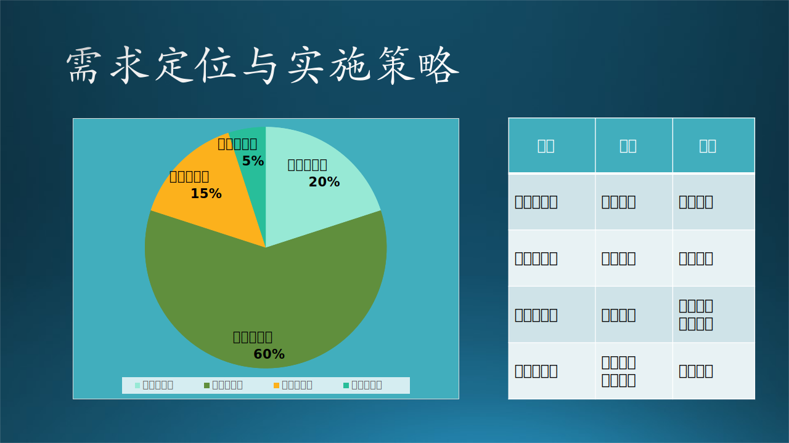
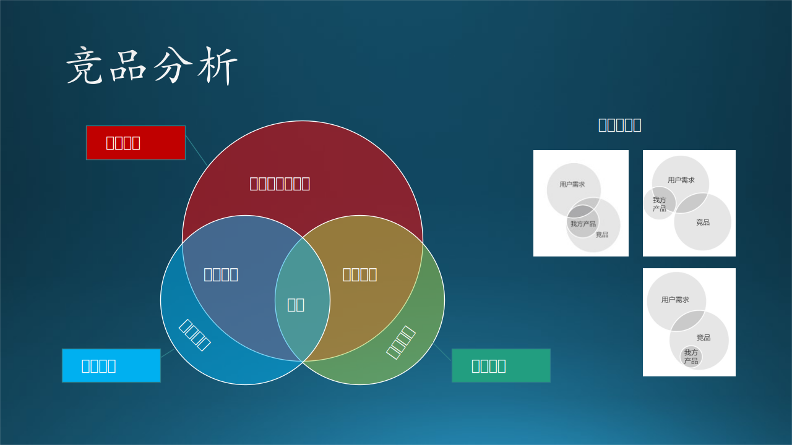
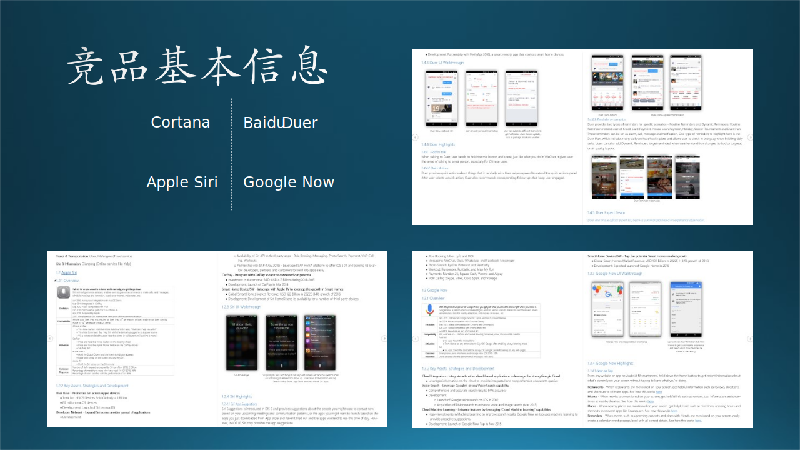
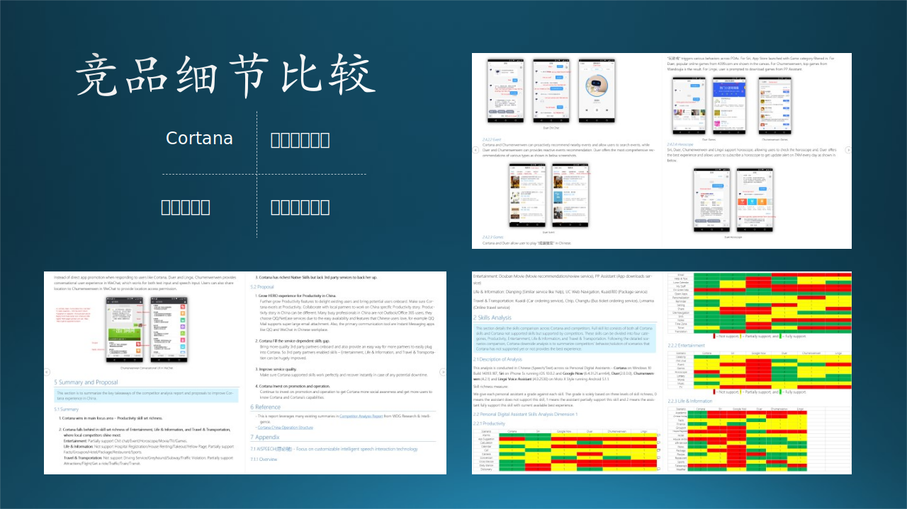

## 8.2 竞争策略与软件定位

### 8.2.1 需求定位与实施策略

根据 KANO 模型，我们得到了四个区域的功能划分，这其实和传统的“紧急/重要四象限法则”是同一个道理。

图 8-12 需求定位与实施策略

#### 1. 惊喜型功能

人无我有。

惊喜型功能属于不紧急但重要的。“不紧急”指的是在商业利益上，该类功能目前还不是主力创收来源，但是放眼未来的赢利点，实现差异化优势，它们却是最重要的。

佛教中有个说法叫做“顿悟”，就是忽然发明/发现了一个新功能，但实际上是不可能有顿悟的事件发生的，历史上所有的发明/发现，都是水滴石穿、集腋成裘的结果。宋词中的名句：“崆峒访道至湘湖，万卷诗书看转愚。踏破铁鞋无觅处，得来全不费功夫。” 很多人只看到了“不费功夫”，却没有看到“踏破铁鞋”。

惊喜型功能，是建立在对产品的熟悉、对技术的追求基础上的，厚积薄发，才有可能出现一个突破。比如 Windows Hello face（人脸识别）登录技术，是建立在以下技术基础上的：

- 高分辨率摄像头，并且是双通道，可以识别景深；
- 人脸数字化特征提取技术；
- CPU 的高速计算能力。

可以看到，其中有硬件、软件、算法的多方面结合，才能实现这个功能。

【最佳实践】在这类功能上的投入力度建议：20%。

#### 2. 期望型功能

人有我优。

期望型功能属于紧急且重要的，这是软件产品的核心竞争力所在，需要花大力气来做，并保持行业领先。

在微软必应搜索产品的开发上，必应团队为了从谷歌的搜索市场中抢到份额，先是经历了痛苦的“基本型”功能的开发，当时讲的最多的一句话就是“fix the gap”，即弥补差距。到了后来，系统逐步完善，也积累了一定的用户量，产品团队改变了关注焦点，口号变成为“钢需、痛点、海量”，即解决用户的真正需求。

钢需、痛点，这两个衡量点都容易理解，“海量”的意思是用户量，由于必应搜索的用户量是千万级别的，所以如果一个功能不能满足百万级别以上的用户，这个功能就不要考虑花资源去做了。

【最佳实践】在这类功能上的投入力度建议：30%。

#### 3. 基本型功能

人有我有。

基本型功能属于紧急不重要的。不重要不代表不做，而是说赶紧做完后，就不要再费心思考虑它们了。

不同的软件的基本功能都有不同的定义，这主要取决于“业界”的共识，即你的产品和其它竞争对手的产品所共有的功能。如果有新加入的竞争者，它也必须实现这些基础功能才能站稳脚跟。

对于这个类别的功能，我们主要以低成本维持为主，不需要超过竞争对手的品质。比如，Chrome 浏览器可以容纳4096个网页收藏，那么 Edge 浏览器非要容纳8192个网页收藏也没什么意义，因为没有用户需要那么多网页收藏。

【最佳实践】在这类功能上的投入力度建议：45%。在完成基本功能后，应该把人力投入到期望型功能上。

#### 4. 无差异功能

人有我无或人无我无。

最简单的就是无差异功能了，属于不紧急不重要。

这类功能，如果已经存在了的话，就放在那里不要动了吧，两个原则：

（1）只要它不影响新功能实现，或者说和新功能没有矛盾；
（2）它还能正常工作，不会被某一次的软件更新破坏掉。

这也是满足一些老用户的需要，向后（低版本）兼容。如果通过统计发现使用率太低了，那就可以干脆去掉了。使用率需要通过两方面来衡量：

（1）百分比，比如低于0.01%，即万分之一；
（2）同时，低于一个绝对值，比如每个月仅有100次使用。

这二者缺一不可，因为用户群总数是未知的，千万级的总用户量，即使是万分之一，用户量也还是客观的。如果总用户量少，每个月100次造访使用量（unique user）也是客观的，我们不能丢失掉这100个用户。

【最佳实践】在这类功能上的投入力度建议：小于5%。

### 8.2.2 竞品分析

#### 1. 目的

做竞品分析的目的有三：

（1）学习领域知识

   在微软，一个刚刚入职的 PM，领导往往让其做一个与本团队相关的产品竞品分析，这对于刚进入一个领域的新手来说，是一个快速学习领域知识的良好途径。

   木头在做手机浏览器时，团队中的一个年轻的 PM 就被分配了一个任务：了解一下市面上所有的手机浏览器，做一个详细的分析。这位兄弟花了两周的时间，列了一张巨大的表格，把一些市场份额较大的品牌都列在里面，如：UC浏览器、QQ浏览器、360浏览器、夸克浏览器、百度浏览器、火狐浏览器、搜狗浏览器，等等。这张表为我们排出上百个功能的优先级起到了很大的参考作用。

（2）寻找功能灵感

   与其闭门造车苦思冥想一个新功能，不如出去走访客户，或使用一下竞争对手的产品，获得些灵感。

   木头在研究如何给必应搜索的广告商实现评分和推荐系统时，自然而然地去研究了一些谷歌的广告系统，一个合作的 PM 在谷歌搜索上注册了一个广告商账号，每月花几个小钱，了解谷歌的评分机制。最后得到的结论很让人失望：谷歌的评分机制是基于规则的静态算法，并没有多么高深。这也和广告商对于这种机制的负面评论相吻合。

   于是木头得到了灵感：我们为必应做一个基于统计的动态算法，可以让最终用户、广告商、必应搜索三方的盈利达到平衡。由于本项目还处于研发初期，一些细节还不方便透露。

（3）监视竞争对手

   一个惊喜型功能刚刚上线两周，其竞争对手也推出了类似的功能，使得惊喜型功能变成了期望型功能。这种竞争关系在国内市场屡见不鲜。软件产品的功能一般没有可以注册专利的点，模仿也不违法，这也迫使产品团队尽量找一些技术门槛高的功能做。

#### 2. 方法

有很多模型和理论可以帮助大家做竞品分析，比如波特五力模型、BCG Matrix、STP理论、德尔菲法、5W2H分析法、SWOT等。利用这些分析方法进行全面研究，同时还要依赖于大量的数据，往往都已经上升至一个公司的战略层面。

图 8-13 竞品分析

一种朴素的定性分析方法如图 8-11 所示，图中用三个圆示意出了用户需求、我方产品、竞争产品的关系：

- 要发挥的是我方优势
- 要避免的是无用功能
- 要弥补的是未满足的需求
- 要追赶的是对方优势
- 要保持的是平手部分

Cortana 发展到现在已经不是什么秘密了，木头还曾经参与过 Windows Cornata 的开发工作，PM 们也曾经做过竞品分析。当时的竞争对手有Apple Siri、Google Now、Baidu Duer等等。

我们以 Cortana 竞品分析为例，简述一种详细的但是便于理解和操作的方法，可以从以下几个方面着手：

（1）竞品基本信息，包括产品简介、进化过程、应用平台、用户评价、市场份额，等等。如图 8-12 所示。

图 8-14 竞品基本信息

（2）功能列表，一般是取所有竞品的功能合集作为基线，在某竞品的相应列上打勾，表示有此功能。如图 8-13 右下角的子图。

图 8-15 竞品分析

（3）用户界面与交互，列出主要功能的界面，并指出该界面上存在的优缺点，提醒我方产品注意的地方。如图 8-13 右上角的子图。

（4）总结和建议，以产品形态、推广方法、竞争策略等为主要内容。如图 8-13 左下角的子图。

### 8.2.3 软件的定位

马斯洛需要层次理论$^{[2]}$（Maslow's Hierarchy of Needs）是关于需要结构的理论，传播较广。马斯洛（1968）认为，人的需要由五个等级构成：生理的需要、安全的需要、归属与爱的需要、尊重的需要、自我实现的需要。

在软件上，这个理论可以确定软件的市场需求定位，从而确定使用人群、软件功能、市场运营策略等等。

比如木头在城铁上观察到的大众使用手机应用软件的情况，可以大致对应到不同等级的需求层次上，如图 8-14 所示。

图 8-16 软件产品定位

#### 1. 生理的需要（Physiological Needs）

传统的生理（生存）需要有：食物、水、空气、衣服、睡眠、温暖、居所等。

在物质生活不再匮乏的今天，软件产品提供的网络小说、视频，实际上是为了满足现代人类的精神生活。这种精神生活并不是需求层次的提高，只是生理需求的扩充而已。

- 我已经吃饱了喝足了，我需要快乐；
- 我不满足于每天两点一线的生活，我想猎奇；
- 我厌烦我身边的人和事，但又不能摆脱，我想拥有别样的生活。

于是，网络小说和电视剧、短视频，就可以用来满足这些需要，因为它们提供了虚拟的现实、别人的生活、平行的空间，软件使用者（即读者）既可以从上帝视角观察别人的生活，也可以假设自己是主人公来体验别人的生活。

微软的 HoloLens 软硬件产品，以虚拟现实的技术和形式，用视觉带领用户进入一个崭新的世界，从更高的体验层次满足用户的生理需要。

#### 2. 安全的需要（Safety Needs）

传统的安全需要，是人们需要稳定、安全的生活环境，受到保护，有秩序，避免焦虑、恐惧等负面情绪产生。

新闻就是新近发生的具有异常性的真事，而微博是自媒体的一种，也可以归结到新闻类别中。人需要包括新闻在内的各种讯息，来完善知识与智力结构，调整行为，适应社会变化，这是一种安全的需要。而出于精神生活需要去看新闻，猎奇、探索、求知欲，实际上属于较低层次的生理需求。

所以，新闻实际上人类被动补充知识的一种手段，以便可以更“安全”地生活和工作。大家都不喜欢看新闻联播了，但是又需要看新闻，所以“今日头条”便推出了个性化新闻服务。

基于个性化推荐引擎技术，根据每个用户的兴趣、位置等多个维度进行个性化推荐，推荐内容不仅包括狭义上的新闻，还包括音乐、电影、游戏、购物等资讯。

对每条信息提取几十个到几百个高维特征，并进行降维、相似计算、聚类等计算去除重复信息；对信息进行机器分类、摘要抽取，LDA主题分析、信息质量识别等处理。

根据人的特征、环境特征、文章特征三者的匹配程度进行推荐。实时推荐，0.1秒内计算推荐结果，3秒完成文章提取、挖掘、消重、分类，5秒计算出新用户兴趣分配，10秒内更新用户模型。

根据用户所在城市，自动识别本地新闻，精准推荐给当地居民。可根据用户年龄、性别、职业等特征，自动计算并推荐其感兴趣的资讯。

从本质上来说，上学读书受教育也是一种安全的需要。木头的同事中有很多孩子家长，一般都会在“微信家长群”里，同事 C 的两个孩子，第一个是儿子，第二个也是儿子。群里经常会有些家长说“我们家孩子上某某补习班”之类的消息，于是其它家长纷纷效仿。按 C 的话说：“人家孩子都参加了，你不参加的话就觉得不安全。”

#### 3. 归属与爱的需要（Belongingness and Love Needs）

传统的归属与爱，就是于其它人建立感情的联系或关系，如团队、朋友、爱情。

Nobody is a island（没有人是一座孤岛），这是玄学派英国诗人约翰$\cdot$多恩的诗，用比喻的方法生动地描述了人类的社会和情感需要。

微软的虚拟人工智能小冰，从具有感情色彩的聊天开始，吸引了无数宅男的目光和时间，对话轮数平均可以到达30轮以上。
- 2014年5月29日，小冰正式推出第一代产品，以对话式聊天机器人形式迅速积累训练数据。
- 第二代产品完成了跨平台部署的交互架构。
- 第三代产品将交互从文本扩充至多模态，进一步积累多模态训练数据。
- 第四代小冰开始，交互总量稳居全球第一并保持至今，同时发布了全双工语音交互感官。
- 第五代小冰采用 Dual AI 战略，大幅度扩展跨平台覆盖的规模，至 20 余个主流平台，并成为中国市场上涵盖了华为、小米、OPPO、Vivo 等智能手机及硬件的唯一的跨平台人工智能。
- 第六代小冰完成了框架迭代目标。
- 从第七代开始推出各类框架工具，以帮助创建第三方人工智能产品，并承载其各类交互。
- 第八代小冰已经创造了 118 万的虚拟男友。

微信的日活跃用户数已经到达 10 亿了，朋友圈、群消息、私聊，每天收割着无数人的时间和感情投入。发朋友圈其实就是一种试图获得归属与爱的行为，与大家分享自己的心情和经历，希望获得朋友的点赞。

木头曾经总结过点赞行为的动机，并发布在朋友圈里：

- 点赞是一种义务。
- 及时点赞是一种美德，好评是一种艺术，差评是一种亲密。
- 给好图点赞是一种本能，给好文点赞是一种修养，给好友点赞是一种友谊，给好心情点赞是一种理解。
- 给无聊贴点赞是一种幽默，给普通贴点赞是一种鼓励，给高级贴点赞是一种欣赏，给每个贴都点赞是一种寂寞。
- 给木头的贴点赞是一种智慧。

此贴获得 100 多赞！

#### 4. 尊重的需要（Esteem Needs）

传统的尊重需要，就是自尊和希望受到别人的尊重。

女孩子在淘宝上买衣服，已经不是生理需要了，她们并不缺衣服，她们需要的是穿在自己身上能让别人夸赞的衣服，以此得到满足感。但是自尊到了极限就是虚荣，当有人挎着 LV 的包包每天在上下班高峰狼狈地挤地铁时，我们只能感叹 LV 已经走下神坛了。最关键的是，LV 的包包在设计时都没有拉链，包里面装的东西一览无余，最高兴的是小偷儿。

在软件设计上，商家想方设法展示衣服的美丽（卖家秀），然后又根据大数据（购买行为）推荐各种相关产品。

男人在穿衣打扮这方面一般没有什么追求，却又有展示个人性格与见解的需求。但同时，有些人的创作能力有限，平时在工作生活中窝窝囊囊，但又想获得存在感和尊重：我写不出来大段的文章来，但写一句话的评论总可以吧？于是在微博、微信公众号、论坛上，各种奇葩的评论层出不穷，骂人说脏话的是一种低级的表现，没有脏字但是句句诛心的是一种高级的表现。

以现在的 NLP（Natural Language Processing，自然语言处理）技术来说，智能地屏蔽这些评论并不是什么难事，但是那些软件厂商不愿意投入精力去做，反而会觉得有这些奇葩的评论会吸引更多的人来观看。

#### 5. 自我实现的需要（Self-actualizaiton Needs）

自我实现本来就是一种高层次的需求，所以在软件行业只是形式上的不同而已。

别小看打游戏，克服里面的重重困难过关斩将，实际上是一种自我实现的需要，这比看科幻小说电视剧高一个层次，因为用户亲身参与了。这些游戏玩家，为了实现更高层次的自我，还会花钱买装备，所以软件游戏成为了最容易赚钱的行业。

互联网还有一个 1:99 定律，就是在每 100 个人里，只有 1 个人创作，其它的 99 人只是观众。对应到各种软件中，这一个人就是微博的博主、公众号的博主、网络小说的作者等等。他们的自我实现方式就是创作。

虽然比例悬殊这么大，但是中国人口多，那么创作者就多，所以就会有一个很好的生态环境来支持微博、公众号、网络小说的运营，稍微加点儿广告，就会有很好的收入。

也有在朋友圈实现自我的，比如发自己拍摄的美图和长文、自己做的短诗等等，偶尔也会有自己写歌作曲的，这大大降低了自我实现的门槛，所以朋友圈里色彩缤纷。而观众都是朋友，所以不会有攻击诋毁的评论出现，相对安全。

而抖音和微信短视频的出现，更是激发了公众的“创作”欲望，因为视频比文字、诗歌、音乐等更容易生成，再配上一段平台提供的音乐就会更加有模有样。视频的分类（从难到易）大致有：知识类、才艺类、搞笑类、新闻类、生活类。
