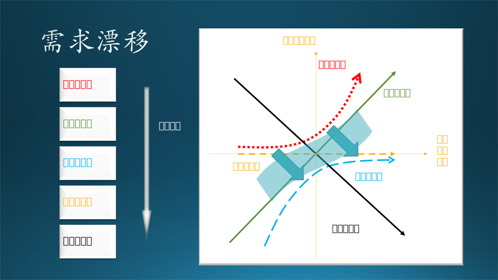
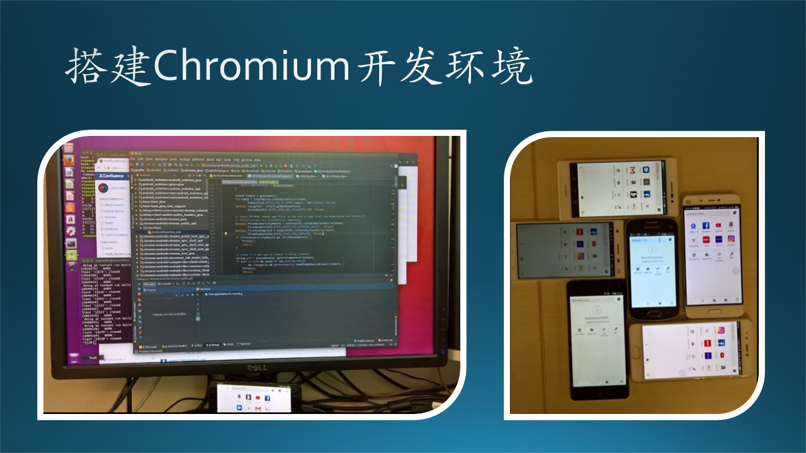

## 8.3 需求的正常变更

需求的正常变更包括四种形式的变化：漂移、演进、引导、推荐。

先说明一下“需求演进”和“需求引导”的区别：
- 需求演进是来自用户的，主要是解决一些痛点，实现基本型和期望型功能；
- 需求引导是来自产品团队的，主要是实现一些新颖的想法，实现期望型和惊喜型功能。


### 8.3.1 需求漂移

需求漂移，准确地说是需求的类别漂移，是指同样一个功能，在不同场合会有不同的理解、效果、满意度，这是由于“场合”对该需求的偏好影响。




图 8-17 需求类别漂移


#### 1. 因使用者而异

由于教育水平、工作性质、年龄阶段等的差别，人们的需求各不不同。

比如我们上面举的关于 Word 的三个看似无用的功能的例子，也许有的人没有浏览器使用基础（比如一些老人），这些功能对他们来说就有很大的帮助。因为这些软件都有 Telemetry（日志）机制，所以可以知道有多少人还在使用这些看似“过时”的功能，所以也就没有取消掉。

再比如手机上的计算器功能，如果是科技工作者使用，希望有乘方、开方、对数、指数等功能；如果是普通老百姓使用，那么有加减乘除就足够用了，功能多了反而容易按错键。

#### 2. 因为文化差而异

在中国的即时消息通信软件中，各种搞笑的表情包被广泛使用，有些甚至是需要付费购买的。表情包通常是漫画形式的，体现出创作者的别具匠心。

微软的 Teams 团队协作软件功能强大，其中的消息模块也有发送 GIF 表情包的功能。但是由于是美国文化，表情包都是那种电影里截出来的人物表情片段，中国人使用起来觉得特别别扭，所以在 Teams 日常通信中，笔者及其它同事们都很少使用 GIF 表情包。

#### 3. 因产品地位而异

SmartArt 对 Power Point 这个产品本身来说，开发者要持续对这个功能的维护，比如增加更多的组合图形，是一种期望型功能。但是对于其它竞争者来说，没有这个功能的话，就根本别想进入市场了，那么这个功能就会变成基本型功能。

所以对于后来者、竞争者来说，用户对它们的要求是必须提供惊喜型功能，或者提供很多期望型功能，才有可能后来居上。

#### 4. 因时间而异

即使是惊喜型功能，在经过一段时间的使用后，新鲜感会消失；或者随着竞争对手也跟风推出类似的功能，变得不那么吸引人。

比如 Windows Hello 人脸识别登录功能，在刚刚随着 Windows 10 发布时，大家觉得特别的高科技，配合着 Surface Book 的时尚感，使得 Windows 10 很快普及。所以它属于惊喜型功能。

但是一段时间过后，假设没有这个功能了，用户会觉得不方便，它就会退化为期望型功能。

### 8.3.2 需求演进

需求总在持续地演进，所以软件开发团队需要持续调研功能，产品需要持续迭代，与时俱进才能赢得用户。

木头用开发手机浏览器的经历，来推演一下当年浏览器领域的需求演进过程。图 8-18 展示了木头在前四周的学习过程。


图 8-18 需求演进


微软在 IE 落伍后尝试继续自研内核，开发基于 EdgeHTML 渲染内核和Chakra JS 解析引擎的 Edge 浏览器，而且继续绑定在 Windows 10 上发布。但是一些问题依然存在：性能，兼容性，扩展插件，更新频率等。所以在 2017 年的时候，微软想尝试一下使用 Chromium 内核开发浏览器。为了保险起见，微软决定先让中国的开发团队在手机上开发移动端浏览器，先试试水，如果成功的话，再在桌面端更新浏览器内核策略。于是，木头所在的团队接受了这一“光荣”的任务。

#### 1. Week 1（第一周）

在这之前，浏览器对于木头来说，就是日常使用，没有仔细研究过功能、架构、竞品等等。所以，在第一周（Week 1），木头认为浏览器就是“浏览器”本身的字面意思。所以，哥儿几个每个人都分到了一个 Android 手机，又把一个台式机装成 Ubuntu 16.0，下载了 Chromium 的代码后，编译出一个浏览器来，安装到 Android 手机上。成果如图 8-19 所示。




图 8-19 搭建开发环境


恍惚间有一种大功告成的感觉，但是，这仅仅是一个开始，后面的几周是疯狂学习浏览器知识的日子，就如同当年开发第一个浏览器的先行者们那样，不断探索这个产品的奥秘。

#### 2. Week 2（第二周）

木头使用着自己编译出来的浏览器，仔细端详着手机屏幕，忽然发现原来浏览器是由“地址栏”和“窗口”两部分组成的！所以，我们至少应该有两个模块，才能实现完整的浏览器功能：

（1）地址栏，用于输入网址，我们称之为输入模块；
（2）窗口，用于显示网页，我们称之为显示模块。

虽然地址栏很窄，但很重要。在手机上，由于屏幕小，有时候甚至是要隐藏地址栏的。

至于显示网页的功能吗，当然是由 Chromium 提供的渲染引擎（Render Engine）完成的，这也是浏览器的核心。

#### 3. Week 3（第三周）

木头使用着初步演进后的浏览器，刚开始还洋洋自得：输入输出都有了，很完备。但是很快就发现了新的需求，如表 8-3 和 8-4 所示，并且随着这些功能的加入，以前的输入和显示“模块”要升级为“子系统”了。

表 8-3 输入子系统的改进

|功能|描述|
|--|--|
|合法性验证|随着测试次数的增加，在地址栏里输入的网址越来越不规范，HTTP GET 经常会出错。那我们就加入一个网址合法性验证的功能吧，避免错误的网址传到后端。|
|自动补全|“https://www.microsoft.com”这个网址太长了，每次都需要输入得很准确才能正常工作。能不能在输入“www.m”以后，自动补全为“www.microsoft.com”呢？|

表 8-4 显示子系统的改进
|功能|描述|
|--|--|
|页面卷滚|页面内容很多，手机屏幕小，绝大多数网页显示不下，那就只好加一个卷滚功能了。|
|刷新单页|有时候由于网络原因，造成页面加载不畅，css没有下载完整，页面乱七八糟的。所以增加一个刷新功能吧。|

经过第三周的探索，我们浏览器已经演进为一个较为人性的“成品”了，但是距离“产品”还差得很远。

#### 4. Week 4（第四周）

在经过前三周的摸索后，到了第四周，木头已经懂得了需求不断演进的趋势，变得小心翼翼了。果然，经过一段时间的使用，又发现了很多新功能，可以让输入和显示两部分演进得更加完善。表 8-5 和 表 8-6 列出了新的功能。

表 8-5 输入子系统的完善

|功能|描述|
|--|--|
|容错|输入“http://”时，由于手机键盘小，每次都会打成“htp:/”，我们需要地址栏模块可以认识这个常见的“错误”。|
|Cookie|每次登录网页都需要重新输入用户名和密码，烦死了。增加一个 Cookie 功能来替我们节省些时间。|
|关键字搜索|如果输入的是一个关键字，比如“azure”，这个浏览器能不能智能地懂得我们是想搜索“azure”这个名词呢？|
|历史网址重现|以前输入过“www.microsoft.com”，也输入过“www.mail.163.com”，能不能在用户输入“www.m”后，自动显示一个下拉列表，列出以上两个网址供用户选择呢？|
|二维码扫描|手机摄像头可以扫描二维码形式的网址，这个也可以算作输入模块的一个功能吧。|
|语音输入|手机话筒可以接收语音，识别为关键字，然后进行搜索或者浏览，当然也算作输入模块的功能。|

表 8-6 显示子系统的完善

|功能|描述|
|--|--|
|页面缩放|在手机屏幕上可以看清更小的细节，或者看到网页的全局。|
|页内搜索|搜索页面文本内的关键字。|
|回到顶部|一键即可回到页面顶部，重新浏览。|
|起始页|展示新闻，或者常用网址，当然还可能有广告。|
|显示多页|同时浏览多个页面，可以切换。|
|导航|在当前页前进、后退，通过缓存看网页。|

### 8.3.3 需求引导

#### 1. 微信支付的需求是怎么来的？

支付是电商平台的重要组成环节，所以说是淘宝促成了支付宝的诞生，是钢需，可以说是理所当然的。但是微信定位在通信上，为什么会有支付的需求产生呢？

在微信支付存在之前，只有支付宝和银行可以支付，而且银行系统死守传统观念，不注重服务质量。

仔细看一下微信中的其它业务点：
- 公众号打赏
- 表情商店的付费表情包
- 在线游戏充值
- 朋友圈转账还钱

需要支付时，堂堂的腾讯微信 APP 总不能要求用户用阿里的支付宝吧？所以产生了微信支付的需求。

最开始，微信支付采取了简单的方式——直接绑定银行卡，但是在体验上存在两个问题：

- 验证码问题，当时快捷支付的使用流程是用户输入密码然后接收验证短信，输入验证码完成支付。用户希望去掉短信验证这个环节。
- 密码问题，当时支付工具的支付密码普遍采用英文数字混合的形式，张小龙希望能够像 ATM 一样使用六位的数字密码。

在产品团队的努力下，这两个需求得以实现。也正是因为这两项优化，微信支付变得流程简短、操作便捷。

实际上，微信支付的需求有两层：
（1）能够支付。
（2）快捷支付。

第一层是基本型功能需求，第二层是期望型功能需求。微信在保证了平台业务发展的同时，也满足了用户的需求。

#### 2. 微信红包的需求是怎么来的？

腾讯年初八“刷红包”的传统，每年发“开工利是”时，会在红包中随机放入不同金额的现金，这种不确定性让领红包的人充满期待，也引起了相互比较，产生话题性。

腾讯联合创始人 Tony 将一些微信团队成员拉进了一个微信群，希望能够依托微信群，趁着春节做一个红包产品，能够让用户感到惊喜和好玩，在收到红包之后也能情不自禁地参与到发红包的行列中，让红包像击鼓传花一样传起来。于是，“拼手气红包”便这样诞生了。

起初，微信红包是一个H5产品，使用公众号向用户推送领取通知。为了让用户体验更好，张小龙提出把微信红包做成原生功能。他希望通知用户的行为不通过公众号推送这种比较重的模式，转而采用群内通知，既不打扰用户，又不割裂产品体验。随着产品交互的调整和央视春晚“摇一摇”活动的进行，微信红包迅速向三四线城市下沉，用户活跃度显著提升。

如果用 KANO 模型来分析，“微信红包”是一个惊喜型功能。它的来源并非是最终用户提出的，而是产品团队提出的，这是惊喜型功能的一个重要特征。

#### 3. 支付宝的社交功能是怎么来的？

从阿里的角度来看，如果微信做支付是合理的，那么支付宝做社交就没有什么不合理的。人们既然能在聊天的时候花钱，那么为什么不能在花钱的时候聊天呢？

阿里选择支付宝做社交功能，是因为在其所有产品中，支付宝是最有可能的入口，无需被“购物”、“电商”的概念绑架。这也证明了笔者在前面对“我们是否要做旺信 UWP 的质疑”，阿里自己都不看好旺信，微软为什么还要去做？

但是，“在花钱的时候聊天”这件事儿，不是用户的真实需要，而是支付宝产品团队臆想出来的，试图引领、教育用户的行为。从社交到支付的需求引导，是自然发生的，是一种依赖增加；而从支付到社交的“引导”，是一种信任崩塌。


图 8-20 需求引导

同样的两件事，有一个先后发生的条件，如同概率论中的条件概率公式：

$$
P(AB) = P(A) \cdot P(B|A) \tag{8-1}
$$
$$
P(BA) = P(B) \cdot P(A|B) \tag{8-2}
$$

其中：
- $P(A)$ 表示聊天需要的概率
- $P(B)$ 表示支付需要的概率
- $P(AB)$ 表示聊天和支付同时需要的概率
- $P(A|B)$ 表示在支付时去聊天的需要（后面的 B 表示条件）
- $P(B|A)$ 表示在聊天时去支付的需要（后面的 A 表示条件）

可以推断，没有人会在支付时去聊天，所以$P(A|B)$会非常小，尽管$P(B)$很大（使用支付宝的人很多），但是两者的乘积$P(BA)$会很小，即在支付宝中加聊天是行不通的。

支付宝团队看到了公式 8-1 的成功（即微信上加支付的成功），并且主观地认为$P(AB) == P(BA)$，因此推论$P(A|B)$也可以成功。

有一个类似的故事是这样的：

```txt
信徒：“我可以在祷告时吸烟吗？”
神父：“不可以！这是对神的不敬。”

信徒：“那我可以在吸烟时祷告吗？”
神父：“可以！这是对神的无时无刻的挂念。”
```

### 8.3.4 需求推荐

一个大家都知道的例子是“纸尿裤和啤酒”的故事，并不是“多喝啤酒会需要纸尿裤”，而是“去超市买纸尿裤的男人通常会顺便买啤酒”。图 8-21 左侧子图表明，“啤酒”和“纸尿裤”没有直接联系，而是通过“男人”联系起来的。


图 8-21 需求推荐


#### 1. 乐器的例子

木头喜欢音乐，经常买一些乐器，10孔的布鲁斯口琴就买了三把（C调，E调，G调）。可是每次再登录淘宝或者京东时，给木头推荐的还是各种品牌的口琴，很无语。用户一旦下单了，系统能监控到下单动作，就不要再推荐类似商品了。

那么买完口琴后，系统应该推荐什么呢？根据木头的音乐爱好者的身份，应该推荐：

- 谱架，因为吹口琴需要看谱子；
- 麦克风和音响：没有音响系统，口琴的声音是没有感召力的，高灵敏度麦克风也很重要；
- 电子琴和吉他：在吹奏乐器的鄙视链上游，是键盘乐器和弹拨乐器，电子琴比较容易学，吉他配口琴特别好听。

这比那个“啤酒和纸尿裤”的例子更具有专业知识性。图 8-21 右侧下方的子图说明了依赖本领域知识而得到的推荐顺序。

#### 2. 外卖的例子

疫情期间，自己做饭太烦了，难免要点一些外卖。木头今天点了宫保鸡丁，系统明天还推荐宫保鸡丁；木头今天点了米饭炒菜，系统明天还推荐米饭炒菜。是想让用户吃腻为止吗？

让木头斗胆来建议一下一个好的外卖推荐系统应该怎么做。衡量饮食的参数要分几个方面：

- 口味，酸辣咸甜苦淡；
- 主食，米饭面条饺子；
- 食量，半斤还是四两；
- 偏好，肉菜主食比例；
- 价位，温饱还是饕餮；
- 营养，蛋白纤维碳水。

图 8-21 右侧上方的子图说明了这些参数。

有了以上这些指标，在按照星期循环和早中晚饭推荐，可以做到精准推送了。尤其是“营养”因素，还没有任何系统做到，而且用户往往是偏食的，只吃几种口味的菜，对于营养均衡极为不利。尤其是晚上十点钟以后点外卖的，应该提高价格并加以警告，因为对人的作息时间是极为不利的，吃完立刻睡觉，很可能造成食管胃酸回流。

有可能是电商和外卖系统的用户黏度足够好，不愁用户群，所以大家都还没有开发出有 AI 或专家参与的推荐系统来，这会是一个商机吗？
