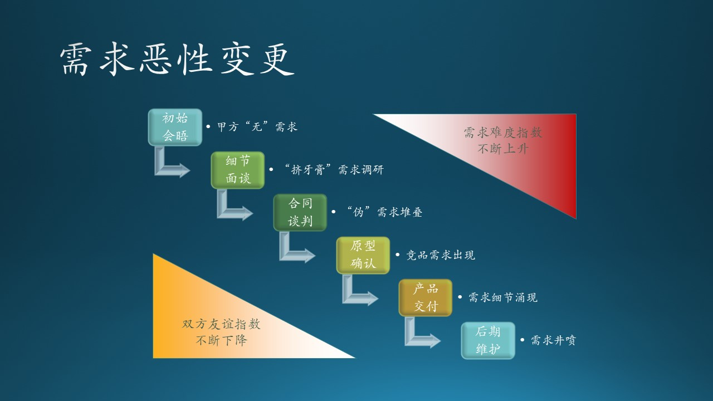
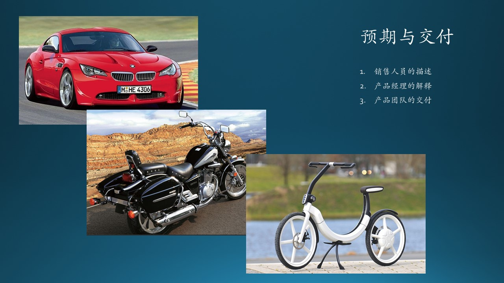
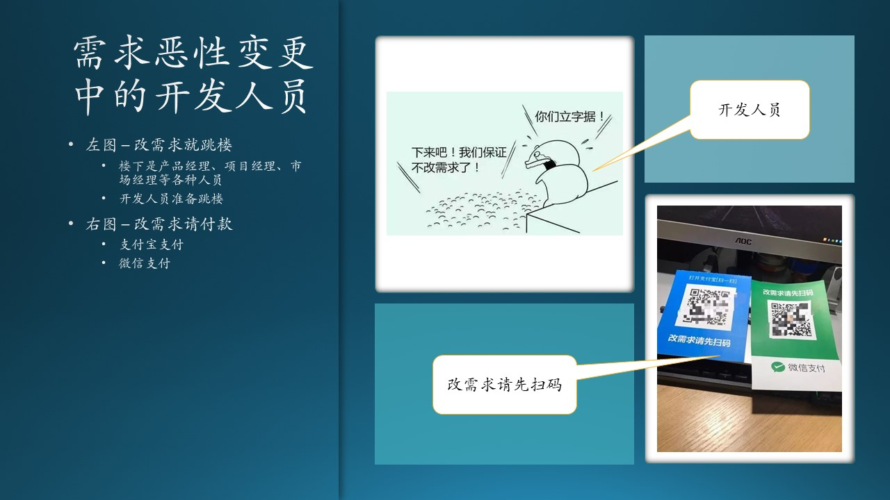
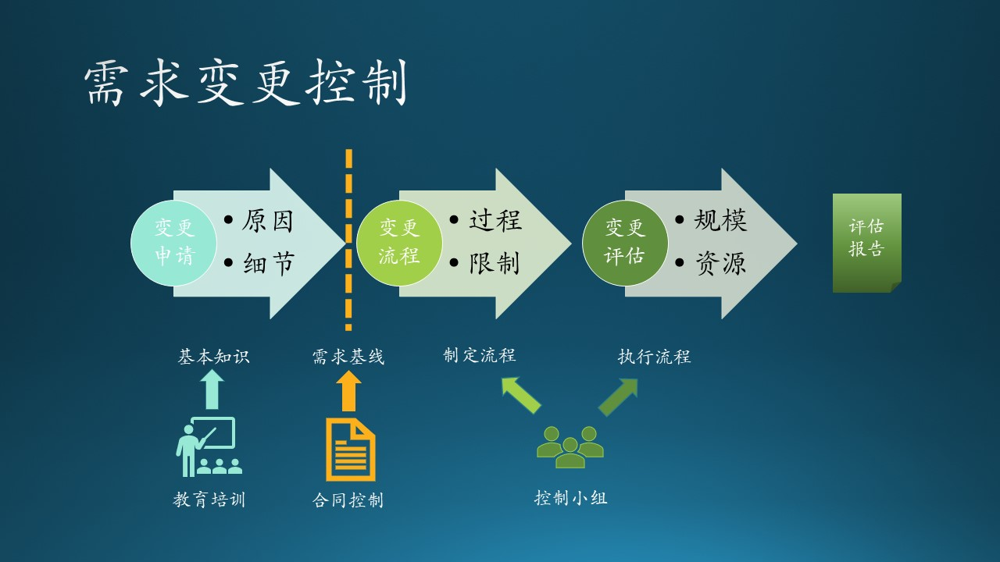

## 8.6 需求的变更与控制

### 8.6.1 需求变更的普遍性故事

以下故事从若干真实案例改编而成，图 8.6.1 展示了这一过程。

图 8.6.1 - 需求恶行变更

1. 第一次会晤
    
   客户（甲方）心中对要做的软件并没有很细致的预期，所以第一次见面时，客户会说：“我们就做一个管理软件，很简单！” 
   
   乙方需求调查人员心想：“原来你们还都没有想好。”
   
   双方老总边喝茶边聊合作前景，很高兴。
   
   *注：甲方如果软件意识淡漠的话，很难主动提出需求。*

2. 第二次面谈
   
   但是当软件公司（乙方）提出更多的疑问后，客户会迫使自己仔细想一想要做什么，第二次会说：“我们要做一个囊括全公司的业务流程管理软件，包括部门 A，部门 B，部门 C。” 

   乙方的需求调研人员驻场两周后，回去加班加点地做需求整理。

   双方老总边喝咖啡边聊行业趣闻，很高兴。

   *注：需求调研的目的，就是帮助甲方提出他们的真实需求。*

3. 第三次谈判
   
   在乙方整理出了基本的需求列表后，拿给甲方看。客户数了数功能列表条目的个数：“一共只有50条吗？咱们可是要有 100 万的合同呀！每条就 2 万块钱！太贵了！咱们再加 20 条功能，然后签合同。” 
   
   乙方需求调查人员才明白：“原来客户是按功能个数算钱的，早知道我就把它们拆分得细细的！”[捂脸]

   双方老总签了合同，边喝酒边聊国际形势，很高兴。
   
   *注：客户不会懂得软件的价值，把功能列表写的细一些总是没有坏处的。*

4. 原型开发结束

   客户在这期间看了一下别家的产品，觉得：“我们也应该有那家软件公司的产品的几个功能，领导很喜欢。没有的话第一期的预付款就成问题了。”

   双方老总握手寒暄了一下，就各自离开了。

   乙方设计人员回去和需求人员讨论到半夜，感觉还是要先攻克几个技术问题，才能继续做设计、开发工作。
   
   *注：原型要尽早提交给客户，以免在以后的开发中出现很大的修改。竞争对手的信息调研，乙方要提前帮助甲方完成。*

5. 第一期产品交付
      
   客户找了各个部门 10 几个人来一起看，你一句我一句地提意见：
   
   - “界面感觉和想象的不一样，我这眼睛不好，这里字体能不能大一些？”
     
     *注：软件界面上所有字体都是标准的，牵一发而动全身。*

   - “哟，这个功能 A 都可以用计算机代替呀，那太好啦！我们还有另外两个功能 B 和 C 应该也可以这么做吧？这个咱们补上！”

     *注：用户受到启发了，新需求呈井喷式涌现。*

   - “这里的日期是自动生成的吗？那不行，有时候我们会晚几天才填写资料，但是时间必须是任务分配下来的时间。”
  
     *注：不正规的工作习惯导致的需求变化。*

   - “我们这个单据不是给一个领导看的，是要给多个领导审批的，这个要流程必须有。”

     *注：当时只说要给领导审批，没说是几个领导。*

   甲方提出一堆修改意见，忘记了前面的合同条款，开发人员忙着记录，密密麻麻记了两页纸。

   双方老总打电话通了个消息，说公司有事脱不开身，没有见面。
   
6. 后期产品维护
   
   客户翻了翻合同条款：“哈哈，幸亏我这里写了个三年质保！那个什么，我们有个部门 D 和部门 E，也要纳入到这个系统中。” 
   
   双方老总这次干脆就没出现。

   最后乙方公司被拖垮了，入不敷出；给甲方提供的软件在凑合使用了一年后，跟不上数字化转型的大趋势了，不得不换掉，又找了另外一家软件公司合作。

   *注：质保不等于新需求。两败俱伤的做法是双方要尽力避免的。*

### 8.6.2 需求变更在微软

#### 自主产品部门

需求变更在国内的软件公司是司空见惯的，但是在微软，对于需求变更是严格控制的。当然微软主要是做自己的产品，为最终用户服务，而不像小软件公司是为企业客户服务。所以在微软，是不会发生图 8.6.2 所示的情景的，但那却是一般的中小型软件公司，包括国内的大型软件公司的通病。

图 8.6.2 - 需求恶性变更带来的灾难

1. Office 产品

在 Office 团队，以桌面版为例，一般是制定一个为期三年的开发计划，在开始前几个月内，这三年内的所有新特性（Feature）都要确定好，就不许再随便改动了。即使发生以下两种情况也是如此：

- 发现有些特别好的特性没有加入到计划中。这种情况，需要等下一个三年才可以有机会加入。
- 发现有些特别糟糕的特性已经开始开发了。这种情况，即使那个特性很糟糕，也要维持，下一个三年才有可能去除。

2. Windows 操作系统

在 Windows 团队，以 Windows 10 为例，制定为期半年的开发计划，所有的新功能都是精挑细选。加上计划阶段，实际的开发时间只有三至四个月，后面要留出两至三个月做集成、测试、稳定，表现不好的功能会被去除掉。

通常情况是 10 个 Feature 有可能被去掉了 7 个，只有 3 个 Feature 最终 Release。这期间绝不会有新功能加入的机会。

3. 云端产品

比如 Bing 和 Azure，会自由一些，因为云端发布的特性决定了其实时性，所以有了新的功能可以随时加入。

#### 企业服务部门

木头采访了一位在微软中国 GSMO（Global Sales, Marketing and Operations，销售市场和服务）部门工作的朋友大淘（网名），以下是他们的对话记录。

木头：你们最近还要经常访问客户场吗？

大淘：是呀！项目到了最后阶段了，在赶 DDL（Dead Line，最终期限）。

木头：那我们长话短说吧。我就想知道你遇到过这种情况没有：客户的需求变来变去，最后造成灾难的事情。

大淘：我觉得这在企业服务部门比较容易常见，对于这种甲乙方的关系，签订合同之后，有可能合同里边没有写得特别的明确。有可能甲方在中后期会提出一些要求，就是揪合同里边的字眼。所以要对合同里边的项目条款定得非常的清晰，边缘也要非常的清晰。

木头：你能举一个具体的例子吗？

大淘：项目里边一个最简单的例子，合同里说要做一张表，展现一个条形图。实际的过程中，客户在第一天的时候要一个红色的条形图，第二天可能又会改蓝色的，第三天可能觉得条形图不好，要求会变成饼图。不断的去改，不断去添加。

木头：这么小的功能点在合同里肯定写不全呀？不过这种级别的问题也不会造成灾难，还好。

大淘：造成灾难的情况没有见过，微软的项目经理都会把控这个范围，会允许有小的改动，但是整体上不会变，否则造成客户因为这个事情而不验收。可能有边界不清晰的时候，基本上都不会有灾难。但是其他小的软件厂商没有这种把控的话，可能会造成严重的灾难。

木头：那么你们遇到的最麻烦的事情是什么呢？

大淘：比如原定10月1号要上线，但是我的测试一直都没有通过，用户这边的测试没有通过，那有可能就要拖，拖到客户验收为止，可能到10月30号啊，这是一种情况。另一种情况是你上线了之后，客户不讲理，尾款会拖着付。

木头：原因是什么呢？

大淘：造成这个的原因有几个阶段：最开始售前去卖这个方案的时候，把这个事情说成了一辆宝马车，然后那客户听了感觉很开心，觉得什么都可以实现；后来项目经理介入开始做项目的时候，项目经理会把它说成一辆摩托车，客户觉得能接受，就是开起来风大些，戴个风镜还能接受；最后，开发人员做出来的是辆自行车，这个时候客户就很不满意了，因为这个期望是不断降低的。画个图的话就像图 8.6.3 那样。

图 8.6.3 - 预期与交付的差距

木头：哦！那是因为大家理解不一致吗？

大淘：前期为了投标，一般情况下销售人员肯定会把产品说成像宝马车，然后在项目经理介入的时候，一般可能会把预期稍微低一点，比如他说成了一辆自行车，那最后交付出来发现是一辆摩托车，用户的最后的满意程度可能会提升一些。当然风镜还要免费送，哈哈！

木头：那么如何避免呢？

大淘：整体上我觉得还是不同职位之间的协调，是前面的销售，中间的项目经理，或者说产品经理和开发，再到客户四个方面的协调。再就是时间点和范围要非常的清楚，一般项目前面会陈述范围在哪儿？它包括什么东西不包括什么东西，那它包括到什么程度？这个东西要写的非常清楚，我觉得基本就是这些。

### 8.6.3 需求变更控制

图 8.6.4 - 需求变更控制

#### 基本教育

售前人员要进行基本的客户教育。需求变更的原因是双方造成的，乙方需要对甲方进行一些基本软件知识的教育。

1. 软件知识
   
   客户总会说：“如果是硬件也就算了，你们这个不就是代码吗？为什么不能改？”
   
2. 开发流程

   甲方对软件开发流程不了解，会有疑问：“上次原型提供得挺快的呀，这次怎么要花这么长时间？”
   
3. 知识产权
   
   有些模糊知识的甲方会问：“不就是训练一个什么 AI 模型吗？我听说有个 PyTorch 就专门干这个的，而且还不要钱，你们这个怎么花这么长时间，价格还很贵？”

4. 变更过程
   
   乙方对甲方的需求没有给与必要的控制管理，任由新需求滋生。乙方需要让甲方明白：需求变更的代价很大。

#### 合同控制

市场部门负责合同控制。

1. 明确细节
   
   合同越细，将来的纠纷越少。比如上面提到的一些反例：
   - 界面颜色、字体大小
   - 图的形状、颜色、尺寸
   - 功能点的细节描述，如输入、输出、动作
   - ......

2. 确定边界

   - Goal/Non-Goal，目标和非目标
   - 软件维护升级的范围
   - 与外部系统交互时双方的职责
   - ......

3. 培训与文档
   
   - 如何正确地使用
   - 如何解决简单故障
   - 系统架构讲解
   - 输入输出细则
   - ......

#### 流程控制

项目经理或者开发经理要进行需求变更流程控制。

【slide 标准、流程、组织、行动】
1. 建立标准
      
   需求基线是需求变更的依据。在开发过程中，需求确定并经过评审后（用户参与评审），可以建立第一个需求基线。此后每次变更并经过评审后，都要重新确定新的需求基线。

2. 制订流程

   制订简单、有效的变更控制流程，在建立了需求基线后提出的所有变更都必须遵循这个控制流程进行控制。

3. 成立小组
   
   成立项目变更控制小组，负责裁定接受哪些变更，由项目所涉及的多方人员共同组成，应该包括甲方和乙方的决策人员在内。

4. 严格执行
   
   需求变更一定要先申请然后再评估，最后经过与变更大小相当级别的评审确认。受影响的软件计划、产品、活动都要进行相应的变更，以保持和更新的需求一致。

   何为“相当级别”？即，看看变更是界面级别的，还是模块级别的，或是系统级别的？变更太大的话，还要牵涉到费用问题。
