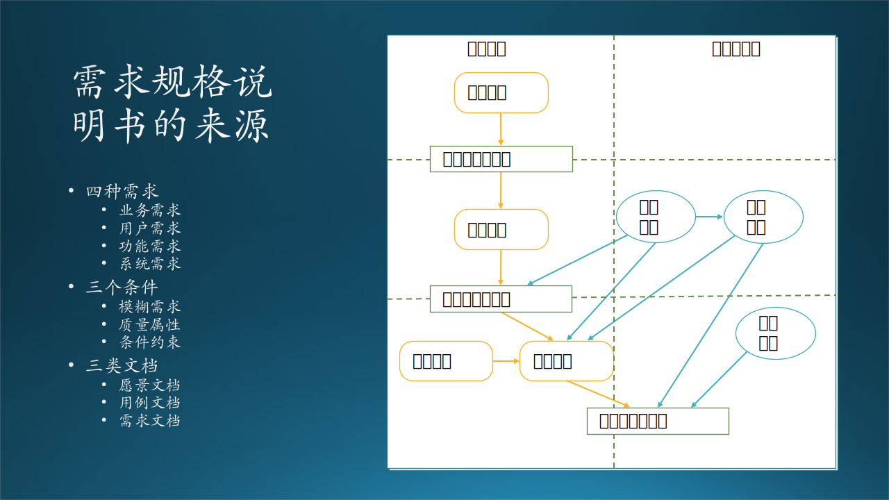

## 8.6 需求规格说明书

### 8.6.1 需求规格说明书的来源

需求规格说明书（SRS，Software Requirement Specification）。

我们在第七章讲到过需求层次和非功能需求的分析，这些其实就是需求规格说明书的素材来源。用图 8-31 的右侧来表示。

图 8-31 需求规格说明书的来源

在微软，通常把需求规格说明书称作Functional Spec（Specification，规格说明书）、Feature Spec。因为这是 PM 需要完成的工作，所以经常叫做 PM Spec。

需求规格说明书是需求分析阶段完成后的输出。如果我们不关心细节的话，那么图 8-31 的左侧可以很好地示意。

### 8.6.2 需求规格说明书的模板

#### 1. 任务与背景（Task/Background）

在需求规格说明书中，首先要简单讲解一下项目或产品的大概背景。可以分成两种情况：

（1）独立的软件，从零开始开发。这种情况可以简单说一下需求背景，比如：
   
- *我们发现大部分研究员都是用 Edge 浏览器和 OneNote（微软办公套件中的一个产品）进行阅读和做笔记，非常不方便，所以想开发一款二合一的软件产品，既能够浏览，也能够做笔记。*

（2）在已有软件上增加功能。这种情况需要简单描述一下已有软件的大概情况，再说一下新增功能，比如：

- *我们发现大部分研究员都是用 Edge 浏览器和 OneNote 进行阅读和做笔记，非常不方便，所以想在 Edge 浏览器上开发一个扩展插件，来解决做笔记的需要。*

在这一部分中，也可以描述一下条件与约束，如 7.6.4 节所述。

#### 2. 目标与非目标（Goal/Non-Goal）

仍然沿用读论文工具的例子：

- *Goal：解决 PDF 的标记问题。*

- *Non-Goal：不准备支持 Word 文档格式，不支持触摸输入。*

#### 3. 典型用户与场景（Persona/Scenario）

有了典型用户后，就要把该用户“放进”具体的应用场景中。Scenario 的意思，就是要把用户放进一个真实的故事片段中，来检验其可行性。

比如前面所述的木头与神经网络课程的故事，用典型用户木头（老师）和毛毛（学生）作为故事的主角，串连起了两个故事片段，在故事中提及了大量的电教课程细节，都可以使用微软提供的技术方案来解决。

反过来看，就是Surface Hub、Azure、OpenPAI 等设备、服务、软件，都应该提供什么功能，才能满足大学电教课程的需要。设计人员坐在办公室冥想是想不出来的，必须到教学现场观察一下上课的情况，才能够设计出相应的产品，然后再泛化。用故事场景（即Scenario）的形式来描述，就是还原现场的一种有效方法。

#### 4. 用户模型（User Model）

如 7.8 节所述，建立用户模型的步骤如下：

（1）确定边界：首先要确定系统的边界，把待建系统看作一个黑盒子，绘出系统上下文图。
（2）寻找用例：每个参与者都会描述自己要做的事情，叫做用例，把参与者和几个用例联系起来建立用例图。有紧密联系的用例可以组织在一起形成子系统，有可能的话，我们尽量把这些子系统也发掘出来，并规划它们的边界。对于复杂的用例，可以进一步细化，定义一些子用例。
（3）描述细节：用例说明可以帮助后续的人员深入理解，避免理解偏差。
（4）寻找数据：使用数据流图把用例联系起来，并进一步发现数据，因为用例一般都会产生数据，并且会有别的用例来处理数据。
（5）描述数据：数据字典可以把第 4 步中的数据整理成表格，便于后续设计开发。

#### 5. 结构模型（Structural Model）

如 7.9 节所述，建立结构模型的步骤如下：

（1）发现类和对象：从参与者和待建系统中发现类和对象，定义类和对象的模型。
（2）发现数据：从数据流图和数据字典中，定义数据模型。
（3）细化关系：一共有七种关系，对于后面的设计和实现工作有着重要的指导意义。
（4）子系统结构：就某个子系统（对象和功能的集合）建立起静态结构。
（5）系统结构：子系统结构建立起来后，若干个子系统构成系统。

#### 6. 行为模型（Behaviour Model）

如 7.10 节所述，建立行为模型的步骤如下：

（1）发现状态：有些对象具有复杂的内部状态，随着外部事件而变化。
（2）捕捉事件：分析出什么样的事件会造成状态的转换。
（3）细节分析：有一些中间状态在最开始时不容易被发现。比如，我们经常使用的计算机，平时具有“开机”和“关机”两种状态，但实际上它们还具有“开机中”和“关机中”两种状态，甚至还有“死机”状态。
（4）发现动作：对象之间是存在交互动作的，代表着将来要实现的方法调用。
（5）动作描述：描述每个动作的起始对象和作用对象，携带的消息，以及动作的先后顺序。

#### 7. 特性与功能（Feature/Function）

Function 和 Feature 不是同一层意思，如表 8-8 所示。

表 8-8 特性和功能的比较

||Feature 特性|Function 功能|
|--|--|--|
|定义|产品或服务可以完成的任务、目标|可以实现某一功能的工具、方法|
|组成|产品、服务、任务、流程、计算、系统、应用、文档、组件、机器，等等|窗口、按钮、菜单、列表、图形、声音、视频、卷滚条，等等|
|举例1|该软件可以完成统计样本方差的任务|点击按钮 A 打开窗口后选择菜单 B 可以计算样本方差|
|举例2|使用微信可以与其它人通信|点击“发送”按钮可以发送信息|

所以，Spec 既要有功能（Function）列表，又要有特性（Feature）列表。功能列表通常由用户指定，而特性列表则由 PM 在需求分析的基础上给出，要具体到软件界面元素，比如是选择菜单还是点击按钮，出现的是一个数据列表框还是条形图，等等。

#### 8. 环境与质量（Environment/Quality）

一般指运行环境的要求或者限制，以及在这一运行环境下的系统性能指标。比如：

- *本软件要求在 Windows 10 操作系统上运行，可以管理多达 32 个类别和每个类别中最多 1024 篇论文。要求显示屏物理分辨率至少为 1920x1080。*

- *推理子系统的性能要求在20毫秒以下。*

- *网站允许200个用户并发，每个用户的响应时间为50毫秒。*

更多的质量要求，可以参考 7.6.3 节所述。

#### 9. Schedule/Plan 计划和日期

给出项目的几个关键点，如表 8-9 所示。

表 8-9 计划和日期

|时间|成果|解释|
|--|--|--|
|Week 2|Feature Spec|提交需求文档并评审|
|Week 4|Design Spec|提交设计文档并评审|
|Week 9|Code Complete|编写代码结束|
|Week 10|ZBB ( Zero Bug Bounce )|没有新Bug再出现|
|Week 12|Release|发布|

这里不给出人员安排，因为开发资源要根据需求的多少来决定。计划和日期当然要根据合同的约定来制定，但是切记不要过于乐观，把你的乐观估计的时长再乘以二，基本上就是实际的开发时长。
