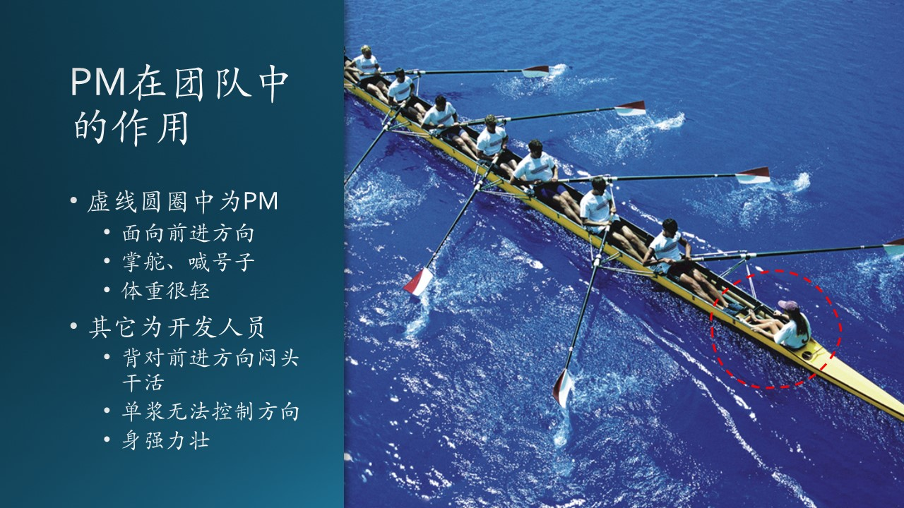
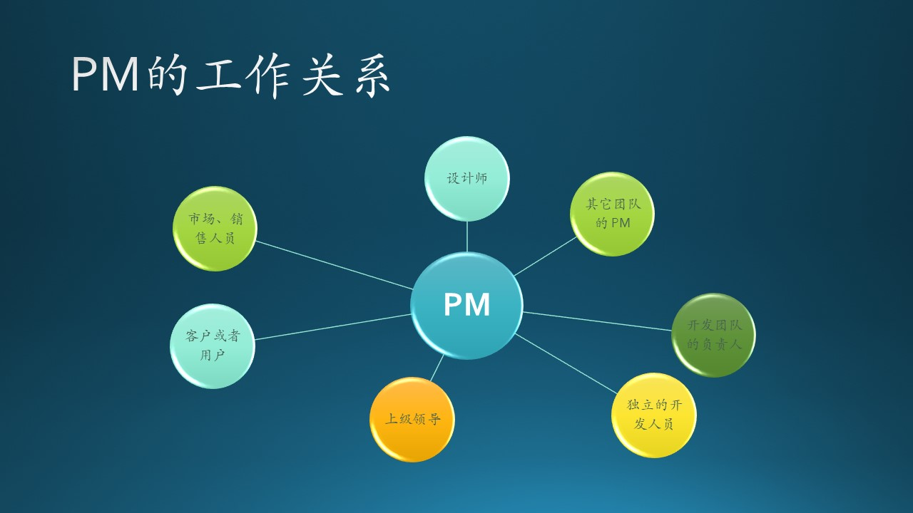
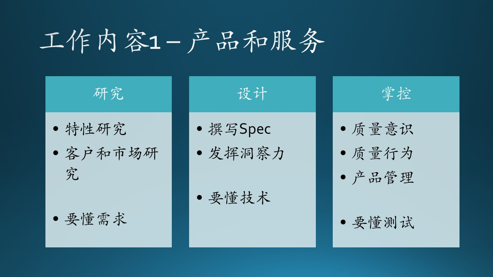
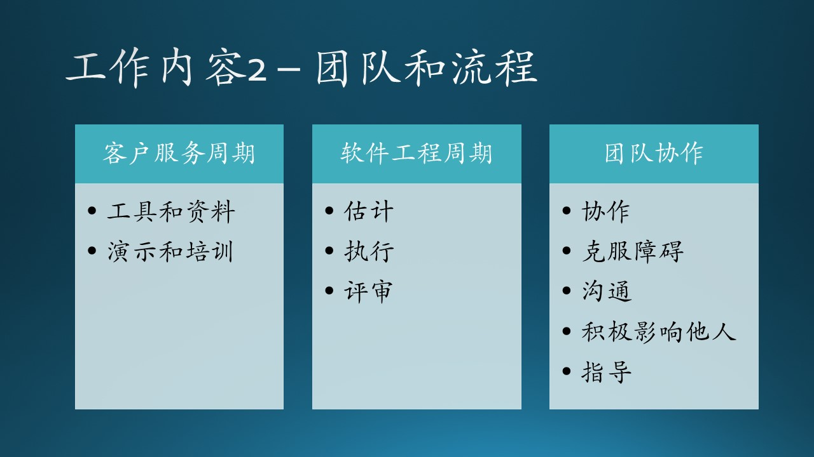

## 8.9 PM 过程经理

### 8.9.1 PM 的定义

PM（Program Manager）是微软的工作职位，在其它公司大概都有Product Manager（产品经理）和Project Manager（项目经理），微软的Program Manager（过程经理，只能这么翻译了，也有叫程序经理的）可以用公式 8.9.1 来理解：

$$
PM=产品经理+项目经理 \tag{8.9.1}
$$

我们来用表 8.9.1 来简单对比一下三者的区别：

表8.9.1 - 产品、项目、过程经理的区别
||产品经理|项目经理|PM|
|--|--|--|--|
|中文名称|产品经理|项目经理|过程经理|
|关注方面|关注产品|关注流程|产品+流程|
|主管方面|管事|管人，管进度|管事，管进度|

那么微软的 PM 的工作内容是什么呢？我们用章节中的内容来解释一下：

- 第五章的全部工作
- 第六章的需求逻辑分析
- 第七章的全部工作
- 其它一些工作

其中第六章的需求技术分析部分，一般由开发人员完成，便于分析、设计、开发三者有较强的延续性。

图 8.9.1 - PM 在团队中作用

在微软，PM 的比例大概为 15% 左右，即开发人员和 PM 的比例大概为 5:1 左右。PM 平时的工作关系网大致如图 8.9.2 所示。

- 左侧的市场、销售、客户、用户很好理解，提供产品的说明；
  
- 上方，要负责给各级领导汇报做 PPT；与其它团队的 PM 联系团队间的合作；
  
- 右侧，和设计师（designer）合作设计交互和界面，和 Dev Lead/Manager 打交道，有时候如果开发人员人数较少没有层级关系，可以直接与之沟通；
  
- 下方，与品质保证与测试人员沟通测试方案，执行测试计划。

图 8.9.2 - PM 的工作关系

### 8.9.2 PM 的关键成果（Key Results）

关键成果就是工作内容产出。前三个工作内容集中在产品和服务上，如图 8.9.3 所示。

图 8.9.3 - 产品和服务

#### 产品和服务定义（Product and Service Definition）

- 特性设想
  
  设想出多种产品特性。这是 PM 的主要工作内容，而且绝大多数新特性是 PM 们想出来的，但是要避免臆想。
  
- 客户和市场洞察力
  
  根据外部信息和自己的判断培养对客户、合作伙伴、竞争对手的洞察力，这有利于为客户提供更多有竞争力的产品特性。

比如，Windows Team 曾经有个想法：假设屏幕上有一串文字或者一张图片，先让用户做局部屏幕截图得到像素点，然后用 OCR 或者图片识别等 AI 技术手段识别其中的文字（实体名称、地址等）或者图片（衣服、家具等），最后给一个 Action（行为）建议。其实这是从 Hackathon 活动中转换过来的一个产品想法。

木头还曾经参与到这个项目的服务器端 AI 组件的开发中，并且 Release了，但是客户端没有落地。

这确实是传统的 Windows 向 AI 迈进的理想路线，很多 Windows Team 内部的人看完这个 Demo 后觉得“太酷了，等不及上线了！”。但是它有三个致命的问题：
  
1. 这个 Feature 的需求确实是客观存在的，只是需求的重要程度不能确定，是不是钢需？或者只是万分之一发生概率的需求？
2. 这个 Feature 所对应的 Scenario 是有问题的，用户本来可以做原生的文字或图片拷贝粘贴，不需要强迫用户做像素级的操作。
3. 这个 Feature 的定位有问题，它应该存在在应用中，如浏览器，而不是 Windows 操作系统里。

  在这个真实的故事里，可以商榷的地方真的很多，这提醒我们的 PM，特性要从用户角度出发，满足需求真实、场景合理、有竞争力等几个条件。

#### 产品和服务设计（Product and Service Design）

- 特性说明书（Feature Spec）
  
  根据组织或客户的愿景，撰写、修改和交流特性说明书，并使得工程师能够进行下一步的开发工作。没有书面的 Spec，开发人员可以拒绝口头下达的任务，避免变动的风险。

- 发挥洞察力
  
  使用技术、功能和客户/合作伙伴的知识来提供完整、可理解、技术上可靠且可实现的特性说明。这明确指出，PM 可以不懂怎么写代码，但是应该懂技术的，

在鲍尔默时代，微软对 PM 职位是这么要求的：不要求懂技术，只要求懂产品。木头曾经就这个问题和一位 PM 的 Manager 讨论过，得到了确认。起初也觉得那是说得过去的，但是，后来发生了这么一件事：

在做 Windows 上的 Cortana 的一个应用场景时，需要一个快捷键来触发此场景，其本身是一个拷贝屏幕的功能的扩展，所以 PM 要求用 Ctrl+C 快捷键。但是 Ctrl+C 已经被绝大多数应用默认为应用内拷贝的快捷键了，所以 PM 要求我们用 Ctrl+C C，即按完 Ctrl+C 后，再按一个 C 键。

这个非常难做到，原因是：

1. 这是一个系统级别的快捷键，需要注册到 Windows 的底层注册表里，由系统管理和监控，而Windows Team的人对这种新的快捷键的注册非常的谨慎，
2. Windows 目前还没有组合快捷键的情况，所以没有基本的代码逻辑可以参考，一不小心会影响系统性能；
3. 这种组合键一般在应用内使用，比如Visual Studio Code里的Ctrl + K F，关闭文件夹，就是按 Ctrl+K，松开 K，再按 F。

木头和其他开发人员就这个问题和 PM 讨论了很多次，PM 固执地认为，这些技术问题都可以解决，而且这个快捷键的设计是影响用户体验的关键，不能使用其他替代方案。大家弄得很不愉快，最后由于技术条件限制，没有实现。

还有一个在坊间广为流传的故事：PM 要求一款手机应用的屏幕主颜色，能够根据手机保护套的颜色自动变化。PM 想象的实现的具体方式是“在用户对着镜子使用手机的时候，手机自动拍照并识别镜中的手机保护套的颜色”。

#### 产品和服务所有权（Product and Service Ownership）

- 质量意识
  
  对产品/服务的端到端质量、完整性和最终用户体验具有自豪感和个人责任感。
  
- 质量行为
  
  找到未解决的问题，并亲自解决，或提请高层注意，找到问题的所有者，以确保最高水平的质量。
  
- 产品管理
  
  定期使用自己的产品/服务来彻底理解它，并发现改进它的方法。正所谓己所不欲勿施于人，自己都不用的东西，怎么能说服别人用呢？

质量意识和管理行为不仅仅是 PM 的工作，而是全体团队成员的职责，在前面介绍开发工程师岗位时，也提到了这一点。

后三个工作内容重点在团队和流程上，见图 8.9.4。

图 8.9.4 - 产品和服务

#### 顾客服务生命周期（Customer Lifecycle）

- 工具和资料
  
  为客户支持、市场营销或销售人员制作工具和资料，用于教育/培训客户并促成其最终采用我们的解决方案。

- 演示与培训
  
  为内部相关人员和合作伙伴提供产品演示和培训。

这是针对已有产品提供的一些资料，与市场销售人员配合，从客户角度来阐述他们的痛点和我们的解决方案。

#### 软件工程生命周期（Engineering Lifecycle）

- 执行
  
  完整执行 PM Spec 的撰写和评审、任务估计、技术设计评审、制定各个阶段的验收标准和时间表以及性能标准。

- 估计
  
  用系统思维方式提供准确的时间估计。但是大多数时候，PM 还是要听从 Dev Lead/Manager 的意见，因为后者更能够准确地估算开发和测试时间，而 PM 可以估算其它环节的时间，比如审批流程的耗时、合作伙伴的配合等外部因素。

- 评审
  
  参与设计评审、代码评审、测试计划评审。

PM 并不是写完 PM Spec 就没事儿了，后面一系列的工程环节都需要参与，以随时了解进度、风险、变动等等。尤其是都最后阶段，还有 Bug Triage 的任务，来决定哪些 Bug 是必须修复的，哪些不是必须的。

#### 高效团队（Effective Team）

- 协作

  在团队会议和跨领域协作中作出建设性贡献，并确保有具有专业知识的合适人员参与进来。

- 克服障碍
  
  知道其他人什么时候缺乏必要的信息，并主动帮忙解决。这一点其实挺难做到的，容易犯的错误是“我以为他知道这件事，所以就没有强调”，最后导致时间的浪费。

- 沟通
  
  应该意识到局部设计的更改会影响其他人的工作，并主动分享信息，实现高效工作流。

- 积极影响
  
  以提升团队士气为目的。

- 指导
  
  对如何在团队内开展良好工作的方法给与反馈。通常 PM 或受到或愿意参加更多的培训，来提高团队合作的技巧。

上面这些条目中，PM 需要和 Dev Lead/Manager 合作来完成的，因为能当上 Dev Lead/Manager 的人也是有足够能力的，PM 得到这些人的支持会事半功倍。

