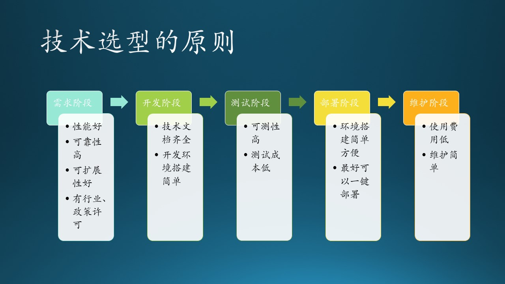
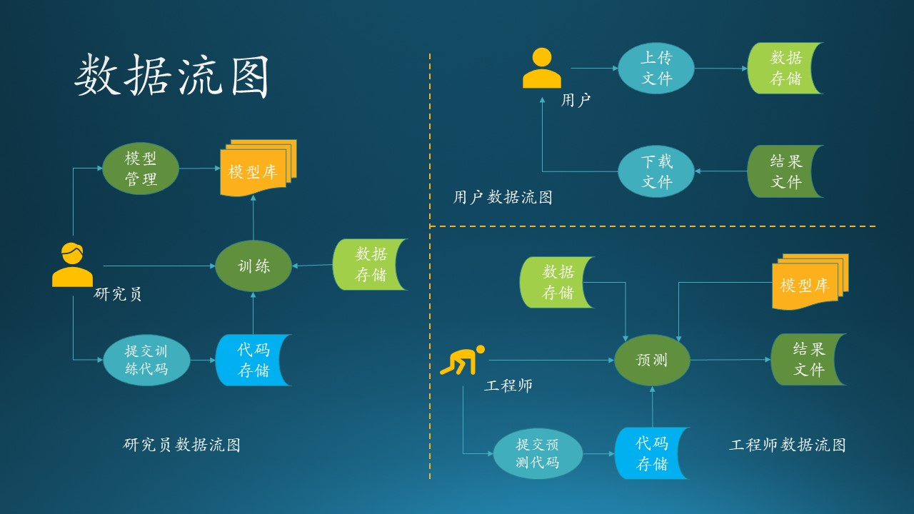
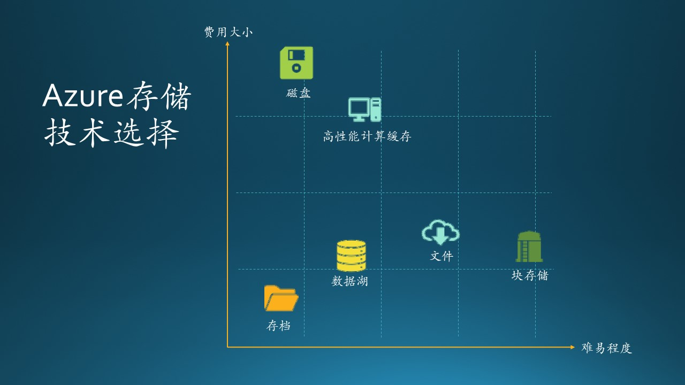
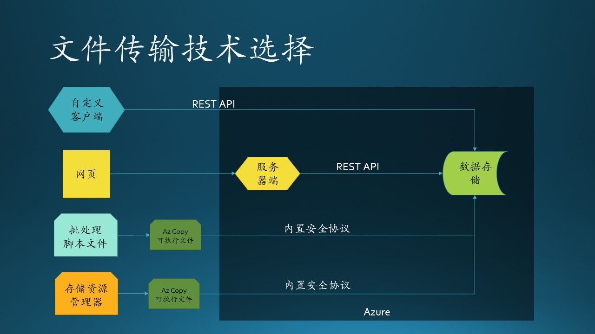
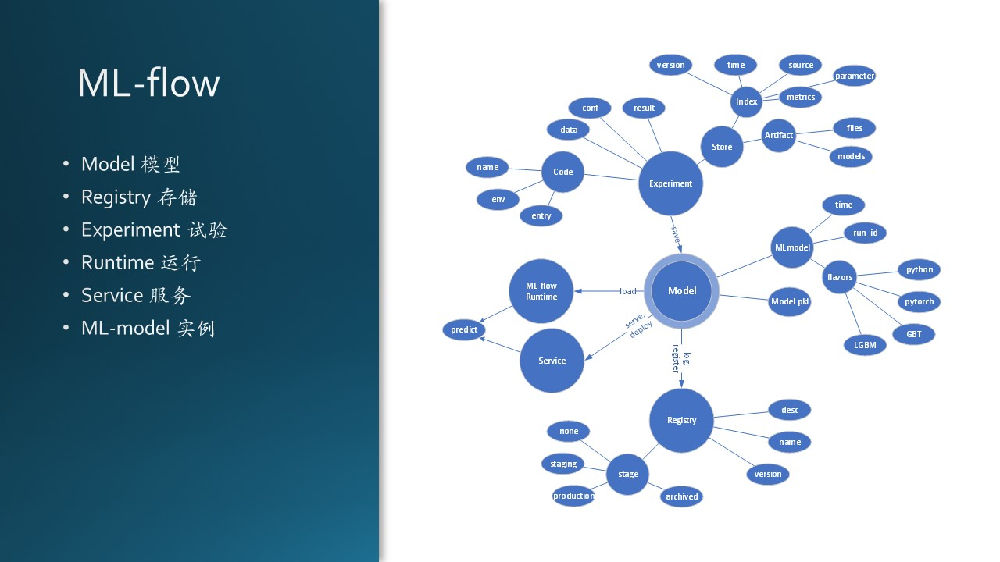

# 10.2 技术选型

## 10.2.1 技术选型原则

图 10.2.1 - 技术选型的原则

做技术选型要考虑以下几个方面：

1. 需求阶段
   - 性能好
   - 可靠性高
   - 可扩展性好
   - 有行业、政策许可
2. 开发阶段
   - 技术文档齐全
   - 开发环境搭建、重建容易
3. 测试阶段
   - 可测性好
   - 测试成本低
4. 部署阶段
   - 环境搭建简单
   - 最好可以一键部署
5. 维护阶段
   - 使用费用低
   - 维护简单

当然，一个技术不可能满足所有这些要求，这和 6.5 节中讲的非功能需求中的“好、快、省”是一个道理。

## 10.2.2 项目的故事

木头参与的一个真实项目，虽然不怎么大，但是麻雀虽小五脏俱全。无论规模如何，都要全力以赴，谨慎对待。

从用户用例的角度看，项目中有三个角色：

- 某基金客户想使用热门的深度学习来预测 A 股股票行情走向，所以找到了 MSRA 请求合作。客户将会在每周末上传上一周的股票交易数据，在微软 Azure 上完成存储、处理、预测、输出等一系列过程，然后从 Azure 上下载预测结果。

- 我软的研究员们深入研究了几个月，他们根据股票交易历史数据，在 Azure 上训练了一系列基于神经网络的深度学习模型，存入模型库中。如果需要的话，会每隔三个月再训练一次模型，以应对市场变化。

- 我软的工程师们，会监控客户的上传数据动作，一旦上传结束后，立刻在 Azure 上启动预测流程，调用研究员的模型库，根据最新交易结果进行预测，得到预测结果后，通知客户下载。

图 10.2.2 - 系统架构

图 10.2.2 展示了本系统的逻辑架构图，针对每个部分，我们下面讨论都需要做哪些技术选择。

## 10.2.3 存储技术选择

我们首先解决存储问题，因为股票数据的量还是比较大的，而且还要保存历史数据。

表 10.2.1 - Azure上的存储技术列表

|技术|描述|特点|价格(月)|
|--|--|--|--|
|文件|简单的分布式跨平台文件系统|直接迁移、简单便宜、无需编码即可将数据迁移至云|0.015$/GB|
|磁盘|适用于每种工作负荷的永久高性能磁盘存储|低延迟、高吞吐量、行业领先的单一实例服务级别协议、企业级持久性|$122（1T)|
|块存储|高度可缩放的非结构化数据对象存储|以高成本效益拥有巨大容量、分层存储选项、覆盖全球的单一基础架构|$0.01/GB|
|数据湖|安全且可大规模缩放的 Data Lake Storage|无限存储分析数据、针对 Apache Spark 和 Hadoop 分析引擎进行了优化、高性能文件系统、支持细化 ACL|$0.01/GB|
|存档|在存储不常访问的数据方面具有优势的行业价格|自动加密静态数据、与热存储层和冷存储层无缝集成、由领先的数据管理合作伙伴支持|$0.001/GB|
|HPC 缓存|用于高性能计算的文件缓存|加快对基于文件的大型工作负荷的数据访问、支持 Azure 现有的 HPC 工作负荷、简化存储资源管理|$29/GB|

表 10.2.1 列出了 Azure 上的主要存储技术，可以用图 10.2.3 简要概括：

图 10.2.3 - 存储技术选择

其中两个比较特殊的是磁盘和 HPC 缓存：

- 磁盘，就是和一般的计算机里的磁盘一样，只不过在Azure上是有操作系统磁盘的，而这里的磁盘是单独挂上的数据磁盘，固定容量（1TB）的。不管你存了多少数据，每个月固定$122，如果数据超出容量了，写入磁盘时会报错，必须再申请另外一块磁盘。这种传统的磁盘形式非常不灵活，而且必须挂在一台虚拟机上，也就是说你还需要租赁一台虚拟机。所以我们不使用这种技术。

- HPC 缓存，是大量读取文件时所需的技术，比如同时有上百颗 CPU 处理数据，在单位时间内（通常是秒级），提供高性能的读取操作。这也和我们的需求不符，我们最多每周训练、预测一次数据，没必要使用这样的技术。

上面这两个东西贵得离谱，先去掉。

- 下面看看最便宜的“存档”，看上去很便宜，但是这只是存储的价格，比如存一部数字化的电影。一旦要读出来，就会花和“块存储”同样的价格。股票历史数据文件是经常需要读出来的，和这个应用场景不符。

- “数据湖”是为高性能存储设计的，我们并不需要那么高的性能。而且要从它的存储向外拷贝数据非常的麻烦，需要提供一个 Job，异步完成数据传输。

- “文件”可以没有服务器支持而单独存在，但是在使用的时候，必须装载在服务器上才能使用，为 Windows 服务器做了优化，也可以被 Linux 服务器装载。使用时必须先装载的话，如果有多台服务器同时使用，可能需要在应用层非常小心地不产生文件冲突。

那么我们只剩下最后一个“块存储（Blob）”了，实际上块存储是 Azure 的基础存储技术，其它的一些存储技术都是建立在 Blob 之上的。比磁盘便宜很多，又可以无限扩展，吞吐能力满足要求，有安全性设计。

使用 Azure Blob 后，由于它提供 REST API 是外部可访问的，且性能很高，所以相当于这个系统有了一个唯一的存储点，避免分散管理或者共享带来的麻烦。

## 10.2.4 上传、下载技术选择

确定存储技术后，紧接着是确定如何读写存储。

图 10.2.4 - 文件传输技术选择

如果存储选择“块存储”技术的话，那么客户端的上传和下载，自然而然地就解决了，因为 Azure Blob 提供了 AzCopy.exe 客户端程序，安全性、性能、稳定性都没有问题，不需要我们在客户端开发软件了，只需要用批处理脚本调用 AzCopy.exe，指定合适的参数即可。

且慢！客户的机器可以运行 AzCopy.exe 吗？经过调查，确定客户的机器是 Windows 7（天呐！居然不是 Windows 10！），木头立刻查看了一下 AzCopy.exe 的说明，还好有 32 位版本可以下载。但是在我软的办公环境中已经找不到 Windows 7 了，木头只好从家里翻出一个旧笔记本，恢复成出厂的 Windows 7 环境，下载了 32 位版本的 AzCopy.exe，测试上传下载文件，一切正常！

另外几种解决方案是：

1. 开发客户端软件，调用关于 Blob 的 REST API 来传输数据
   - 优点：提供界面，方便用户操作。
   - 缺点：
     - 需要提供一个程序安装在客户的计算机上。如果这个程序太简单了，那和直接使用Azcopy没多少区别；但是如果太复杂了，万一逻辑有变化，需要再发布这个程序。只为一个客户做一个程序，有点儿得不偿失了。
     - 一般的程序还都需要依赖 Python 或者 .NetFramework 库，这就要求客户必须先安装底层软件支持包，太复杂了。

   这个方法是木头的一个实习生提出来的，并加以实现，界面画的有模有样，进度条、按钮、非阻塞界面线程等等，但是被木头叫停了。因为在还没有做好技术选型之前，不需要做那么漂亮的界面，只需要一个很粗糙的低保真原型，后台能够调用 REST API，成功上传下载一个足够大的测试文件就足够了。

2. 存储资源管理器

   Azure 还有一个关于存储的客户端产品叫做存储资源管理器（Storage Exploere），它可以像浏览本地文件夹一样管理位于 Azure Blob 上的文件，其后台也使用AzCopy。但是它过于灵活了，用户很容误操作，而且我们不希望用户把新文件上传到随便什么位置，而是要我们指定的位置和目录名称。

3. 开发一个网页
   - 优点：提供界面，方便用户操作；在服务器端收到全部文件后，再由服务器调用 API 转存到 Blob 上，这样可以不需要让客户知道 Blob 的访问密码；
   - 缺点：需要写这个网页，并部署在服务器端；需要处理大文件断点续传等逻辑。

   这个方法是木头在高级软件工程课上的一个学生提出来的，木头和另外一个工程师与这个学生讨论了很长时间，试图说明他的这个解决方案当然是可以行得通的，但是除了上面提到的缺点外，还有其它问题：

   - 网页安全性：必须在服务器端启用 SSL 协议，防止黑客监听。但是搭建认证服务器是要花钱的，在与客户的合同里面我方并没有承诺这一点，这笔费用没有人承担。
  
   - 网页合规性：微软在给别人提供网页时，都要经过法务部分的合规性检查。

   - 网页设计：我们不能粗制滥造一个网页给客户使用，所以又要找 Designer 来帮忙设计，增加了工作量。

   - 客户的潜在需求：客户一旦使用了网页，可能会得寸进尺地需要在网页上增加更多的功能，使得市场人员陷入被动。

   针对安全性问题，该学生有提出了新的论点：有开源免费的认证服务器可以使用！

   这听上去确实令人动心！但是，在这份合同里，微软收费了，所以不能给客户提供第三方的免费服务。注意，我们说的是“服务”，而不是“产品”，在后面我们还会提到第三方的免费产品问题。

   直到最后我们也没有能说服这个学生改变他的想法，因为在他看来，只要是网上开源的软件就都可以使用；而在我们工程师看来，要遵守微软的商业准则、维护公司形象，要确保系统运行稳定可靠，慎用第三方软件和服务。在可以使用已有产品的地方，绝不开发新的产品。比如 AzCopy，有一个专业的 team 在维护，其稳定性、安全性、性能等等肯定比任何其它方法都要好。

## 10.2.5 模型试验管理技术选择

模型管理在传统软件工程中是不存在的，只有在训练机器学习或深度学习模型时才会用到。

训练模型最大的问题就是，没有一个标准可以告诉你应该达到什么准确率，所以需要我们不断地去试验各种方法，试图获得最好的结果，并记录每种方法的超参数、数据使用方式、评估结果等等。在可能的情况下，通常我们会训练十多个模型做比对，最后再决定用哪个或者哪几个的组合，然后按照当时记录的参数重新训练一次，以便可以稳定地重复当时的结果。以上这些都需要一个模型管理模块或者系统来管理。

木头经过调研，有以下几种技术方案可以选择：

1. 自己做。这个方案最笨，但是最保险，因为按照木头的 coding skill（编程技巧）来说，这个东西是肯定可以做出来的，只不过时间上不好估算，因为要牵涉到代码库（如Git）、数据库、存储等多个环节的设计和协调。
  
2. 基于 Anaconda 进行再开发。Anaconda 可以便捷获取包且对包能够进行管理，同时对环境可以统一管理的发行版本。Anaconda包含了conda、Python在内的超过180个科学包及其依赖项。但是它只能处理环境问题，不能管理参数。所以需要我们自己定制，也不省力气。
   
3. 找开源软件。Tensorflow 和 Pytorch 里都自带一些简单的工具包，但是比起其它一些独立的开源软件来说，要差很多，比如：
   - Wandb.ai
   - Comet.ml
   - Neptune.ai
   - Allegro Trains
   - ML-flow
   
   因为有些同事以前用过 ML-flow，听过介绍后，木头认为很靠谱，就去仔细研究了两个星期，感觉可以完全满足我们的需求，最后决定就用它了。比起前两个方案来说，至少能节省两个月的开发时间。

图 10.2.5 - 文件传输技术选择

ML-flow 是基于 Python 环境的，所以需要一台虚拟机部署，木头选择了一台 Windows 2019 Server，当然也可以选择 Linux Ubuntu 19，由于我们的应用都是在 Python 上，所以区别不大。它既能够管理模型，也可以把代码当作模型的附属一并管理，这样就省去了单独管理代码但是又需要和模型匹配的麻烦。

## 10.2.6 训练、预测实例化技术选择

我们的研究员都是用 Pytorch 做模型训练，所以预测也要使用 Pytorch，这样软件就定了，我们要选择的是硬件。

在 Azure 上的深度学习硬件的选择并不多，主要是选择带有 GPU 的虚拟机做训练；对于预测来说，我们可以选择使用 CPU 运算，但是该虚拟机需要的内存较大。所以这两类虚拟机都不便宜，一个月下来，需要上千美元。

如何降低成本呢？经过研读文档，木头发现在空闲时可以关闭虚拟机释放资源，在需要时再打开虚拟机，这样只根据实际使用时长收费，对于我们这个应用场景来说（一周使用一次），是非常适合的。

木头又看了一下容器技术，在 Azure 上，是需要事先申请好计算资源池，然后在池中创建容器的，所以并不能省钱。况且容器技术是一种微服务，对本场景来说并不适合。

## 10.2.7 控制中心的编程框架技术选择

首先要确定软件开发环境。因为训练、预测、模型管理都使用了 Python，所以我们干脆也用 Python 来实现控制门户吧，代码管理方便，部署环境一致，技术栈统一。

在 Python 中有很多 RESTful Web 框架，如 Django REST framework，Flask-RESTful 等等。

- Django REST framework 是一个功能强大且灵活的 REST Web API 框架，包含 OAuth1a、OAuth2身份验证策略，支持 ORM 和非 ORM 数据源的序列化，使用基于函数的常规视图实现自定义你所需要的功能，有广泛的文档资料和社区支持。

- Tornado是一种 Web 服务器软件的开源版本。Tornado 和现在的主流 Web 服务器框架（包括大多数 Python 的框架）有着明显的区别：它是非阻塞式服务器，而且速度相当快。得利于其非阻塞的方式和对epoll的运用，Tornado 每秒可以处理数以千计的连接，因此 Tornado 是实时 Web 服务的一个理想框架。

- Flask 是一个使用 Python 编写的轻量级 Web 应用框架。其 WSGI 工具箱采用 Werkzeug ，模板引擎则使用 Jinja2 。Flask也被称为 “microframework” ，因为它使用简单的核心，用 extension 增加其他功能。Flask没有默认使用的数据库、窗体验证工具。Flask 很轻，花很少的成本就能够开发一个简单的网站。非常适合初学者学习。Flask 框架学会以后，可以考虑学习插件的使用。例如使用 WTForm + Flask-WTForm 来验证表单数据，用 SQLAlchemy + Flask-SQLAlchemy 来对你的数据库进行控制。

还有4、5个其它的框架，都有很多拥趸。对于我们这个系统，用户很少，所以对性能没什么要求，只要开发简单、能够稳定运行即可。所以最后木头选择了 Flask API，只用十几行代码就可以搞定框架部分，每个 API 定义一个函数，指定好传入的参数，非常的方便，调试也很简单。
