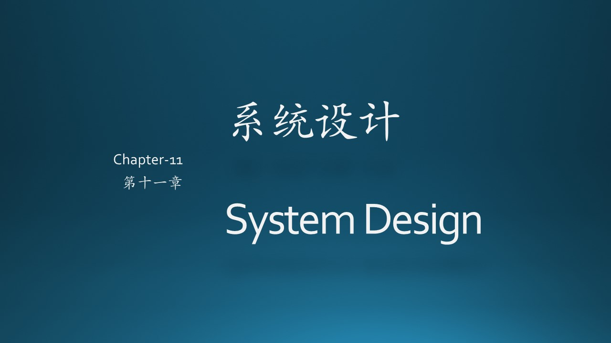
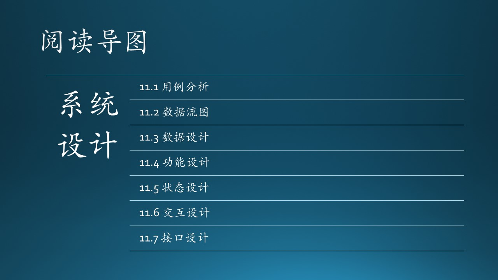

（插入一些说明性文字，重点在介绍上下文，串连）

在本章中，将通过一个实际案例讲解软件系统从分析到设计的整个过程，最开始的两个小节会复习一下需求分析的内容，以便和后面的系统设计形成完整的上下文。这个实际案例并不复杂，规模偏小，但是却正好可以用于讲解，而且是现代软件工程中常见的 AI 模型落地的应用。

思路

敏捷开发一般不推荐详细设计，系统总体设计、概要设计可合并为架构（Architecture）设计。

架构设计4+1视图，里面有很多任务，来完成整体视图

Scenarios
（6.6）
- 系统边界
- 子系统划分

Logical View
(6.7)
- 模块划分
- 接口定义

Process View
- 进程线程设计与同步

Development View
- 技术选型
- 详细设计

Physical View
- 技术选型
- 网络设计
- 容错设计

|步骤：|1.描述原始功能|2.提取静态结构|3.捕捉动态行为|4.计划代码结构|5.制定部署方案|
|--|--|--|--|--|--|
|功能分解法|功能|子功能|功能接口|
|结构化分析法|系统关系图，顶层数据流图|数据存储，端点|数据处理，数据流|
|信息建模法|原始信息|对象和属性|关系类型，关联对象|
|面向对象法|功能模型|对象模型|动态模型|
|RUP 4+1 view|Scenario View|逻辑视图|进程视图|开发视图|物理视图|
|图例类型|用例图|静态图|行为图|构件图|部署图|
|UML图例|用例图|类图、对象图|活动图，顺序图，协作图，状态图|组件图|配置图|
|作用|从外部用户的角度描述系统的功能，并指出功能的执行者|初步分析后得出系统中的各个行为主体|从不同侧面描述客户系统的状态和行为|描述软件实现代码的组成|描述软件实现系统的组成和分布状况||
|其它图例|数据流图，鲁棒图|包图，关联图，E-R图，结构图|

