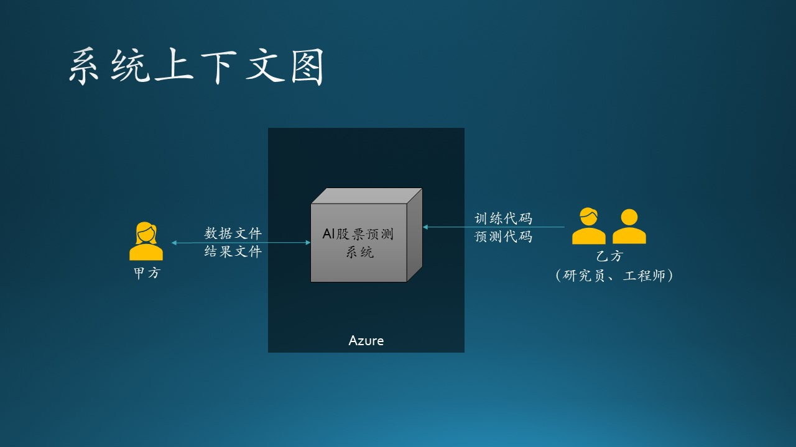
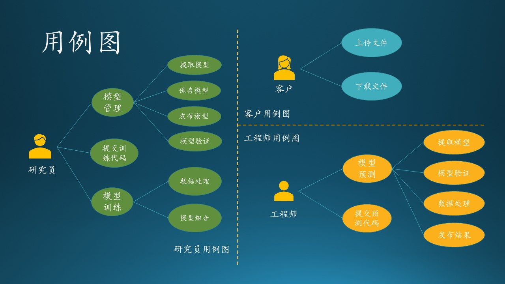
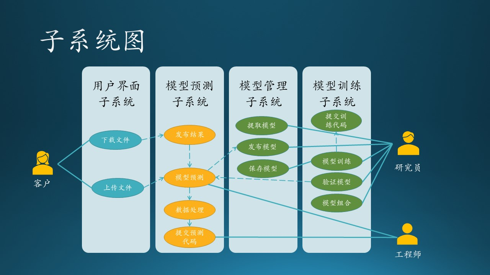

# 11.1 第一步：用例分析

在这一部分中，我们先来复习一下需求分析的基本内容，以便和后面的设计部分无缝连接。

## 11.1.1 应用场景

我们仍然使用 10.2.2 节中的项目的故事为例，来说明一个完整分析、设计过程。为了方便阅读，我们再重复一下这个故事场景。

木头参与的一个真实项目，虽然不怎么大，但是麻雀虽小五脏俱全，服务于客户的系统，无论规模如何，都要全力以赴，谨慎对待。

- 某基金客户想使用热门的深度学习来预测 A 股股票行情走向，所以找到了 MSRA 请求合作。客户将会在每周末上传上一周的股票交易数据，在微软 Azure 上完成存储、处理、预测、输出等一系列过程，然后从 Azure 上下载预测结果。

- 我软的研究员们深入研究了几个月，他们根据股票交易历史数据，在 Azure 上训练了一系列基于神经网络的深度学习模型，存入模型库中。

- 我软的工程师们，会监控客户的上传数据动作，一旦上传结束后，立刻在 Azure 上启动预测流程，调用研究员的模型库，根据最新交易结果进行预测，得到预测结果后，通知客户下载。

- 整个系统要求构建在 Azure 技术架构之上。

## 11.1.2 系统上下文图

先根据应用场景绘制一个系统上下文图，搞清楚系统边界，见图11.1.1。

图 11.1.1 - 系统上下文图

可以看到，这是一个独立的 AI 股票预测系统，要求构建在 Azure 上，周边没有任何其它系统交互，只有两种参与者：甲方（客户）、乙方（研究员、工程师）。当然，对于客户来说，分不清研究员和工程师的职责，也没必要知道。

## 11.1.3 用例图

其次，针对三种参与者绘制用例图。由于此图是给乙方内部看的，所以一定要分清研究员和工程师的职责。见图 11.1.2。

图 11.1.2 - 用例图

我们根据 11.1.1 节的需求描述，把每个参与者（客户、研究员、工程师）的用例图单独画出来，这样可以避免一开始就陷入复杂的逻辑纠缠中。另外，我们还进行了进一步的归类，比如模型管理用例含有4个子用例。

刚开始画此用例图时，可以把所有想到的用例（椭圆形）都并列画出，不包含层级关系，比如图 11.1.2 中，研究员可能就会有7~9个用例；然后根据各个用例的从属关系进一步整理成子用例。如果在此不整理成为层级关系，也可以在绘制子系统图时再整理。

### 研究员的工作

1. 提交训练代码：在本地写好训练代码后提交到云端保存。
2. 模型训练
   - 数据处理：在训练前对数据进行处理，提取特征值。
   - 模型组合：在训练后，组合多个模型，提高预测准确率。
3. 模型管理
   - 保存模型：训练好的模型保存到系统中供以后使用。
   - 提取模型：提取以前训练好的模型。
   - 发布模型：把效果最好的模型发布给工程师。
   - 模型验证：验证模型的准确率并与以前的模型比较。

### 工程师的工作

1. 提交预测代码：在本地写好预测代码后提交到云端保存。
2. 模型预测
   - 提取模型：提取研究员发布的最新模型。
   - 模型验证：验证研究员发布的模型的准确率，并与以前的模型进行比较。
   - 数据处理：在预测前对数据进行处理，提取特征值。
   - 发布结果：预测结束之后的数据写入文件并发布到云端存储。

### 客户的使用

1. 上传文件：上传最新一周的股票交易数据文件到云端存储。
2. 下载文件：从云端存储下载乙方工程师发布的结果文件。

在用例图绘制过程中，我们可能会发现有用例名称重复的情况，这里有两种情况：

1. 不同的参与者在各自的工作范围内完成具有相同名称的动作，但是其实质内容不同，只是名称恰巧相同而已，比如“模型验证”：
   - 对于研究员来说，是用验证集数据验证模型的准确率，并于以前训练过的模型相比较；
   - 对于工程师来说，是用测试集数据验证模型的准确率，并于上一次发布的模型相比较。

   再比如“提取模型”：
   - 对于研究员来说，是提取模型库中的指定的历史模型。
   - 对于工程师来说，是提取研究员发布的最新模型。

   所以这样的用例，将来在系统中是处于不同的子系统中的不同模块。

2. 不同的参与者执行完成相同任务的用例，名字和内容都一致，比如“数据处理”：
   - 对于研究员来说，在训练前先做数据预处理，提取特征，抛弃无用数据；
   - 对于工程师来说，是在预测前做相同的事，达到相同的目的。
   
   所以这样的用例，将来在系统中会变成一个共用模块。

## 11.1.4 子系统图

在有了用例、子用例后，绘制子系统图会变得很容易。如果在用例图中不整理出子用例的话，在这个阶段整理也是可以的。图 11.1.3 显示了用例在子系统中的位置，其中，实线表示用例关系，带箭头的虚线表示用例依赖关系，比如：“发布结果”是要依赖“模型预测”的。

图 11.1.3 - 子系统图

整个子系统划分的分析整理过程的思路如下：

1. 首先，根据研究员和工程师的职责，系统是要肯定有“训练子系统”和“预测子系统”的。前者可以在任何时间运行，供研究员做试验使用；后者只在用户有新数据上传时才运行。
2. 模型管理子系统更多地是为训练子系统提供服务，为研究员的试验保存参数和模型等数据。对于预测子系统来说，只获取发布的最新模型即可，对于模型管理子系统的依赖不是很强烈。但是鉴于模型管理子系统的复杂性，不能把它合并到训练子系统中。
3. 不能够让客户直接接触到预测子系统，要通过数据交换的松散耦合方式来设计，即提供给客户上传和下载的接口，这些都可以归纳到用户界面子系统中。这里有一个误区，大家看到“界面”两个字，一般会想到要给客户提供一个“交互式的界面”，其实 REST API 也是一种“界面”。
