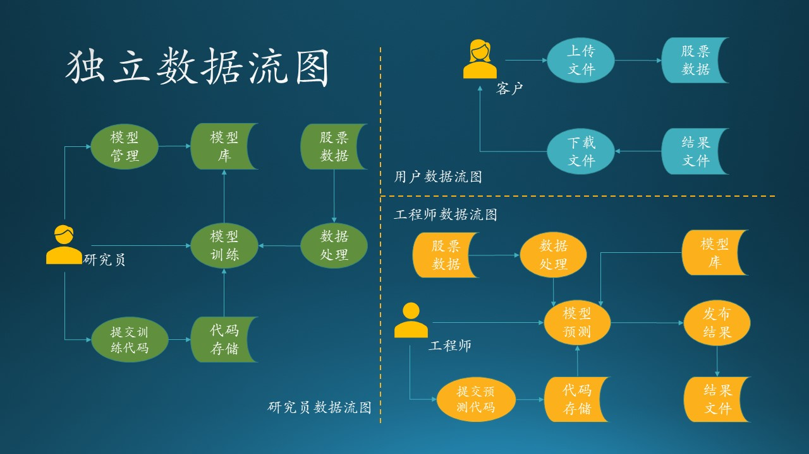
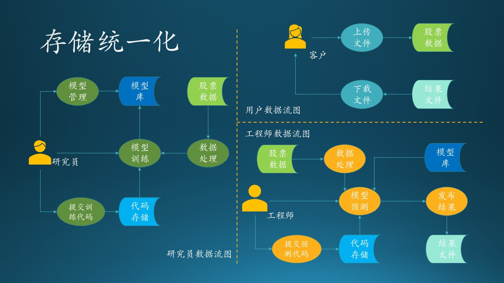
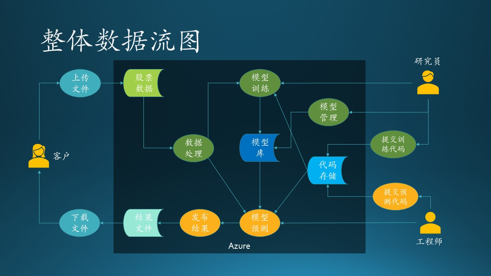

## 11.2 第二步：数据流图

本节依然属于需求分析的范畴，紧接着 11.1 节的内容。

### 11.2.1 各个参与者的独立数据流图

我们根据 11.1 中的需求描述，把每个参与者（客户、研究员、工程师）的数据流图单独画出来，这样可以避免一开始就陷入复杂的逻辑纠缠中。见图 11.2.1。

图 11.2.1 - 独立数据流图

图 11.2.1 中的各个图例没有按照标准的数据流图图例（见6.8节）绘制，而是使用了更生动的彩色图例。其中：

- 人形图例代表参与者；
- 椭圆形图例代表加工逻辑；
- 铲形图例代表存储；
- 有方向的线代表数据流。

#### 客户数据流图

1. 用户上传数据到云端的数据存储上；
2. 用户得到通知后，下载预测结果文件。

对用户来说比较简单，就是两个动作：上传、下载，后面的一切流程都是透明的。所以，我们需要设计“上传”和“下载”的实现。

#### 研究员数据流图

1. 研究员在自己的计算机上设计模型，并提交训练代码到云端存储；
2. 云端有一个代码存储库，包括模型、代码、初始参数等；
3. 研究员登录到云端服务器，启动模型训练过程；
4. 在训练开始时，需要读取存储在云端的股票历史数据并进行预处理；
5. 训练结束后，把成熟的模型存放到模型库，供后续流程使用。
6. 对模型库进行管理，比如删除一些性能较差的模型。

对研究员来说，“提交训练代码”和“模型训练”是两个主要动作，代码可以在本地计算机上完成实现，与 Azure 交互的是“提交”动作，还要考虑“训练”部署在什么设备上运行，其它的一些辅助存储需要 Azure 上的哪种存储设备。

#### 工程师数据流图

1. 开发完毕后，提交预测代码到云端部署；
2. 启动模型预测过程；
3. 在预测开始前，要读取股票历史数据和最新上传的数据并进行预处理，还要从模型库中读取最新模型；
4. 预测完毕后，输出结果文件。

对于工程师来说，“提交预测代码”和“预测”是两个主要动作，代码可以在本地计算机上完成实现，与 Azure 交互的是“提交”动作，还要考虑“预测”部署在什么设备上运行，其它的一些辅助存储需要 Azure 上的哪种存储设备。

### 11.2.2 存储统一化的数据流图

图 11.2.1 中，表示存储系统的图例，有一些是具有相同名称的，比如：“模型库”、“代码存储”、“结果文件”在不同角色的数据流图中总共各出现了两次，“股票数据”出现了三次。我们不妨用不同的色彩来标记，如图 11.2.2 所示。

图 11.2.2 - 存储统一化的数据流图

也就是说不同的角色之间，是通过这些公共的存储来做数据交换的。这为我们下一步形成整体数据流图做了准备。

这一步不是必须要画彩色图才能实现的，分析人员只要心中记住哪些存储是可以合并的即可。

### 11.2.3 模块统一化的数据流图

在图 11.2.1 中，表示加工逻辑的图例，有一些是具有相同名称的，比如“数据处理”。熟悉 AI 模型训练和预测过程的读者都知道，数据处理在训练和预测时必须保持一致，否则或造成预测结果与模型不匹配。比如：
- 训练过程要求输入三个特征值，那么数据处理就会把数据提取出三个特征值来，在预测时需要同样的三个特征值，而不是两个或者四个；
- 训练过程要求其中一个特征值的值域范围为 $[0,1]$，那么预测前也必须把该特征值做相同的归一化处理。

所以，数据处理模块实际上训练和预测共用的，必须合并为一个。

同存储图例一样，分析人员也要清楚这些加工逻辑是否真的可以在不同子系统之间共用，还是恰巧只是名称相同而已。如果可以共用，就要标记出来；如果不能共用，就重新命名为不同的名称。

### 11.2.4 整体数据流图

下面我们需要把三个独立的数据流图合并成一个完整的数据流图，来发现需要改进的地方。

合并的过程很简单，把 11.2.2 和 11.2.3 小节中整理出来的重复（具有相同名字并且相同颜色）的单元删掉，但是保留连接线。比如“股票数据”单元一共有三个，删掉右侧的两个，然后把“上传文件”连接到左侧的“股票数据”上，再把“数据处理”连接到左侧的“股票数据”上，箭头方向保持不变。

依此类推，去掉所有重名重色的单元后，再调整各个单元的位置，尽量让连接线没有交叉，就变成了图 11.2.3 的样子。当然，由于这是一个拓扑图，所以可能画法不止一种。

图 11.2.3 - 整体数据流图

被合并的存储有：
- 股票数据
- 代码存储
- 模型库
- 结果文件

被合并的加工逻辑有：
- 数据处理

与图 11.2.1 不同的是，这里多了一个深色的矩形区域“Azure”，表明在我们的设计中，该矩形区域内的元素，包括数据、行为、流程，都应该使用 Azure 提供的技术。

