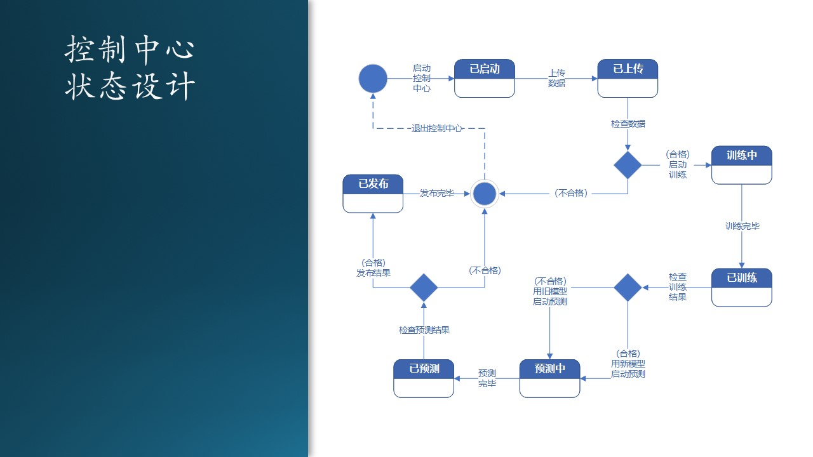
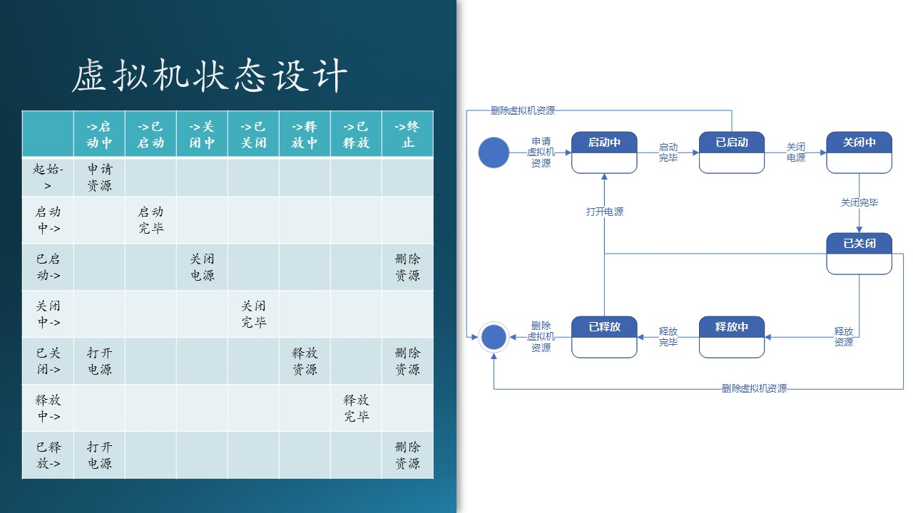
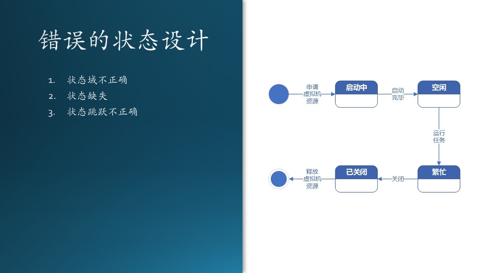

## 11.5 状态设计

### 11.5.1 控制中心的状态转换

在数据流图中定义了一系列大的流程，在功能设计中划分了模块，但是都没有给出所有的分支和细节，所以我们在这一小节要通过对控制中心的状态转换设计来捋清楚所有细节。绘制传统的流程图也是可以做到这一点的，但是不包含状态名称信息，在后面的文档或者开发过程中，不容易形成共同语言。而且使用流程图做设计，实现时只能用 if...else 来编写代码，当一个对象状态非常复杂时，用 if...else 解决不了问题。

图 11.5.1 - 控制中心状态设计

状态解释如下：

1. 初始状态，手工启动控制中心的程序，进入“已启动”状态；
2. 用户上传数据，完毕后会通知控制中心，进入“已上传”状态；
3. 自动检测数据，如果合格，就启动训练，进入“训练中”状态；如果不合格，就终止；
4. 训练完毕后进入“已训练”状态；
5. 检查训练结果，即新的数据模型是否优于旧的模型，合格的话使用新模型进入预测，不合格的话使用旧模型进入预测；进入“预测中”状态；
6. 预测完毕，进入“已预测”状态；
7. 检查预测结果，如合格就发布结果，进入“已发布”状态；如果不合格，就“终止”；
8. 发布完毕后，进入“终止”状态。

其中，“启动控制中心”和“退出控制中心”都是手动完成的，不需要编码。

控制中心提供 REST API 以便得到外部通知，再对内进行任务调度。图 11.5.1 的各状态之间的转换还算比较规矩（顺序性较强），基本没有乱跳的，所以后续的开发人员在编码实现时，用 if...else 来实现呢，还是用状态机模型来实现呢？这依赖于在业务逻辑中有没有异步或者阻塞情况发生。

比如，“已预测”状态后，会有一个事件（在状态设计中叫做事件，在功能设计中叫做模块）叫做“检查预测结果”，如何检查不是状态设计要关心的问题，在具体运行中，有可能是手工检查（这就需要中断流程，并在控制中心提供一个界面来人工检查预测结果数据），也可能是自动检查（通过一段代码来判断输出结果是否符合要求）。

如果是人工检查的话，那就是一个异步过程：

1. 预测完毕，输出预测结果到文本文件存储；
2. 系统生成一封电子邮件，发送给当事人；这一步已经脱离了本系统的控制。
3. 邮件里面带着一个链接，点击链接将会从控制中心得到一个网页，来浏览预测结果文件的文本内容；
4. 网页最下端有一个“合格”按钮和一个“不合格”按钮，用于通知控制中心，是继续后面的流程，还是就此终断。这一步又把控制权返回给系统。

还有一种设计方式是，当文本文件的内容不多时，可以放到邮件正文或附件中，并在邮件正文中附带一个链接，导航到控制中心的一个简单网页上，再选择“合格”或“不合格”。

### 11.5.2 虚拟机状态设计

由于系统都运行在 Azure 上，而且定制化程度较高，所以我们都使用 Azure 上的虚拟机来搭建控制中心、训练子系统、预测子系统。

由于虚拟机的收费较高，所以要研究清楚虚拟机的收费策略，即：
- 需要申请虚拟机，虚拟机自动启动；
- 虚拟机在“已启动”时，是按时长收费的，不管是否运行了应用程序；
- 虚拟机在“已关闭”时，仍然收费（Azure的这个设计让用户有些不解，并因此忘记释放资源而继续被动付费）；
- 虚拟机在“已释放”后，停止收费，但是“释放”并非“销毁”，里面安装的应用和数据还是可以打开虚拟机后再重新加载继续使用的，不会丢失；
- 虚拟机在删除后，数据全部丢失。

把上面的策略总结成状态转换，如图 11.5.2 所示。

图 11.5.2 - 虚拟机状态设计

### 11.5.3 错误的状态设计

初学者在做状态设计的时候，会出现的一些常见错误如图 11.5.3 所示。

图 11.5.3 - 错误的状态设计

这同样是虚拟机的状态设计，存在三个问题：

1. 状态域不正确
   
   我们可以对比图 11.5.2，就可以发现问题：本图中“启动中”和“已关闭”状态是正确的虚拟机状态域，都是属于硬件和操作系统级别的状态；但是“空闲”和“繁忙”并不是，它们是属于应用软件系统的状态。

2. 状态/事件缺失
   
   和上一个状态域不正确的问题合并，缺失“已启动”、“关闭中”两个状态，实际上“空闲”应该是“已启动”，“繁忙”应该是“关闭中”。因为关闭不是瞬间完成的，如果可以瞬间完成的话，那么事件应该是“掉电”。

3. 状态跳跃不正确

   我们先假设“繁忙”是正确的状态，从“繁忙”跳到“已关闭”的话，会有很多应用数据丢失，所以必须从“繁忙”先跳到“空闲”，把正在执行的任务优雅地停止，保存好状态数据，然后才能关闭。

