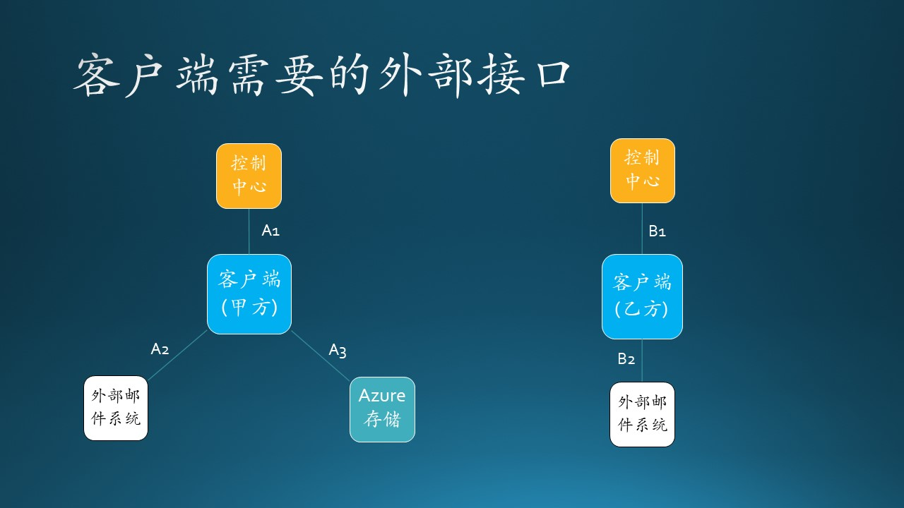
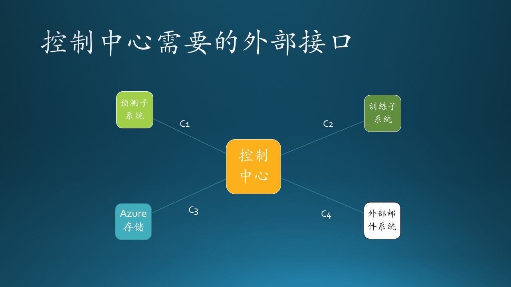
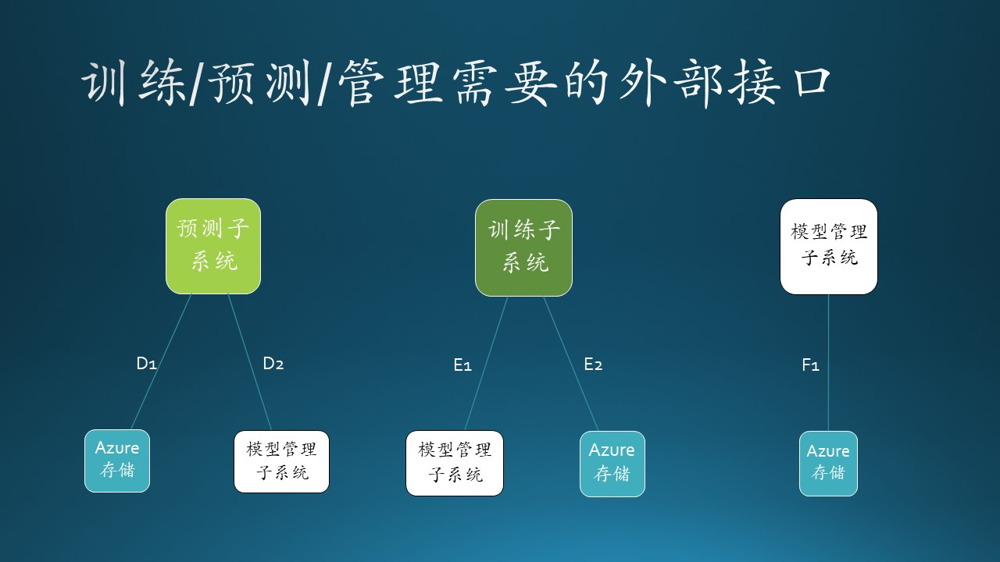
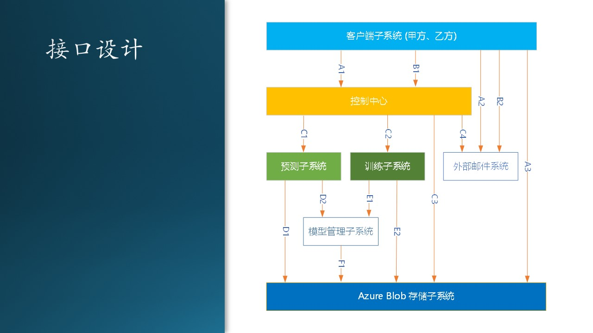

## 11.7 接口设计

### 11.7.1 接口技术选择

这里的接口指的是子系统之间的接口，而不是具体的编程语言接口，如 Java、C# 中定义的接口。另外，简单的 API 调用也不是我们要讨论的接口，我们主要讨论跨越进程甚至物理机器之间的接口设计问题。

在 11.6 节的交互设计中，我们确定了两个组件（子系统）之间如何交互，现在要设计具体接口，即：

1. 使用什么技术？
2. 传送什么数据？
3. 返回什么结果？

接口技术的选择：

- Web Service
  
  使用SOAP（Simple Object Access Protocol，简单对象访问协议）提供了在各种平台、框架上运行的不同软件之间可以进行互操作的标准方法。

- Web API/REST API
  
  使用 HTTP 协议的 GET、POST、PUT、DELETE 操作封装 JSON 数据作为参数，驱动服务器完成指定任务。

- RPC（Remote Procedure Call，远过程调用）
  
  有很多中间件可以完成 RPC，调用者在本地使用一个简单的 API，透明地通过服务器传递给被调用者完成指定功能。

- 管道
  
  是一种简单的 IPC（进程间通信）机制，可以是单向的或双向的，传送自定义消息，接收方自行解释执行相应功能。

- Message Queue

  消息队列，FIFO先入先出，是一种进程间通信的方式，接收方繁忙或掉线时，消息不会丢失，直到接收方可以重新主动获得消息。

- Socket

  最底层的套接字通讯，自己封装数据包并在发送和接收端解析，完成指定功能并返回给对方。

在本系统中由于有了控制中心的存在，使得不同子系统之间的网状连接变成了与控制中心的星形连接，大大简化了通信成本。由此可见，当系统中存在4个以上的子系统时，一定要使用星形连接来构建。

下面我们逐个设计每个组件需要的外部接口。

### 11.7.2 客户端需要的外部接口

图 11.7.1 - 客户端需要的接口

#### 接口 A1

包括两个方法：

- 获得时间戳
   
   - 方法：GET /api/get_timestamp/
   - 目标：控制中心
   - 返回：\<timestamp\> 时间戳

   客户端每周都要上传一次数据，带有强烈的时间信号，所以我们设计用时间戳来表示本批次的数据，时间戳的格式是“YYYYmmddHHMMSS”，即“年月日时分秒”。

- 通知上传数据完毕

   - 方法：GET /api/start/\<timestamp\>
   - 目标：控制中心
   - 返回：200 OK

   这个方法用 POST 也是可以的，只不过用 GET 可以简化编程，也没有歧义。后面很多方法与此相同。
   
   客户端脚本上传完数据后，直接用 CURL.exe 可执行文件调用该接口，通知控制中心开始后续的工作。至于后续的工作是什么，由控制中心决定。

#### 接口 A2

- 接收邮件
  - 方法：邮件客户端软件
  - 目标：外部邮件系统
  - 返回：邮件内容，内含网页链接

  甲方会收到控制中心发送的邮件通知，然后使用本地的邮件客户端接收邮件。内容是告知甲方上传数据完毕或可以下载预测结果文件。

#### 接口 A3

- 存取 Azure 存储
  - 方法：AzCopy.exe 可执行程序
  - 目标：Azure 存储
  - 返回：成功或失败

  客户端上传、下载数据文件时使用。

#### 接口 B1

包括四个方法：

- 检查训练结果
   - 方法：GET /api/review_training_result/\<timestamp\>
   - 目标：控制中心
   - 返回：HTML 格式网页
  
  这个接口实际上返回一个网页，研究员需要用此网页来检查训练结果的正确性，避免需要登录到 Azure 虚拟机上检查的麻烦。

- 确认训练结果
  - 方法：GET /api/confirm_training_result/\<timestamp\>
  - 目标：控制中心

  在上面的接口方法返回的网页上，有一个按钮，研究员可以点击此按钮调用 REST API 触发本接口，控制中心将接到通知，进行下一步操作（进入下一个状态）。

- 检查预测结果
   - 方法：GET /api/review_inference_result/\<timestamp\>
   - 目标：控制中心
   - 返回：HTML 格式网页
  
  这个接口实际上返回一个网页，研究员需要用此网页来检查训练结果的正确性，避免需要登录到 Azure 虚拟机上检查的麻烦。

- 确认预测结果
  - 方法：GET /api/confirm_inference_result/\<timestamp\>
  - 目标：控制中心
  - 返回：

  在上面的接口方法返回的网页上，有一个按钮，工程师可以点击此按钮调用 REST API 触发本接口，控制中心将接到通知，进行下一步操作（进入下一个状态）。
  
#### 接口 B2

- 接收邮件
  - 方法：邮件客户端软件
  - 目标：外部邮件系统
  - 返回：邮件内容，内含网页链接

  乙方会收到控制中心发送的邮件通知，然后使用本地的邮件客户端接收邮件。内容是告知研究员训练完毕，需要检查训练结果并确认，或者是告知工程师预测完毕，需要检查预测结果并确认。

### 11.7.3 控制中心需要的外部接口

图 11.7.2 - 控制中心需要的外部接口

#### 接口 C1

- 启动预测子系统
  - 方法：使用系统命令行接口调用 ssh 远程登录并执行指定启动代码
  - 目标：预测子系统
  - 返回：停等，直到预测过程结束后返回控制权

  控制中心需要预测子系统暴露出启动接口。

#### 接口 C2

- 启动训练子系统
  - 方法：使用系统命令行接口调用 ssh 远程登录并执行指定启动代码
  - 目标：训练子系统
  - 返回：停等，直到训练过程结束后返回控制权

  控制中心需要训练子系统暴露出启动接口。

#### 接口 C3

- 访问 Azure 存储
  - 方法：得到预测或者训练的文本输出
  - 目标：Azure 存储
  - 返回：得到文本文件内容

  控制中心需要访问 Azure 存储读取指定文本文件内容。

#### 接口 C4

- 发送邮件通知

  - 方法：本地 API 调用（SMTP 协议 Python 支持包）
  - 目标：外部邮件系统
  - 返回：成功或失败

  控制中心需要发送邮件给外部邮件系统。

### 11.7.4 内部子系统需要的外部接口

图 11.6.3 - 训练/预测/管理需要的外部接口

#### 接口 D1

- 访问 Azure 存储
  - 方法：本地 API 调用（安装 Azure 的 Python 支持包）读取或者存储文件
  - 目标：Azure 存储
  - 返回：成功或失败

  预测子系统需要读取 Azure 存储上的数据文件，把预测结果保存到存储。

#### 接口 D2

- 获得最新模型
  - 方法：本地 API 调用（安装 ML-flow 的 Python 支持包）读取最新模型文件
  - 目标：模型管理子系统
  - 返回：成功或失败

  预测子系统从模型管理子系统获得最新发布的模型文件。

#### 接口 E1

- 写入模型
  - 方法：本地 API 调用（安装 ML-flow 的 Python 支持包）写入模型文件
  - 目标：模型管理子系统
  - 返回：成功或失败

  训练子系统把训练好的模型写入模型管理子系统。

#### 接口 E2

- 访问 Azure 存储
  - 方法：本地 API 调用（安装 Azure 的 Python 支持包）读取或者存储文件
  - 目标：Azure 存储
  - 返回：成功或失败

  训练子系统把训练结果写入 Azure 存储上的文本文件。

#### 接口 F1

- 访问 Azure 存储
  - 方法：本地 API 调用（安装 Azure 的 Python 支持包）读取或者存储文件
  - 目标：Azure 存储
  - 返回：成功或失败

  模型管理子系统（ML-flow）需要使用 Azure Blob 作为模型试验存储。

图 11.6.3 - 客户子系统的

