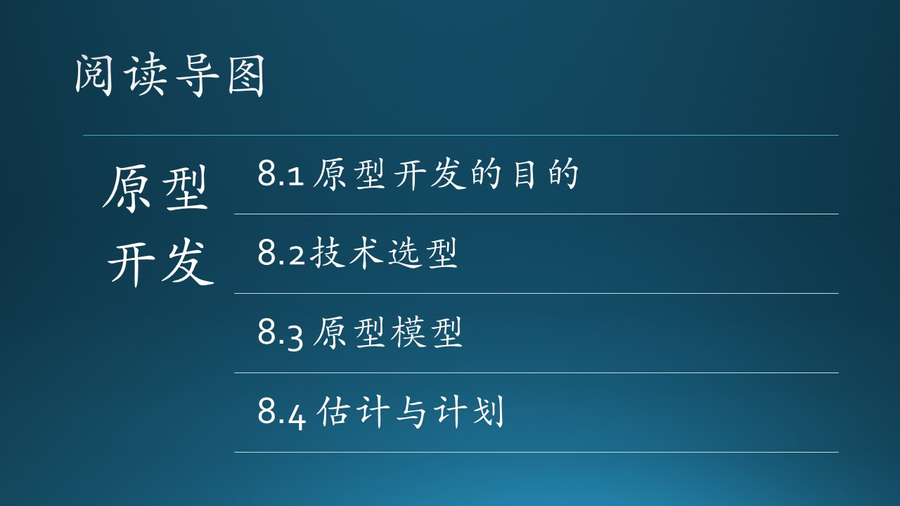

（插入一些说明性文字，重点在介绍上下文，串连）

- [1] http://www.zhoujingen.cn/blog/5610.html
- [2] 低保真原型与高保真原型，https://www.jianshu.com/p/c1fa72cb4021
- [3] 原型的保真度，https://www.jianshu.com/p/c1fa72cb4021
- [4] 制作原型的深度，https://www.jianshu.com/p/cb1c9294eec8
- [5] 《构建之法》，邹欣
- [6] 软件项目估算，https://zhuanlan.zhihu.com/p/96522361
- [7] COCOMO模型计算，http://softwarecost.org/tools/COCOMO/