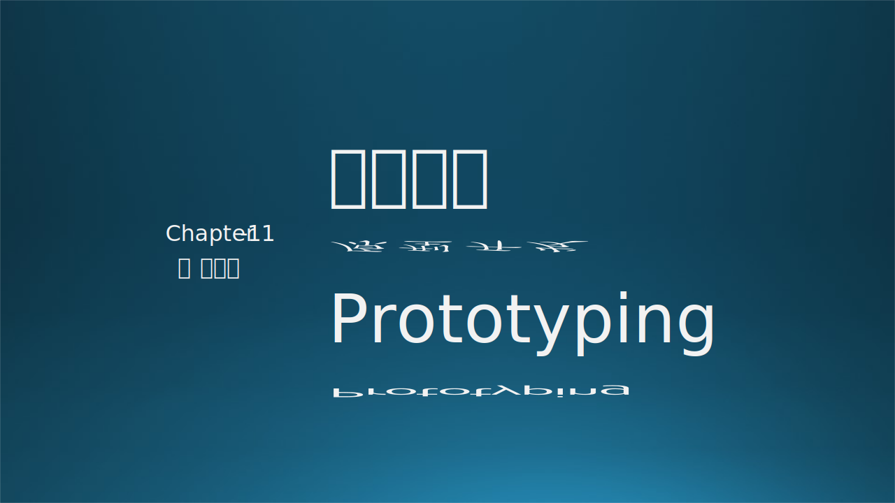
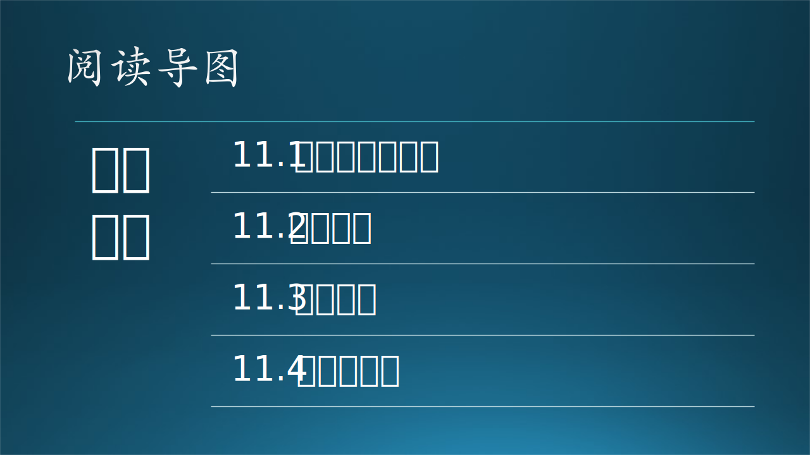

原型开发是需求与设计的中间阶段，经常被忽视。因为它既不属于需求，也不属于设计。那么它存在的意义是什么呢？

在本章中，木头还是会先讲一个 UWP 原型开发故事，进而引入原型开发的概念、目的。对于一个新产品来说，技术选型是原型开发的主要工作内容，而熟悉原型模型理论对于原型开发的深度和广度有重大的指导意义。

在原型开发结束后，我们才能正确估计一个系统的真实开发时间，制定合理的开发计划。

- 需求入门：原型开发，http://www.zhoujingen.cn/blog/5610.html
- 低保真原型与高保真原型，https://www.jianshu.com/p/c1fa72cb4021
- 原型的保真度，https://www.jianshu.com/p/c1fa72cb4021
- 制作原型的深度，https://www.jianshu.com/p/cb1c9294eec8
- 《构建之法》，邹欣，人民邮电出版社
- 软件项目估算，https://zhuanlan.zhihu.com/p/96522361
- COCOMO模型计算，http://softwarecost.org/tools/COCOMO/
