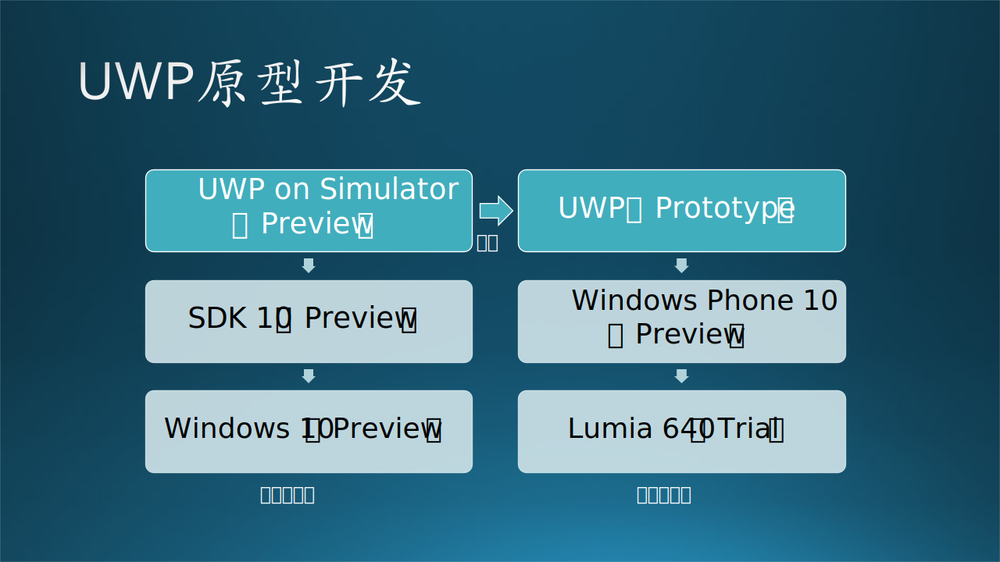
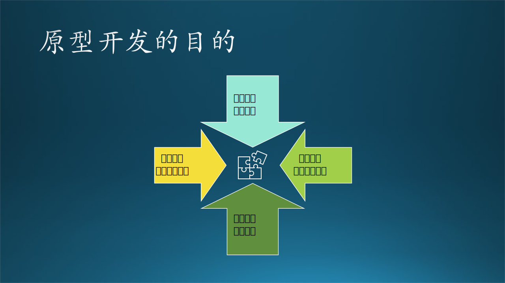
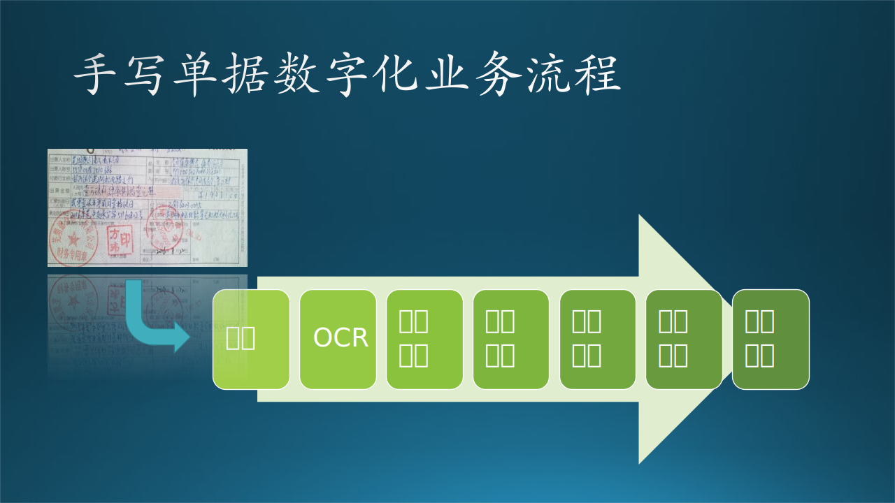

## 11.1 原型开发的目的

### 11.1.1 木头与 UWP 原型开发的故事

UWP（Universal Windows Platform，统一 Windows 平台），是微软在 Windows 10 上的战略，在任何微软设备上，如 Surface Hub、Desktop、Laptop、HoloLens、Windows Phone 上，都运行同一套操作系统。因此，在 UWP 的基础上开发的 APP，可以无缝部署到任何设备上，而无需额外的移植工作。

木头曾经为 Windows Phone 10 做一款预装的 UWP APP，在这之前，木头一直在 Windows Phone 8.0/8.1 上工作。当时的 PM 和 Dev Lead 都没有告诉木头这个新 APP 是为 Windows Phone 10 而定制的，木头在 Windows Phone 8.1 上按照 Designer 给的 Redline 做出 Prototype 后，界面特别丑，而且有几个技术点还不能实现。

Designer 在自己的手机上看到 Demo 后，感觉字号不对，就来和木头确认是否是 Windows 10 的开发环境。木头赶紧去问 PM 和 Dev Lead，才知道这是为 Windows Phone 10 设计的 APP。幸好前面的 Prototype 没有耽误太多时间，而且用 XAML 编写的大部分的界面代码是可以重用于 UWP 的。

木头又用了两天时间，在当时并不稳定的 Windows 10 桌面机上，安装并不稳定的 Windows 10 SDK，再花时间熟悉 SDK，很快又做出了新的 Prototype，然后安装在并不稳定的 Windows Phone 10 上，结果和 Designer 的设计图完全匹配。Designer 看到后非常兴奋，因为这是 UWP 设计标准的第一次实践，看到了设计蓝图和实现效果的完美吻合。

图 11-1 UWP 原型开发

从图 11-1 中可以看到，左侧为软件开发栈，从下到上依次是Windows 10（Preivew）PC 操作系统、SDK 10（Preview）、Simulator（Preview）模拟器；右侧为硬件部署栈，从下到上依次为Lumia 640（Trial）手机、Windows Phone 10（Preview）手机操作系统、UWP（Prototype）软件。整个技术架构是名副其实的“原型”，从软件到硬件，从操作系统到开发工具包，全都是在原型阶段，只不过大家的称谓不同（Preview、Trial、Prototype），原型的成熟度也不同。最终的 UWP APP 可以在这个环境中诞生、部署、运行，也是非常不容易的一件事，怪不得 Designer 会很兴奋。

### 11.1.2 为什么需要原型？

建立原型的主要目的是为了解决在产品开发的早期阶段不确定的问题$^{[1]}$。这种不确定性来自多个方面，如图 11-2 所示的四个主要方面：

- 上方：来自甲方的需求。
- 下方：来自乙方的设计。
- 左侧：来自工程领域的选型。
- 右侧：来自科研领域的新技术影响。

图 11-2 原型开发的目的

下面我们依次解释这四个方面的细节：

#### 1. 来着甲方：用户需求的确认和引导
   
用户通常描述不清楚他们的真实想法，开发团队需要尽快做出一个原型，让用户看到界面，并亲自动手来体验交互过程，输入一些仿真的数据，得到仿真的输出结果。如果用户对原型不满意，可以改进它直到用户满意为止；或干脆丢弃它，开发一个全新的系统。

比如：

- 设计一个输入框，让老师输入长字符串的学生ID。从表面上看，这个输入是满足要求的，但是太不方便了，在老师使用过几次之后，就会要求从下拉列表中选择学生ID。
  
- Designer 设计的字体一般都偏小，会使得整体的界面比较“秀气”，但用户可能会觉得看不清文字，因为使用者都是中老年人，或者是因为使用环境如屏幕的尺寸与 Designer 使用的高清显示器有差距。
  
- Designer 选择使用卷滚条来呈现多于一屏的内容，但用户觉得卷滚条比较难以操作，还是用“上一页、下一页”这样的分页模式比较好。

#### 2. 来自乙方：验证概念的可行性

微软的用户服务团队有一个传统做法叫做概念验证（Proof of Concept，PoC），即有了一个新的想法或设计，但是需要一系列的验证，才能最终证明是可行的。它可能是上面的三点的综合，更重要的是要跑通端到端 （end to end，e2e）的业务逻辑，所有的关键点都是用真实的技术，但是代码质量可以是粗糙的。

   

   
 图 11-3 手写单据数字化业务流程
      

木头遇到的一个真实的故事是：银行客户需要处理历史遗留下来的纸质单据，数字化后存入计算机系统。这个处理系统的流程如图 11-3 所示：

（1）批量扫描纸质单据；
（2）通过光学字符识别（Optical Character Recognition，后文简称为 OCR）模型做脱机手写体汉字识别，得到文本；
（3）通过表单识别模型识别单据上的表格结构，得到语义化的文本，如“存款人：xxx”、“家庭地址：xxx”等；
（4）字段矫正，比如地址字段的识别结果是“中国料木支大学”，通过与先验知识比对纠正为“中国科技大学”；
（5）把以上语义信息传送给计算机系统存入临时档案；
（6）在计算机屏幕上同时调出数字化信息和纸质单据扫描件，经过人工抽查比对，合格率达到标准后批量存入正式档案。

   其中，最关键的技术环节是两个 AI 模型，一个是 OCR 模型，一个是表单识别模型。负责这个项目的服务团队找到了微软认知服务（Cognitive Service）模型提供组，用从客户那里拿到的样本单据做输入，用一周的时间搭建了一个完整的流程。测试结果是，目前版本的 OCR 手写汉字识别的准确率还达不到要求，但是有望在下一个版本中得到大幅度改进。

   通过 PoC 过程，服务团队决定暂时不向客户提交方案，避免因关键技术环节的准确率不过关而影响项目的整体质量。

#### 3. 来自工程领域：技术选型的合理性

在底层技术支持问题上，有时候还会有多种选择，同样也会造成烦恼。比如系统需要每天都存储一个大的数据文件，在 Azure 上，有可能的选择有：磁盘、块存储、数据库、热存储等等。开发团队需要考虑以下一些因素：

- 性能好
- 可靠性高
- 可扩展性灵活
- 使用费用低
- 开发成本低
- 部署方便
- 维护简单
   
这就需要开发人员针对每一种都做一个试验，给出比较的指标和结果。但是正如 6.5 节中指出的那样，快、好、省是不能同时兼备的，所以通常用其中一个指标（比如性能）作为主要考虑因素，再结合其它几种因素，做一个综合排序。

我们在 11.2 节中专门讨论这个问题。

#### 4. 来自科研领域：新技术实现可行性
   
有些功能以前没有做过，需要一种新的软硬件技术的支持。在确定要使用这些新技术之前，开发人员需要做一些探索性的试验，验证技术可行性，包括功能和性能两个方面。
   
比如 Tensor Lite 号称可以在 Android 手机上部署模型，开发人员需要先设计一个中等规模的模型，在台式计算机训练它得到性能指标，包括准确率和速度性能，然后在手机上部署，再测试准确率和速度性能，看看能否达到要求。
