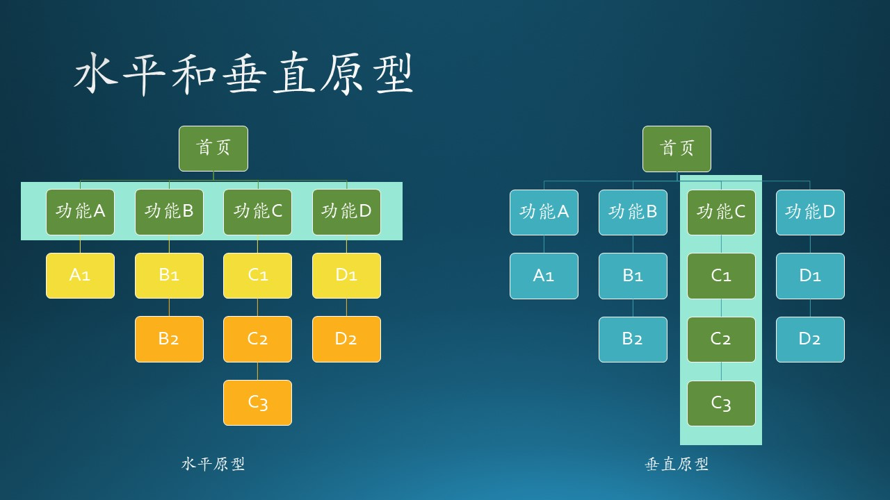
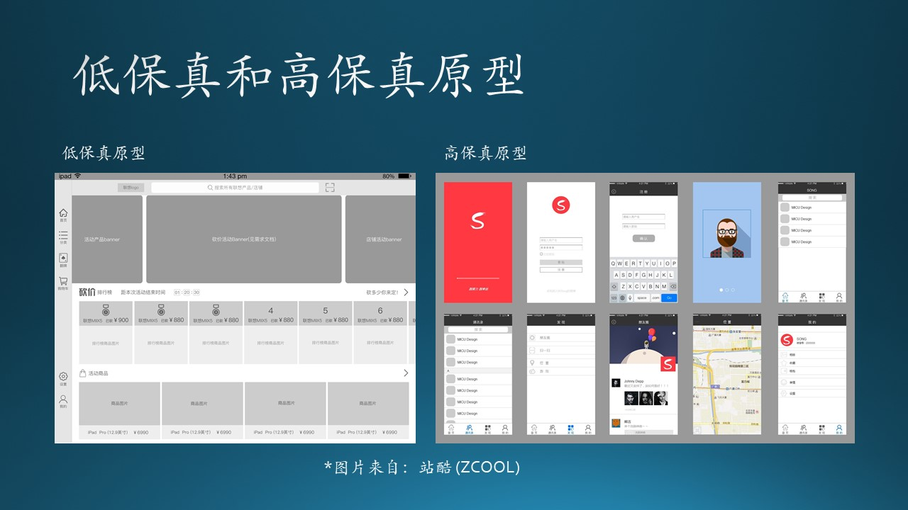
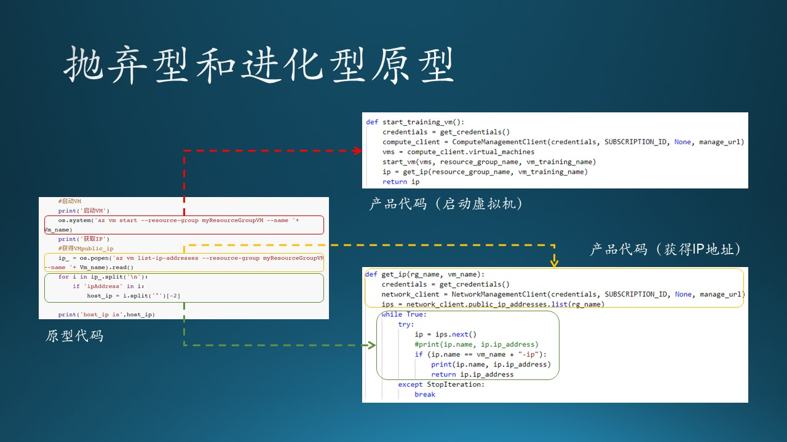
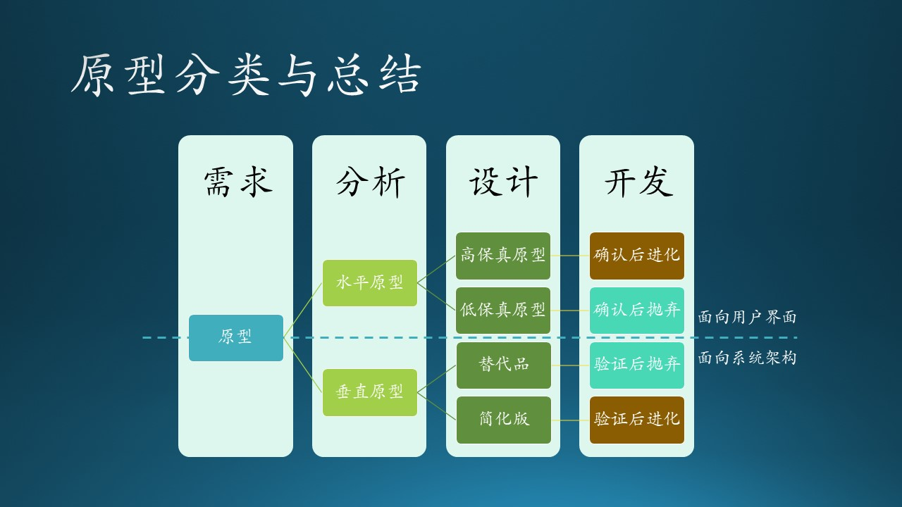
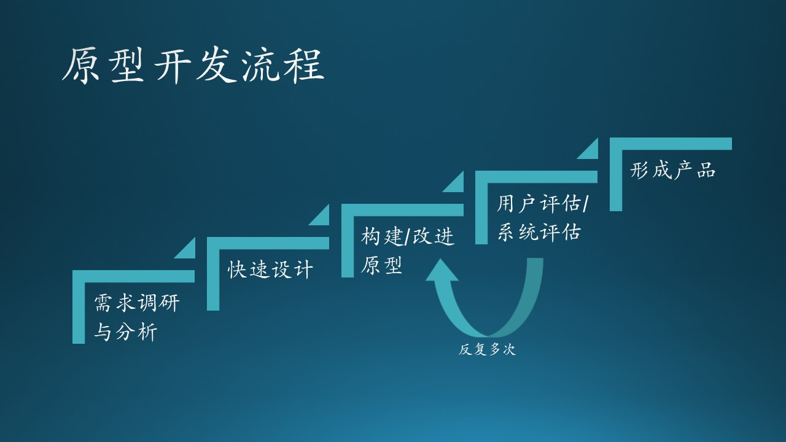
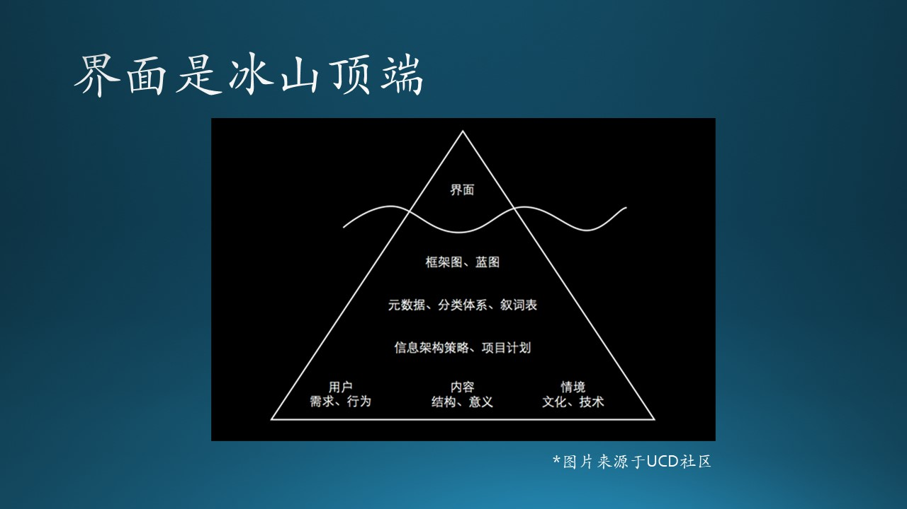

## 11.3 原型模型

### 11.3.1 水平原型与垂直原型



图 11.3.1 - 水平原型与垂直原型


#### 水平原型

在 10.1.2 中的第1点（用户需求确认及引导）就是水平原型，也叫做行为原型（behavioral prototype）。在图 11.3.1 左侧的子图中，功能A/B/C/D构成了水平原型，一般是指的用户界面。用户才不会关心你后面是如何实现的，只要界面满足要求即可，所以水平原型一般是给用户或者业务人员看的。

这类原型只是绘制了主用户界面，而无需进行任何实质性编码，以便用户能够感受到实际系统的外观。

功能A1/B1/C1/D1虽然也处在一条水平线上，但是已经是业务逻辑层了，属于代码层，所以不能形成水平原型。

#### 垂直原型

在 10.1.2 中的第2点（验证概念可行性）就是垂直原型（vertical prototype），也叫做结构化原型或概念证明，实现了一部分应用功能。在图 11.3.1 的右侧子图中，功能C/C1/C2/C3形成了一个垂直原型，在实现过程中，应用要使用的技术搭建业务链，比如界面、组件、数据访问、数据库等，在模拟出来的或真实的环境中运行，确保输入和真实环境一致，看看输出是否满足预期。

图 11.3.1 右侧子图中其它三条线A/B/D，可能由于业务链较短，技术较为成熟，所以不需要搭建垂直原型。

### 11.3.2 低保真原型和高保真原型



图 11.3.2 - 低保真和高保真原型


#### 低保真原型

低保真原型目标在于表达工作主要内容，体现静态的元素，不需要动态交互。有时候，低保真原型甚至可以不是在真正的用户设备上，而是在纸上画出来的。如果对于小型项目，或者只是用来做交流主要需求用时，就可以做低保真原型。

#### 高保真原型

高保真原型目标是作出一个和实际上线后的产品差不多的样子，不仅包括静态的界面，还包括交互，甚至有的还把数据保存、逻辑验证等都包含在内。如果客户要求开发之前必须看到和实际产品一样的原型时，这时就需要做高保真原型。$^{[3]}$

通过使用这个原型，客户可以对系统有一个真实的感觉，因为与原型的交互可以使客户更好地理解所需系统的需求。

表 11.3.1 展示了两种原型的对比。

表 11.3.1 - 低保真和高保真原型对比$^{[3]}$

||低保真原型|高保真原型|
|--|--|--|
|视觉设计|仅呈现最终产品的一部分视觉属性，如元素的形状，基本视觉层次等|逼真细致的设计，所有界面元素、间距和图形看起来就像一个真正的产品|
|内容|仅包含内容的关键元素|真实或类似于真实的内容|
|交互性|原型交互可以由设计师手动完成，也可以给线框图制作交互效果，称为“交互线框图”|原型在交互层面非常逼真，由用户的实际的点击完成|
|优点|便宜、快速、可群体贡献|可测试性强，易获得甲方认可|
|缺点|交互性有限，需要使用者自己脑补细节，可测试性弱|费时，需要专业人员制作|


### 11.3.3 抛弃型原型或进化型原型

从原型存在生命时机考虑分为抛弃型原型和进化型原型。



图 11.3.3 - 抛弃型原型或进化型原型


#### 抛弃型原型

抛弃型原型不作为最终产品的一部分，只是作为探索性的回答一些需求问题，细化需求并提高需求质量。由于在开发阶段最终将抛弃这些原型，因此不需要花太大力气去建立该原型。$^{[1]}$

木头曾参与一个与 Azure 相关的项目，在原型阶段，木头让实习生调研了启动虚拟机和获得虚拟机 IP 地址的功能。实习生为了方便起见，使用了 Azure CLI（Command Line Interface）命令行接口来控制虚拟机，于是写了图 11.3.2 中左图所示的代码片段，其中，红色框（启动虚拟机）和黄色框（列 IP 地址）内的源代码片段，如：

```
os.system('az vm start ...')
```
表示在Python中用 os.system 系统命令接口来调用 'az vm start' 命令行接口来启动虚拟机。

但是在实际系统中，安装 Azure CLI 是一个额外的步骤，并且使用命令行接口编程也很不专业，所以木头在 Python 中用"pip install azure-storage-blob"命令安装了支持包，使用纯 Python 代码重写了启动虚拟机和列 IP 地址的函数，实习生写的代码也就被抛弃了。

是否抛弃原型，主要从软件工程的质量要求上去衡量，而不是说实习生写的代码就一定要抛弃，该代码很好地完成了原型任务，为后面的设计打下了基础。

抛弃型原型的另外一种做法是：可以先用 Python 写一些逻辑代码，由于 Python 的开源库比较多，做原型比较方便。但是 Python 的性能有问题，可以后期再用 C++ 去实现真的系统，但是有些功能必须自己用 C++ 实现了，花费时间较多。这里的Python就称作“替代品”。

替代品的另外一种形式是组件级别的，比如先使用某个免费的低准确率 AI 模型做推理，验证系统可行性；然后再自己训练一个高准确率 AI 模型，替换掉免费的模型。

#### 进化型原型

同样用图 11.3.2 中绿色框所示的代码为例，就是一种比较浅显的进化型原型的例子，右侧的代码基本继承了左侧代码的逻辑，写法不同而已。

从大的方面讲，进化型原型一般在处理架构时会采用，这和 MVP（Minimum Viable Product，最小可用产品）有异曲同工之妙。即：
1. 可以不实现全部系统，而只写核心业务逻辑的代码作为进化型原型，并且保证质量；

2. 而其他的辅助部分的代码可以用抛弃型原型来对待，与核心业务代码一起跑通业务逻辑；

3. 然后再继续改进进化型原型，增加更多的功能或者提高鲁棒性等等，向真正的产品进化。

仍以图 11.3.1 中的垂直原型为例，我们可以先用C1做成进化型原型（简化的有限功能子集），而把C2/C3看作抛弃型原型，这样整个功能C就可以跑通了。然后再改进C1，或者把C2再变成进化型原型。如此进化，功能C最终就变成实际产品了。


### 11.3.4 原型分类与流程总结



图 11.3.4 - 抛弃型原型或进化型原型


图 11.3.4 横向看：

- 作为一种需求分析工具，明确并完善需求原型，它初步实现所理解的系统的一部分。

- 作为一种设计工具，探索设计选择方案原型，探索不同的用户界面技术，使系统达到最佳的可用性，并且可以评价可能的技术方案。

- 作为一种开发工具，发展为最终的产品原型，是产品最初子集的完整功能实现，通过一系列小规模的开发循环后可以完成整个产品的开发。

图 11.3.4 纵向看：

- 在面向用户界面部分，PM 和 Designer 需要多与用户进行交流，得到反馈，不断改进原型，成为真实产品；

- 在面向系统架构部分，系统设计人员需要与开发人员多进行交流，及时了解业界最新或最成熟技术方案，抛弃原型中的替代品，开发简化版组件，并最终进化成实际产品组件。


图 11.3.5 说明了在原型模型中执行的步骤。



图 11.3.5 - 原型开发流程


1. 需求调研和分析：原型模型从需求分析开始，详细定义系统的需求。访问用户以了解系统的需求。

2. 快速设计：当需求已知时，为系统创建一个初步设计或快速设计，只包括系统的重要方面，这可以帮助用户形成一个系统的直观认识。快速设计有助于开发原型。

3. 构建原型：从快速设计中收集的信息被修改成第一个原型，它代表所需系统的工作模型。

4. 用户评估/系统评估：接下来，将建议的系统提交给用户，以便对原型进行全面评估，以识别其优势和弱点，例如要添加或删除的内容。从用户那里收集意见和建议并提供给开发人员、PM、Designer。

5. 改进原型：用户对原型进行评价后，如果不满意，则根据需求对当前原型进行细化。也就是说，使用用户提供的附加信息开发一个新的原型。新原型的评估与之前的原型一样。此过程将持续到满足用户指定的所有要求。一旦用户对所开发的原型满意，就在最终原型的基础上开发出最终的系统。

6. 形成工程产品：一旦完全满足要求，用户接受最终原型。对最终系统进行全面评估，形成稳定的产品。


### 11.3.5 原型工具

这里说的原型工具主要是针对水平原型来说的，即用户界面层。

原型工具有非常多，比如大多数人用过的Excel、Access、Delphi、PowerPoint、Axure、Balsamiq Mockups、ForeUI、iRise、Lucid Spec、Mockup Screens、Pencil、Serena等。工欲善其事，必先利其器。对于刚刚使用原型方法的业务人员来说，如何选择适合自己的原型工具呢？这就需要首先根据原型的目的明确做原型的粒度：

1. 需要低保真界面还是高保真界面？
2. 需要静态界面还是可交互式界面？

业务人员一般都不会有什么编程经验，我们怎么能够做出表达静态元素界面，又能加入动态交互功能的原型呢？原型工具 GUI Design Studio ，它的主要特点就是操作简单，不需要开发人员帮助，通过半个小时的学习后你将可以自己开始做原型了。$^{[1]}$




图 11.3.6 - 原型界面只是冰山的顶端


我们可以通过原型来引导用户来使用系统解决问题，但原型不仅仅是需求，它还是设计、开发工具，所以作原型时不仅需要客户的参与，也需要技术人员的参与，但应该尽量由业务人员而非开发人员来实现原型的需求部分。

图 11.3.6 在 UCD 社区里面看到的一张图，原型最主要功能是表现界面，但要做好界面其实不容易，山下面还有很多东西需要考虑才能支撑界面，其实做原型的过程就是设计系统的过程。我们都希望尽量把开发工作前移，需求能做的工作就不留到开发环节做。如果软件模式一定，那么框架做得好的话就一定可以让业务人员来做一部分现在属于开发人员的工作（注：这部分工作其实本就该属于业务人员），那时大家就能体会到开发软件就如同做原型一样的乐趣了！

