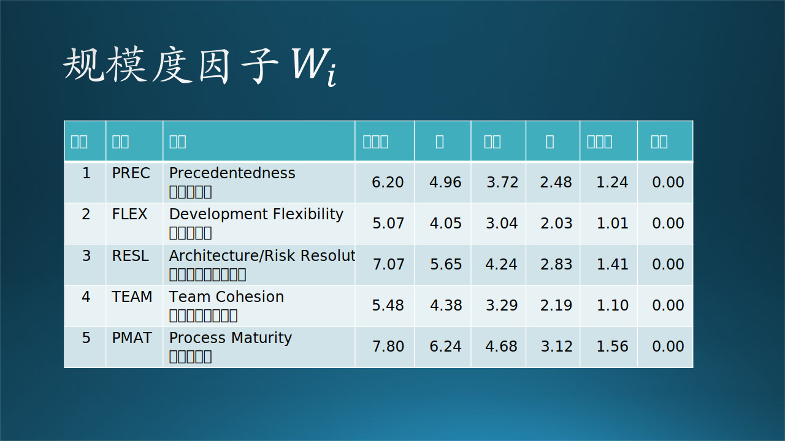
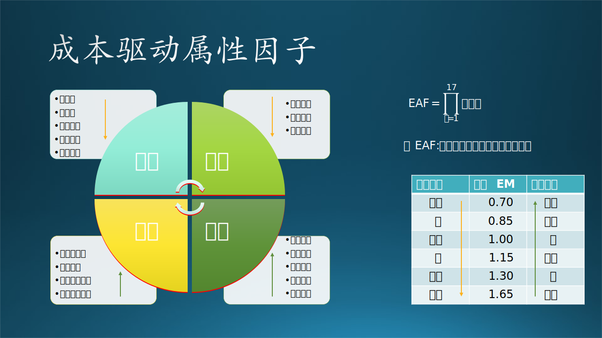
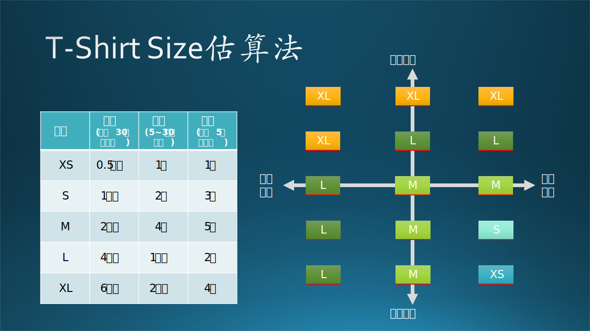

## 11.4 估计与计划

如果是轻车熟路的项目，PM 很容易根据历史经验估算出开发时间，依次指定计划，完成 PM Spec。但是如果是一个与已有产品有部分不同或者完全不同的项目，就需要先做原型开发，验证一些技术关键点之后，才能有比较准确的估计。

### 11.4.1 成本估算模型

COCOMO$^{[4]}$ 是 COnstructive COst MOdel（建设性成本估算模型）的缩写，最早是由巴利·玻姆（Barry Boehm）在 1981 年提出，是一种精确的、易于使用的成本估算方法。 COCOMO II 模型的原型是在 1996 年提出，并持续改进。由于其采用了模型化的管理方法，在国外有很高的影响力。由于国内现有的软件开发项目数据还不是很完善，该方法在国内的使用还是受到限制。所以很多资料以及参数只能从国外的网站上去参考。而参数的准确性，则由于文化、开发背景、技术熟练度、编程环境和成本等的差异，不能直接使用在现有开发项目中，只能作为大致的参考。

软件项目分为五种：

（1）基础软件
（2）系统集成
（3）程序自动化生成
（4）应用集成
（5）最终用户编程

规模从大到小变化，难易程度也是同样。COCOMO 有三个子模型来支持上述五种软件项目：

（1）应用构图（Applications Composition）
   
   通过原型开发解决人机交互、系统接口、技术成熟度等具有潜在高风险的内容。

（2）早期设计（Early Design）
   
   支持确立软件体系结构的生命周期阶段。

（3）后体系结构（Post-Architecture）

   在项目确定开发之后，对软件功能结构基本了解，通过代码行数或功能点数来计算工作量和进度，使用 5 个规模度因子和 17个 成本属性驱动因子调整计算公式。

COCOMO II 模型的使用场景如下：

（1）做出涉及软件开发工作的投资或其他财务决策；
（2）制定项目预算和时间表作为计划和控制的基础；
（3）决定或协商软件成本、进度、功能、性能或质量因素之间的权衡；
（4）制定软件成本和进度风险管理决策；
（5）决定开发、重用、租赁或购买软件系统的哪些部分；
（6）制定遗留软件库存决策：修改、逐步淘汰、外包等；
（7）通过重用、工具、过程成熟度、外包等，设置混合投资策略来提高组织的软件能力。

### 11.4.2 项目的规模度

我们先了解一下规模度的概念，见图 11-15。

图 11-15 规模度因子

举例来说，某个项目在图11.4.2中满足下列条件：

（1）$PREC = 2.48$，即有前例可以借鉴，程度为“高”；
（2）$FLEX = 3.04$，即开发灵活性为“正常”；
（3）$RESL = 5.65$，即架构水平与风控能力“低”；
（4）$TEAM = 1.10$，即团队成熟度“非常高”；
（5）$PMAT = 4.68$，即过程成熟度为“正常”。

则根据公式 11-1：

$$
B = 0.91 + \frac{1}{100}\sum_{i=1}^5{W_i} \tag{11-1}
$$

计算得到B值为：

$$
B=0.91+(2.48+3.04+5.65+1.10+4.68)/100=1.0795
$$

### 11.4.3 工作量评估

我们用 PM（People Month，人月）来估算软件开发的工作量，如公式11-2所示。

$$
PM = A \times Size^B \tag{11-2}
$$

这里的 $A$ 通常取常数 2.94，$Size$ 是代码行数（千行），$B$ 是公式11.4.1的结果值。

假设一共 4 万行代码，则：

$$
PM = 2.94 \times (40000/1000)^{1.0795}=2.94 \times 53.63=157.67(人月)
$$

### 11.4.4 成本驱动属性

成本驱动属性因子的加入，扩展了基本模型的能力。17 个成本驱动属性因子可以分为 4 个部分，如图 11-16 所示。

图 11-16 成本驱动属性因子

表 11-4 给出了原文，便于大家进一步查找资料学习。

表 11-4 后体系结构模型的成本驱动属性

|序号|缩写|原文|中文|分类|
|--|--|--|--|--|
|1|RELY|Reliability|可靠性|产品|
|2|DATA|Data Base Size|数据库大小|产品|
|3|CPLX|Complexity|复杂度|产品|
|4|RUSE|Required Reusability|可重用需求|产品|
|5|DOCU|Documentation|文档完备性|产品|
|||||
|6|TIME|Execution Time Constraint|执行时间（性能）限制|平台|
|7|STOR|Main Storage Constraint|主存储限制|平台|
|8|PVOL|Platform Volatility|平台波动性（执行环境）|平台|
|||||
|9|ACAP|Analyst Capability|分析员能力|人员|
|10|PACP|Programmer Capability|开发人员能力|人员|
|11|AEXP|Applications Experience|应用开发经验|人员|
|12|PEXP|Platform Experience|平台开发经验|人员|
|||||
|13|LTEX|Language & Tool Experience|语言沟通和管理工具|组织|
|14|PCON|Personnel Continuity|人员连续（流动）性|组织|
|15|TOOL|Use of Software Tools|软件工具的使用熟练度|组织|
|16|SITE|Multi-site Development|多地合作开发|组织|
|17|SCED|Required Schedule|进度要求|组织|

通常以上因子的取值范围在 $[0.70,1.65]$ 之间，其中：
- 产品属性和平台属性是正向指标，即，该类因子级别越高，数值越大；
- 人员属性和组织属性是反向指标，即，该类因子基本越高，数值越小。

所有的因子相乘，得到工作量调节因子EAF：

$$
EAF = \prod_{i=1}^{17}{EM_i} \tag{11-3}
$$

式 11-4 是在式 11-2 的基础上，考虑了成本驱动属性后的改进：

$$
PM = A \times Size^B \times EAF \tag{11-4}
$$

在针对每个属性取值后，我们假设式 11-3 的乘积结果为 1.13。仍然用前面的数值例子，计算得到：

$$
PM = 2.94 \times 53.63 \times 1.13 = 178.17（人月）
$$

### 11.4.5 微软常用的估计方法

用 COCOMO 模型的问题是，代码行数通常是开发完毕后才知道的，所以有一个改进的办法是，把 Size 值改成子模块数。一般一个子模块的代码行数在 500~2000 行之间，可以大致与 KLOC（Kilo Line of Code）相当。

在微软通常使用 T-Shirt Size（T恤号码）方法来估算开发时间，具体见图 11-17。

图 11-17 T-Shirt Size估算法

这是一种简化的方法。既然用复杂的模型很难计算出准确的数值，那么我们干脆就使用一些简化的模型来估算。

首先，根据软件复杂程度的不同，把它们分成了三类：
（1）复杂，大于30万行代码；
（2）中等，介于5万到30万行代码之间；
（3）简单，小于5万行代码。

其次，给每个功能点或者模块赋予一个 T-Shirt（T恤衫）尺寸，尺寸分为 5 级：

（1）XS，Extremly Small，特小号；
（2）S，Small，小号；
（3）M，Middle，中号；
（4）L，Large，大号；
（5）XL，Extremly Large，特大号。

根据软件复杂度，每个功能点或模块所需要的时间也是不同的，见图 11-17 中的表格。

最后，我们把所有的功能点或模块所需要的时间相加，就是该软件总共需要的开发时间。

还有一个经验是，以简单软件为例，通常没有超过 5 天的功能点或模块，如果超过了，就要把该模块继续分解成若干小模块，所有小模块的尺寸都必须小于等于 M，这样就可以比较准确地估算整体工作量。

当然，以上的估算方法也是以团队成熟度为前提的。图 11-17 的右半部分给出了一个示意：假设有一个 M 尺寸的模块，对于成熟团队来说很快就可以完成，而对于稚嫩的团队来说，尺寸可能会增加到 L。
