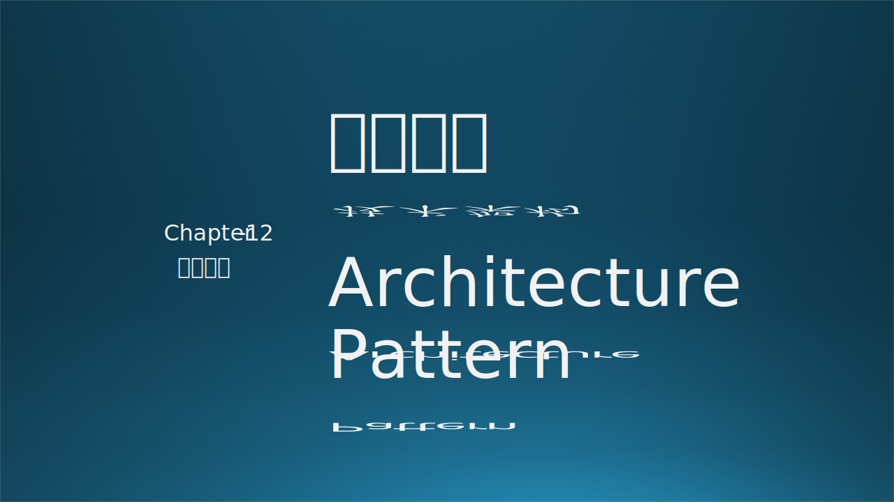
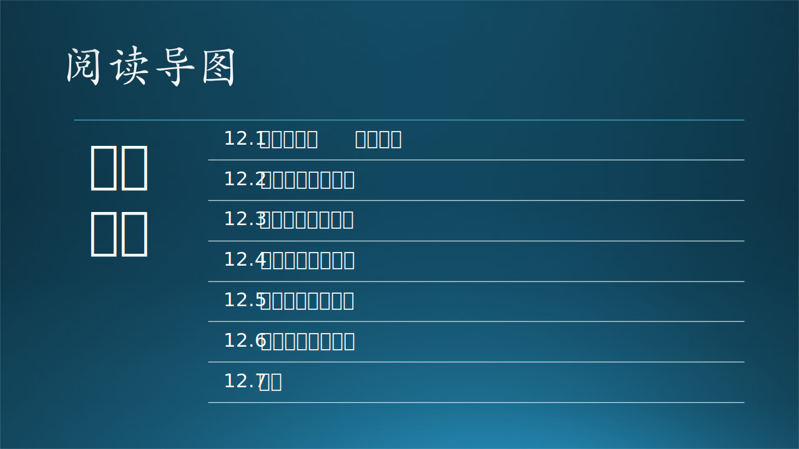

# 第十二章 技术架构

技术架构是一个很模糊的概念，根据笔者的理解，它可以是逻辑架构、运行架构、数据架构、开发架构、物理架构的混合体，在第十三章中有更多的解释。在这里，读者可以理解为是软件系统的一种与技术相关的高层次的架构设计。

在本章中，木头会照例先讲一个技术架构演化的故事，拉进读者与技术架构的关系；然后列出了星形、串行、树形、环形四种类型的技术架构模式的拓扑结构、扩展模式、应用实例以及它们各自的优缺点；最后介绍了康威定律在 Cortana 中的具体体现。

