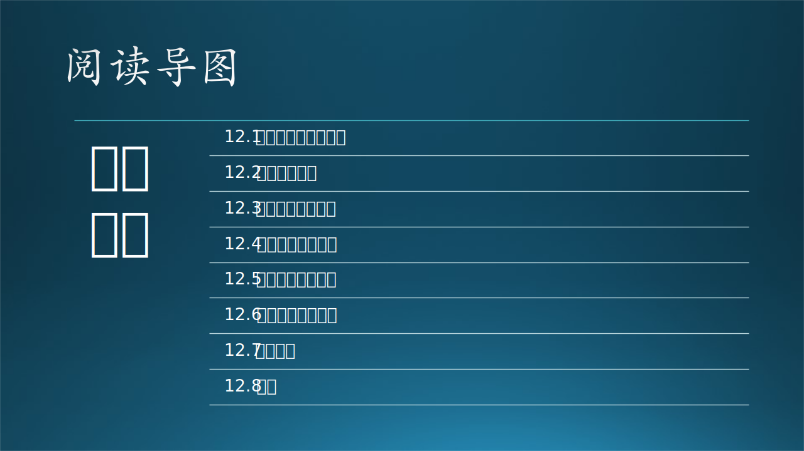

关于架构，有很多个流派给出了不同的概念，我们将在第十三章中细述。在本章中，我们将重点讲解技术架构。

https://blog.csdn.net/lfsf802/article/details/8487990

https://towardsdatascience.com/10-common-software-architectural-patterns-in-a-nutshell-a0b47a1e9013

https://zhuanlan.zhihu.com/p/41395345

https://blog.csdn.net/Jayphone17/article/details/103651076

https://zhuanlan.zhihu.com/p/41395345

https://www.ou.nl/documents/40554/791670/IM0203_03.pdf/30dae517-691e-b3c7-22ed-a55ad27726d6

https://towardsdatascience.com/10-common-software-architectural-patterns-in-a-nutshell-a0b47a1e9013

https://max.book118.com/html/2016/1115/63079375.shtm

https://blog.csdn.net/hguisu/article/details/78259898

https://help.aliyun.com/document_detail/207135.html
