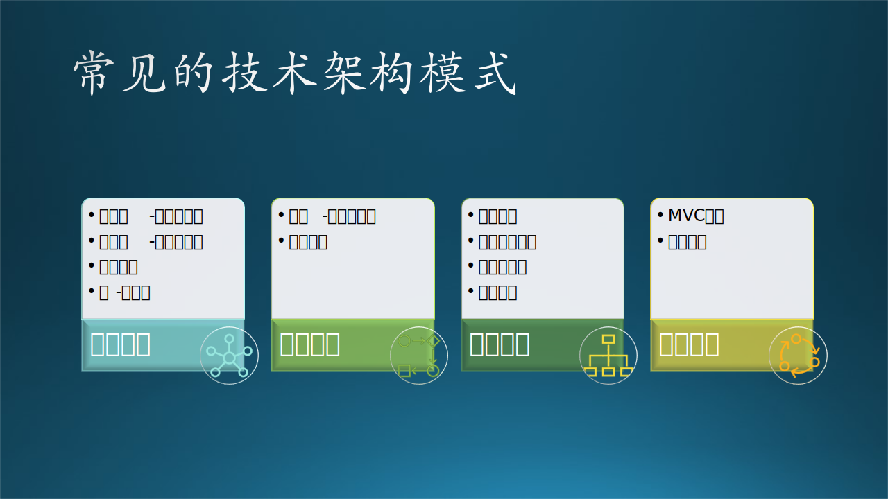

## 12.2 技术架构模式

### 12.2.1 概念

#### **1. 什么是架构？**

架构，源于中国古代建筑术语。架 = 加 + 木，构 = 木 + 勾，即把一堆木头加起来并互相勾住，以形成一个完整的、牢固的建筑。引申到软件产品概念上，就是：

1. 结构切分：把一个软件项目整体切分成不同的部分；
2. 功能定义：定义这些部分各自完成的局部功能；
3. 关系建立：建立这些部分相互沟通的机制，使之结合为一个整体，并完成这个整体所需要的所有功能。

#### 2. 什么是技术架构？

在众多的架构组成中，技术架构定义为：

$$
技术架构 = 逻辑功能 + 运行过程 + 数据存储 + 软件开发 + 物理部署
$$

这些概念还是很复杂，所以读者可以先简单地认为，技术架构包括设计、实现、部署的一系列方案的混合体，就是面向技术实现的架构设计，主要是给开发人员内部看的，用于统一认识。

#### **3. 什么是技术架构模式？**

**模式**是主体行为的一般方式，包括科学实验模式（包括软件开发）、经济发展模式、企业盈利模式等，是理论和实践之间的中介环节，具有一般性、简单性、重复性、结构性、稳定性、可操作性的特征。我们经常说“从理论到实践，再从实践到理论”，其实就是为了总结出一个解决问题的通用思路来，这个思路就是模式。所以，模式解决某一类问题的方法论。

**技术架构模式**是在给定上下文中对软件构建中常见问题的通用的、可重用的解决方案。

读者都知道 GOF 的 23 种设计模式，技术架构模式类似于软件设计模式，但前者层次更高、范围更广，所解决的问题更大。

### 12.2.2 技术架构模式

一些基本的技术架构模式如下：

#### 1. 星形模式

- 客户端-服务器模式（Client-server pattern）
- 浏览器-服务器模式
- 对等模式（Peer-to-peer pattern）

#### 2. 串行模式

- 分层模式（Layered pattern）
- 管道-过滤器模式（Pipe-filter pattern）
- 主-从模式（Master-slave pattern）

#### 3. 树形模式

- 代理模式（Broker pattern）
- 微服务模式（Microservices pattern）
- 插件模式（Plug-in pattern）

#### 4. 环形模式

- 模型-视图-控制器模式（Model-view-controller pattern）
- 反馈模式
- 事件驱动模式（Event-driven pattern）

一个复杂系统的技术架构是利用上面这些基本模式的一个或几个有机组合而成。当然，上面这些并不是全部，只是笔者认为比较重要的、在实际应用中经常被用到的模式。如图 12-5 所示。

图 12-5 常见的技术架构模式

### 12.2.3 技术架构模式一览

表 12-1 列出了上述技术架构的简单描述和软件质量评价。

表 12-1 技术架构模式一览表$^{[1,2,3,4]}$

|名称|简单描述|质量评价|
|-|-|-|
|**星形模式**||
|客户端-服务器模式|一个服务器为多个客户端提供定制化服务。 主要优点：安全性好，开发方便，可测试性好。 主要缺点：客户端数量多时升级维护麻烦。|开发期：较高。 运行期：一般。|
|浏览器-服务器模式|一组服务器为很多客户端的浏览器提供网页服务。 主要优点：开发、维护非常简便，对客户端要求很低。 主要缺点：浏览器端开发能力和计算能力受限制。|开发期：一般。 运行期：较高。|
|对等模式|很多节点之间相互提供服务。 主要优点：支持分布式计算，可扩展性高。 主要缺点：服务质量、安全性、性能没有保证。|开发期：一般。 运行期：一般。|
|**串行模式**||
|分层模式|把完成相似功能的节点组合成层，形成多层。 主要优点：级别与接口清晰，层内改动不影响其他层。 主要缺点：性能不高，层间通信有开销。|开发期：较高。 运行期：一般。|
|管道-过滤器模式|多个节点前后串连接力完成任务。 主要优点：不同的节点可以自由组合完成不同的任务。 主要缺点：串行计算效率低，过滤器之间交换数据较慢。|开发期：较高。 运行期：较低。|
|主-从模式|一个主节点把任务分发给多个从节点。 主要优点：负载分担，提供更准确的计算结果。 主要缺点：从节点孤立，主从通信有延迟而造成不一致。|开发期：较高。 运行期：较高。|
|**树形模式**||
|代理模式|一个节点接受请求并代替其它节点完成任务。 主要优点：被代理的对象可以轻松上线离线，修改方便。 主要缺点：需要事先知道代理的能力，有可能成为瓶颈。|开发期：较高。 运行期：一般。|
|微服务模式|很多个小节点临时被创建并组合完成任务。 主要优点：强隔离，耦合度低，开发速度快。 主要缺点：数量多时带来管理、性能问题。|开发期：较高。 运行期：较低。|
|插件模式|主节点完成基本任务，附着的小节点完成额外的任务。 主要优点：功能插拔灵活，可扩展性高。 主要缺点：核心系统需要鲁棒性强，接口设计精细。|开发期：一般。 运行期：较高。|
|**环形模式**||
|MVC 模式|模型、视图、控制器三者协同完成数据展示、修改工作。 主要优点：一个模型可以对应多个视图。 主要缺点：实现复杂，一般需要框架支持。|开发期：一般。 运行期：较高。|
|反馈模式|多节点串行工作，末节点的输出作为首节点的部分输入。 主要优点：算法先进，内部迭代来学习数据特征。 主要缺点：性能低，反馈信号不容易调节。|开发期：较低。 运行期：较低。|
|事件驱动模式|多个节点从一个队列中获得任务来完成各自不同的任务。 主要优点：轻松添加新的发布者和订阅者。 主要缺点：事件总线有可能影响计算性能。|开发期：较高。 运行期：一般。|

### 12.2.4 其它模式

除了上面列出的模式以外，还有一些不常用的模式如下：

- 黑板模式（Black-Board pattern）

    黑板模式是一种常用的架构模式，应用中的多种不同数据处理逻辑相互影响和协同来完成数据分析处理。黑板模式允许多个消息读写者同时存在，消息的生产者和消费者完全分开。这就像一个黑板，任何一个教授（消息的生产者）都可以在其上书写消息，任何一个学生（消息的消费者）都可以从黑板上读取消息，两者在空间和时间上可以解耦，并且互不干扰。这种模式对于没有确定解决方案策略的问题是有用的。
    
    这种模式性能较低，一般不适合于实时系统。

- 解析器模式（Interpreter pattern）

    给分析对象定义一个语言，并定义该语言的文法表示，再设计一个解析器来解释语言中的句子。也就是说，用编译语言的方式来分析应用中的实例。这种模式实现了文法表达式处理的接口，该接口解释一个特定的上下文。

    这里提到的文法和句子的概念同编译原理中的描述相同，“文法”指语言的语法规则，而“句子”是语言集中的元素。例如，汉语中的句子有很多，“我是中国人”是其中的一个句子，可以用一棵语法树来直观地描述语言中的句子。

    这种模式适用范围较窄。

- 空间模式（Space pattern）

    基于空间的架构模式（有时也称为云架构模式）将限制应用扩展的因素最小化了。它的名称来源于元组空间（tuple space）的概念，也就是分布式共享内存的概念。通过冗余的内存中的数据网格代替数据库来实现高伸缩性。应用数据保存在内存中，并在所有活动的处理单元中保存一份副本。处理单元可以根据负载大小动态地添加或关闭。这样数据库的瓶颈就不存在了，提供了几乎可以无限扩展的能力。

    该架构模式中有两个主要组件：处理单元（processing unit）和虚拟化中间件（virtualized middleware）。如图1所示。处理单元组件包含应用组件（或部分应用组件），它包含Web组件和后端的业务逻辑。处理单元通常包含应用程序模块、内存中的数据网格和一个可选的异步持久化转移模块。还包含一个复制引擎供虚拟中间件调用，来同步各单元之间的数据变化。

    这种模式设计开发阶段非常复杂。

- 六边形模式（Hexagonal pattern）

    六边形架构又称为端口-适配器，这个名字更容器理解。六边形架构将系统分为内部（内部六边形）和外部，内部代表了应用的业务逻辑，外部代表应用的驱动逻辑、基础设施或其他应用。内部通过端口和外部系统通信，端口代表了一定协议，以API呈现。一个端口可能对应多个外部系统，不同的外部系统需要使用不同的适配器，适配器负责对协议进行转换。这样就使得应用程序能够以一致的方式被用户、程序、自动化测试、批处理脚本所驱动，并且，可以在与实际运行的设备和数据库相隔离的情况下开发和测试。

    这种模式在实现业务逻辑时，由于都在六边形内部，有可能因为过于复杂而导致不易维护。
