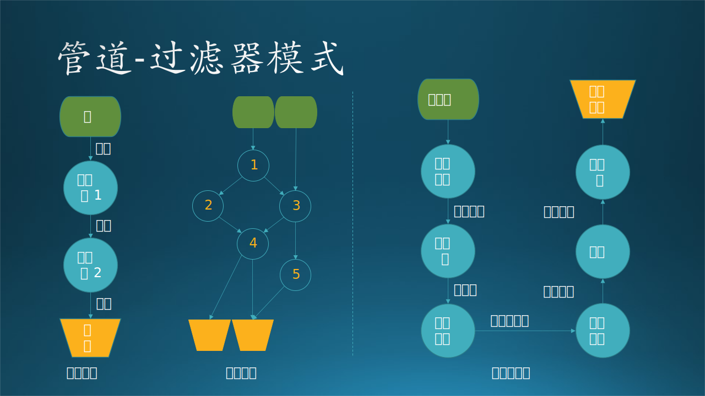
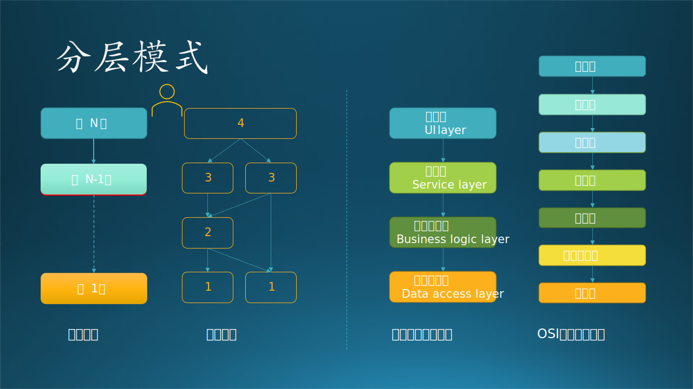

## 12.4 串行系统架构模式

### 12.4.1 管道-过滤器模式 (Pipe-Filter)

见图 12-9。



图 12-9 管道-过滤器模式

#### 1. 架构说明

这种架构是可以非常自然地产生的，因为它符合人们按部就班地做事的习惯，和我们每个开发者刚开始学习的流程图和结构化开发也很类似。这种方结构有一个数据起点（原始数据）、一个数据汇点（处理好的数据）、N 个过滤器（处理逻辑）和 N+1 个管道组成，我们常说的 Pipeline 就是这个机制。

其中：
- 数据起点和汇点可能是数据库或者数据文件（源代码也可以看作是数据）。
- 过滤器一般都是可独立运行的模块，被动（被主控程序调度）或主动（常驻进程）地把数据从前面的管道拉入（pull），处理好后推入后面的管道（push）。
- 管道可以是内存中的各种数据结构、系统管道，或者是临时放在磁盘中的文件（这种情况要注意定时清理临时文件，避免磁盘被占满）。

#### 2. 扩展模式

- 允许一个过滤器把数据分可后分别推送到不同的管道中，以便后续的不同逻辑的过滤器处理，甚至有可能进入不同的数据汇点。
- 或者是在一开始，就有不同的数据源进入，但是共享某些过滤器，这种情况一般是分当作两个 pipeline 处理，图 12-9 中的过滤器 3 只是个可以重用的组件而已。

#### 3. 应用场景

在 Unix 系统中的 Shell，就是一个管道模式的例子，比如：

```
cat a.txt | grep 'food' | sort | uniq > out
```
这个命令行首先用 cat 命令把 a.txt 中的文本行取出来，送给 grep 命令，把其中含有 'food' 的行取出来，送给 sort 命令，排序后把结果送给 uniq 命令去重，最后输出到 out。

管道过滤器模式的另外一个例子是编译器，如图 12-10 右侧所示。其中一个词法分析器分析源文件并将生成的符号序列发送到解析器，产生语法树，再由语义分析器产生增强语法树。然后由代码生成器用来生成字节代码，这些代码被优化后，并最终被翻译成机器代码（可能需要更多或更少的步骤）。

其实最常见的是我们经常所说的 Pipeline，可以应用于各种数据预处理中。比如：针对海量的原始数据，第一步可以先去掉字段不完整的记录，第二步删除无用字段以减小数据尺寸，第三步去重以避免后续逻辑混乱，第四步把纯文本格式变成二进制格式，等等。每一步都是过滤器，每两步之间的管道可以用临时文件，也可以用内存数据结构，或者是系统管道。

一种特殊的 Pipeline 是针对代码的，叫做 CI/CD Pipeline，经常用于团队合作开发流程中，主要功能是执行单元测试，当然也可以加入一些集成测试的单元。

#### 4. 优缺点

优点：

- 很容易通过增加新的过滤器来扩展整个 pipeline 的功能。
- 可复用性好，因为每个过滤器都可以完成独立的处理功能，所以可以应用于任何其它系统中相同的场景。
- 同分层结构一样，事先定义好的接口可以运行并行开发、测试、集成。

缺点：

- 性能较低，一般用于非实时系统的后同数据处理流程中。
- 数据传输和转换开销大，注意中间数据存储要及时清理。

### 12.4.2 分层模式（Layer）

见图 12-10。



图 12-10 分层模式

#### 1. 架构说明

分层模式用于对软件系统进行层次拆解，每个层次都是独立的抽象，包含一组子模块，为其上层提供服务。其目的主要是为了分散关注、松散解耦、逻辑复用、标准定义。由于其众多的优点，已经成为典型的软件系统架构，也已经成为构建企业软件的标准。

一个好的分层式结构，可以使得开发人员的分工更加明确。一旦定义好各层次之间的接口，负责不同逻辑设计的开发人员就可以**分散关注**，齐头并进。例如 UI 人员只需考虑用户界面的体验与操作，领域的设计人员可以仅关注业务逻辑的设计，而数据库设计人员也不必为繁琐的用户交互而头疼了。每个开发人员的任务得到了确认，开发进度就可以迅速的提高。

**松散耦合**的好处是显而易见的。如果一个系统没有分层，那么各自的逻辑都紧紧纠缠在一起，彼此间相互依赖，谁都是不可替换的。一旦发生改变，则牵一发而动全身，对项目的影响极为严重。

降低层与层间的依赖性，既可以良好地保证未来的可扩展，在**复用性**上也是优势明显。每个功能模块一旦定义好统一的接口，就可以被各个模块所调用，而不用为相同的功能进行重复地开发。

进行好的分层式结构设计，**标准定义**也是必不可少的。只有在一定程度的标准化基础上，这个系统才是可扩展的，可替换的。而层与层之间的通信也必然保证了接口的标准化。

#### 2. 扩展模式

- 有些时候也可以跨层调用，比如从 第 3 层直接调用第 1 层的功能。
- 同一层中有可能有两个独立的组，它们之间没有关系，只是根据上层业务逻辑提供不同的、独立的服务。

#### 3. 应用场景

一个复杂的应用系统通常被拆分为以下四个层次，如图 12-9 右侧所示：

- 表示层（也称为 UI 层）
- 应用层（也称为服务层）
- 业务逻辑层（也称为领域层）
- 数据访问层（也称为持久化层）

这几乎成为了行业标准。有时候应用层和业务逻辑层也可以合并，变成标准的三层架构。

而在开放系统互联标准协议中，一共定义了 7 层，从下到上分别为：

- 物理层，比如光纤、同轴、双绞线设备。
- 数据链路层，提供物理编址、错误校验、数据帧序列生成、流量控制。
- 网络层，IP 协议在这一层实现，如确定 IP 地址并建立连接。
- 传输层，TCP 协议在这一层实现，用于可靠地传输数据。
- 会话层，SSL、TLS 等安全协议在这一层实现。
- 表示层，加密解密、压缩解压缩。
- 应用层，FTP、HTTP、POP3、SMTP 等重要协议都在这一层实现。

#### 4. 优缺点

优点：

- 下层可以为所有的上层提供服务，调用灵活。一般不允许平级调用，否则被调用者就应该放在下一层。
- 高内聚，低耦合，每一层都有标准化抽象。
- 上下层之间指定好接口后，可以分组独立开发。
- 测试、集成、排查错误、升级维护等都比较容易。

缺点：

- 逐层调用会降低系统性能，需要每一层都有相应的提高性能的措施。
- 有时会导致级联的修改，这种修改尤其体现在自上而下的方向。如果在表示层中需要增加一个功能，为保证其设计符合分层式结构，可能需要在相应的业务逻辑层和数据访问层中都增加相应的代码。
- 代码量变多，肯定比都聚合在一起的代码量大。

分层后代码量自然要比不分层多

### 12.4.3 主从模式（Master-Slave/Primary-Secondary）

因为 Slave 这个词比较敏感，因此英文中更多地使用 Primary-Secondary，我们只要知道 Slave 不是“奴隶”的意思就好。见图 12-11。


图 12-11 主从模式

#### 1. 架构模式

这种模式由两部分组成：主节点和从节点。主节点将工作分配给不同的从节点，并根据从节点返回的结果计算最终结果。图 12-11 右侧显示了主从节点之间分配工作的顺序图，其中有一个硬性的要求：初始任务必须是可以**分割**的。

主从模式是分治（divide-and-conquer）原则的一个例子。每个从节点都是独立的，没有任何共享状态，因为它们是并行运行，或者是在同一个主机的不同进程中，或者是在不同的主机上，所以主从通信的延迟可能是一个问题。

#### 2. 应用场景

那么什么叫做可以分割？注意“分割”这个词比较生硬，它并非智能地“分解”，也非理性地“分析”。有几种应用：

- 并行计算：把一批数据或任务整齐地拆分成 N 份儿，然后分配给 N 个从节点去处理。比如大规模的并行计算时，可以把多个矩阵的运算分配给多个从节点并行完成，再在主节点中合并。
- 容错：主节点把同一个计算任务分配个多个从节点，然后从最快结束运算的从节点那里获得返回结果，并返回给调用者；或者是比较所有从节点的返回结果，取相似性最高的结果（三个结果是1.512，一个结果是1.511，则取1.512），返回给调用者。
- 提供准确度：不同的从节点执行同一个任务，但是它们各自的实现方式不同，比如，一个是用神经网络推理，一个用线性回归做预测，还有一个用表格匹配法取近似值，最终在主节点上用一种策略来决定最佳结果，如平均值或最多相似值。
- 数据库复制：主数据库被视为权威源数据库，从数据库与之同步。在有读取请求时，主数据库把请求转给从数据库，以提高并非读取的速度；在有写入请求时，只发生在主数据库上，然后再同步给从数据库。


#### 3. 优缺点

优点：

- 读写分离。
- 适合读多写少的场景，大并发读取时，多个从节点可以提供负载均衡。
- 从节点数量扩展灵活。
- 不怕数据丢失，有很多个备份。

缺点：

- 同步延迟问题，主从节点上的数据在某一时刻有可能不一致，不适合于要求一致性高的场合。
- 如果有大量写操作，会集中在主节点上。
- 主节点发生故障会比较麻烦，自动切换的复杂度高。
