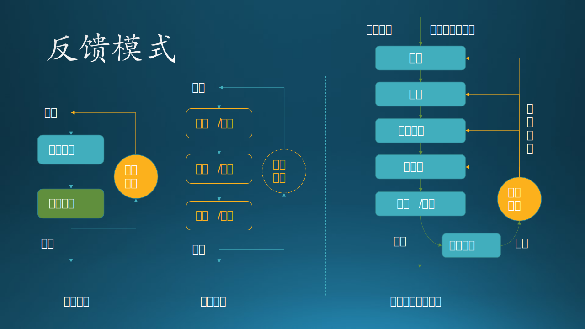

## 12.6 环形系统的架构模式

### 12.6.1 模型-视图-控制器-模式（MVC）

MVC 这个名词很多读者都熟悉，它代表了 Model-View-Controller。但大多数人熟悉的应该是 MVC 框架和设计模型，我们这里要讲解的是 MVC 架构模型。表 12-4 举例说明了三者的区别。

表 12-4 三种概念的举例比较

|MVC|基本功能|MVC架构举例|MVC框架举例|MVC设计举例|
|-|-|-|-|-|
|模型|数据或状态的表示，应用逻辑的封装。 如：游戏卡带。|管理电子邮件系统 的所有数据|JAVA: JavaBean ASP.NET: 用户自定义类|封装对象： 文件、 文件列表|
|视图|用户界面组件，模 型数据的可视化， 允许用户输入。 如：游戏手柄和电视。|Web网站可以同时 提供浏览器页面和 手机WAP页面来收 发电子邮件|JAVA: JSP ASP.NET: Razor|控件绑定： 大图标、列表、 小图标、详情|
|控制器|选择模型和视图，将 用户的操作转换为对 模型或者视图的更改 如：游戏主机。|根据请求类型决定 是浏览邮件还是发 送邮件，选择不同 模型，并确定视图|JAVA: Servlet ASP.NET: Controller|用户操作： 剪切、复制、 更名、删除、 排序、新建|
|说明|通用功能定义， 以游戏机为例|以电子邮件系统为例|以Java和 ASP.NET为例|以 Windows 的 文件管理器为例|

#### 1. 架构说明

MVC 模式将交互式应用程序拆分为三个部分：

- 模型（model）：包含业务功能及数据、状态。
- 视图（view）：把模型中的数据信息用指定的界面展示给用户，通常有多个视图可供控制器选择。
- 控制器（controller）：处理用户的输入操作，选择模型和相应的视图。

MVC 模式通过将内部信息表示、用户信息呈现以及用户操作接收分开的方式解耦组件，实现高效的架构重用。

见图 12-15。

图 12-15 MVC 架构

以老式插卡游戏机为例：

- 游戏主机是控制器 C。注意这里的“控制”不是指用户的操作，而是对各个零部件的控制。它接收手柄的操作信号，把模型中指定的视图播放到显示器上。
- 游戏卡是模型 M，封装了游戏的数据和逻辑，和其它两个部件完全无关，可以任意更换游戏卡，只要接口一致即可。它决定显示器上的图像。
- 游戏手柄和显示器是视图 V。注意，手柄是用户交互设备，相当于鼠标键盘，所以属于视图，而不是属于控制器。如果屏幕是可以触摸的话，也可以直接用手操作屏幕。

#### 2. 应用场景

一般用于主流开发语言所构建的互联网网页应用架构，比如 ASP.NET MVC、Spring MVC。

在图 12-15 右侧显示了 ASP.NET MVC 框架的工作流程：

（1）用户浏览器向 Web Application 提出请求 URL（如：https://xxx.com/home/index）；
（2）Routing Module 执行 RouteTable 中定义的路由动作；
（3）MVCHandler 生成 home_Controller；
（4）执行 URL 中的 index_action，向 Model 请求数据；
（5）Model 从数据库中获得数据；
（6）Controller 决定使用哪个 View；
（7）把 Model 交给 View；
（8）合成好网页后返回给用户浏览器。

读者可以很容易地找到 Spring MVC 框架的工作流程并自行阅读，相信会有所帮助，在此不再赘述。

#### 3. 优缺点

优点：
- 耦合性低
视图层和业务层分离，这样就允许更改视图层代码而不用重新编译模型和控制器代码，同样，一个应用的业务流程或者业务规则的改变只需要改动MVC的模型层即可。因为模型与控制器和视图相分离，所以很容易改变应用程序的数据层和业务规则。
- 重用性高
MVC模式允许使用各种不同样式的视图来访问同一个服务器端的代码，因为多个视图能共享一个模型，它包括任何WEB（HTTP）浏览器或者无线浏览器（WAP），比如，用户可以通过电脑也可通过手机来订购某样产品，虽然订购的方式不一样，但处理订购产品的方式是一样的。由于模型返回的数据没有进行格式化，所以同样的构件能被不同的界面使用。
- 部署快，生命周期成本低
MVC使开发和维护用户接口的技术含量降低。使用MVC模式使开发时间得到相当大的缩减，后端开发人员集中精力于业务逻辑，界面程序员集中精力于表现形式上。
- 可维护性高
分离视图层和业务逻辑层也使得 WEB 应用更易于维护和修改

缺点：

- 完全理解MVC比较复杂。
   完全理解并掌握 MVC 不是一个很容易的过程。
- 调试困难。
   因为模型和视图要严格的分离，这样也给调试应用程序带来了一定的困难，每个构件在使用之前都需要经过彻底的测试。
- 不适合小型，中等规模的应用程序
   在一个中小型的应用程序中，强制性的使用 MVC 进行开发，往往会花费大量时间，并且不能体现 MVC 的优势，同时会使开发变得繁琐。
- 增加系统结构和实现的复杂性
   对于简单的界面，严格遵循 MVC，使模型、视图与控制器分离，会增加结构的复杂性，并可能产生过多的更新操作，降低运行效率。
- 视图与控制器间的过于紧密的连接并且降低了视图对模型数据的访问
   视图与控制器是相互分离，但却是联系紧密的部件，视图没有控制器的存在，其应用是很有限的，反之亦然，这样就妨碍了他们的独立重用。
   依据模型操作接口的不同，视图可能需要多次调用才能获得足够的显示数据。对未变化数据的不必要的频繁访问，也将损害操作性能。

### 12.6.2 反馈模式（LoopBack）

#### 1. 架构说明

反馈模式在应用架构模式中使用得较少，它是从控制理论衍生过来的一种编程模式，但是在操作系统级别的架构模式上，基本上都是使用这种方式。

见图 12-16。

图 12-16 反馈模式

它包括消息接收、消息处理、反馈控制三个部分。

- 消息接收，接收上一次的运行结果作为消息的唯一来源；
- 消息处理，针对感兴趣的消息进行处理，要求处理速度尽可能地快，以避免影响后续的操作。
- 反馈控制，负责接收输出结果，再返回给输入端，进行闭环的调节控制，以达到预期的输入和输出的关系。

该模式与事件驱动模式的区别如表 12-5 所示：

表 12-5 事件驱动模式与反馈模式的区别

||事件驱动模式|反馈模式|
|-|-|-|
|形式|开环系统，可以随时增加处理单元|闭环控制系统，运行时无外界干扰|
|运行|根据需要可以暂时停止然 后再开启，事件不会丢失|一旦运行就不能停止，因为停 止再恢复运行时状态比较复杂|
|终止条件|无|有，事先设定|
|事件消息来源|应用程序中的任意模块|从上一次的输出结果中来|
|多个处理单元|并行|串行|

#### 2. 扩展模式

可以多个接收/处理单元串联在一起，每个单元负责不同的消息，但是要求每个单元的消息处理速度非常快，不至于影响其它单元。

反馈控制可以是轻量级的（图中画成虚线），或者其它任何形式的，只要与输出有关即可。

#### 3. 应用场景

以神经网络训练为例：

（1）搭建神经网络模型；
（2）初始化各层的网络参数；
（3）用批量样本逐层做正向计算；
（4）在最后的输出部分计算损失函数（与样本的标签值比较）；
（5）把误差逐层做反向传播，更新每层的网络参数；
（6）返回到 3，直到误差符合要求。

#### 4. 优缺点

优点：

- 不受外界干扰的闭环系统。
- 控制行为（处理逻辑）简单，系统运行稳定。

缺点：

- 比较难设计和实现。
- 反馈信号需要妥善处理，反馈力度太强会引起系统崩溃，太弱则不起作用。
- 因为要正向、反向反复运行，所以运行性能较低。

### 12.6.3 事件驱动模式 (Event-Driven)

#### 1. 架构说明

事件驱动模式应用于事件处理，主要由四个组件构成：事件源（event source），事件侦听者（event listener），通道（Channel）以及事件总线（event bus）。 事件源将消息发布到总线的特定通道，侦听者订阅相应的通道，事件源所发布的消息经通道通告给订阅通道的侦听者。

见图 12-17 拓扑结构。

图 12-17 事件驱动模式$^{[5]}$

一个事件源一般只发送消息到一个通道中，该通道一般由消息队列实现。而监听者根据业务需求可以监听一个或多个通道内的消息，比如图 12.5.2 中的监听者 1 就同时监听通道 1 和通道 2 的消息，此时，事件源 2 要发送两个消息拷贝到通道 2 中。

发布-订阅模式是事件驱动模式的一个子集。单独此模式的拓扑结构，感觉它是一个树形，但是在实际的应用中，参与通信的角色既是事件源，又是监听者。作为监听者接收事件后进行处理，然后发送新的事件到消息队列中，由下一级的监听者处理，最后绕了一圈儿又回来了，形成一个闭环。

#### 2. 应用场景

这里用一个网络购物的应用常见来说明事件驱动的应用方式，见图 12.5.2 右侧订单服务实力。

（1）一个网络购物的用户下了订单，应用程序会发送“订单事件”到事件总线；
（2）“订单处理”模块会得到“订单处理通知”，处理订单，比如核对存货量、配送地、付款信息等；
（3）处理完毕后发送“订单确认事件”到事件总线；
（4）“订单确认”模块会得到“订单确认通知”，给用户发送确认短信或使用其他通信手段；
（5）发送消息给用户；
（6）发送完毕后发送“通知成功事件”到事件总线；
（7）“订单执行”模块会得到“订单配送通知”；
（8）商家配送，送货上门，用户签收；
（9）配送完成后发送“订单完成事件”到事件总线。
（10）系统发送“用户评价通知”然后关闭该订单（未画出）。

这种应用场景相当复杂，如果用串行系统架构种的管道-过滤器模式的话，所有操作都要做成同步的，对于网络购物这种大访问量的应用几乎是不可能的。所以，这种“重要不紧急”的场景很适合于使用事件驱动模式。另外，这个场景中的所有参与者基本上都既是事件源又是监听者。

#### 3. 优缺点

优点：

- 分布式的异步架构，事件处理器之间高度解耦，软件的扩展性好。
- 适用性广，各种类型的项目都可以用。
- 性能较好，因为事件的异步本质，软件不易产生堵塞。
- 事件处理器可以独立地加载和卸载，容易部署。

缺点：

- 涉及异步编程（要考虑远程通信、失去响应等情况），开发相对复杂。
- 难以支持原子性操作，因为事件通过会涉及多个处理器，很难回滚。
- 分布式和异步特性导致这个架构较难测试。

