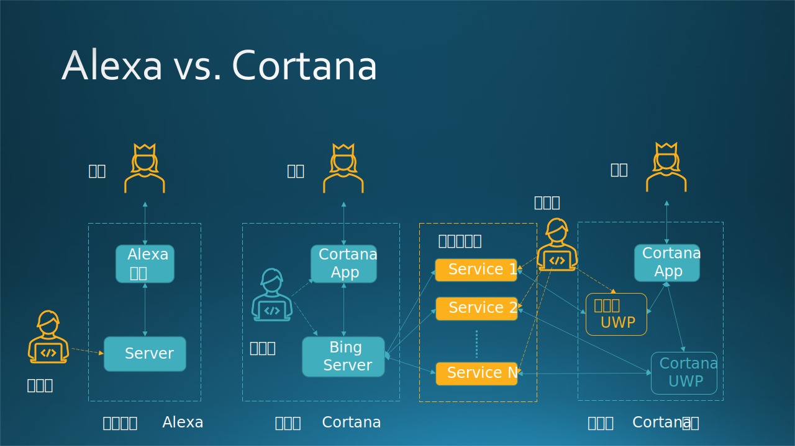

## 12.7 软件的技术架构与康威定律

### 12.7.1 康威定律

康威定律是一句格言，指出“**一个团队设计的系统通常反映了他们自己的组织沟通结构**”。它以计算机程序员梅尔文·康威的名字命名，他于1967年提出了这个想法。原文是：

**Any organization that designs a system (defined broadly) will produce a design whose structure is a copy of the organization's communication structure.**

笔者最初也是不明白康先生在讲什么，直到在写作的时候分析了微软 Cortana 的产品战略和系统架构之后，才恍然大悟。意思是说：假设一个组织内部有三个领导各自带领一个小组来共同完成一个项目（不一定是软件系统），那么系统设计中起码会有三个组成部分，因为每个组成部分是由一个小组来完成的。

图 12-18 对比了亚马逊的 Alexa 和微软的 Cortnan 的（简易）技术架构，用于说明康威定律。

图 12-18 亚马逊 Alexa 与 微软 Cortana 的对比

图例：

- 单箭头虚线：开发行为。
- 双箭头实线：网络或数据通信。
- 黄色开发者：外部开发者。
- 蓝色开发者：内部开发者。
- 蓝色虚线框：产品边界。
- 黄色虚线框：第三方服务。

### 12.7.2 半开放的亚马逊 Alexa

亚马逊智能音箱产品 Alexa 无疑是一个**成功**的产品，在 2018 年的一个第三方的统计报告中的数字告诉我们：

- Alexa 平台上的技能超过了 5 万个；
- 有数十万开发者，其中有一些独立开发者通过技能开发实现盈利；
- 开发者和使用者遍布 180 多个国家；
- Alexa 已经为人们唱了数百万此生日快乐歌，讲了超过 1 亿个笑话；
- 热门技能包括：音频和音乐播放、游戏问答、智能家居控制、生活方式辅助、教育，等等。

亚马逊的 Alexa 是一种半开放的环境。见图 12-18 左侧。

在 Client 端就是一台音箱，具备 ASR（语音识别）和 TTS（文本转语音）功能，并通过互联网与 Server 端通信传输数据。

在 Server 端开发了一套无代码/低代码的服务框架，第三方开发者在服务器上注册登录后，根据服务器端指定的流程，输入一些可定制的规则，完成两件事：1. 识别用户的语音问话的含义；2. 做出相应的响应。

### 12.7.3 封闭的微软 Cortana

微软的 Cortana 也无疑是一个**不成功**的产品。

首先从定位上看，Alexa 是放在用户家里的，为用户提供生活服务；而 Cortana 是运行在计算机上的，局限在为用户提供工作助理功能上，这是先天性的缺陷。

其次我们看看它的产品架构。在图 12-18 中我们省去了很多架构的细节，关键的元素是开发者所处的位置：

- Alexa，开发者是第三方的，在虚线框外部；
- Cortana，开发者是第一方，在虚线框内部。

微软自己全权负责 Cortana 的技能开发：

- 在客户端，相关软件是硬编码在 Windows 操作系统中的，而不是用可扩展的 UWP 应用来随时提供灵活快捷的升级服务，这就意味着和 Windows 操作系统的耦合度太高。
- 在服务器端，由于 Windows Team 没有自己的在线服务系统，所以借用了 Bing 的服务。首先把语音转成文本，然后做语义识别，触发对应的服务，最后把结果页面返回给客户端展示。
- 在第三方服务端，合作的服务厂商需要按照微软的要求提供一些 WebAPI 接口调用，但是在客户端的体验是微软提供的，第三方厂商无权干预，只能提建议。

其中，第一点的代码位置限制了 Cortana 的技能的快速扩展，因为第三方根本不可能加入到这个生态系统中来。

当年笔者看到了 Cortana 的架构后，不禁心里发紧，深知这是 Windows Team 的一贯作风 —— 这就是**康威定律**的具体体现：

- Windows Team 本身就是一个封闭的组织，很多人在里面工作了十几年，所以设计出来的产品也是封闭的。
- Windows 向来不依赖外部，但是这次需要有语音处理分析这些事情，Windows 自己搞不定，只能求助于 Bing。
- 就算投入几百人做 Cortana 技能，但是如果这些人不是服务领域的专家，也不会做出什么好的服务体验的，这就根本不能和亚马逊的“全民皆兵”的模式媲美。

除此之外，还有一个天然的缺陷，就是 Cortana 被设定在“办公助理”的位置，那么谁会在办公室里对着 Cortana 大喊要做什么做什么呢？岂不是暴露了自己正在上班摸鱼的秘密？

### 12.7.4 假设 Cortana 有一个开放架构...

所以，笔者自己在 Windows 现有的技术基础上构想了一个架构，如图 12-18 最右侧所示

- Cortana App 依然存在，由 Windows Team 维护；
- 增加一个 Cortana（Assistant）UWP App，它对外可以接入第三方服务，对内可以被 Cortana App 通过 UWP 内部机制调用（相当于是一个本地启动的服务）。这样做的好处是：虽然 Cortana App 跟随 Windows 的发布节奏（至少半年才发布一次），但是 Cortana UWP 可以随时在 Windows 应用商店中发布，像普通的 UWP App 一样，自由地迭代更新。这个 UWP App 由 Cortana 项目组来负责。
- 第三方 UWP App，是第三方通过 Windows 应用商店在 Windows 10 上发布的应用。它和 Cortana UWP App 一样，可以对内为 Cortana App 提供服务，对外调用自己的服务。比如，网易云音乐 UWP 只访问网易云自己提供的服务，淘宝 UWP 只访问阿里提供的服务。这些 UWP 可以在不显式启动的情况下为 Cortana App 提供服务，只要实现相应的开发接口即可。

笔者所在中国团队的 PM Manager 看到这个架构设计后兴奋无比，它的最大好处可以总结为：

- Cortana 技能可随时更新。
- 第三方可以参与技能提供。
- Cortana 技能开发的难度降低了很多。

但是理由再充分，也无法说服美国总部做出改变，他们希望掌控一切，关起门来自己玩儿。

