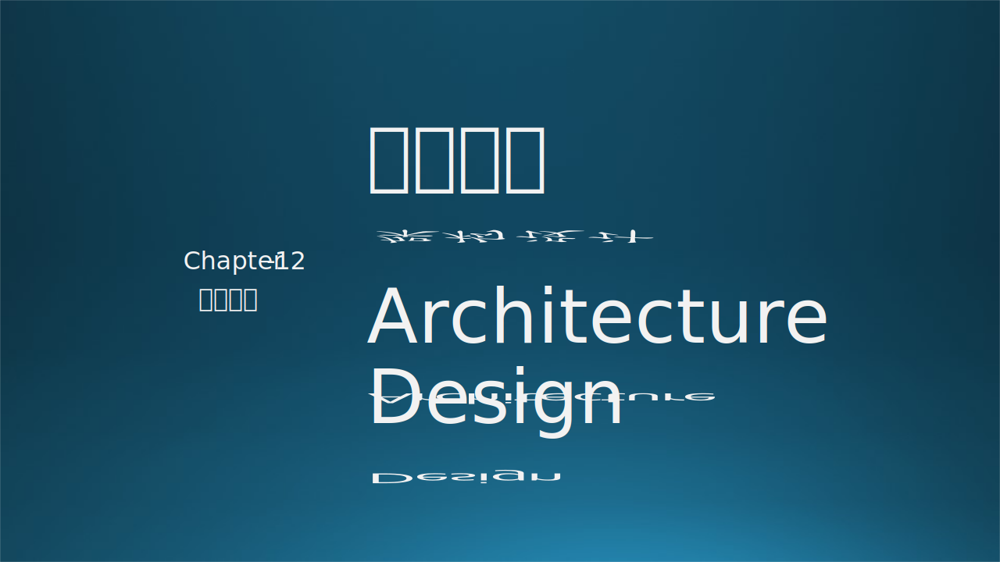
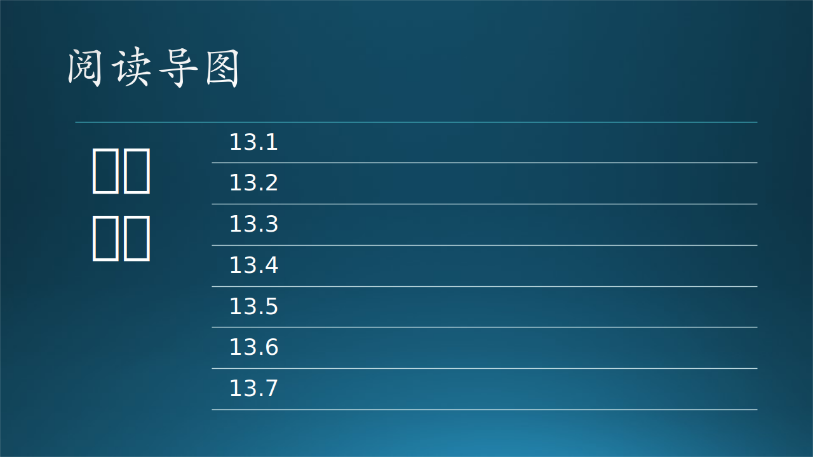

概要设计、总体设计、架构设计，high level design

详细设计（design pattern，low level design）

架构，源于中国古代建筑术语。架 = 加 + 木，构 = 木 + 勾，把一堆木头加起来并互相勾住，以形成一个完整的、牢固的建筑。引申到软件产品概念上，就是：

1. 把一个软件项目整体切分成不同的部分；
2. 定义不同的角色来完成这些部分的工作；
3. 建立相互沟通的机制，使得这些部分能够有机的结合为一个整体，并完成这个整体所需要的所有功能。

有两种常用的架构方法：RUP（Rational Unified Process，统一开发过程），TOGAF（The Open Group Architecture Framework）

https://blog.csdn.net/lfsf802/article/details/8487990

https://towardsdatascience.com/10-common-software-architectural-patterns-in-a-nutshell-a0b47a1e9013

https://zhuanlan.zhihu.com/p/41395345

https://blog.csdn.net/Jayphone17/article/details/103651076

https://zhuanlan.zhihu.com/p/41395345

https://www.ou.nl/documents/40554/791670/IM0203_03.pdf/30dae517-691e-b3c7-22ed-a55ad27726d6

https://towardsdatascience.com/10-common-software-architectural-patterns-in-a-nutshell-a0b47a1e9013

https://max.book118.com/html/2016/1115/63079375.shtm

https://blog.csdn.net/hguisu/article/details/78259898
