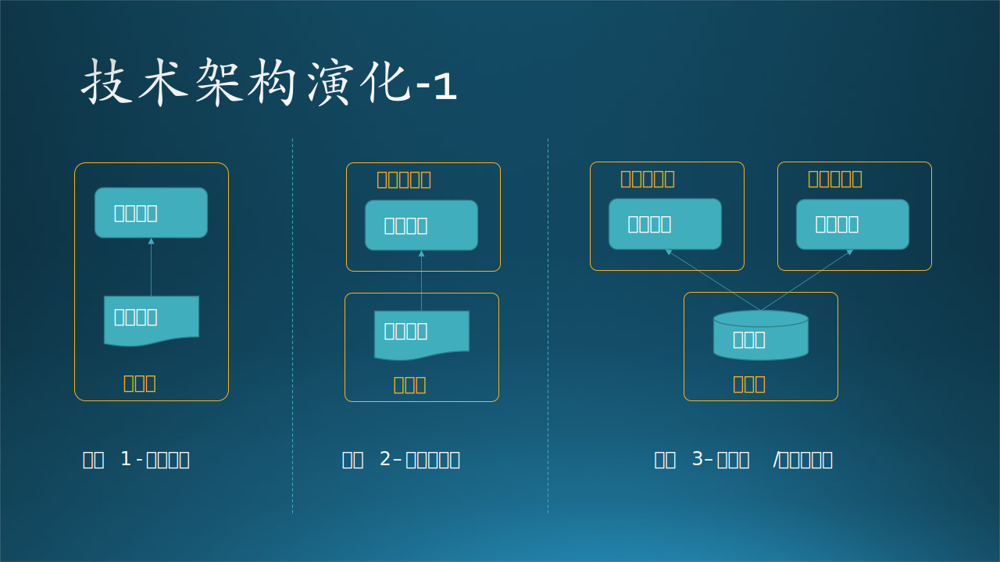
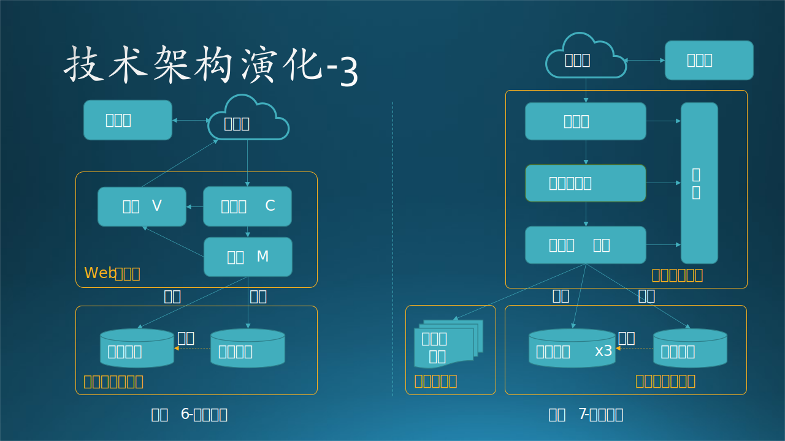
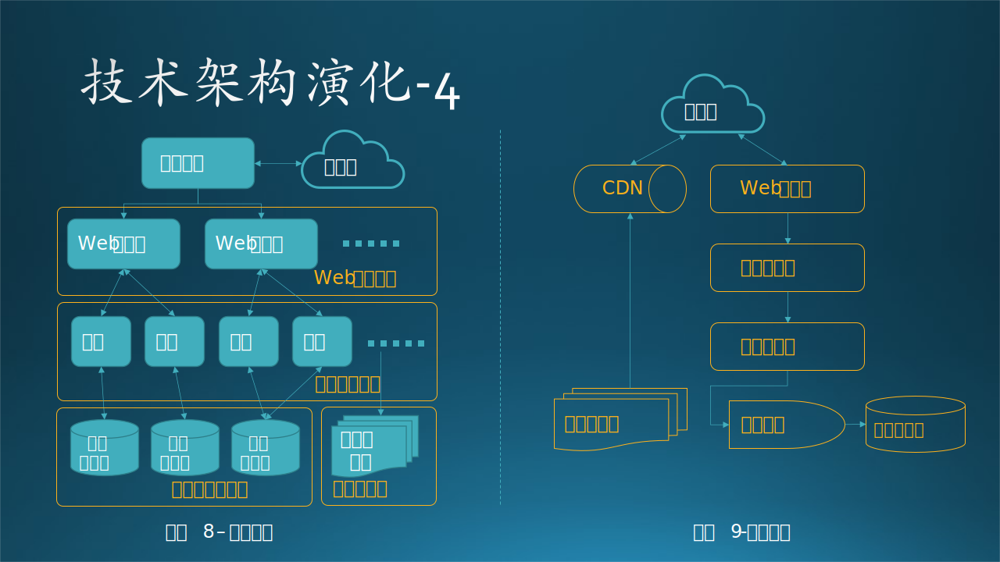

## 12.1 架构演化的故事

还记得第一章中关于“木头与软件工程的故事”吧？这里有另外一个版本，是同样的应用场景，但是想说明的是软件**架构**演化的故事。

### 12.1.1 单机架构

我们首先假设木头有个熊孩子，还在上小学。数学不是很好，所以木头想了一个注意：每天出 20 道 100 以内的加减法算术题。这个对木头来说很容易，花了 1 个小时用 C# 搞定了一个小的应用程序。

**再小的软件也是有架构的，所以架构是可大可小的，能用小的、简单的架构解决问题，就不要用大的、复杂的架构。**

这个小应用程序的架构很简单：一个有界面的应用程序，显示出题目，孩子计算出结果后填入一个数字，提交，如果正确则进入下一题，错误则提示重做。那些题目是事先生成好的（经过人工核对，以保证不重复和一定的复杂程度），包括答案，都放在了一个数据文件里。

木头自己家里就有一个台式机运行 Windows 10 操作系统，是平时在余时间写书用的，性能还可以。于是木头就把应用程序和数据文件都放在一个目录中，在桌面上创建一个应用程序的快捷方式，孩子每次点击打开即可使用。

见图 12.1.1 阶段1。

图 12.1.1 架构计划-1

### 12.1.2 点对点架构

很快，木头发现一个问题：每天晚上如果孩子在使用台式机做题的时候，自己就不能使用。木头忽然想到家里还有一个比较旧的 Surface 笔记本电脑，于是拿出来升级到 Windows 10，性能还可以接受。

然后把应用程序拷贝到笔记本电脑上，数据文件仍然放在台式机上（这样木头就可以随时在台式机上维护那个文件），用点对点网络共享的方式把数据文件共享给笔记本电脑，这样在笔记本电脑上的应用程序可以像读本地磁盘一样打开数据文件。

于是，父子俩每天晚上都可以在局域网内共同使用电脑了。见图 12.1.1 阶段2。

### 12.1.3 客户端/服务器架构

熊孩子和同学们吹嘘自己在用电脑做算术题，同学们很羡慕。其中有个同学就住在木头家的隔壁，哭着喊着带着家长过来学习先进经验。

木头本来想把这个应用直接拷贝给邻居使用，但是邻居基本上是个电脑盲。木头忽然想到 Wifi 信号可以穿墙，于是在无线路由器上开了一个端口给邻居，并让邻居买了一台二手笔记本电脑，装好 Windows 10 操作系统和应用程序软件，登录到木头家的路由器。自己家的笔记本电脑也登录到同一个路由器上。

但是两台笔记本电脑操作同一个数据文件会产生一些读写冲突，木头又花了几个小时的时间把对数据文件的读写改成了数据库读写，SQL Server 数据库（个人版）部署在自己的台式机上，两台笔记本电脑可以同时访问数据库获得习题并提交答案了。

其实这种模式还不是标准的客户端/服务器模式，只能算是网络数据库模式，如果把数据库看成是服务器的话，也勉强算是客户端/服务器模式。

见图 12.1.1 阶段3。

### 12.1.4 浏览器-服务器架构

熊孩子的进步突飞猛进，引起了老师的注意。经过询问后得知有这么一个好工具，立刻和教务处及校长汇报，然后联系木头寻求合作。

面对下一代的教育问题，木头当仁不让。但是，如果全校师生都用的话，需要做的改动有（其实是重新设计开发）：
- 要有广域网（互联网）的支持，因为同学们是在各自的家中使用；
- 题库需要很大的改进以满足各个年级的需要，并且用一个强壮一些的数据库来存储题库，如 SQL Server 企业版，可以有很多并发连接；
- 软件也需要重新进行架构设计，因为不能要求所有的学生都有一台 Windows 10 的电脑，所以必须改成浏览器/服务器模式；
- 由于是业余练习，目前还不需要记录成绩，所以在服务器端配置一台 Web 服务器连接数据库，允许简单的上传下载功能即可。

木头寻思了一下，这个事情自己一个人做不了，后期还需要持续升级维护，所以和公司领导汇报，看看是不是能组织一个小组来试水教育领域的软件开发。领导很支持，调配了 3 个人和木头一起花了一个月的时间完成了这件事。

见图 12.1.2 阶段4。

图 12.1.2 架构演化-2

### 12.1.5 MVC 架构

运行一段时间后，数学老师们觉得效果非常好，校长知道后也很高兴，就想把这个模式推广到其它学科。于是，除了体育老师、音乐老师、美术老师以外，其它学科的老师纷纷找木头讲述需求，木头忙得脚丫子朝天，把小学课程整个都复习了一遍，觉得知识很生疏。

由于各门课的内容差异很大，所以要求有不同种类的界面来支持，一台实现简单逻辑 Web 服务器已经不能满足要求了。开发小组内部商量后决定用 MVC 模式，用 ASP.NET 的 MVC 框架来实现，完全分离模型、视图、控制，以免所有逻辑都混在一起。其中，模型负责与数据库交互获得数据，视图负责展示给浏览器，控制器负责接收用户的请求，调用不同的学科的模型和视图。

而数据库也从 Web 服务器中拆出来，安装在一台独立的服务器中。

见图 12.1.2 阶段5。

### 12.1.6 数据库主从架构

增加了很多学科，当然要在数据库中增加更多的内容。

在开发小组向数据库中逐步增加题库的同时，木头感觉如果全校的上千名学生同时使用这个系统的话，数据库访问会是个瓶颈。于是和校长/教务处商量，又购买了一台数据库服务器，与已有的一台数据库配置成了主从关系，即：

- 主数据库负责写入，然后同步给从数据库；
- 从数据库负责查询/读出；
- 当检测到从数据库压力较大时，可以再增加一台从数据库服务器，做负载均衡。

这样就基本解决了数据库的压力，而且数据有了备份。当然，如果发现一台从数据库服务器不够用了，还可以再增加。而 Web 服务器的压力，目前预测还可以承受，木头和开发小组决定上线后先观察一下再说。

见图 12.1.3 阶段6。

图 12.1.3 架构演化-3

### 12.1.7 多层架构

木头和开发小组正在严密监视着 Web 服务器的流量问题，意想不到的事情发生了：体育老师、音乐老师、美术老师来找开发小组谈业务了！口口声声是推动数字化教学方案！

木头心想：嗐，多增加几个学科也没问题吧，反正前面的架构设计也没有限制具体的学科。但是，这几位老师的需求完全不同：他们需要增加大量的视频、音乐、图片，供同学们下载观看和倾听。

木头和开发小组商量，不得已又申请了几台机器，把以前单纯的 Web 服务器变成了一个服务器群，花了半个月的时间，把以前的 MVC 架构改了改，最后变成了三层架构。其中，表示层中含有原来的视图和控制器部分的代码，实体中含有以前的模型部分的代码，相当于是 MVC 架构在三层模式中的实现。

数据库当然也要增加，从数据库从 1 台变成了 3 台，校长虽然心疼，但还是批准了预算。还有一些视频、音频、图片文件都放在了独立的文件服务器上，这些文件都是只读的，不需要修改。

见图 12.1.3 阶段7。

### 12.1.8 负载问题

就这样平稳运行了半年多，木头和开发小组都觉得风平浪静的日子有些枯燥，突然接到了市教育局的电话，对方一个冷冰冰的女声：“是木头吗？听说你们没有经过我们教育局审核，就给某小学开发了一套课外教育系统？” 一听这话，木头手中正在旋转的鼓棒“咣啷”一声掉在地上，结结巴巴地说：“啊？审核？这个...校长没有说起过有这个手续呀？” 那个女声说：“校长也是想出成绩，明年升级为市重点小学。这样吧，你们明天来一趟教育局，带好相关材料，我们补一个审核！” 木头愣了一会儿，问：“哦？哦！是教育局，不是公安局吧？” 女声说：“对，是教育局，公安局在我们对面，想去那里也很方便。”

听了这话，木头才放下心来，没有法律责任，也没有经济处罚，而且还能补审核，好事！于是捡起鼓棒，又转了起来......

审核很快通过了，主要是界面上要多一些官方认证的标志、许可证号码等等，最关键的是，市教育局想在全市推广这套系统！这下子木头可乐坏了，赶紧向领导申请加派人手，领导也很高兴，欣然同意。

由于教材是统一的，所以在需求上没有大的改动，只不过需要增加登录系统，以区分学校和学生，便于市教育局进行统计。但是有两个重大变化：

1. 系统不能部署在某个学校了，市教育局申请了 Azure 云资源，所有的软件都要部署在 Azure 上。
2. 要承担全市小学的课外辅导工作，用户量剧增，并发访问量剧增。

据此，木头和开发团队（从小组变成了团队，准备进军教育行业）做了以下设计：

- 在最前端增加了**负载平衡**机制，这样 Web 服务器就可以根据访问量横向扩展了。
- 在应用层，为每个学科单独开发了对应的服务，**负载分解**，以满足不同学科之间的需求差异，还能随时扩展。数据存取层也放在这里。
- 在数据库层也是采用了分库的机制，每个学科单独使用一套主从数据库，有些作业量不大的学科可以共享一套数据库。通过这些**负载调整**，每个数据库都处于合理的繁忙程度的运行状态。

见图 12.1.4 阶段8。

图 12.1.4 架构演化-4

### 12.1.9 性能问题

在部分学校开始使用这套系统后，系统运行还算平稳。渐渐地，当更多的学校使用后，木头团队逐渐发现了两个问题：

- 文件服务器访问量太大了，似乎同学们对视频、图片、音乐更感兴趣。
- 以前写数据库的操作特别少，但是有了用户系统后，需要不断地向数据库中写入日志，数据库的压力也变得很大。

针对第一个问题，开发团队租用了 CDN（Content Delivery Network，内容分发网络）来缓存静态文件资源，提高响应速度，同学们看视频、听音乐、看图片更起劲儿了，体育老师、音乐老师、美术老师都很高兴。

针对第二个问题，开发团队在数据库写入前端加了消息队列，使得大量的并发写入都先进入消息队列进行削峰处理，然后在分批次地写到数据库路中，可以保证数据不丢失，这是由消息队列的特性来保证的。这也可以看作是用空间换时间的缓存机制。

见图 12.1.4 阶段9，由于细节太多而版面有限无法绘制出来，所以采用了框架图。

### 12.1.10 总结

注意，我们讲的是架构**演化**，而不是**进化**，意思是用户需求处于什么阶段，我们就使用什么样的架构。演化的各个阶段的具体架构没有好坏之分，只要最适合当前需求的就是最好的。每个后续的阶段都会比上一个阶段更复杂，开发、维护、部署的成本都更高，所以要谨慎选择。
