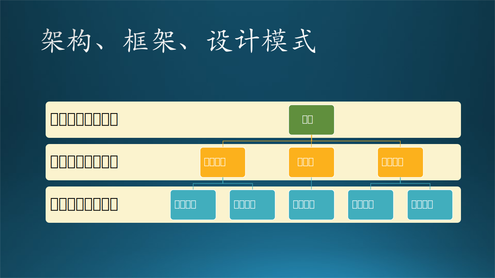
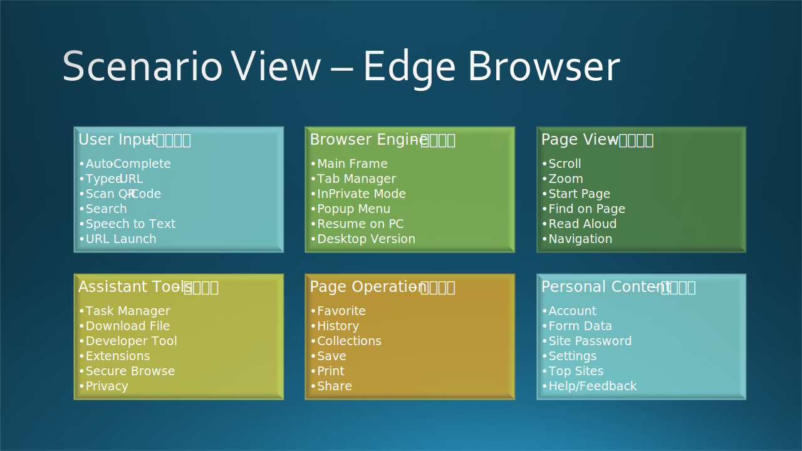
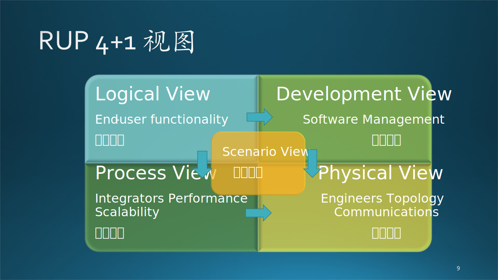
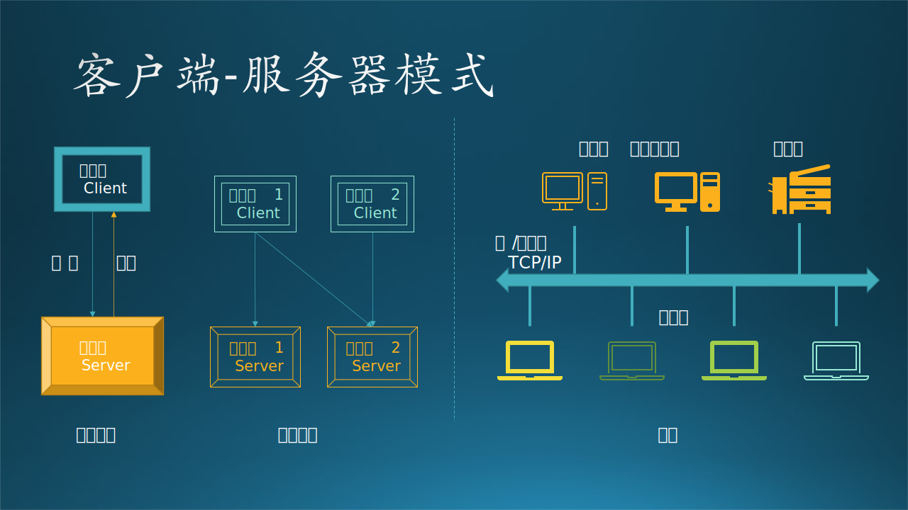
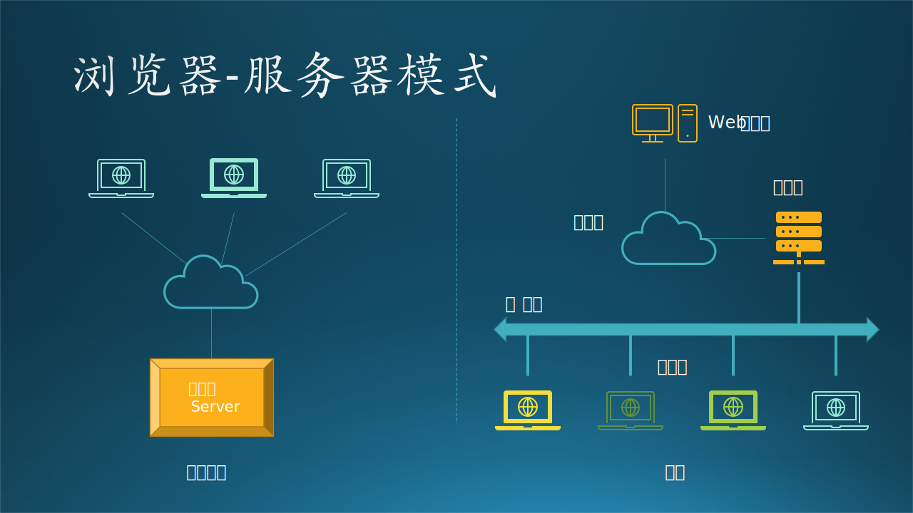

## 12.2 与架构相关的概念

### 12.2.1 基本概念

先澄清一些容易混淆的基本概念，在网络上这些概念鱼龙混杂，让读者不明所以。

#### 1. 架构、架构师、构建、框架、结构

**架构师**（architect）使用**架构**模式**构建**（construct）了一个**框架**（framework），用于约束那些开放者们只能使用规定的**结构**（structure）来进行二次开发。

#### 2. 架构设计、系统设计、概要设计、详细设计

架构设计比概要设计更抽象。

概要设计主要要描述出系统分为哪些功能模块，每个模块又可以分为哪些子模块，每个模块的主要功能是什么等，

而架构设计一般不需要详细描述到子模块，主要描述系统的层次结构、各层包含的重要的模块、各层之间的接口和通讯方式、大模块的物理部署等。

一般大型项目都是在需求分析之后先做架构设计，再进行概要设计和详细设计，不过一般中小型的项目很多都没有架构设计，直接进行概要设计，在概要设计里阐述架构设计。

- 架构
- 功能
- 数据

本着敏捷开发的原则，概要+详细设计比较臃肿，详细设计可以针对具体的模块、算法，由相应的开发人员完成。或者，把概要设计做得稍微详细一些，可以代替详细设计。

#### 3. 架构、框架、设计模式

从 12.1 节的架构进化的故事中，想必读者已经对“架构”有了一些基本的概念。本章中主要讨论架构设计，所以先澄清一下三个重要概念：

**（1）架构**

简单的说架构就是一个蓝图，是一种设计方案，将客户的不同需求抽象成为抽象组件，并且能够描述这些抽象组件之间的通信和调用。

比如，三层架构、事件总线架构等，这些架构代表的模式也可以叫做架构模式，它定义了系统的总体结构。

**（2）框架**

软件框架是项目软件开发过程中提取特定领域软件的共性部分形成的体系结构，不同领域的软件项目有着不同的框架类型。框架不是现成可用的应用系统。而是一个半成品，提供了诸多服务，开发人员进行二次开发，实现具体功能的应用系统。框架是代码，是工具，不是知识。

比如 .Net Framework 是开发框架，PyTorch 是深度学习框架。一旦使用了某个框架，就会有一定的粘性，想迁移到其它框架上会有困难。比如使用 PyTorch 搭建好神经网络模型后，如果想迁移到 Tensor Flow（另外一个深度学习框架）上，需要重新学习语法、重新搭建、重新训练。

框架有哪些？

C++语言的QT、MFC、gtk，Java语言的SSH 、SSI，php语言的 smarty(MVC模式)，python语言的django(MTV模式)等等

【最佳实践】

不要轻易地决定是否使用框架，一旦投入，就和框架绑定了，需要学习理解框架的底层逻辑，代码结构要遵守框架的约定，框架的 bug 也会让项目陷入泥潭。

笔者曾接手 Windows Phone 10 上的新浪微博的开发，上一个开发者采用了一个框架，用于处理用户交互事件，第一印象是：本来很直接的一件事，非得要通过框架绕一个弯儿。而笔者是第一批在 Windows Phone 10 上开发的先驱，对整个开发体系非常清楚，自然看不上这么一个奇奇怪怪的不知名的框架，于是不费什么力气，就摘掉了这个框架。意想不到的是，发布出去以后，用户反映整个应用的响应速度比以前快了，软件运行流畅了很多。

【最佳实践】

不要轻易决定自己写框架

- 没人用
- 与业务逻辑耦合

**（3）设计模式**

是一套被反复使用、广为人知的、经过分类的代码设计经验的总结，它强调的是一个设计问题的解决方法。设计模式是知识，是概念，不是代码。

稍微有些底层软件开发经验的读者，都知道有约 23 种软件设计模式，比如工厂模式、适配器模式、策略模式等等，目的是保证代码的可重用性、可读性、可靠性。而且还有 7 种设计原则，是上述的 23 种 设计模式要遵守的基本规则。

在上层的架构设计上，同样有设计原则和设计模式，一个合格的架构师就是根据这些原则和模式来工作的。

**（4）三者的比较**

所以，从概念大小和开发顺序上看，架构 $\gt$ 框架 $\gt$ 设计模式。

- 首先架构应该是一个最大的概念，是最高层次的设计。所以在做一个项目的时候首先出来的应该是架构，是对整个问题的一个总体上的设计。可以根据已有架构模式衍生出具体的架构，或者自己设计出新的架构。一个架构设计中可能会用到多个框架和多个设计模式。

- 其次会考虑采用什么现有的框架或者自己实现框架来解决架构设计中的子系统、子任务。一个架构中，在不同的局部可能要采用不同框架，比如在靠近应用层的部分应该采用 MVC 框架，而靠近后台处理的部分应该采用 xx 框架。系统小的话，只使用一种框架也可以。框架是针对共性抽象出来的半成品，所以，如果开发者自己实现框架的话，基本上会和实例（实际的应用）代码混在一起，分不出哪个是框架，哪个是应用。

- 最后，在具体的功能模块实现时就需要用到设计模式，所以设计模式就是解决单一问题的设计思路和解决方法。

这三者的共同点都是解决软件开发中的问题而出现的，而且都会表现出来的就是“高内聚，低耦合”的理念，就是让我们的设计更面向对象化。

所以我们要想做好一个好的项目，那么架构设计、框架选型、设计和使用、设计模式的使用是非常重要的。

简而言之：架构是大智慧，用来对软件设计进行分工；框架是半成品，加入代码来实现自己想要的功能；设计模式是小技巧，对具体问题提出解决方案，以提高代码复用率，降低耦合度。

### 12.2.2 架构设计方法

#### 1. RUP 4+1

RUP，Rational Unified Process，即统一开发过程。

0. 场景视图（Scenario View）

   通过数量一些重要场景（更常见的是用例）进行无缝协同工作，我们为场景描述相应的脚本（对象之间和过程之间的交互序列）。

1. 逻辑视图（Logical View）

   主要支持功能性需求，即系统应该为用户提供哪些服务。

2. 过程视图（Process View）

   一些非功能性的需求，如性能和可用性。它解决并发性、分布性、系统完整性、容错性的问题，以及逻辑视图如何与过程结构配合在一起，在哪个控制线程上，对象的操作被实际执行。

3. 开发视图（Development View）

   关注软件开发环境下实际模块的组织。软件打包成小的程序块（程序库或子系统），它们可以由一位或几位开发人员来开发。子系统可以组织成分层结构，每个层为上一层提供良好定义的接口。

4. 物理视图（Physical View）

   主要描述硬件配置。在UML中通常被称为部署视图，它主要考虑如何把软件映射到硬件上。通常需要考虑到解决系统拓扑结构、系统安装和通信等问题。

#### 2. UML

UML，即Unified Model Language，统一建模语言。

1. 用户模型（Use Case View）

   强调从用户的角度看到的或需要的系统功能，是被称为参与者的外部用户所能观察到的系统功能的模型图。
   用用例图描述。

2. 结构模型（Logic View）

   展现系统的静态或结构组成及特征，也称为结构模型视图(Structural Model View)或静态视图(Static View)。
   用类图和对象描述。

3. 行为模型（Concurrent View）

   体现了系统的动态或行为特征，也称为行为模型视图(Behavioral Model View)或动态视图(Dynamic View)。
   用状态图、时序图、协作图、活动图描述。

4. 实现模型（Component View）

   体现了系统实现的结构和行为特征，也称为实现模型视图(Implementation Model View)。
   用组件图描述。

5. 环境模型（Deployment View）

   体现了系统实现环境的结构和行为特征，也称为环境模型视图(Environment Model View)或物理视图(Physical View)。
   用配置图描述。

#### 3. TOGAF

TOGAF，即 The Open Group Architecture Framework，开放组织架构框架，是由 The Open Group 这个开放组织指定的企业发展架构的方法和工具（即框架）。

0. 组织架构

   在 TOGAF 中不存在（所以图中为灰色），但却是客观存在的，由人或部门组成的公司管理层，不属于架构设计范畴。

1. 业务架构（Business Architecture）

   业务战略、组织和关键业务流程。

2. 应用架构（Application Architecture）

   也叫做刨面架构、逻辑架构。

3. 数据架构（Data Architecture）

   各类逻辑和物理数据资产以及数据管理资源的结构。

4. 技术架构（Technology Architecture）

   支持上述架构的必要软硬件，包括基础设施、中间件、网络、部署。

#### 4. 其它

1. 开发架构

   开发架构则更关注程序包，不仅仅是我们自己写的程序，还包括应用程序依赖的SDK、第三方类库、中间价等。尤其是像目前主流的Java、.NET等依靠虚拟机的语言和平台，以及主流的基于数据库的应用，都会比较关注。和逻辑架构有紧密的关联。

2. 逻辑架构

   逻辑架构关注的是功能，包含用户直接可见的功能，还有系统中隐含的功能。或者更加通俗来描述，逻辑架构更偏向我们日常所理解的“分层”，把一个项目分为“表示层、业务逻辑层、数据访问层”这样经典的“三层架构”。

3. 运行架构

   顾名思义，更关注的是应用程序运行中可能出现的一些问题。例如并发带来的问题，比较常见的“线程同步”问题、死锁问题、对象创建和销毁（生命周期管理）问题等等。开发架构，更关注的是飞机起飞之前的一些准备工作，在静止状态下就能规划好做好的，而运行架构，更多考虑的是飞机起飞之后可能发生的一些问题。

4. 数据架构

   数据架构，更关注的是数据持久化和存储层面的问题，也可能会包括数据的分布、复制、同步等问题。更贴切来讲，如何选择需要的关系型数据库、流行的NOSQL，如何保障数据存储层面的性能、高可用性、灾备等等。很多时候，和物理架构是有紧密联系的，但它更关注数据存储层面的，物理架构更关注整个基础设施部署层面。

5. 物理架构

   物理架构，更关注的系统、网络、服务器等基础设施。例如：如何通过服务器部署和配置网络环境，来实现应用程序的“可伸缩性、高可用性”。或者举一个实际的例子，如何通过设计基础设施的架构，来保障网站能支持同时10W人在线、7*24小时提供服务，当超过10W人或者低于10W人在线时，可以很方便的调整部署架构来支撑。

### 12.2.3 技术架构模式

架构模式是在给定上下文中对软件构建中常见问题的通用、可重用解决方案。架构模式类似于软件设计模式，但层次更高、范围更广。

串行模式

1. 分层模式 (Layered pattern)
4. 管道-过滤器模式 (Pipe-filter pattern)

星形模式

2. 客户端-服务器模式 (Client-server pattern)
6. 对等模式 (Peer-to-peer pattern)
3. 主-从模式 (Master-slave pattern)

树形模式

5. 代理模式 (Broker pattern)
7. 事件总线模式 (Event-bus pattern)

环形模式

8. 模型-视图-控制器 (MVC) 模式 (Model-view-controller pattern)
9. 黑板模式 (Blackboard pattern)
10. 解析器模式 (Interpreter pattern)

