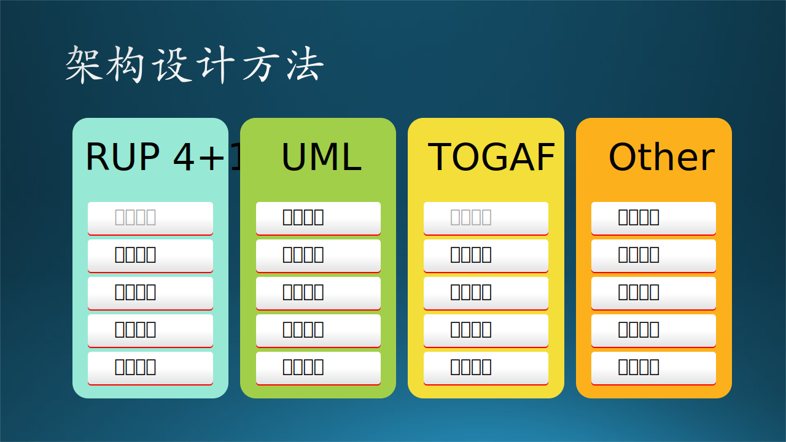
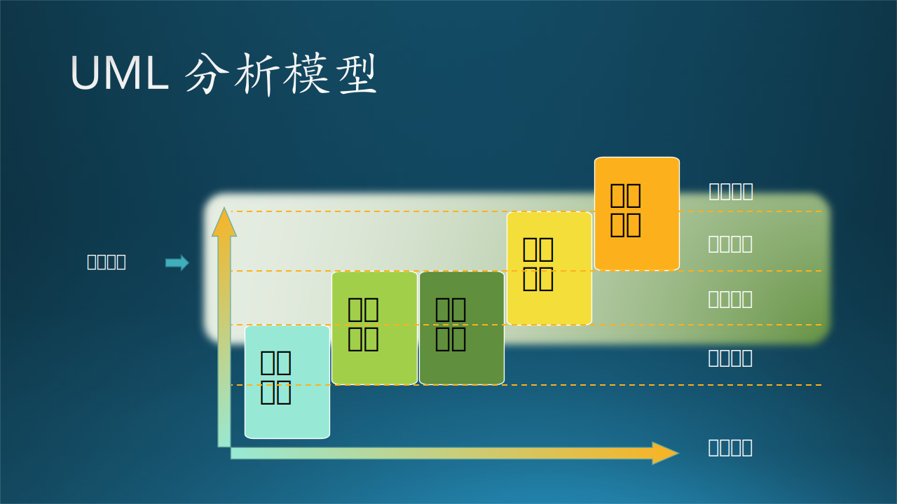

## 12.2 业务场景架构

目前各个高校的数字化建设早已经非常完备了，而且大多数读者想必在上大学的时候都亲身体验过数字化系统带来的便利。所以，在本节中，木头带着大家回到十几年前的校园，来经历一遍建立数字化校园的过程。

数字化校园是一个大系统，所以必须要经历架构设计过程。

### 12.2.1 业务需求调研

在第六章中，我们学习了软件工程的第一步：需求调研，其中讲了很多种方法，有观察、体验、访谈、问卷调查等到。于是，木头和需求调研小组首先在校长那里拿到了“尚方宝剑”，也就是校长的介绍信，然后拿着纸笔跑遍了学校的每个角落，大概花了两周的时间，粗略地记录了一些零散的需求点，如图 12.2.1 所示。

图 12.2.1 业务需求调研

在这个阶段，调研者先不需要动什么脑筋，只需要带着耳朵去听就行，把所有的不知道有用没用的需求都收集到一起，用贴纸（或电子贴纸）方式把它们贴在白板上。

但是，需求调研小组的任务还没有结束，有两个原因：

1. 用户第一次描述需求，其实他们可能根本不知道什么是需求，什么该说，什么不该说；
2. 需求调研小组的人也是第一次接触业务，如果用户说得太详细的话，需求小组的人也不一定能领会。

所以第一轮需求调研只是了解大概情况，后续还有更细的一轮功能调研。

### 12.2.2 业务需求整理

需求调研小组面对着贴满小纸条的白板，开始了分类行动。

有些需求点很容易分类，比如，从图书馆管理员那里听到的需求就属于图书馆的，与食堂宿舍无关。但是，有些需求没有明确的责任人，比如课程问题，它是属于教学过程，既有老师参与，也有学生参与，还有教务处安排，所以这类需求要独立分类。

最后，大家把粗略的分类结果在白板上展示出来，如图 12.2.2 所示。

图 12.2.2 业务需求整理

在图 12.2.2 中，大家用笔在同类的需求贴纸周围画了一个圈子，然后再看看有没有什么明显的分类错误。没有的话，则进入下一阶段。

### 12.2.3 业务需求分析

下面要根据分类结果给每一个类别都起一个名字来标识此类，比如，图 12.2.2 中的一个圈子内的所有需求都与学生有关，则叫做“学生”；都与吃喝拉撒睡有关，就叫做“生活”，等等。最后得到图 12.2.3 的分析图。

图 12.2.3 业务需求分析

在图 12.2.3 中，大家把所有的**需求点**分成了 6 个**需求块**，这与图 12.2.2 中的五个圈子不完全吻合，是进一步分析归纳的结果。

6 个块的名字分别是：教师、学生、教学、生活、图书、行政。每个名字下面包含了数量不等的模块，并且其名字和原始的需求点名字不尽相同。比如，食堂$\rightarrow$食堂管理，宿舍$\rightarrow$宿舍管理，校内办公$\rightarrow$办公系统，等等。并且，根据一些归纳和推理，还删除了一些重复的需求的，增加了一些用户没有提起的但又必须有的模块。

有的读者可能对 6 个需求块的划分有不同意见，没关系，笔者在这里只是举例说明，读者完全可以给出自己的业务划分结果。

### 12.2.4 业务场景架构

有了图 12.2.3 后，大家心里对这个数字化校园的基本功能块都有了初步的理解，但是如果把图 12.2.3 拿给校长看的话，还是有些抽象。接下来要做进一步的规划。

图 12.2.4 业务场景架构

首先，需要把图 12.2.3 中的六个需求块分出重点来，因为建设数字化校园是一个长期而费钱的工程，校长也不可能一次性拿出一大笔资金来支持。而且基于规避风险的需要，校长也肯定要决定先做什么后做什么。

于是，需求分析小组和架构设计师坐在一起讨论了一个下午，把六个需求块分成了三个层次，如图 12.2.4 所示：

1. 重点层：教学管理子系统；
2. 管理层：教师管理子系统、学生管理子系统；
3. 服务层：行政子系统、生活子系统、图书子系统。

这些子系统之间没有强烈的依赖关系，都可以单独运行。但是，还有两个基础组件需要先期完成：

1. 系统管理，包含了用户登录验证、权限管理、管理员管理等基本的服务。
2. 基础设施建设，比如 IT 网络和数据库以及机房的建设。

处于上方的用户接入部分，如果只提供浏览器方式接入，相对来说解决方案比较成熟。

处于右侧的外部系统部分，比如与互联网的物理连接方式，与教育部的上级系统的软件接口等等，也是非常重要的组成部分，需要事先考虑清楚。

不过，有了图 12.2.4 后，木头认为可以和校长进行初步的汇报了，以便决定后续的工作安排。因为就这一部分的内容来说，即使校长这个级别的用户对软件工程不是很懂的话，也是可以完全理解的，因为这是校长的业务能力范围，所以被称为**业务场景架构**。

### 12.2.5 其它业务场景举例
