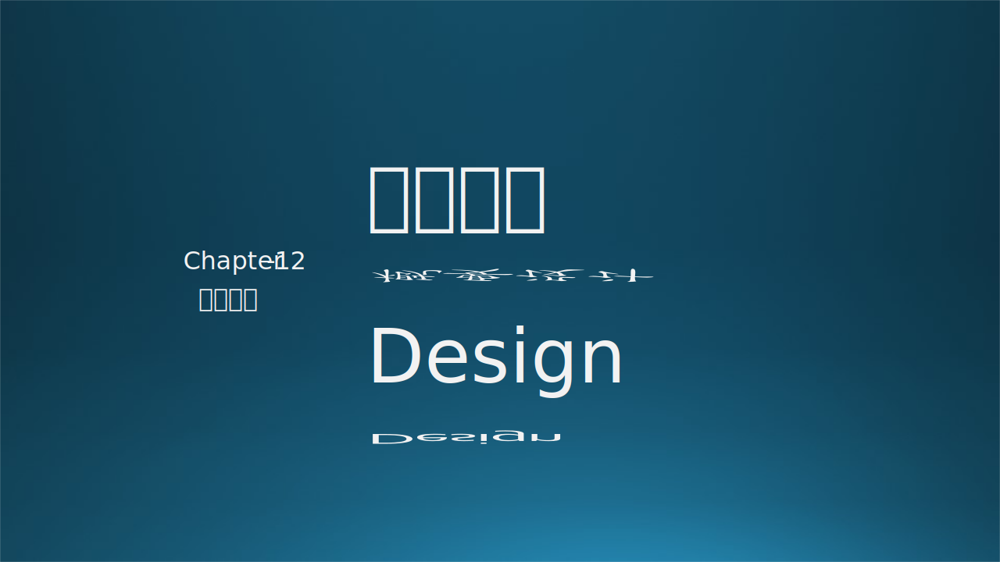
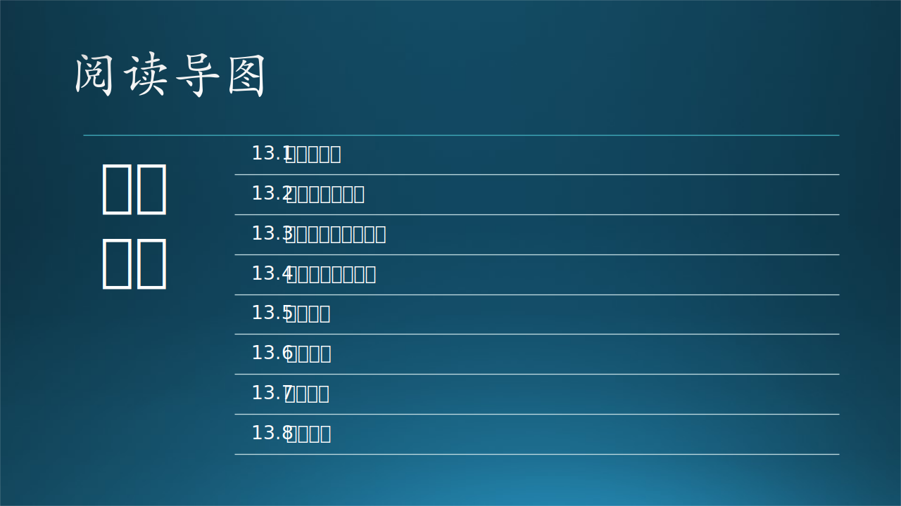

# 第十三章 概要设计

本章的标题是概要设计，但是在前面几个小节中讲述了大量的“架构设计”的知识。那么**概要设计**和**架构设计**之间的区别和联系是什么呢？

在本章中，首先会澄清一些关于“设计”的概念；然后木头会给读者讲一个业务场景架构设计的故事，引入架构设计的概念；接下来介绍几个主流的架构设计方法供大家参考；当然笔者也会从中总结出自己认为较为合理的架构设计的任务、关注点，最重要的是**把架构设计降维到概要设计**，成为一系列基本的设计任务以及最佳实践，并形成概要设计说明书；最后会讲到如何实现设计的核心目标，如性能、可用性、可扩展性等等。

