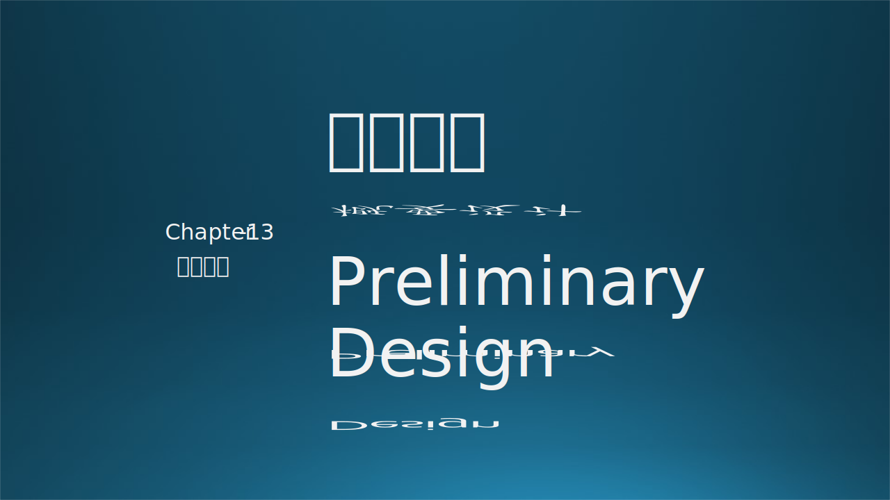
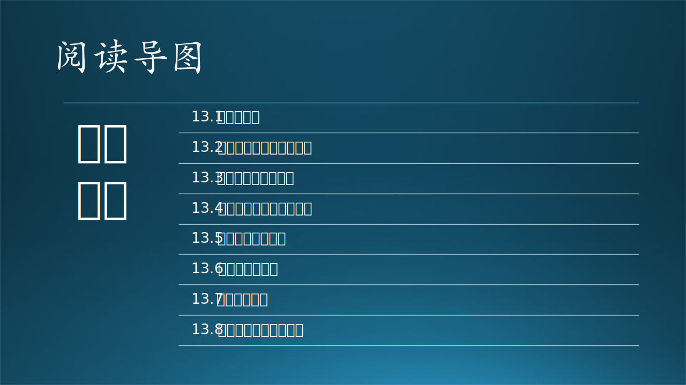

本章的标题是概要设计，但是在前面几个小节中讲述了大量的“架构设计”的知识。那么**概要设计**和**架构设计**之间的区别和联系是什么呢？

在本章中，首先会澄清一些关于“设计”的概念；然后木头会给读者讲一个业务场景架构设计的故事，引入架构设计的概念；接下来介绍几个主流的架构设计方法供大家参考；当然笔者也会从中总结出自己认为较为合理的架构设计的任务、关注点，最重要的是**把架构设计降维到概要设计**，成为一系列基本的设计任务以及最佳实践，并形成概要设计说明书；最后会讲到如何实现设计的核心目标，如性能、可用性、可扩展性等等。

#### 参考资料

- Architectural Blueprints—The “4+1” View Model of Software Architecture，Philippe Kruchten
  https://www.cs.ubc.ca/~gregor/teaching/papers/4+1view-architecture.pdf

- 京东应用架构设计，吴博
  https://www.slidestalk.com/u3813/Design_and_Governance_of_Jingdong_Application_Architecture

- 建筑设计理念与构想，文镜
  https://zhuanlan.zhihu.com/p/92154271

- The C4 Model for Software Architecture，Simon Brown
  https://www.infoq.com/articles/C4-architecture-model/
  https://c4model.com/

- The Art of Crafting Architectural Diagrams，Ionut Balosin
  https://www.infoq.com/articles/crafting-architectural-diagrams/

- The TOGAF Standard，Version 9.2
  https://pubs.opengroup.org/architecture/togaf9-doc/m/mobile-index.html

- 《软件架构设计》，温昱，电子工业出版社

- 《从零开始学架构》，李运华，电子工业出版社

- 《大型网址技术架构》，李智慧，电子工业出版社
