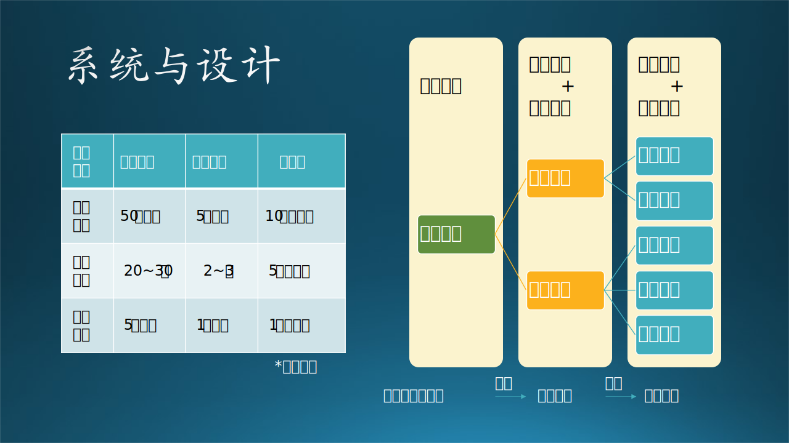
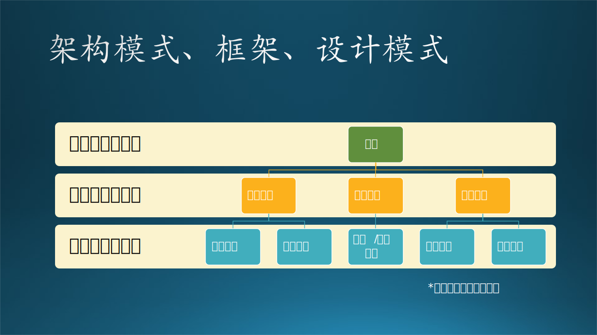
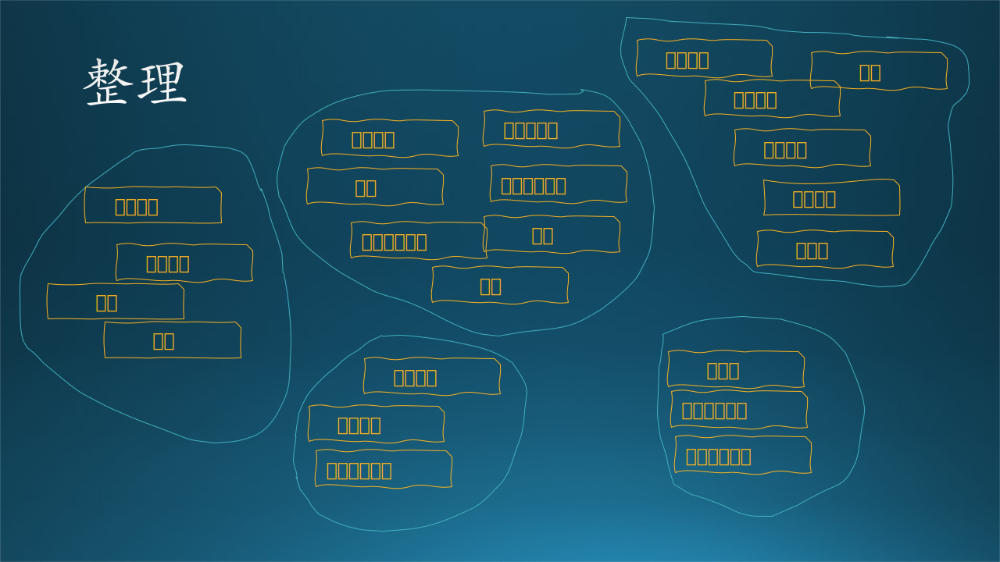

## 13.1 与架构相关的概念

### 13.1.1 基本概念

先澄清一些容易混淆的基本概念，在网络上这些概念鱼龙混杂，让读者不明所以。

#### 1. 架构、架构师、构建、框架、结构

**架构师**（architect）使用**架构**模式**构建**（construct）了一个**框架**（framework），用于约束那些开发者们只能使用规定的**结构**（structure）来进行二次开发。

#### 2. 架构设计、总体设计、系统设计、概要设计、详细设计

- 在大型系统中，需求分析结束后，首先要做的是**架构设计**。由架构师来负责。**架构设计**比**概要设计**更高层、更抽象。
- 对于中小型项目，架构设计可以不做，而是直接做**概要设计**，在概要设计里用**总体设计**这一名词来代表**架构设计**。由技术专家来负责。
- **系统设计**如果是应用于软件领域，则其含义 = 架构设计 + 概要设计 + 详细设计。
- 在小型项目中，可以用概要设计代替架构设计和详细设计，只不过要求概要设计写得稍微细一些，上可以涵盖架构设计的内容，下可以涵盖详细设计的内容。

所以，总的来说软件的系统设计顺序为：架构设计$\rightarrow$概要设计$\rightarrow$详细设计，总结为表 13.1.1。

表 13.1.1 几种“设计”概念的比较

||架构设计|概要设计|详细设计|
|-|-|-|-|
|负责人|架构师|技术专家|开发人员|
|内容|描述系统层次结构、各 层包含的重要的模块、 各层之间的接口和通讯 方式、大模块的物理部 署等。|描述出系统分为哪些功 能模块，每个模块又可 以分为哪些子模块每个 模块的主要功能是什么。|针对各个模块进行的， 包括算法、流程、状 态、数据等等，必须符 合概要设计的约束，如 功能约定、接口约定。|
|用途|确定轮廓，合理规划|理清脉络，层次分解|确定细节，编写代码|
|输出文档|架构设计说明书|概要设计说明书|详细设计说明书|

无论那种级别的设计，都应该包含：结构、功能、数据三个要素。

#### 3. 架构、框架、设计模式

见图 13.1.1。

图 13.1.1 架构、框架、设计模式之间的关系

架构对应着架构模式；框架本身就是个模式，只不过包含基础功能代码；而设计对应着设计模式。

**（1）架构**

软件架构指软件系统的顶层结构。简单的说架构就是一个蓝图，是一种设计方案，将客户的需求抽象成为组件，并且能够描述这些抽象组件之间的通信和调用。

比如，三层架构、事件总线架构等，它定义了系统的总体结构。

**（2）框架**

软件框架是项目软件开发过程中提取特定领域软件的共性部分形成的体系结构，不同领域的软件项目有着不同的框架类型。框架不是现成可用的应用系统，而是一个半成品，提供了诸多服务，开发人员在框架内部进行二次开发，实现具体功能的应用系统。框架是代码，是工具，不是知识。

比如 .Net Framework 是开发框架，PyTorch 是深度学习框架。一旦使用了某个框架，就会有一定的粘性，想迁移到其它框架上会有困难。比如使用 PyTorch 搭建好神经网络模型后，如果想迁移到 Tensor Flow（另外一个深度学习框架）上，需要重新学习语法、重新搭建、重新训练。

【最佳实践】

不要轻易地决定是否使用框架，一旦投入，就和框架绑定了，需要学习理解框架的底层逻辑，代码结构要遵守框架的约定，框架的 bug 也会让项目陷入泥潭。

笔者曾接手 Windows Phone 10 上的新浪微博的开发，上一个开发者采用了一个框架，用于处理用户交互事件，第一印象是：本来很直接的一件事，非得要通过框架绕一个弯儿。而笔者是第一批在 Windows Phone 10 上开发的先驱，对整个开发体系非常清楚，自然看不上这么一个奇奇怪怪的不知名的框架，于是不费什么力气，就摘掉了这个框架。意想不到的是，发布出去以后，用户反映整个应用的响应速度比以前快了，软件运行流畅了很多。

【最佳实践】

不要为了一个项目轻易决定自己写框架，原因如下：

- 与业务逻辑耦合

   如果能够直接使用现有框架是最好的。但是如果项目有特殊需求，也不要轻易决定自己写框架，因为很难把具体的业务与框架分开，也就是说无法从一个特殊需求抽象出来一个框架。

- 没人用

   写框架的目的是想以后重用，或者自己重用，或者让别人重用。但是大概率是没有人用的，除非这个框架可以解决通用问题。

   在 5.3 节中讲到的强化学习资源优化平台（MARO），基本上没有可重用的可能，因为应用场景都有很大的差异；量化交易平台（Qlib）的应用场景相对比较明确，所以会有不少用户来尝试使用。

**（3）设计模式**

设计模式是一套被反复使用、广为人知的、经过分类的代码设计经验的总结，它强调的是一个设计问题的解决方法。设计模式是知识，是概念，不是代码。

稍微有些底层软件开发经验的读者，都知道有约 23 种软件设计模式，比如工厂模式、适配器模式、策略模式等等，目的是保证代码的可重用性、可读性、可靠性。而且还有 7 种设计原则，是上述的 23 种 设计模式要遵守的基本规则。

在上层的架构设计上，同样有设计原则和设计模式，一个合格的架构师就是根据这些原则和模式来工作的。比如在设计模式中有观察者（订阅-发布）模式，在架构模式中有事件总线模式，其工作原理是相同的。

**（4）三者的比较**

所以，从概念大小和开发顺序上看，架构 $\gt$ 框架 $\gt$ 设计模式。

- 首先架构应该是一个最大的概念，是最高层次的设计。所以在做一个项目的时候首先出来的应该是架构，是对整个问题的一个总体上的设计。可以根据已有架构模式衍生出具体的架构，或者自己设计出新的架构。一个架构设计中可能会用到多个框架和多个设计模式。

- 其次会考虑采用什么现有的框架或者自己实现框架来解决架构设计中的子系统、子任务。一个架构中，在不同的局部可能要采用不同框架，比如在靠近应用层的部分应该采用 MVC 框架，而靠近后台处理的部分应该采用事件总线框架。系统小的话，只使用一种框架也可以。框架是针对共性抽象出来的半成品，所以，如果开发者自己实现框架的话，基本上会和实例（实际的应用）代码混在一起，分不出哪个是框架，哪个是应用。

- 最后，在具体的功能模块实现时就需要用到设计模式，所以设计模式就是解决单一问题的设计思路和解决方法。

这三者的共同点都是解决软件开发中的问题而出现的，而且都会表现出来的就是“高内聚，低耦合”的理念，就是让我们的设计更面向对象化。所以我们要想做好一个项目，那么架构设计、框架选型、设计模式的使用，三者都是非常重要的。

简而言之：架构是大智慧，用来对软件设计进行分工；框架是半成品，加入代码来实现自己想要的功能；设计模式是小技巧，对具体问题提出解决方案，以提高代码复用率，降低耦合度。

### 13.1.2 架构设计方法

目前软件领域有几种主流的架构设计方法，见图 13.1.2。

图 13.1.2 主流的架构设计方法

#### 1. RUP 4+1

RUP，Rational Unified Process，即统一开发过程。

图 13.1.3 RUP 4+1 视图

0. 场景视图（Scenario View）

   通过数量一些重要场景（更常见的是用例）进行无缝协同工作，我们为场景描述相应的脚本（对象之间和过程之间的交互序列）。

1. 逻辑视图（Logical View）

   主要支持功能性需求，即系统应该为用户提供哪些服务。

2. 过程视图（Process View）

   一些非功能性的需求，如性能和可用性。它解决并发性、分布性、系统完整性、容错性的问题，以及逻辑视图如何与过程结构配合在一起，在哪个控制线程上，对象的操作被实际执行。

3. 开发视图（Development View）

   关注软件开发环境下实际模块的组织。软件打包成小的程序块（程序库或子系统），它们可以由一位或几位开发人员来开发。子系统可以组织成分层结构，每个层为上一层提供良好定义的接口。

4. 物理视图（Physical View）

   主要描述硬件配置。在UML中通常被称为部署视图，它主要考虑如何把软件映射到硬件上。通常需要考虑到解决系统拓扑结构、系统安装和通信等问题。

#### 2. UML

UML，即Unified Model Language，统一建模语言。

图 13.1.4 UML 分析模型

1. 用户模型（Use Case View）

   强调从用户的角度看到的或需要的系统功能，是被称为参与者的外部用户所能观察到的系统功能的模型图。
   - 在**概要设计**中用**业务场景架构图**来表示。
   - 在**详细设计**中用**用例图**描述。

2. 结构模型（Logic View）

   展现系统的静态或结构组成及特征，也称为结构模型视图（Structural Model View）或静态视图（Static View）。
   - 在详细设计中用**类图和对象**描述。

3. 行为模型（Concurrent View）

   体现了系统的动态或行为特征，也称为行为模型视图（Behavioral Model View）或动态视图（Dynamic View）。
   - 在详细设计中用**状态图、时序图、协作图、活动图**描述。

4. 实现模型（Component View）

   体现了系统实现的结构和行为特征，也称为实现模型视图（Implementation Model View）。
   - 在详细设计中用**组件图、包图**描述。

5. 环境模型（Deployment View）

   体现了系统实现环境的结构和行为特征，也称为环境模型视图（Environment Model View）或物理视图（Physical View）。
   - 在详细设计中用**配置图**描述。

#### 3. TOGAF

TOGAF，即 The Open Group Architecture Framework，开放组织架构框架，是由 The Open Group 这个开放组织指定的企业发展架构的方法和工具（即框架）。

1. 业务架构（Business Architecture）

   业务战略、管理、组织和关键业务流程，也叫做俯视架构。

2. 应用架构（Application Architecture）

   也叫做剖面架构、逻辑架构。

3. 数据架构（Data Architecture）

   各类逻辑和物理数据资产以及数据管理资源的结构。

4. 技术架构（Technology Architecture）

   支持上述架构的必要软硬件，包括基础设施、中间件、网络、部署。

如图 13.1.5 左侧所示。

图 13.1.5 TOGAF架构模型和其它流派

#### 4. 其它流派

如图 13.1.5 右侧所示。

1. 逻辑架构

   逻辑架构关注的是功能，包含用户直接可见的功能，还有系统中隐含的功能。或者更加通俗来描述，逻辑架构更偏向我们日常所理解的“分层”，把一个项目分为“表示层、业务逻辑层、数据访问层”这样经典的“三层架构”。

2. 运行架构

   顾名思义，更关注的是应用程序运行中可能出现的一些问题。例如并发带来的问题，比较常见的“线程同步”问题、死锁问题、对象创建和销毁（生命周期管理）问题等等。开发架构，更关注的是飞机起飞之前的一些准备工作，在静止状态下就能规划好做好的，而运行架构，更多考虑的是飞机起飞之后可能发生的一些问题。

3. 开发架构

   开发架构则更关注程序包，不仅仅是我们自己写的程序，还包括应用程序依赖的SDK、第三方类库、中间件等。尤其是像目前主流的Java、.NET等依靠虚拟机的语言和平台，以及主流的基于数据库的应用，都会比较关注。和逻辑架构有紧密的关联。

4. 物理架构

   物理架构，更关注的系统、网络、服务器等基础设施。例如：如何通过服务器部署和配置网络环境，来实现应用程序的“可伸缩性、高可用性”。或者举一个实际的例子，如何通过设计基础设施的架构，来保障网站能支持同时 10 万人在线、7*24 小时提供服务，当超过 10 万人或者低于 10 万人在线时，可以很方便的调整部署架构来支撑。

5. 数据架构

   数据架构，更关注的是数据持久化和存储层面的问题，也可能会包括数据的分布、复制、同步等问题。更贴切来讲，如何选择需要的关系型数据库、流行的 NoSql，如何保障数据存储层面的性能、高可用性、灾备等等。很多时候，和物理架构是有紧密联系的，但它更关注数据存储层面的，物理架构更关注整个基础设施部署层面。

### 架构设计方法

表 四种架构体系的统一

||RUP 4+1|UML|TOGAF|Other|$\rightarrow$|统一名称|
|-|-|-|-|-|-|-|
|1|场景视图|用户模型|业务架构|逻辑架构|$\rightarrow$|业务场景架构|
|2|逻辑视图|结构模型|应用架构|逻辑架构|$\rightarrow$|逻辑功能架构|
|3|N/A|N/A|数据架构|数据架构|$\rightarrow$|数据存储架构|
|4|过程视图|行为模型|应用架构|运行架构|$\rightarrow$|应用运行架构|
|5|开发视图|实现模型|技术架构|开发架构|$\rightarrow$|软件开发架构|
|6|物理视图|环境模型|技术架构|物理架构|$\rightarrow$|物理部署架构|

$$
技术架构 = 逻辑功能 + 应用运行 + 数据存储 + 软件开发 + 物理部署
$$

每种设计在不同的阶段有不同的含义

|阶段|架构设计|概要设计|详细设计|
|-|-|-|-|
|业务场景|用户|业务场景架构图|用例图|
|逻辑功能|概要设计人员|逻辑功能架构图|类图、对象图|
|行为过程|概要设计人员|行为过程架构图|状态图、时序图、协作图、活动图|
|开发|开发人员|开发架构图|组件图、包图|
|部署|部署工程师|部署架构图|配置图|
|数据存储|开发人员|数据存储架构图|

最开始只有逻辑架构和物理架构

逻辑架构 = 模块划分 + 接口定义 + 领域模型

运行架构 = 技术选型 + 控制流划分 + 同步关系

开发架构 = 技术选型 + 文件划分 + 编译关系

物理架构 = 硬件分布 + 软件部署 + 方案优化

数据架构 = 技术选型 + 存储格式 + 数据分布

大型系统

架构设计
子系统设计

中型系统

系统设计

https://zhuanlan.zhihu.com/p/422882715

什么时机开始架构设计是十分重要的，业界也对这方面始终争论不休，有的主导预先设计，有的反对，有的人相对喜欢先做架构设计，有的人则懒得做，想到哪写到哪。
日常工作相对繁琐，面对的问题及系统现状也是千差万别，通常来说是在面对复杂问题和重要功能时需要进行架构设计，何为“复杂、重要”？
个人认为可以先从内容上做一些区分，比如下面是常见的需要架构设计的内容：
1、是否为全新的领域：如果是首次构建，架构的重要性是十分强的，而对于现有的系统增加个接口，架构考虑就会小很多了。
2、解空间小，或者压根没有一下子能想到的解决方案。
3、问题本身对于系统的要求特别高，相对难以实现，比如：可用性9个9，千万qps，未来变化频率十分高需要高扩展、灵活可配。
4、面临多方合作、协作时，需要一个从全局出发的指导。
5、需要精确衡量ROI的场景。
6、所开发的功能可能会引发相对较大的问题时。

然后再从时机的角度辅助判断：
1、在某项功能被重视起来，或者小步试错成功后准备大资源投入时。
2、系统的质量属性已经烂到了一定的地步，比如已经无法扩展、线上问题频发、研发质量下降、可用性已经无法良好提升等，忍无可忍时。
3、整体定位发生变化时

