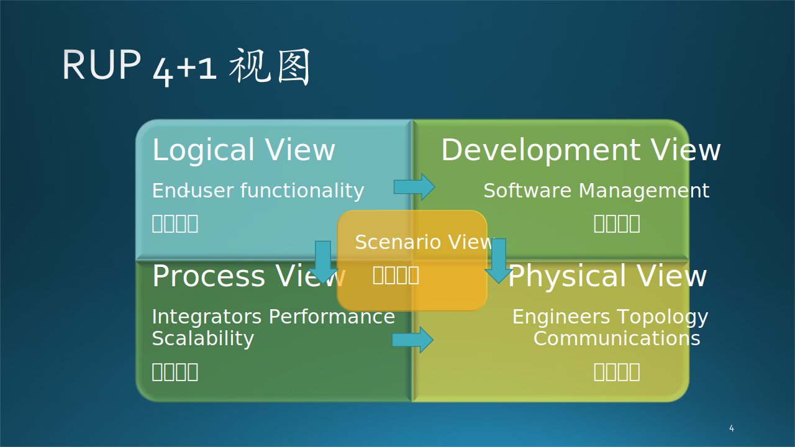

## 13.1 设计的概念

本小节主要是澄清一些容易混淆的关于“设计”的基本概念，在网络上这些概念鱼龙混杂，让读者不明所以；而公司里的老板和同事们也是经常混用这些概念，让新手们一头雾水。

### 13.1.1 建筑系统的分解与设计

我们先用一个居民小区的设计与建设来做个比喻，见表 13-1。

表 13-1 居住小区的设计与建设

|设计任务|居民小区|每栋楼宇|每户人家|
|:-:|-|-|-|
|**总体规划**|周边配套设施|楼宇周边设计|户门之间的相互关系|
|**静态设计** (功能区与间隔)|院门设置,内部功能区划分,外部边界圈定|结构,外观,长宽高,位置,朝向,单元门划分|室内布局,空间形状,墙体,门窗采光通风|
|**动态设计** (交通与水电气)|主干道,支道,地下总管线|电梯楼梯,楼宇内主管线|室内管线,开关,行走动线,干湿分离|
|**开发设计** (运输与施工)|从北向南推进,先铺管线再铺路|打地基,浇筑,从下到上逐层搭建|砌墙,铺管线,墙顶地面找平,安装门窗,室内装修|

#### 1. 居民小区

这是一个大系统，需要总体规划设计，主要完成周边配套设施的规划，商场、学校、幼儿园、公园、体育设施等等。

在建筑行业**没有**静态设计、动态设计、开发设计的说法，笔者为了能和后面要讲的软件工程具有可比性，才引入了这个说法。对于小区来说，所谓静态设计，主要是功能区的划分；所谓动态设计，主要是人员车辆的流动，水电气的运行，生活垃圾清理等等；所谓开发设计，即施工方法，一般是从小区深处向小区门口推进，方便清理运输。

#### 2. 每栋楼宇

楼宇就可以定义为中型系统了。

对于每栋楼宇来说，它的总体规划会降级，关注楼宇与其它楼宇之间的距离是否影响采光，周边道路，停车场安排。

静态设计$^{[1]}$主要是建筑整体结构上的一些考虑，动态设计是主要是人员通行的考虑以及楼宇内总管线的设计，开发设计当然是先打地基、浇筑主框架，然后从下到上逐层搭建。

 在施工的时候有个技巧，整栋楼是按层施工的，在每个单元之间并没有物理隔离，以便工人和建筑材料可以在整栋楼内来回流动，在最后阶段才会隔离单元。

#### 3. 每户人家

门户就是小型系统了。

它的总体规划会进一步降级，关注一梯三户之间户门的相互关系，比如户门位置是不是会影响开启，与电梯、楼梯之间的位置是否合适等等。

在室内设计上需要比较精细，主要是考虑人类日常生活中的一些习惯，布局合理，浪费面积小。

当然，在建筑学上还有很深的学问，笔者只是班门弄斧而已，只是想说明在不同的层次上面对不同规模的问题，设计的任务不同。

### 13.1.2 软件系统的分解与设计

#### 1. 软件系统规模定义

设计这个词本来是一个非常宽泛的概念，但是在软件工程领域，有其严格的定义，否则大家就无法基于同一概念来沟通了。如同 13.1.1 所说的建筑设计，**针对不同规模的系统，会有不同级别的设计方法**。所以，我们先考察一下软件系统的规模是如何界定的。

图 13-1 软件系统规模与设计的关系

在图 13-1 左侧，有一个粗略评价系统规模的表格，主要依据是投入的人力、花费的时间、最终的产出等三项。为什么说是粗略的呢？因为：

- 代码复杂度：

   - 以前的代码都是 C/C++ 代码，比较容易比较代码数量。但是现在有很多种编程语言，比如一段 Python 代码只用两行就调用了一个计算包，而用 C/C++ 要实现底层计算包。
   - Web 项目中的各种辅助数据，如 xml/html/css/JSON 等等，不容易界定是否属于代码。但笔者认为只要是程序员写出来的东西都算代码，包括注释行。
   - 有些是自动生成的代码，比如在使用 JAVA/.Net 框架时，都会产生这类代码，而且是和程序员写的代码位于同一个文件中，无法拆分。

- 业务复杂度：面向企业的系统会比面向公众的系统复杂很多，因为需要实现一些特殊的工作流程。一个公众系统可以从简单到复杂慢慢进化，而企业系统必须一次性交付才能满足合同要求。

- 人员复杂度：程序员的素质不同，团队合作的成熟度也有差异，对于团队规模和完成时间有很大的影响。

- 技术复杂度：项目难度也需要考虑。比如一个项目中包含了若干高难度的算法或模型的研发和实现任务，所需要的时间也就相对较长。

- 环境复杂度：软件运行环境如果比较复杂，有很多外部系统需要连接，那么接口设计与实现、开发过程中的调试、集成测试等环节都会比较耗时。

当然，除了大中小三种规模外，还会有超大型和微型。

#### 2. 分解与设计

如图 13-1 右侧所示：

- 对于大型系统，需求分析结束后，需要**架构师**把它分解成若干个中型系统，此时需要**架构设计**来完成分解任务。

- 对于中型系统，首先还是要进行需求分析，然后需要**技术专家**把它分解成若干个小型系统。此时，我们需要**概要设计**来完成分解任务，因为在概要设计中也包含有**架构设计**的工作内容，但是一般用**总体设计**这一名词来代表架构设计，以避免和大型系统中的架构设计混淆。

- 对于小型系统，一般就不需要做需求分析了，我们需要**概要设计**和**详细设计**，最终达到能用代码实现的目的，这项工作由具体的**开发人员**来完成。

对于超大型系统，把它分解为中型系统即可；对于微型系统，只做详细设计即可。

所以，**在软件工程中，只有架构设计（Architecture Design）、概要设计（Preliminary Design）、详细设计（Detailed Design）三个设计概念**。

细数当今世界上的大型系统，国外有微软、谷歌、亚马逊的搜索、购物平台，国内有微信、微博、抖音、淘宝、京东、12306 等的电商、娱乐平台，总数不超过 50 个。而且这些大平台也都是一步步从小到大逐步扩展的。所以一般人很少有机会从事、参与大型系统的设计工作。既然大型系统很少，那么就很少有人立说著书来讲解架构设计，因为即使是经历过大型系统设计工作的人，也不能保证他/她的经验就是普遍适用的。最终的结果是：关于**架构设计的知识不成体系**。

那么读者可能会有疑问：既然大型系统很少，我们为什么还要学习架构设计？原因如下：

- 架构设计是一种抽象思维活动，学习相关知识可以让读者打开眼界，学会自上而下的思考过程，而不是只会自下而上。
- 架构设计方法论，是软件工程在大系统的架构层次上的具体实践，**这种方法论，在我们经常遇到的中小型系统中同样适用**。
- 从另外一个角度看，理论上概要设计是可以包括架构设计的（因为里面有总体设计部分的内容需要填写），所以在坊间一般只要求开发人员写概要设计和详细设计，非必要不写架构设计，除非系统特别复杂或者规模特别大。

总的来说**软件系统的设计顺序为：架构设计$\rightarrow$概要设计$\rightarrow$详细设计**，总结为表 13-2，但这不算完整，在 13.5 节中，我们还会继续扩展此表。

表 13-2 几种“设计”概念的比较

|系统设计|架构设计|概要设计|详细设计|
|-|-|-|-|
|系统规模|只应用于大型系统|主要应用于中型系统|主要应用于小型系统|
|设计负责人|架构师|技术专家|开发人员|
|设计对象|系统|子系统|模块|
|设计内容|把系统分解为子系统， 说明子系统之间的关系， 找出共同依赖的基础， 并考虑运行时的质量。|把子系统按照一定的原则 分解为模块，分配每个模 块具体功能，并确定模块 间调用关系和接口。|确定模块的算法、流程、 状态转换、数据结构等详 细信息，便于后续开发。|
|设计参考|架构模式|框架|设计模式|
|用途|分解系统，确定轮廓|分解模块，理清关系|确定细节，编写代码|
|输出文档|架构设计说明书|概要设计说明书|详细设计说明书|

从表 13.1.2 中可以看到架构设计比概要设计更抽象：

- 概要设计主要要描述出系统分为哪些功能模块，每个模块又可以分为哪些子模块，每个模块的主要功能是什么等。

- 而架构设计一般不需要详细描述到每个模块，主要描述系统的层次结构、各层包含的重要的模块、各层之间的接口和通讯方式、子系统的物理部署等。

【最佳实践】

- 一般大型项目都是在需求分析之后先做架构设计，再进行概要设计和详细设计，不过一般中小型的项目很多都没有架构设计，直接进行概要设计，在概要设计里阐述架构设计。所以，本章虽然讲了很多架构设计的知识，但是题目却是概要设计。

- 对于小型系统，为了体现敏捷开发的原则，我们通常只写一个稍微详细些的概要设计，通过评审后就可以开始编码开发工作，而不比写详细设计。有些技术细节可以在开发阶段再解决，以 Scrum meeting 的方式向团队其它成员汇报，并补充到最开始写的概要设计中。

#### 3. 其它几个概念

（1）系统

   一堆**组件**依靠相互之间的**关系**组成一个有机的整体以实现完整的**功能**。所以，可以说：

   $$
   系统 = 组成元素 + 结构关系 + 实现功能
   $$

   在谈论一个系统的时候，我们通常用以上这三个要素来描述，缺一不可。比如：
   - 缺乏第一个要素：那么后两者也将不存在，比如一个真空世界。
   - 缺乏第二个要素：一堆零件零散地摆在那里只能成为废品，不能实现任何功能。
   - 缺乏第三个要素：汽车模型非常漂亮，有前两个元素，但是没有任何功能，仅供观赏，不能成为系统。

（2）系统与子系统

   子系统是一种相对概念，对于大型系统来说，子系统是中型系统；对于中型系统来说，子系统是小型系统。以此类推。

（3）模块与组件

   - 模块是从源代码层面对系统的拆分，它包含了完整的代码逻辑和数据结构，并提供对外的调用接口。它的主要作用是从业务功能角度进行职责分离。

   - 组件是从可执行程序层面对系统的拆分，它可大可小，有用户界面（如 WinForm 中的窗体控件）或调用接口，并通常是可以编程的。使用者并不知道其实现的源代码是什么语言，它的主要作用从技术角度被跨系统的单元复用。

（4）系统设计（System Design）

   针对大型、中型、小型软件系统的设计行为。但是具体的设计内容根据系统的规模不同而不同，可以理解为“系统设计 = 架构设计 + 概要设计 + 详细设计”。比如，老板对你说：“你把 xx 项目做一个系统设计，我们后面好展开。” 那就需要先评价 xx 项目的系统规模，然后再决定使用架构设计、概要设计还是详细设计。

（5）总体设计（Overal Design / General Design / High-Level Design / Outline Design）

   在概要设计中，用于完成针对当前系统规模的架构设计工作的代名词。除了微型系统系统之外，其它规模的系统都可以有总体设计，也就是说“架构设计”这个词汇可以下沉到小型系统设计中，但是设计内容有所不同。

### 13.1.3 架构模式、框架、设计模式

在表 13.1.2 中列出了设计参考一项，我们现在来做个解释。

架构设计对应着架构模式；框架本身就是个模式，只不过包含基础功能代码，通常在概要设计中指定；而详细设计对应着设计模式。

从概念大小和开发顺序上看，架构模式 $\gt$ 框架 $\gt$ 设计模式。

这三者的共同点都是解决软件开发中的问题而出现的，而且都会表现出来的就是“高内聚，低耦合”的理念，就是让我们的设计更面向对象化。所以我们要想做好一个项目，那么架构设计、框架选型、设计模式的使用，三者都是非常重要的。

简而言之：架构是大智慧，用来对软件设计进行分工；框架是半成品，加入代码来实现自己想要的功能；设计模式是小技巧，对具体问题提出解决方案，以提高代码复用率，降低耦合度。

见图 13-2。

图 13-2 架构模式、框架、设计模式之间的关系

#### 1. 架构模式

首先架构应该是一个最大的概念，是最高层次的设计。所以在做一个项目的时候首先出来的应该是架构，是对整个问题的一个总体上的设计。可以根据已有架构模式衍生出具体的架构，或者自己设计出新的架构。一个架构设计中可能会用到多个框架。

在第十二章中给出了一些主流的技术架构模式，比如，三层架构、事件总线架构等，它定义了系统的总体结构。

#### 2. 框架

框架也是一种模式，但包含代码。

其次会考虑采用什么现有的框架或者自己实现框架来解决架构设计中的子系统、子任务。一个架构中，在不同的局部可能要采用不同框架，比如在靠近应用层的部分应该采用 MVC 框架，而靠近后台处理的部分应该采用事件总线框架。系统小的话，只使用一种框架也可以。框架是针对共性抽象出来的半成品，所以，如果开发者自己实现框架的话，基本上会和实例（实际的应用）代码混在一起，分不出哪个是框架，哪个是应用。

软件框架是项目软件开发过程中提取特定领域软件的共性部分形成的体系结构，不同领域的软件项目有着不同的框架类型。框架不是现成可用的应用系统，而是一个半成品，提供了诸多服务，开发人员在框架内部进行二次开发，实现具体功能的应用系统。框架是代码，是工具，不是知识。

比如 .Net Framework 是开发框架，PyTorch 是深度学习框架。一旦使用了某个框架，就会有一定的粘性，想迁移到其它框架上会有困难。比如使用 PyTorch 搭建好神经网络模型后，如果想迁移到 Tensor Flow（另外一个深度学习框架）上，需要重新学习语法、重新搭建、重新训练。

【最佳实践】

不要轻易地决定是否使用框架，一旦投入，就和框架绑定了，需要学习理解框架的底层逻辑，代码结构要遵守框架的约定，框架的 bug 也会让项目陷入泥潭。

笔者曾接手 Windows Phone 10 上的新浪微博的开发。上一个开发者采用了一个框架，用于处理用户交互事件，给笔者的第一印象是：本来很直接的一件事，非得要通过框架绕一个弯儿。而笔者是第一批在 Windows Phone 10 上开发的先驱，对整个开发体系非常清楚，自然看不上这么一个奇奇怪怪的不知名的框架，于是不费什么力气，就摘掉了这个框架。意想不到的是，发布出去以后，用户反映整个应用的响应速度比以前快了，软件运行流畅了很多。

【最佳实践】

不要为了一个项目轻易决定自己写框架，原因如下：

- 与业务逻辑耦合

   如果能够直接使用现有框架是最好的。但是如果项目有特殊需求，也不要轻易决定自己写框架，因为很难把具体的业务与框架分开，也就是说无法从一个特殊需求抽象出来一个泛化的框架。

- 没人用，一次性劳动

   写框架的目的是想以后重用，或者自己重用，或者让别人重用。但是大概率是没有人用的，除非这个框架可以解决通用问题。

   在 5.3 节中讲到的强化学习资源优化平台（MARO），基本上没有可重用的可能，因为应用场景都有很大的差异；量化交易平台（Qlib）的应用场景相对比较明确，所以会有不少用户来尝试使用。

#### 3. 设计模式

最后，在具体的功能模块实现时就需要用到设计模式，所以设计模式就是解决单一问题的设计思路和解决方法，是一套被反复使用、广为人知的、经过分类的代码设计经验的总结，它强调的是一个设计问题的解决方法。设计模式是知识，是概念，不是代码。

稍微有些底层软件开发经验的读者，都知道有约 23 种软件设计模式，比如工厂模式、适配器模式、策略模式等等，目的是保证代码的可重用性、可读性、可靠性。而且还有 7 种设计原则，是上述的 23 种 设计模式要遵守的基本规则。

一般说到设计模式时，都是指这 23 种，但也并不是绝对的。在上层的架构设计上，同样有设计原则和设计模式，一个合格的架构师就是根据这些原则和模式来工作的。比如在设计模式中有观察者（订阅-发布）模式，在架构模式中有事件总线模式，其工作原理是相同的。
