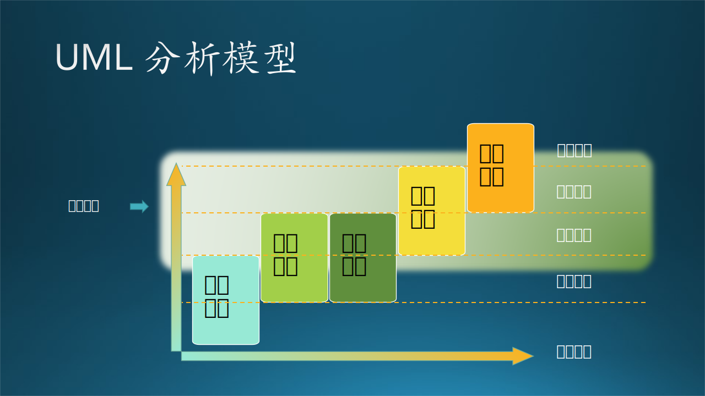
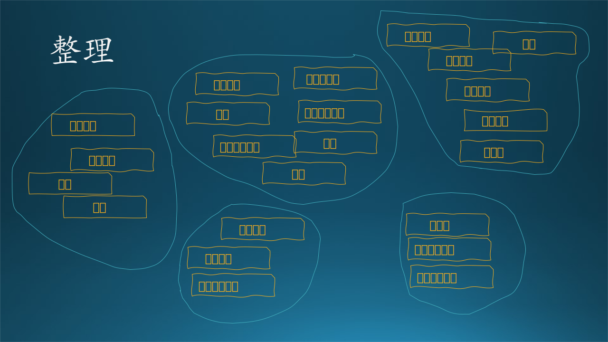
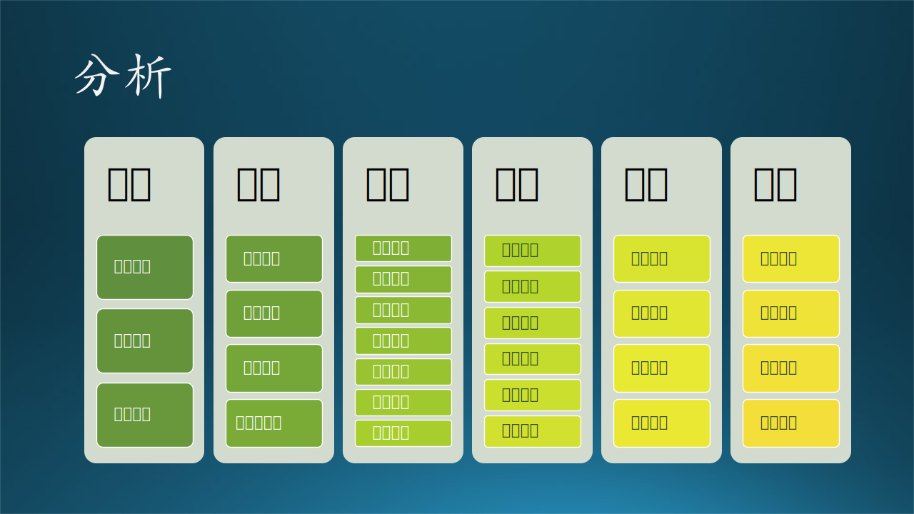
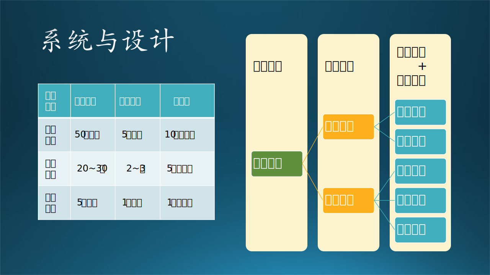
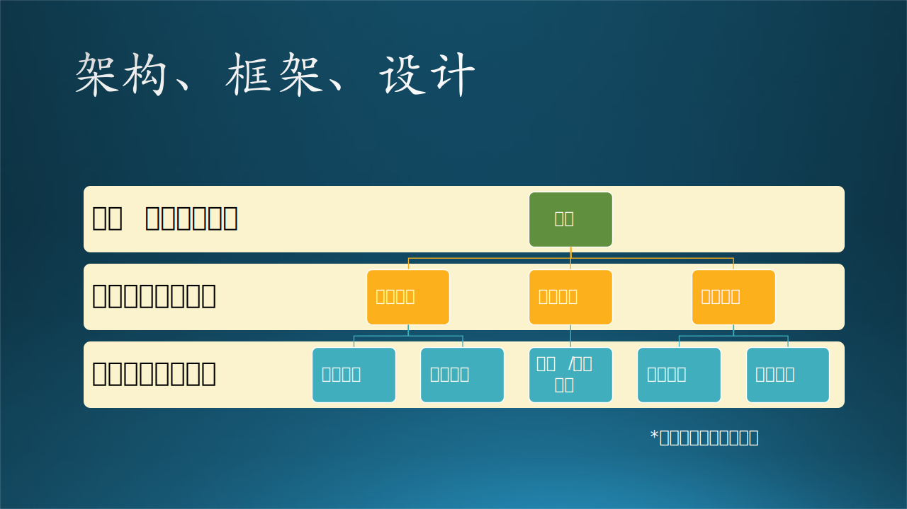

## 13.2 业务场景架构设计的故事

目前各个高校的数字化建设早已经非常完备了，而且大多数读者想必在上大学的时候都亲身体验过数字化系统带来的便利。所以，在本节中，木头带着大家回到十几年前的校园，来经历一遍建立数字化校园的过程。

数字化校园是一个大系统，所以必须要经历架构设计过程。

### 13.2.1 业务需求调研

业务需求调用的策略有两种：

#### 1. 自顶向下

给特定客户开发的产品，比如企业管理系统、智能校园系统等等，需要以客户的真实需求为导向，不能自己胡编乱造。这种情况下，按照客户的组织层级由上而下地进行需求调研是一个省时省力的方法。

在数字化校园系统中，先和校长及其它校领导谈顶层的业务需求（参见 7.4 节），然后再深入到中层获得用户需求，最后到基层获得功能需求。

#### 2. 自底向上

对于自主式的产品（即产品的 owner 不是客户，而是产品开发团队本身，自己开发并运营该产品，如微信、微博），他们需要直接从“民间”获得需求，因为他们的“客户”就是最终用户。

这种方式相对来说过程比较复杂，但是一般的面向公众的软件产品（如微软的各种产品）都是使用这种方式做需求调研。所以，我们假设下面的过程使用这种**自底向上**的方式完成的，以帮助读者顺利学习理解。

在第六章中，我们学习了软件工程的第一步：需求调研，其中讲了很多种方法，有观察、体验、访谈、问卷调查等到。于是，木头和需求调研小组首先在校长那里拿到了“尚方宝剑”，也就是校长的介绍信，然后拿着纸笔跑遍了学校的每个角落，大概花了两周的时间，粗略地记录了一些零散的需求点，如图 13-3 所示。

图 13-3 数字化校园系统业务需求调研

在这个阶段，调研者先不需要动什么脑筋，只需要带着耳朵去听就行，把所有的不知道有用没用的需求都收集到一起，用贴纸（或电子贴纸）方式把它们贴在白板上。

但是，需求调研小组的任务还没有结束，有两个原因：

- 用户第一次描述需求，其实他们可能根本不知道什么是需求，什么该说，什么不该说；
- 需求调研小组的人也是第一次接触业务，如果用户说得太详细的话，需求小组的人也不一定能完全领会。

所以第一轮需求调研只是了解大概情况，后续还有更细的一轮功能调研。

### 13.2.2 业务需求整理

需求调研小组面对着贴满小纸条的白板，开始了分类行动。

有些需求点很容易分类，比如，从图书馆管理员那里听到的需求就属于图书馆的，与食堂宿舍无关。但是，有些需求没有明确的责任人，比如课程问题，它是属于教学过程，既有老师参与，也有学生参与，还有教务处安排，所以这类需求要独立分类。

最后，大家把粗略的分类结果在白板上展示出来，如图 13-4 所示。

图 13-4 数字化校园系统业务需求整理

在图 13-4 中，大家用笔在同类的需求贴纸周围画了一个圈子，然后再看看有没有什么明显的分类错误。没有的话，则进入下一阶段。

### 13.2.3 业务需求分析

下面要根据分类结果给每一个类别都起一个名字来标识此类，比如，图 13-4 中的一个圈子内的所有需求都与学生有关，则叫做“学生”；都与吃喝拉撒睡有关，就叫做“生活”，等等。最后得到图 13-5 的分析图。

图 13-5 数字化校园系统业务需求分析

在图 13-5 中，大家把所有的**需求点**分成了 6 个**需求块**，这与图 13-4 中的五个圈子不完全吻合，是进一步分析归纳的结果。

6 个块的名字分别是：教师、学生、教学、生活、图书、行政。每个名字下面包含了数量不等的模块，并且其名字和原始的需求点名字不尽相同。比如，食堂$\rightarrow$食堂管理，宿舍$\rightarrow$宿舍管理，校内办公$\rightarrow$办公系统，等等。并且，根据一些归纳和推理，还删除了一些重复的需求，增加了一些用户没有提起的但又必须有的模块。

有的读者可能对 6 个需求块的划分有不同意见，没关系，笔者在这里只是举例说明，读者完全可以给出自己的业务划分结果。

如果我们用**自顶向下**的方法来做本场景的需求调研，可以比较容易地得到与图 13-5 近似的结果，需要再整理一下。要注意的是“教学”这个**需求块**不能直接得到，它是从教务处、任课教师、学生等多方得到信息的综合。

### 13.2.4 业务场景架构

有了图 13-5 后，大家心里对这个数字化校园的基本功能块都有了初步的理解，但是如果把图 13-5 拿给校长看的话，还是有些简单，没什么技术含量。接下来要做进一步的规划。

首先，图 13-5 中的六个**需求块**，可以基本上确定为**子系统**，在这些子系统中的各个**需求点**将会成为**模块**，可以简单地理解为：

$$
\begin{aligned}
需求块 &= \sum 需求点
\\
 需求块 \rightarrow 子系统 &，需求点 \rightarrow 模块
\\
子系统 &= \sum 模块
\\
系统 &= \sum 子系统
\end{aligned}
$$

如果在后期的调研中发现有些模块过于复杂，也可以上升到子系统的级别，比如行政子系统中的财务管理，完全可以升级为财务子系统。

其次，需要把六个子系统的重要程度排序，区分出主要次要，因为建设数字化校园是一个长期而费钱的工程，校长也不可能一次性拿出一大笔资金来支持。而且基于规避风险的需要，校长也肯定要决定先做什么后做什么，视前期的效果而制定后期的计划。

于是，需求分析小组和**架构设计师**坐在一起讨论，把六个子系统分成了三个层次，如图 13-6 所示：

- 重点场景：教学管理子系统；
- 基本场景：教师管理子系统、学生管理子系统；
- 服务场景：行政子系统、生活子系统、图书子系统。

图 13-6 数字化校园系统业务框架

这些子系统之间没有强烈的依赖关系，都可以单独开发、运行。但是，还有基础组件需要先期完成：

- 系统管理，包含了用户登录验证、权限管理、管理员管理等基本的服务。
- 基础设施建设，比如 IT 网络、数据库以及机房的建设。
- 处于上方的用户接入部分，如果只提供浏览器方式接入，相对来说解决方案比较成熟，这部分可以同时做。
- 处于右侧的外部系统部分，比如与互联网的物理连接方式，与教育部的上级系统的软件接口等等，也是非常重要的组成部分，需要事先考虑清楚。

有了图 13-6 后，木头认为可以和校长以及其它校领导进行初步的汇报了，因为就这一部分的内容来说，没有复杂的技术问题，校长和校领导们可以完全理解的，因为这是他们的业务职责范围，所以被称为**业务框架**。

但是，为了体现出架构设计师的素养，木头又把图 13-6 进一步细化，绘制成了 图 13-7 的样子。

图 13-7 数字化校园系统业务场景架构图

【最佳实践】

在画业务场景架构图时，除了内容上要完全和需求分析结果匹配，还需要注意的技巧是：

- 颜色搭配要合理，最好是用绘图工具（如 Power Point）中建议的色系。比如图 13-7 中的色系就是 深黄、浅黄、绿色、浅绿、浅蓝、深蓝，不会出现红色、紫色等。
- 用层次关系表达设计思想。
- 列出一些必要的子模块，篇幅不够的画可以少列一些。
- 同一类功能使用同一种颜色，用方框包围，并给出小标题，如“教学应用”。
- 方框内部不需要绘制箭头线，一是显得乱，二是还不能确定逻辑关系。在方框外部可以画一些箭头线，笼统地表示有交互。
- 虚线框实线框结合，表示层级关系，先虚后实或先实后虚都可以，内外框线的颜色要不同。

### 13.2.5 其它业务场景架构举例

在上面讲述的“数字化校园”系统的业务场景只是真实的系统的一个缩影而已，实际的系统复杂度是图 13-7 的三到五倍，但图 13-7 也已经可以称作是一个大系统了。

下面我们可以再举一些更流行的例子，来说明业务场景架构的概念。如图 13-8 所示。

图 13-8 电商业务场景架构图$^{[3]}$

图 13-8 这张业务场景架构图基本覆盖了电商业务的全貌，其中有几个需要解释的地方：

- 每个小的矩形是一个模块，比如实物平台、商家工具等等；
- 小矩形中的名称比较多样化，后缀有“平台”、“系统”、“服务”、“管理”等等，其实都是一个功能模块；
- 每个圆角矩形框是一个子系统，比如“用户”、“支付”等等；
- 每个子系统中都有三个模块，只是为了绘图好看而已，实际上模块的数量要更多一些；
- 中间的绿色区域是核心业务，包含网站、交易、订单、履约；
- 箭头表示业务交互关系，有双向的箭头，也有单向的。

从层次来看：

- 最上层是与用户或者商家的接口；
- 中层是核心业务；
- 下层是外围服务部分。

这中层次划分与图 13-6 的“数字化校园”系统类似。

到此为止，第一张架构图“业务场景架构”已经诞生了，它属于非技术的业务需求，是所有人（主要是用户）能够看懂的。但是，这只是架构设计的工作开始。
