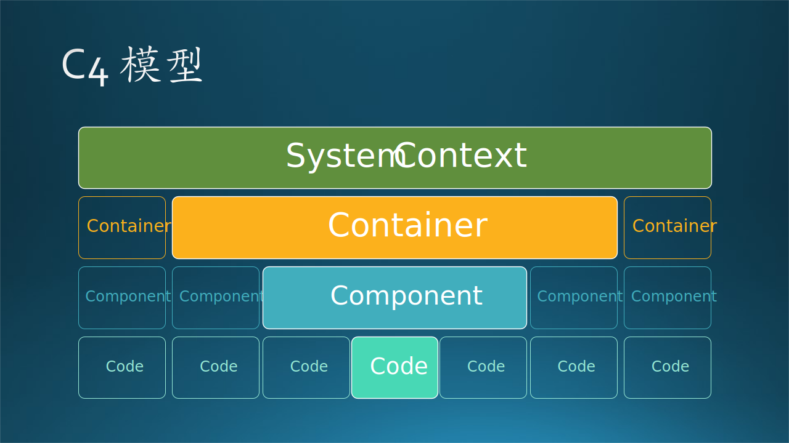
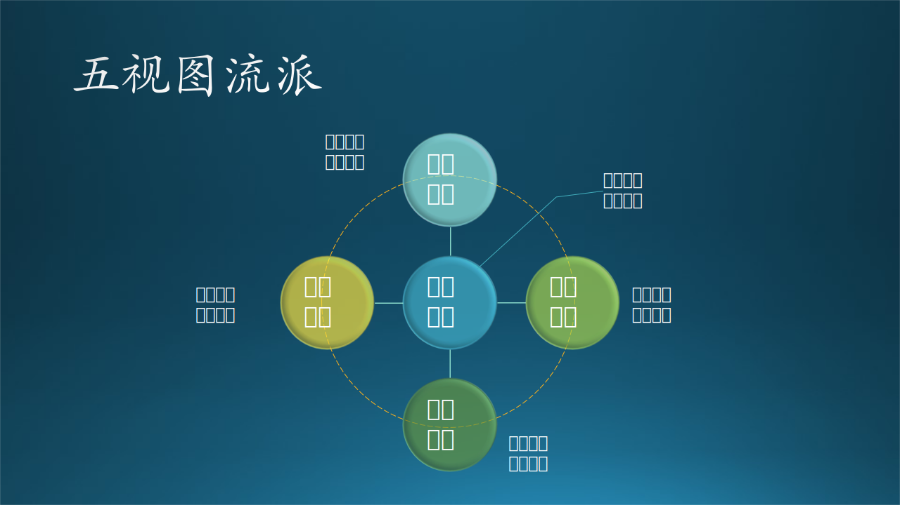

## 13.3 主流的架构设计方法

在上一节中讲述了一个数字化校园系统的业务场景架构设计的故事，最后的输出是给校长和领导们看的**业务场景架构图**。为什么叫做这个名字呢？还有其它类型的架构图吗？我们在本节中一起来解决这个问题。

首先我们先看看业界当前流行的五种架构设计方法，它们分别是：

- RUP 4+1 架构视图
- UML 统一建模视图
- C4 模型
- TOGAF 企业架构设计图
- 其它

### 13.3.1 RUP 4+1 视图

RUP，Rational Unified Process，即统一开发过程。

这是 Philippe Kruchten 在 1995 年 11 月发表的一篇 IEEE 的论文$^{[2]}$，使用多个并发视图来描述一种软件架构模型，多个视图可以分别面向各种“利益相关者”：最终用户、开发人员、系统工程师、项目经理等，分别处理功能和非功能需求，针对以架构为中心、场景驱动的迭代开发过程设计的。见图 13-9。

图 13-9 RUP 4+1 视图

#### 1. 逻辑视图（Logical View）

- 面向对象的分解。
- 描述最终用户关心的软件功能。

逻辑架构主要支持功能需求，即系统应该为用户提供哪些服务。根据问题领域（即应用场景）把系统分解为一组抽象的对象或对象类的形式。这种分解不仅是为了功能分析，还用于识别分布在系统各个部分中的可以共享的底层模块。

#### 2. 过程视图（Process View）

- 过程的分解。
- 描述系统集者成关心的的性能和可扩展性。

过程架构主要支持非功能需求，如性能和可用性。它解决并发性、分布性、系统完整性、容错性的问题，以及逻辑视图如何与过程结构配合在一起，使得针对对象的操作如何被实际执行。

#### 3. 开发视图（Development View）

- 子系统分解。
- 描述开发人员所关系的软件代码结构管理问题。

开发架构关注软件开发环境下实际模块的组织。软件打包成小的程序块（程序库或子系统），它们可以由一位或几位开发人员来开发。子系统可以组织成分层结构，每个层为上一层提供的接口。

#### 4. 物理视图（Physical View）

- 软件在硬件上的部署。
- 描述系统工程师关心的拓扑结构和网络通信问题。

物理架构主要考虑系统的非功能需求，如可用性、可靠性（容错）、性能（吞吐量）和可扩展性，描述软件系统中的不同部分如何部署在网络中的多台计算机上运行。

#### 5. 场景视图（Scenarios）

- 场景视图是 4+1 中的 1。

把上面的所有内容都串起来，通过一些重要的需求场景（常见用例）进行无缝协同工作，验证对象之间和过程之间的交互。

#### 6. 小结

表 13-3 RUP 4+1 视图小结

|视图|组件|使用者|关注点|
|-|-|-|-|
|逻辑|类|用户|功能|
|过程|任务|设计者,集成者|性能,可用性|
|开发|模块,子系统|开发者,管理者|代码结构,可重用性|
|物理|计算节点|设计者|可扩展性,性能,可用性|
|场景|步骤|用户,开发者|可理解性|

### 13.3.2 UML 建模视图

UML，Unified Model Language，即统一建模语言。UML 还总结了一套建模视图，见图 13-10。

图 13-10 UML 建模视图

#### 1. 用户模型（Use Case View）

   强调从用户的角度看到的或需要的系统功能，是被称为参与者的外部用户所能观察到的系统功能的模型图。

#### 2. 结构模型（Logic View）

   展现系统的静态或结构组成及特征，也称为结构模型视图（Structural Model View）或静态视图（Static View）。

#### 3. 行为模型（Concurrent View）

   体现了系统的动态或行为特征，也称为行为模型视图（Behavioral Model View）或动态视图（Dynamic View）。

#### 4. 实现模型（Component View）

   体现了系统实现的结构和行为特征，也称为实现模型视图（Implementation Model View）。

#### 5. 环境模型（Deployment View）

   体现了系统实现环境的结构和行为特征，也称为环境模型视图（Environment Model View）或物理视图（Physical View）。

#### 6. 小结

表 13-4 UML 建模视图小结

|模型|使用者|使用图形|
|-|-|-|
|用户模型|用户,设计者,开发者,测试者|实例图,活动图|
|结构模型|设计者,开发者|类和对象图,状态图,时序图,协同图,活动图|
|行为模型|开发者,集成者|状态图,时序图,协同图,活动图,构件图,配置图|
|实现模型|开发者|构件图|
|环境模型|开发者,集成者,测试者|配置图|

### 13.3.3 C4 模型

C4 模型$^{[4]}$是一位知名的专门从事软件架构的独立顾问 Simon Brown 在 2018 年国际软件开发会议上提出的方法论，是一种在不同抽象层次上交流软件架构的简单方法，可以向不同的受众讲述不同的故事。这也是向软件开发团队介绍（通常是重新引入）严谨和轻量级建模的一种方式，避免过度强调敏捷开发而带来的弊端。见图 13-11。

图 13-11 C4 模型

#### 1. 系统上下文图（System Context）

这一层不会关注细节，提供的是系统级别的总览关系图，这层的关注点应该是用户和系统的交互，而不是协议，技术点等一些具体的体现。所以它的使用人群是非技术人员，这里面描述的是系统级别的交互，以及谁使用。

#### 2. 容器图（Container）

这里的 Container 也可以简单地理解为容器，前提是这个 Container 只有一个服务，当 Container 具备多个服务组成时，那么这个 Container 就包含一系列的服务了，不能简单的对等于容器。

这层是给具有技术背景的人员看，这里面描述的是进程级别的应用，这是可直接部署和运行的，通过这层，我们将可以看清软件整体形态以及职责描述。

#### 3. 组件图（Component）

这一层是给开发人员看，这里描述的是系统组成部件、部件之间的层级关系和依赖。

这层的 Component，可以理解为 Java 里面的包或者 C# 里面的程序集，这里描述的是内部的包/程序集相互引用（调用）关系以及包对外部系统的程序的依赖。

#### 4. 代码（Code）

这一层的使用对象是开发人员，这里描述的是基于 UML 等图形来描述实现的技术细节，直接反映了代码层面。

#### 5. 小结

C4 模型是一种轻量级的设计方法，其实就是像看电子地图一样一步步放大，直到能看到代码细节。适合于小型系统做概要设计。

表 13-5 C4 模型小结

|视图|使用者|绘图元素|使用图形|建议|
|-|-|-|-|-|
|上下文|用户,开发团队|软件系统和使用者|系统上下文图|必须有|
|容器|设计者,开发者,集成者|系统中的容器和使用者|普通框图|必须有|
|组件|设计者,开发者,测试者|容器中的组件和组件的使用者|普通框图|可以有|
|代码|设计者,开发者|组件中的类,接口,功能,数据库|UML 类和对象图|不必有|

### 13.3.4 TOGAF 企业架构设计图

TOGAF，即 The Open Group Architecture Framework，开放组织架构框架，是由 The Open Group 这个开放组织指定的企业发展架构的方法和工具（即框架）。见图 13-12。

图 13-12 TOGAF 企业架构$^{[6]}$

#### 1. 业务架构（BA - Business Architecture）

定义了企业战略，管理，组织和主要的业务流程。开发基于原则、业务目标和策略驱动力的目标业务架构，描述产品、服务策略，以及业务环境在组织、功能、过程、信息和地理这些方面的内容。

#### 2. 数据架构（DA - Data Architecture）

描述一个组织的物理和逻辑数据资产，以及数据资源的结构。通过一种干系人容易理解的方法数据的类型与来源进行定义。数据架构并不是针对存储系统在逻辑或物理方面的设计，而是对企业相关的数据实体的定义。包括数据管理、数据迁移、数据治理。

与应用架构并称为信息架构。

#### 3. 应用架构（AA - Application Architecture）

描述各个应用程序逻辑，它们之间的相互作用，以及它们的关系，是该企业的核心业务流程。作为信息系统架构的另外一个组成部分，应用架构描述了各种用于支持业务架构并对数据架构所定义的各种数据进行处理的应用系统。

与数据架构并称为信息架构。

#### 4. 技术架构（TA - Technology Architecture）

描述了需要支持的业务、数据和应用服务部署的逻辑软件和硬件的能力，包括 IT 基础设施、中间件、网络、通信、处理、标准等。将应用架构中定义的各种应用组件映射为相应的技术组件，这些技术组件代表了各种可以从市场或组织内部获得的软件和硬件组件。

应用架构本身只关心需要哪些应用系统，哪些平台来满足业务目标的需求，而不会关心在整个构建过程中你需要使用哪些技术。技术架构是根据应用架构的技术需求，并根据识别的技术需求，进行技术选型，把各个关键技术和技术之间的关系描述清楚。技术架构解决的问题包括：如何进行纯技术层面的分层、开发框架的选择、开发语言的选择、涉及非功能性需求的技术选择

#### 5. 小结

【最佳实践】

严格地说，**TOGAF 并非软件开发的架构指南**，而是建立、管理企业的一种架构指南。在软件业界有很多人用它来做企业管理软件的架构设计，也未尝不可，因为 TOGAF 本身就是企业的一个很好的抽象。但是在使用过程中有以下几点需要注意：

- 它强调了数据架构，因为企业中有很多数据需要管理，但是在普通的应用程序中，数据是依附在功能和流程上的，不要本末倒置。所以，它只适合于数据业务较重的软件系统。

- 它的正确顺序是：业务架构 $\rightarrow$ 信息架构（数据架构 + 应用架构）$\rightarrow$ 技术架构。而有些人把它解释成：业务架构 $\rightarrow$ 应用架构 $\rightarrow$ 数据架构 $\rightarrow$ 技术架构，但是又画不出实际的数据架构。此时，可以把应用架构看作是“静态+动态”架构，而把技术架构看作是“开发+部署”架构，忽略数据架构环节。

- 不要把这四种架构和产品架构、代码架构/开发架构、部署架构/物理架构等名词混在一起用，因为它们互相之间有重叠，不利于画出关注点分离的架构图。

- 如果不是严格按照 TOGAF 的定义使用架构名词时，就不要宣称自己是按照标准来设计的，完全可以说自成体系，按自己的理解来解释上述四个架构名词。

### 13.3.4 五视图流派

这个流派的来源不明，可能是一些从业者在总结了上面所述的一些架构设计思路后，整理出的最佳实践，叫做架构设计五视图。见图 13-13。

图 13-13 五视图流派$^{[7]}$

#### 1. 逻辑架构

逻辑架构关注的是功能，包含用户直接可见的功能，还有系统中隐含的功能。或者更加通俗来描述，逻辑架构更偏向我们日常所理解的“分层”，把一个项目分为“表示层、业务逻辑层、数据访问层”这样经典的“三层架构”。

#### 2. 开发架构

开发架构则更关注程序包，不仅仅是我们自己写的程序，还包括应用程序依赖的SDK、第三方类库、中间件等。尤其是像目前主流的Java、.NET等依靠虚拟机的语言和平台，以及主流的基于数据库的应用，都会比较关注。和逻辑架构有紧密的关联。

#### 3. 运行架构

顾名思义，更关注的是应用程序运行中可能出现的一些问题。例如并发带来的问题，比较常见的“线程同步”问题、死锁问题、对象创建和销毁（生命周期管理）问题等等。开发架构，更关注的是飞机起飞之前的一些准备工作，在静止状态下就能规划好做好的，而运行架构，更多考虑的是飞机起飞之后可能发生的一些问题。

#### 4. 物理架构

物理架构，更关注的系统、网络、服务器等基础设施。例如：如何通过服务器部署和配置网络环境，来实现应用程序的“可伸缩性、高可用性”。或者举一个实际的例子，如何通过设计基础设施的架构，来保障网站能支持同时 10 万人在线、7*24 小时提供服务，当超过 10 万人或者低于 10 万人在线时，可以很方便的调整部署架构来支撑。

#### 5. 数据架构

数据架构，更关注的是数据持久化和存储层面的问题，也可能会包括数据的分布、复制、同步等问题。更贴切来讲，如何选择需要的关系型数据库、流行的 NoSql，如何保障数据存储层面的性能、高可用性、灾备等等。很多时候，和物理架构是有紧密联系的，但它更关注数据存储层面的，物理架构更关注整个基础设施部署层面。
