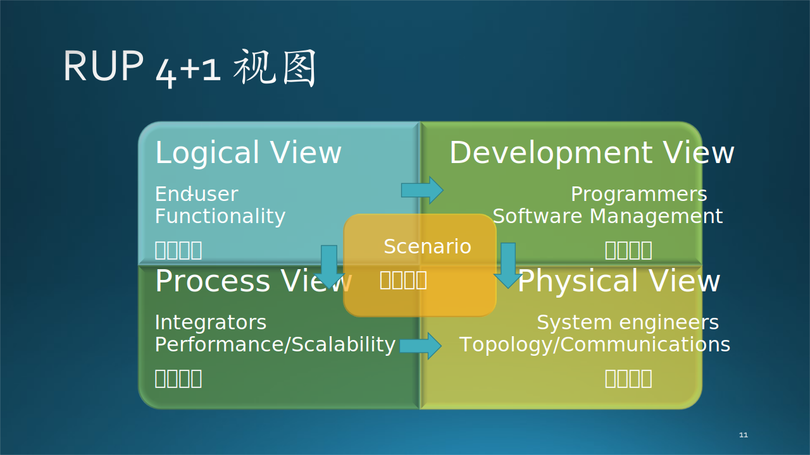
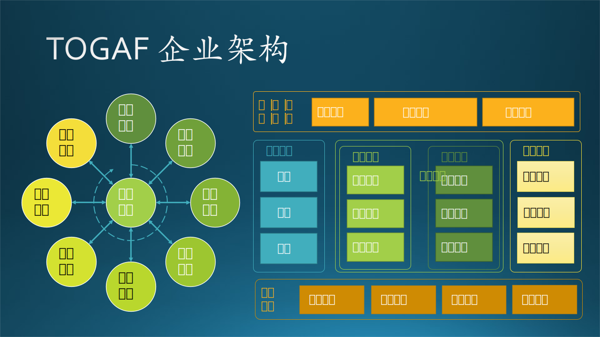

## 13.3 设计的概念

## 13.3.2 架构设计方法

目前软件领域有几种主流的架构设计方法，见图 13.3.2。

图 13.3.2 主流的架构设计方法

#### 1. RUP 4+1

RUP，Rational Unified Process，即统一开发过程。

图 13.3.3 RUP 4+1 视图

0. 场景视图（Scenario View）

   通过数量一些重要场景（更常见的是用例）进行无缝协同工作，我们为场景描述相应的脚本（对象之间和过程之间的交互序列）。

1. 逻辑视图（Logical View）

   主要支持功能性需求，即系统应该为用户提供哪些服务。

2. 过程视图（Process View）

   一些非功能性的需求，如性能和可用性。它解决并发性、分布性、系统完整性、容错性的问题，以及逻辑视图如何与过程结构配合在一起，在哪个控制线程上，对象的操作被实际执行。

3. 开发视图（Development View）

   关注软件开发环境下实际模块的组织。软件打包成小的程序块（程序库或子系统），它们可以由一位或几位开发人员来开发。子系统可以组织成分层结构，每个层为上一层提供良好定义的接口。

4. 物理视图（Physical View）

   主要描述硬件配置。在UML中通常被称为部署视图，它主要考虑如何把软件映射到硬件上。通常需要考虑到解决系统拓扑结构、系统安装和通信等问题。

#### 2. UML

UML，即Unified Model Language，统一建模语言。

图 13.3.4 UML 分析模型

1. 用户模型（Use Case View）

   强调从用户的角度看到的或需要的系统功能，是被称为参与者的外部用户所能观察到的系统功能的模型图。
   - 在**概要设计**中用**业务场景架构图**来表示。
   - 在**详细设计**中用**用例图**描述。

2. 结构模型（Logic View）

   展现系统的静态或结构组成及特征，也称为结构模型视图（Structural Model View）或静态视图（Static View）。
   - 在详细设计中用**类图和对象**描述。

3. 行为模型（Concurrent View）

   体现了系统的动态或行为特征，也称为行为模型视图（Behavioral Model View）或动态视图（Dynamic View）。
   - 在详细设计中用**状态图、时序图、协作图、活动图**描述。

4. 实现模型（Component View）

   体现了系统实现的结构和行为特征，也称为实现模型视图（Implementation Model View）。
   - 在详细设计中用**组件图、包图**描述。

5. 环境模型（Deployment View）

   体现了系统实现环境的结构和行为特征，也称为环境模型视图（Environment Model View）或物理视图（Physical View）。
   - 在详细设计中用**配置图**描述。

#### 3. TOGAF

TOGAF，即 The Open Group Architecture Framework，开放组织架构框架，是由 The Open Group 这个开放组织指定的企业发展架构的方法和工具（即框架）。

1. 业务架构（Business Architecture）

   业务战略、管理、组织和关键业务流程，也叫做俯视架构。

2. 应用架构（Application Architecture）

   也叫做剖面架构、逻辑架构。

3. 数据架构（Data Architecture）

   各类逻辑和物理数据资产以及数据管理资源的结构。

4. 技术架构（Technology Architecture）

   支持上述架构的必要软硬件，包括基础设施、中间件、网络、部署。

如图 13.3.5 左侧所示。

图 13.3.5 TOGAF架构模型和其它流派

#### 4. 其它流派

如图 13.3.5 右侧所示。

1. 逻辑架构

   逻辑架构关注的是功能，包含用户直接可见的功能，还有系统中隐含的功能。或者更加通俗来描述，逻辑架构更偏向我们日常所理解的“分层”，把一个项目分为“表示层、业务逻辑层、数据访问层”这样经典的“三层架构”。

2. 运行架构

   顾名思义，更关注的是应用程序运行中可能出现的一些问题。例如并发带来的问题，比较常见的“线程同步”问题、死锁问题、对象创建和销毁（生命周期管理）问题等等。开发架构，更关注的是飞机起飞之前的一些准备工作，在静止状态下就能规划好做好的，而运行架构，更多考虑的是飞机起飞之后可能发生的一些问题。

3. 开发架构

   开发架构则更关注程序包，不仅仅是我们自己写的程序，还包括应用程序依赖的SDK、第三方类库、中间件等。尤其是像目前主流的Java、.NET等依靠虚拟机的语言和平台，以及主流的基于数据库的应用，都会比较关注。和逻辑架构有紧密的关联。

4. 物理架构

   物理架构，更关注的系统、网络、服务器等基础设施。例如：如何通过服务器部署和配置网络环境，来实现应用程序的“可伸缩性、高可用性”。或者举一个实际的例子，如何通过设计基础设施的架构，来保障网站能支持同时 10 万人在线、7*24 小时提供服务，当超过 10 万人或者低于 10 万人在线时，可以很方便的调整部署架构来支撑。

5. 数据架构

   数据架构，更关注的是数据持久化和存储层面的问题，也可能会包括数据的分布、复制、同步等问题。更贴切来讲，如何选择需要的关系型数据库、流行的 NoSql，如何保障数据存储层面的性能、高可用性、灾备等等。很多时候，和物理架构是有紧密联系的，但它更关注数据存储层面的，物理架构更关注整个基础设施部署层面。

### 架构设计方法

表 四种架构体系的统一

||RUP 4+1|UML|TOGAF|Other|$\rightarrow$|统一名称|
|-|-|-|-|-|-|-|
|1|场景视图|用户模型|业务架构|逻辑架构|$\rightarrow$|业务场景架构|
|2|逻辑视图|结构模型|应用架构|逻辑架构|$\rightarrow$|逻辑功能架构|
|3|过程视图|行为模型|应用架构|运行架构|$\rightarrow$|应用运行架构|
|4|开发视图|实现模型|技术架构|开发架构|$\rightarrow$|软件开发架构|
|5|物理视图|环境模型|技术架构|物理架构|$\rightarrow$|物理部署架构|
|6|N/A|N/A|数据架构|数据架构|$\rightarrow$|数据存储架构|

$$
技术架构 = 逻辑功能 + 应用运行 + 数据存储 + 软件开发 + 物理部署
$$

每种设计在不同的阶段有不同的含义

|阶段|架构设计|概要设计|详细设计|
|-|-|-|-|
|业务场景|用户|业务场景架构图|用例图|
|逻辑功能|概要设计人员|逻辑功能架构图|类图、对象图|
|行为过程|概要设计人员|行为过程架构图|状态图、时序图、协作图、活动图|
|开发|开发人员|开发架构图|组件图、包图|
|部署|部署工程师|部署架构图|配置图|
|数据存储|开发人员|数据存储架构图|

最开始只有逻辑架构和物理架构

逻辑架构 = 模块划分 + 接口定义 + 领域模型

运行架构 = 技术选型 + 控制流划分 + 同步关系

开发架构 = 技术选型 + 文件划分 + 编译关系

物理架构 = 硬件分布 + 软件部署 + 方案优化

数据架构 = 技术选型 + 存储格式 + 数据分布

大型系统

架构设计
子系统设计

中型系统

系统设计

https://zhuanlan.zhihu.com/p/422882715

什么时机开始架构设计是十分重要的，业界也对这方面始终争论不休，有的主导预先设计，有的反对，有的人相对喜欢先做架构设计，有的人则懒得做，想到哪写到哪。
日常工作相对繁琐，面对的问题及系统现状也是千差万别，通常来说是在面对复杂问题和重要功能时需要进行架构设计，何为“复杂、重要”？
个人认为可以先从内容上做一些区分，比如下面是常见的需要架构设计的内容：
1、是否为全新的领域：如果是首次构建，架构的重要性是十分强的，而对于现有的系统增加个接口，架构考虑就会小很多了。
2、解空间小，或者压根没有一下子能想到的解决方案。
3、问题本身对于系统的要求特别高，相对难以实现，比如：可用性9个9，千万qps，未来变化频率十分高需要高扩展、灵活可配。
4、面临多方合作、协作时，需要一个从全局出发的指导。
5、需要精确衡量ROI的场景。
6、所开发的功能可能会引发相对较大的问题时。

然后再从时机的角度辅助判断：
1、在某项功能被重视起来，或者小步试错成功后准备大资源投入时。
2、系统的质量属性已经烂到了一定的地步，比如已经无法扩展、线上问题频发、研发质量下降、可用性已经无法良好提升等，忍无可忍时。
3、整体定位发生变化时

### 13.3.6 抽象

https://blog.csdn.net/hguisu/article/details/78258430

Capstera Business Architecture Framework

### 13.3.7 设计原则

1. 业务平台化
2. 核心业务分离
3. 隔离不同类型
4. 区分主流程、辅助流程

5. 不考虑具体实现
6. 关注用户能看到什么
