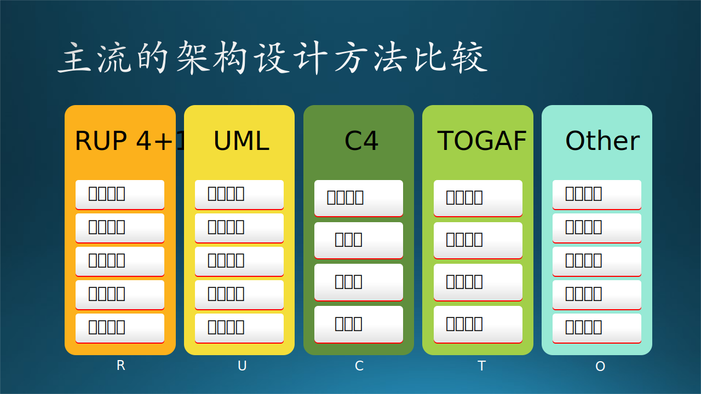

## 13.4 架构设计最佳实践

### 13.4.1 各种设计方法的比较

总结一下上个小节中的内容，目前软件工程领域有几种主流的架构设计方法，见图 13.4.1。为了下文中描述方便，我们分别用这几种方法的首字母作为该方法的缩写：R，U，C，T，O。

图 13.4.1 主流的架构设计方法比较

只从方法名称上看，可以引发一些联想，比如：

- 场景、用户、业务、上下文，这些词都代表了用户业务需求；
- 逻辑、结构、功能，这些是描述静态结构和逻辑功能的词汇；
- 过程、行为、运行，这些是描述动态行为和行为模式的词汇；
- 开发、实现、代码，这些是描述编写代码和技术实现的词汇；
- 物理、环境、技术，这些是描述网络节点和硬件环境的词汇。

所以，接下来我们通过横向对比这几种主流方法，来发掘它们的共同点，以便得到一个统一的方法论。这种方法就好比 12.3.4 小节中描述的主从模式的工作方式：既然大家的意见有细微差别，那么就由“从节点”给出各自的答案，由“主节点”总结出来一个更准确的最终答案。

见表 13.4.1。注意该表中各方法的顺序与图 13.4.1 有所不同，主要是为了横向比较，不会影响架构设计工作的进行。比如：

- 图 13.4.1 中的 RUP 4+1，本来场景视图在最下方，原文的含义是用场景视图做架构设计验证，检测是否可以把前四步的设计结果串联成一个完整的业务场景；如果在表 13.4.1 中放在最上方，意味着需要先定义一个业务场景，这种软件工程中属于需求分析，是合理的。

- 图 13.4.1 中的 TOGAF 的数据架构本来在第二位，但其实在原文中它和第三位的应用架构是并列的，二者相辅相成，没有前后关系，所以在表 13.4.1 中把二者对调了一下位置。

- 图 13.4.1 中的 Other 的开发架构放在第二位，由于找不到出处，不知道这个顺序的理由是什么。从笔者的观点看，运行架构是设计的一部分，必须先有运行架构，才会决定开发架构，所以二者应该对调。另外，数据架构为什么放在最后一位？没有数据架构的话，开发架构是有缺失项的。

表 13.4.1 架构设计方法的统一

|顺序|统一名称|RUP 4+1|UML|C4|TOGAF|Other|
|-|-|-|-|-|-|-|-|
|1|**业务场景架构**|场景视图|用户模型|上下文图|业务架构|N/A|
|2|**逻辑功能架构**|逻辑视图|结构模型|容器图|应用架构|逻辑架构|
|3|**运行过程架构**|过程视图|行为模型|组件图|应用架构|运行架构|
|4|**数据存储架构**|N/A|N/A|N/A|数据架构|数据架构|
|5|**软件开发架构**|开发视图|实现模型|代码图|技术架构|开发架构|
|6|**物理部署架构**|物理视图|环境模型|N/A|技术架构|物理架构|

从表 13.4.1 中可看到：

- 最左侧的序号表明了架构任务的顺序，按照这个顺序进行是最合理的。
- 第二列中使用 6 个汉字的统一名称，这样命名更加准确，以避免一些模糊的含义产生错误的理解。比如，4 个字的“运行架构”用 6 个字的“运行过程架构”来表示。
- TOGAF 的“应用架构”和“技术架构”都出现了两次，正如 13.3.4 节中所说，因为这个方法不是标准的软件工程方法，所以它的定义比较模糊。目前在业界有很多人使用这个方法，在网上查资料看到的画出来的图关注点混乱不堪，误导读者，慎用。
- “数据架构”被上移到了第四位，符合设计工作的正常顺序。

### 13.4.2 业务场景架构

前四种方法中都有反映业务需求的非技术架构，如 R-场景视图、U-用户模型、C-上下文图、T-业务架构。在软件工程中，如果从需求出发的话，第一张图应该是给用户看的，不妨叫做**业务场景架构**。该图中没有逻辑，只有一些大的功能区，用来区分系统/子系统的边界。这张图在 13.2 节中已经绘制好了，我们不妨拷贝过来到图 13.4.2 以方便阅读。

图 13.4.2 业务场景架构图

【最佳实践】

软件系统建设是为业务服务的，所有的系统建设都是为了解决业务问题。因此，首先做的是进行战略分析和业务场景架构设计，战略分析不在软件工程的范畴之内，所以我们只关心业务场景架构。

关注点在于：

- 这张图的目的是把用户的需求做分类，把一个复杂的系统分解成若干个子系统。那么要不要分解到模块级别呢？如果系统复杂，就不需要，而是把模块分解留到下一个阶段（子系统的概要设计）去做。

- 关注点在业务上，不要包含任何技术词汇或概念，否则无法和用户沟通。

- 这个级别的设计是给用户的上层领导看的，所以不用涉及很多业务细节，比如只需要知道有课程管理，而无需描述课程管理内部的具体细节。

- 通过讨论后，用户可能会提出新的需求，看看是不是能合并到已有的子系统中，如果不能，需要增加子系统。

### 13.4.3 逻辑功能架构

业务需求分析结束后，应该进入技术阶段了，根据需求分析的用户需求和功能需求建立软件系统的静态模型。如 R-逻辑视图、U-结构模型、C-容器、T-应用架构、O-逻辑架构。这张图是给开发团队的所有人（但主要是管理者）看的，可以掌控全局，所以应该是分层、分模块的软件功能静态模型，可以叫做**逻辑功能架构**。见图 13.4.3。

图 13.4.3 逻辑功能架构图

【最佳实践】

如果把业务场景架构看作是俯视图，那么逻辑架构就是一个横向的切片，类似医学上 CT。比如，在图 13.4.3 中，在表示层、应用层、数据访问层，都会出现“生活（服务）”，这是一种技术上的划分，三个层次的模块串联在一起共同实现“生活服务”子系统。

与图 13.4.2 比较，本图的关注点在于：

- 软件功能子系统/模块的划分。那么“生活服务”中的“食堂管理”、“宿舍管理”要不要列出来呢？在这个阶段中不需要列出来，而是在做生活服务子系统的概要设计时再考虑。

- 公共业务下沉（比如单点登录），因为这是所有子系统必须都调用的业务。

- 在 7.4 节中我们讲过三种层次的需求：业务需求，用户需求，功能需求。在本图中要发掘出功能需求，如“管理员子系统”，这是用户自己想不到的，只能由系统设计人员提出。

- 大的架构单元之间的相互关系要绘制出来，而不必关心具体的调用关系或者接口协议，只是表达“A 和 B 有联系”即可。

### 13.4.4 运行过程架构

既然有了静态模型，还应该有动态模型来描述系统内部的交互行为已经状态变化，如 R-过程视图、U-行为模型、C-组件图、T-应用架构、O-运行架构。通过这个模型，可以知道软件系统在运行过程中的内部具体流程，用于分析性能质量问题，可以叫做**应用运行架构**。见图 13.4.4。

图 13.4.4 应用运行架构图

【最佳实践】

图 13.4.4 中绘制了一些关键的软件系统元素，包括进程、模块（逻辑）、数据节点（库、表）、服务等等，展示了完整的运行过程。比如：

1. 用户浏览器发送 Http 请求；
2. Web 服务器上的监听进程（建议用框架实现，但也可以自己实现）接收请求，启动（或激活）工作进程，调用表示层的逻辑代码；
3. 调用应用网关接口，在预先注册好的服务注册表中发现对应的服务；
4. 如果该用户没有登陆，就先进入单点登录逻辑；
5. 然后启动应用层中的微服务，通过三个微服务的串联完成用户请求；
6. 在微服务运行时，需要读写对应的数据库；
7. 最后由微服务 3 把结果返回给表示层；
8. 生成响应页面后通过 Http 响应发给用户；
9. 在上面这个过程中，后台服务一直在工作。

关注的是应用程序运行中可能出现的一些问题。例如并发带来的问题，比较常见的“线程同步”问题、死锁问题、对象创建和销毁（生命周期管理）问题等等。但是在一张图中是不可能画出这么复杂的机制的，所以要写在文档中。

假设是一个汽车模型，那么逻辑功能架构中已经把该汽车的所有可以看到的零配件都配齐了，比如轿厢、车门、车窗、座椅、方向盘、尾灯，甚至 logo，都制作得惟妙惟肖。但是，这个模型只能放在那里供观赏，车无法跑起来，虽然它也有 4 个车轮甚至备胎。

所以，应用运行架构的关注点在于：

- 确定哪些进程、服务是需要“常活”的，即一直在运行程序模块。如果大量使用线程工作的话，还需要描述线程机制，比如线程池。

- 它们都位于哪个组织中，比如是 Web 服务器群中，还是应用层中，或者是后台服务层中。

- 调用关系如何，比如：读、写、执行、注册、发现、调用、返回等行为。

- 调用的类型是什么，比如是一个模块间的功能调用，还是 HTTP 请求，还是 RESTful API 调用，或者是一个通过代理的远过程调用，等等。

- 消息队列、缓存等组件（中间件）也需要绘制出来。

### 13.4.5 数据存储架构

这一部分不是必须的，如果是面向企业的数据密集型的软件系统才会用到，叫做**数据存储架构**，而一般的计算密集型软件中，在逻辑功能架构和运行过程架构中中可以顺带给出。因为静态架构中可以有数据库的存在，在动态架构中，也离不开数据的读写过程，所以在图 13.4.3 和 图 13.4.4 中可以看到数据库的影子，只不过比较简单（当然也可以画得复杂）。如 T-数据架构、O-数据架构。见图 13.4.5。

图 13.4.5 数据存储架构图

【最佳实践】

数据架构，更关注的是数据持久化和存储层面的问题，也可能会包括数据的分布、复制、同步等问题。更贴切来讲，如何选择需要的关系型数据库、流行的 NoSQL，如何保障数据存储层面的性能、高可用性、灾备等等。很多时候，和物理架构是有紧密联系的，但它更关注数据存储层面的，物理部署架构更关注整个基础设施部署层面。

图 13.4.5 比较简约，越是高层次的设计，越是要避免陷入细节。

数据存储架构的主要关注点是：

- 系统需要什么样的数据？这需要通过需求分析得到，画数据流图可以帮助完成这一目标。但是在架构阶段，不需要绘制具体业务流程的数据流图，只需要把握大的脉络即可，比如图 13.4.5 中的“业务数据库”，并没有指定是哪个业务，而是通用的称呼。

- 如何存储这些数据？其中存储的数据可以是文件、关系数据库、实时数据库；存储格式包括文件格式、数据库图表；数据分布及同步，以及数据管理。比如读写操作的性能、存储容量限制、有无并非读写、事务回滚操作等等。通常要求读的时候比较快，而写的时候比较稳。

- 确定数据的类型/来源分类，以及数据模型的设计，即代码和内存中的数据结构，如图 13.4.5 中的“业务实体模型”；以及它们之间的联系，比如数据流的方向，要求与数据存储有关的周边模块要同时绘制出来。

### 13.4.6 软件开发架构

按照软件工程，有了静态和动态设计后，在数据密集型应用中再有了数据存储设计，就可以进行软件开发了，所以需要有**软件开发架构**来指导、统一开发者的行为。如 R-开发视图、U-实现模型、C-代码图、T-技术架构、O-开发架构，都是用于描述源代码组织方式、使用的框架组件、依赖关系等等。见图 13.4.6。

图 13.4.6 软件开发架构图

【最佳实践】

软件开发架构关注程序包，不仅仅是我们自己写的程序，还包括应用程序依赖的SDK、第三方类库、中间件等。尤其是像目前主流的Java、.NET等依靠虚拟机的语言和平台，以及主流的基于数据库的应用，都会比较关注。和逻辑功能架构有紧密的关联。

在图 13.4.6 中，根据逻辑功能架构的三层设计，把代码组织成了三个大的部分：

- UI Layer 表示层，这一部分（假设）用 C# 来实现，基于 ASP.NET 中的技术框架，如 MVC、WebAPI、SPA、WebHooks、Mobile Apps等等，而代码结构中包含 Models、Views、Controllers 等逻辑代码。

- Service 服务层，这一部分（假设）用 Java 实现，基于 Spring Cloud 中的技术框架，比如 Eureka、Ribbon、Feign等等，而目录中包含 filter、mapper 等逻辑代码。

- Storage DAO 存储访问层，这一部分（假设）用 C++ 实现，基于 4 种异构的存储技术，如 Redis、SQL Server、Active MQ、Azure Blob Storage等，目录中包含根据具体的存储技术的读写逻辑代码。

主要关注点：

- 确定程序单元以及程序单元的组织结构。其中程序单元包括：源文件、配置文件、程序库、框架、目标单元；程序单元组织包括 project 划分、project目录结构、编译依赖关系。

- 制定开发政策和标准，如代码库权限管理、编码规范、测试策略、集成方式、部署流程等。其中 CI/CD 持续开发/持续集成的 pipeline 必不可少，以满足开发期质量需求，包括：代码可读性、可维护性、可复用性、可测试性、可扩展性、可移植性等。

### 13.4.7 物理部署架构

开发完毕后才能进行产品部署，虽然是最后的动作，但是需要在前几步就有统一考虑，而不是等软件开发完毕后再想。这一部分叫做**物理部署架构**，主要是设计师根据系统非功能质量的要求做出的设计。如 R-物理视图、U-环境模型、T-技术架构、O-物理架构。见图 13.4.7。

图 13.4.7 物理部署架构图

【最佳实践】

物理部署架构，更关注的系统、网络、服务器等基础设施。例如：如何通过服务器部署和配置网络环境，来实现应用程序的“可伸缩性、高可用性”。或者举一个实际的例子，如何通过设计基础设施的架构，来保障网站能支持同时10W人在线、7*24小时提供服务，当超过10W人或者低于10W人在线时，可以很方便的调整部署架构来支撑。

关注点：

- 确定物理节点和物理节点的拓扑结构，包括节点和群集的可靠性、可扩展性、可用性、安全性等。

- 技术选型。在哪个节点上选择哪种设备，计算机的 CPU 主频和数量、内存大小、硬盘大小、网卡的数量和速度等等、交换机的数量和端口数。

- 软件安装的步骤以及验证方法。在服务器、PC机、专用机上安装部署软件，根据开发人员的配置文档进行软件内的网络地址和端口的配置的规划。

### 13.4.8 设计难度进化

【最佳实践之一：**六视图法**】

现在读者再回过头来看表 13.4.1，就可以理解这些名词的含义了。我们把它们再次总结成表 13.4.2。

表 13.4.2 架构设计方法名称与关注点

|顺序|设计步骤名称|关注点|
|-|-|-|
|1|**业务场景架构**|业务齐全，子系统划分合理，用户可以看懂|
|2|**逻辑功能架构**|功能覆盖业务，层级划分合理，|
|3|**运行过程架构**|运行过程合理，接口清晰，运行期质量可控|
|4|**数据存储架构**|业务数据齐全，存储方式可靠，读写性能高|
|5|**软件开发架构**|代码结构清晰|
|6|**物理部署架构**|系统、网络、节点的功能和性能|

按照软件工程的工作流程顺序，可以顺理成章地得到表 13.4.2 中的六个架构设计步骤，我们可以称之为**六视图法**。但是，一般的情况下，开发人员无缘遇到这么复杂的系统，所以我们可以按照下面的简化步骤来做设计。

【最佳实践之二：**两视图法**】

有些比较小的系统很难把上述架构图都画出来，可以只有：

$$
架构设计 = 业务架构 + 技术架构
$$

其中，业务架构即业务场景架构，定义不变，技术架构的定义如下：

$$
技术架构 = 逻辑功能 + 运行过程 + 数据存储 + 软件开发 + 物理部署
$$

说白了就是把表 13.4.2 中的 2,3,4,5,6 混在一起画。在第十二章中讲技术架构演化的故事时，基本上就是采用了这种办法。

【最佳实践之三：**三视图法**】

如果对物理部署架构的要求较高，也可以把它从技术实现架构中拆出来，最后形成三张图：

$$
架构设计 = 业务架构 + 软件架构 + 硬件架构
$$

其中，业务架构就是业务场景架构，硬件架构就是物理部署架构，软件架构的定义如下：

$$
软件架构 = 逻辑功能 + 运行过程 + 数据存储 + 软件开发 
$$

第十二章中的架构模式如何使用？
