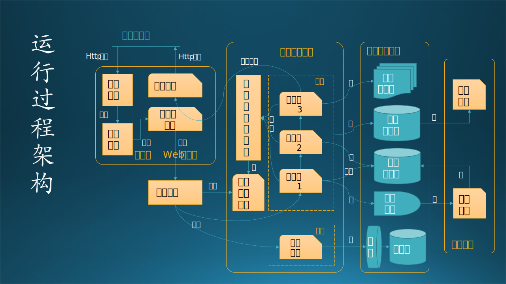
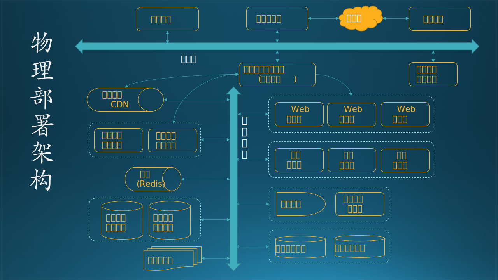
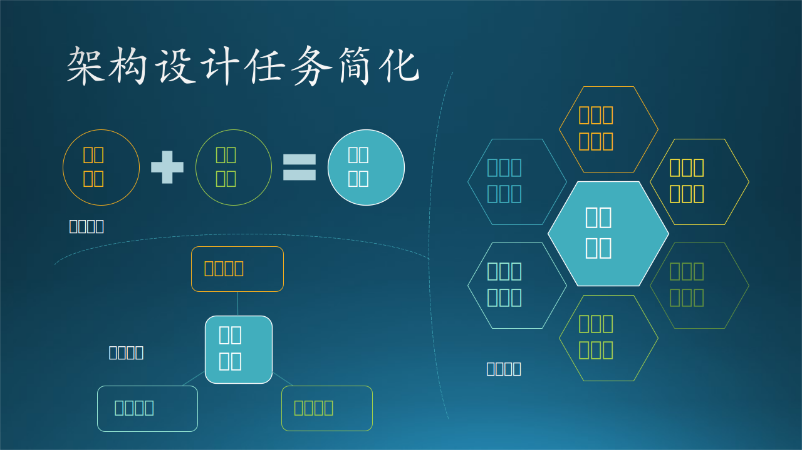

## 13.4 架构设计最佳实践

### 13.4.1 统一方法

总结一下上个小节中的内容，目前软件工程领域有几种主流的架构设计方法，见图 13.4.1。为了下文中描述方便，我们分别用这几种方法的首字母作为该方法的缩写：R，U，C，T，O。

图 13.4.1 主流的架构设计方法

只从方法名称上看，可以引发一些联想，比如：

- 场景、用户、业务、上下文，这些词好像都代表了用户需求；
- 逻辑、结构，这些是描述静态功能那个结构的词汇；
- 过程、行为、运行，这些是描述动态行为的词汇；
- 开发、实现、代码，这些是描述编写软件代码的词汇；
- 物理、环境、技术，这些是描述网络节点硬件的词汇。

所以，接下来我们通过横向对比这几种主流方法，来发掘它们的共同点，以便得到一个统一的方法论。这种方法就好比 12.3.4 小节中描述的主从模式的工作方式：既然大家的意见有细微差别，那么就由“从节点”给出各自的答案，由“主节点”总结出来一个更准确的最终答案。

#### 1. 业务场景架构

前四种方法中都有反映业务需求的非技术架构，如 R-场景视图、U-用户模型、C-上下文图、T-业务架构。在软件工程中，如果从需求出发的话，第一张图应该是给用户看的，不妨叫做**业务场景架构**。该图中没有逻辑，只有一些大的功能区，用来区分系统/子系统的边界。这张图在 13.2 节中已经绘制好了，我们不妨拷贝过来到图 13.4.2 以方便阅读。

图 13.4.2 业务场景架构图

#### 2. 逻辑功能架构

业务需求分析结束后，应该进入技术阶段了，根据需求分析的用户需求和功能需求建立软件系统的静态模型。如 R-逻辑视图、U-结构模型、C-容器、T-应用架构、O-逻辑架构。这张图是给开发团队的所有人（但主要是管理者）看的，可以掌控全局，所以应该是分层、分模块的软件功能静态模型，可以叫做**逻辑功能架构**。见图 13.4.3。

图 13.4.3 逻辑功能架构图

#### 3. 应用运行架构

既然有了静态模型，还应该有动态模型来描述系统内部的交互行为已经状态变化，如 R-过程视图、U-行为模型、C-组件图、T-应用架构、O-运行架构。通过这个模型，可以知道软件系统在运行过程中的内部具体流程，用于分析性能质量问题，可以叫做**应用运行架构**。见图 13.4.4。

图 13.4.4 应用运行架构图

#### 4. 软件开发架构

按照软件工程，有了静态和动态设计后，就可以进行软件开发了，所以我们需要有**软件开发架构**来指导、统一开发者的行为。如 R-开发视图、U-实现模型、C-代码图、T-技术架构、O-开发架构，都是用于描述源代码组织方式、使用的框架组件、依赖关系等等。见图 13.4.5。

图 13.4.5 软件开发架构图

#### 5. 物理部署架构

开发完毕后才能进行产品部署，虽然是最后的动作，但是需要在第 2,3,4 步就有统一考虑，而不是等软件开发完毕后再想。这一部分叫做**物理部署架构**，主要是设计师根据系统非功能质量的要求做出的设计。如 R-物理视图、U-环境模型、T-技术架构、O-物理架构。见图 13.4.6。

图 13.4.6 物理部署架构图

#### 6. 数据存储架构

最后这一部分不是必须的，如果是面向企业的数据密集型的软件系统才会用到，叫做**数据存储架构**，而一般的计算密集型软件中，在第 2,3 步中可以顺带给出，因为静态架构中可以有数据库的存在，在动态架构中，也离不开数据的读写过程。如 T-数据架构、O-数据架构。见图 13.4.7。

图 13.4.7 数据存储架构图

### 13.4.2 

把上述步骤总结为表 13.4.1，形成**六视图法**。注意该表中各方法的顺序与图 13.4.1 有所不同，主要是为了横向比较，不会影响架构设计工作的进行。

表 13.4.1 架构设计方法的统一

|顺序|统一名称|RUP 4+1|UML|C4|TOGAF|Other|
|-|-|-|-|-|-|-|-|
|1|**业务场景架构**|场景视图|用户模型|上下文图|业务架构|N/A|
|2|**逻辑功能架构**|逻辑视图|结构模型|容器图|应用架构|逻辑架构|
|3|**应用运行架构**|过程视图|行为模型|组件图|应用架构|运行架构|
|4|**软件开发架构**|开发视图|实现模型|代码图|技术架构|开发架构|
|5|**物理部署架构**|物理视图|环境模型|N/A|技术架构|物理架构|
|6|**数据存储架构**|N/A|N/A|N/A|数据架构|数据架构|

从表 13.4.1 中可看到：

- 最左侧的序号表明了架构任务的顺序，按照这个顺序进行是最合理的。
- 第二列中使用 6 个字的统一名称，这样命名更加准确，以避免一些模糊的含义产生错误的理解。
- TOGAF 的应用架构和技术架构都出现了两次，正如 13.3.4 节中所说，因为这个方法不是标准的软件工程方法，所以它的定义比较模糊。目前在业界有很多人使用这个方法，在网上查资料看到的画出来的图关注点混乱不堪，误导读者，慎用。
- C4 模型是一种轻量级的设计方法，其实就是像看电子地图一样一步步放大，直到能看到代码细节。适合于小型系统做概要设计。

### 13.4.2 简易方法

【最佳实践：**两视图法**】

有些比较小的系统很难把上述架构图都画出来，可以只有“**业务架构 + 技术架构**”，其中，业务架构就是业务场景架构，技术架构的定义如下：

$$
技术架构 = 逻辑功能 + 应用运行 + 数据存储 + 软件开发 + 物理部署
$$

说白了就是把 2,3,4,5,6 混在一起画。在第十二章中讲技术架构演化的故事时，基本上就是采用了这种办法。

【最佳实践：**三视图法**】

如果对物理部署架构的要求较高，也可以把它从技术架构中拆出来，最后形成三张图：“**业务架构 + 软件架构 + 硬件架构**”。其中，业务架构就是业务场景架构，硬件架构就是物理部署架构，软件架构的定义如下：

$$
软件架构 = 逻辑功能 + 应用运行 + 数据存储 + 软件开发 
$$

