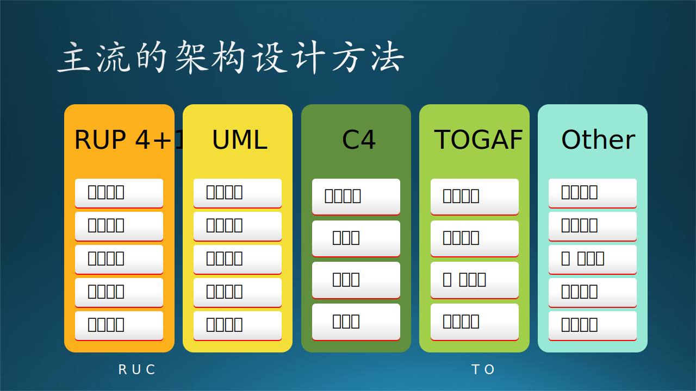
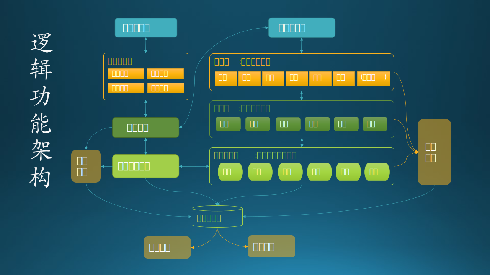
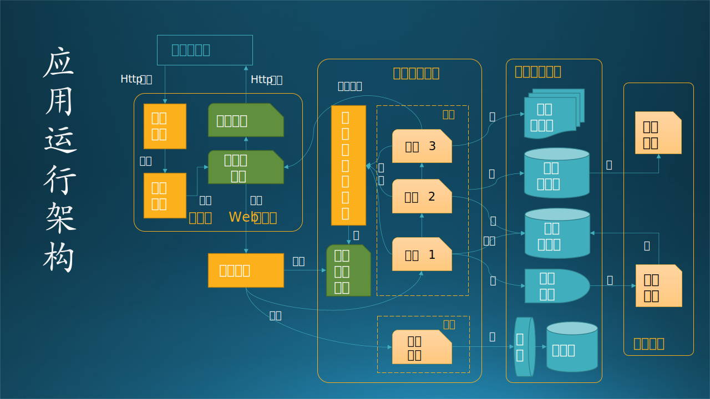
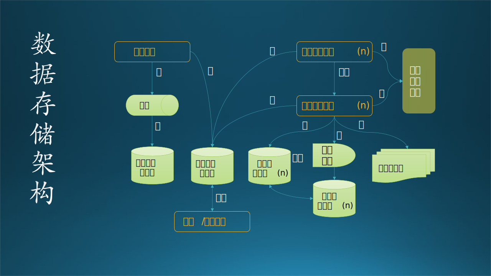
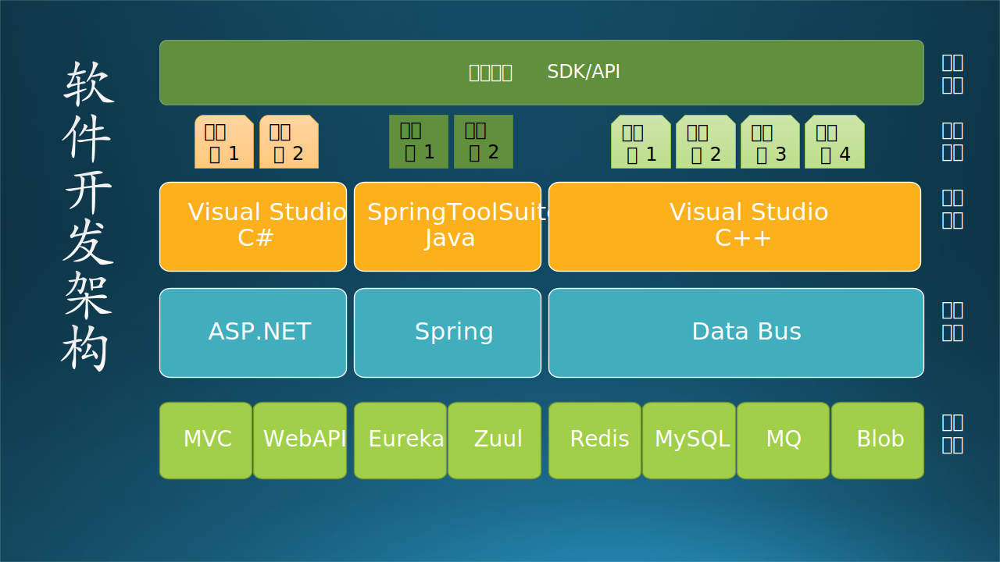
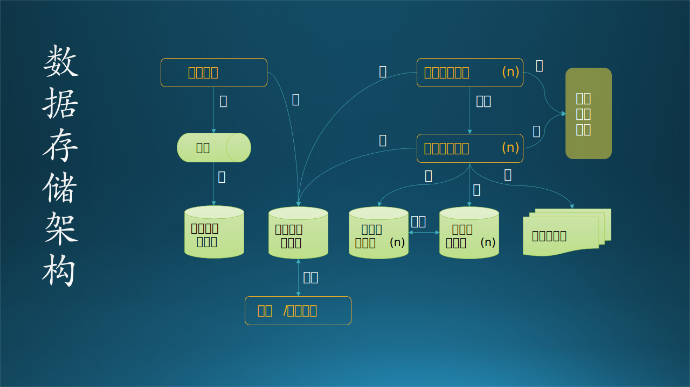

## 13.4 架构设计的任务与关注点

### 13.4.1 各种设计方法的比较

总结一下上个小节中的内容，目前软件工程领域有几种主流的架构设计方法，见图 13-14。为了下文中描述方便，我们分别用这几种方法的首字母作为该方法的缩写：R，U，C，T，O。

图 13-14 主流的架构设计方法比较

从各方法的步骤名称上看，可以引发一些联想，比如：

- 场景、用户、业务、上下文，这些词都代表了用户业务需求；
- 逻辑、结构、功能，这些是描述静态结构和逻辑功能的词汇；
- 过程、行为、运行，这些是描述动态变化和行为模式的词汇；
- 开发、实现、代码，这些是描述编写代码和技术实现的词汇；
- 物理、环境、技术，这些是描述网络节点和硬件环境的词汇。

所以，接下来我们通过横向对比这几种主流方法，来发掘它们的共同点，以便得到一个统一的方法论。这种方法就好比 12.3.4 小节中描述的主从模式的工作方式：既然大家的意见有细微差别，那么就由“从节点”给出各自的答案，由“主节点”（笔者和各位读者）总结出来一个更准确的最终答案。

见表 13.4.1。注意该表中各方法的顺序与图 13-14 有所不同，主要是为了横向比较，不会影响架构设计工作的进行。比如：

- 图 13-14 中的 RUP 4+1，本来场景视图在最下方，原文的含义是用场景视图做架构设计验证，检测是否可以把前四步的设计结果串联成一个完整的业务场景；如果在表 13.4.1 中放在最上方，意味着需要先定义一个业务场景，这种软件工程中属于需求分析，是合理的。

- 图 13-14 中的 TOGAF 的数据架构本来在第二位，但其实在原文中它和第三位的应用架构是并列的，二者相辅相成，没有前后关系，所以在表 13.4.1 中把二者对调了一下位置。

- 图 13-14 中的 Other 的开发架构放在第二位，由于找不到出处，不知道这个顺序的理由是什么。从笔者的观点看，运行架构是设计的一部分，必须先有运行架构，才会决定开发架构，所以二者应该对调。另外，数据架构为什么放在最后一位？没有数据架构的话，开发架构是有缺失项的。

表 13-6 架构设计方法的统一

| 顺序 | 统一名称         | (R)RUP 4+1 | (U)UML   | (C)C4    | (T)TOGAF | (O)Other |
| ---- | ---------------- | ---------- | -------- | -------- | -------- | -------- |
| 1    | **业务场景架构** | 场景视图   | 用户模型 | 上下文图 | 业务架构 | N/A      |
| 2    | **逻辑功能架构** | 逻辑视图   | 结构模型 | 容器图   | 应用架构 | 逻辑架构 |
| 3    | **运行过程架构** | 过程视图   | 行为模型 | 组件图   | 应用架构 | 运行架构 |
| 4    | **数据存储架构** | N/A        | N/A      | N/A      | 数据架构 | 数据架构 |
| 5    | **软件开发架构** | 开发视图   | 实现模型 | 代码图   | 技术架构 | 开发架构 |
| 6    | **物理部署架构** | 物理视图   | 环境模型 | N/A      | 技术架构 | 物理架构 |

从表 13.4.1 中可看到：

- 最左侧的序号表明了架构任务的顺序，按照这个顺序进行是最合理的。
- 第二列中使用 6 个汉字的统一名称，这样命名更加准确，以避免一些模糊的含义产生错误的理解。比如，4 个字的“运行架构”用 6 个字的“运行过程架构”来表示。
- TOGAF 的“应用架构”和“技术架构”都出现了两次，正如 13.3.4 节中所说，因为这个方法不是标准的软件工程方法，所以它的定义比较模糊。目前在业界有很多人使用这个方法（因为与其它方法比较，这种方法设计量小，关注点模糊，可以随意解释），在网上查资料看到的画出来的图关注点混乱不堪，误导读者，慎用。
- “数据架构”被上移到了第四位，符合设计工作的正常顺序。

### 13.4.2 业务场景架构

#### 1. 关键词理解

**场景、用户、业务、上下文**，这些词都代表了用户业务需求。

前四种方法中都有反映业务需求的非技术架构，如 (R)场景视图、(U)用户模型、(C)上下文图、(T)业务架构。在软件工程中，如果从需求出发的话，第一张图应该是给用户看的，不妨叫做**业务场景架构**。该图中没有逻辑，只有一些大的功能区，用来区分系统/子系统的边界。这张图在 13.2 节中已经绘制好了，我们不妨拷贝过来到图 13-15 以方便阅读。

图 13-15 业务场景架构图

【以汽车为例】

业务场景架构，就好比一个车企的产品发布会，需要把一系列的产品展现给观众，包括家庭轿车、家庭 SUV、商用轿车、商用 MPV、新能源汽车、高级跑车等等，琳琅满目，每款汽车都有自己的**客户（功能）定位**，很少与其它类型的车有交集。该车企只专注于乘用汽车，对于运输车辆不会涉足，这就是**系统划分**。为了增加可信度，车企还有可能告知观众自己的上游原材料、零件进货商，下游的强大销售、保养、维修实力，先进的自动化生产线，良好的历史业绩和用户口碑等等，这就是**外部关系**。

#### 2. 设计任务与关注点

【设计任务】

$$
业务场景架构 = 系统划分 + 功能覆盖 + 外部关系 \tag{13.4.1}
$$

软件系统建设是为业务服务的，所有的系统建设都是为了解决业务问题。因此，首先做的是进行战略（可行性）分析和业务场景架构设计，但是战略（可行性）分析一般是由甲方来做。比如学校想建设数字化校园系统，那么应该由学校的人员来做这个分析，以确定是否可以开始咨询乙方给出技术方案。

作为软件开发者，我们只关心业务场景架构，不关心可行性分析，除非甲方冒傻气让乙方来做。

【关注点】

- 这张图的目的是把用户的需求做分类，把一个复杂的系统分解成若干个子系统。那么要不要分解到模块级别呢？如果系统复杂，就不需要，而是把模块分解留到下一个阶段（子系统的概要设计）去做。

- 关注点在业务上，强调功能覆盖，不要包含过多的软件工程领域的技术词汇或概念，否则无法和用户沟通。

- 这个级别的设计是给用户的上层领导看的，所以也不用涉及很多业务细节，比如只需要知道有课程管理，而无需描述课程管理内部的具体细节。

- 但是，上层领导很敏感的领域是对外关系，比如校园网和教育网如何连接、外部用户能不能访问或使用校园网信息、如果校长在外出差时能不能及时收到校内的电子邮件或审批请求等等，所以与外部系统的关系要有描述。

- 通过讨论后，用户可能会提出新的需求，看看是不是能合并到已有的子系统中，如果不能，需要增加子系统。

### 13.4.3 逻辑功能架构

#### 1. 关键词理解

**逻辑、结构、功能**，这些是描述静态结构和逻辑功能的词汇；

业务需求分析结束后，应该进入技术阶段了，根据需求分析的用户需求和功能需求建立软件系统的静态模型。如 (R)逻辑视图、(U)结构模型、(C)容器、(T)应用架构、(O)逻辑架构。这张图是给开发团队的所有人（但主要是管理者）看的，可以掌控全局，所以应该是分层、分模块的软件功能静态模型，可以叫做**逻辑功能架构**。见图 13-16。

图 13-16 逻辑功能架构图

在图 13-16 中，我们使用了 12.4.2 节的分层模式，12.6.1 节的 MVC 模式（业务实体模型是 M）。

【以汽车为例】

逻辑功能架构，就好比一个仿真汽车模型，所有可以看到的**零配件**（功能模块）都配齐了，比如轿厢、车门、车窗、座椅、方向盘、尾灯，甚至 logo，都制作得惟妙惟肖，甚至车门还可以手动开启，车漆锃光瓦亮，装上电池以后，车灯还能闪亮。但是这些，都属于汽车的用户（驾驶）子系统，位于**表层**，还应该有用户看不见的行驶子系统和动力子系统位于**底层**，三者**配合**才能带来好的驾驶体验。

#### 2. 设计任务与关注点

【设计任务】

$$
逻辑功能架构 = 静态结构 + 功能模块 + 协作关系 \tag{13.4.2}
$$

如果把业务场景架构看作是俯视图，那么逻辑架构就是一个横向的切片，类似医学上的 CT。比如，在图 13-16 中，在表示层、应用层、数据访问层，都会出现“生活（服务）”，这是一种技术上的划分，三个层次的模块串联在一起共同实现“生活服务”子系统。

本任务介于业务语言与技术语言之间，是对整个系统实现的总体上的架构，需要指出系统的层次、系统开发的原则、系统各个层次的应用服务，例如，上述系统中可以分为数据层（资源层）、数据服务层、中间构建服务层、业务逻辑层、表现层，并写明每个层次应用服务。

【关注点】

- 需要一个静态的、基本的结构，我们可以采用第十二章中学习的架构模式，比如 12.4.2 节的分层模式。也可以是多个架构模式的组合。

- 软件功能子系统/模块的划分，比如生活服务、行政服务等。那么“生活服务”中的“食堂管理”、“宿舍管理”要不要列出来呢？在这个阶段中不需要列出来，而是在做生活服务子系统的概要设计时再考虑。

- 公共业务下沉（比如单点登录），因为这是所有子系统必须都调用的业务。

- 在 7.4 节中我们讲过三种层次的需求：业务需求，用户需求，功能需求。在本图中要发掘出功能需求，如“管理员子系统”，这是用户自己想不到的，只能由系统设计人员提出。

- 结构单元之间的相互协作关系要绘制出来，而不必关心具体的调用关系或者接口协议，只是表达“A 和 B 有联系”即可。

### 13.4.4 运行过程架构

#### 1. 关键词理解

**过程、行为、运行**，这些是描述动态变化和行为模式的词汇。

既然有了静态模型，还应该有动态模型来描述系统内部的交互行为已经状态变化，如 (R)过程视图、(U)行为模型、(C)组件图、(T)应用架构、(O)运行架构。通过这个模型，可以知道软件系统在运行过程中的内部具体流程，用于分析性能质量问题，可以叫做**运行过程架构**。见图 13-17。

图 13-17 应用运行架构图

在图 13-17 中，我们使用了 12.3.2 节的浏览器/服务器模式，12.5.1 节的代理模式（应用网关），12.5.3 节的微服务模式。

【以汽车为例】

逻辑功能架构中的汽车模型已经很完美了，但是，这个模型只能放在那里供观赏，车无法跑起来，虽然它也有 4 个车轮甚至备胎。那么在运行过程架构中，我们就需要给它安装底盘和发动机或电动机，再加上动力电池**驱动**，就可以驱动四个轮子前进了。如何使得动力子系统和行驶子系统**协调工作**，让汽车安全、稳定地**运行**并得到实时状态是这一小节的任务。

#### 2. 设计任务与关注点

【设计任务】

$$
运行过程架构 = 进程设定 + 状态转换 + 调用关系 \tag{13.4.3}
$$

图 13-17 中绘制了一些关键的软件系统运行期元素，包括进程、模块（逻辑）、数据节点（库、表）、服务等等，展示了完整的运行过程。其中，进程都用浅黄色的图形表示，有两类：应用软件系统自己的进程用缺角矩形表示；操作系统或框架的进程用普通矩形表示。

基本的运行流程如下：

（1）用户浏览器发送 Http 请求；
（2）Web 服务器上的监听进程（建议用框架实现，但也可以自己实现）接收请求，启动（或激活）工作进程，调用表示层的逻辑代码；
（3）调用应用网关接口，在预先注册好的服务注册表中发现对应的服务；
（4）如果该用户没有登陆，就先进入单点登录逻辑；
（5）然后启动应用层中的微服务，通过三个微服务的串联完成用户请求；
（6）在微服务运行时，需要读写对应的数据库；
（7）最后由微服务 3 把结果返回给表示层；
（8）生成响应页面后通过 Http 响应发给用户；
（9）在上面这个过程中，后台服务一直在工作。

关注的是应用程序运行中可能出现的一些问题。例如并发带来的问题，比较常见的“线程同步”问题、死锁问题、对象创建和销毁（生命周期管理）问题等等。但是在一张图中是不可能画出这么复杂的机制的，所以要写在文档中。

【关注点】

- 确定哪些进程、服务是需要“常活”的，即一直在运行的程序模块，设定为进程。如果大量使用线程工作的话，还需要描述线程机制，比如线程池。

- 它们都位于哪个组织中，比如是 Web 服务器群中，还是应用层中，或者是后台服务层中。

- 调用关系如何，比如：读、写、执行、注册、发现、调用、返回等行为。

- 调用的类型是什么，比如是一个模块间的功能调用，还是 HTTP 请求，还是 RESTful API 调用，或者是一个通过代理的远过程调用，等等。

- 进程在处理完一个事件后，肯定要有状态转换，最基本的就是从“繁忙状态”转到“空闲状态”，复杂的系统可能有多种状态。

### 13.4.5 数据存储架构

#### 1. 关键词理解

关键词只有**数据**。

这一部分不是必须的，如果是面向企业的数据密集型的软件系统才会用到，叫做**数据存储架构**，而一般的计算密集型软件中，在逻辑功能架构和运行过程架构中中可以顺带给出。因为静态架构中可以有数据库的存在，在动态架构中，也离不开数据的读写过程，所以在图 13-16 和 图 13-17 中可以看到数据库的影子，只不过比较简单（当然也可以画得复杂）。反过来看，数据存储架构是不能独立于逻辑功能/运行过程而独立存在的。如 (T)数据架构、(O)数据架构。见图 13-18。

图 13-18 数据存储架构图

在图 13-18 中，我们使用了 12.3.4 节的主从模式（数据库），12.4.1 节的管道/过滤器模式，12.5.2 的事件驱动模式（消息队列）。

【以汽车为例】

传统的汽车本身不是数据密集型的系统，所以它的数据存储架构并不典型。但是在自动驾驶技术中，数据确实无处不在。通过摄像头、传感器把外界的信息**采集**上来，然后**处理**，保留有用信息，做特征抽取、模式识别，再根据知识库（或通过强化学习得到的规则）发出指令，并随时监测汽车本身的行驶数据，评估指令的有效性。在这个过程中，所有加工（非原始）数据都要**保存**下来备查。

#### 2. 设计任务与关注点

【设计任务】

$$
数据存储架构 = 内容格式 + 存储方式 + 读写控制 \tag{13.4.4}
$$

数据架构，更关注的是数据持久化和存储层面的问题，也可能会包括数据的分布、复制、同步等问题。更贴切来讲，如何选择需要的关系型数据库、流行的 NoSQL，如何保障数据存储层面的性能、高可用性、灾备等等。很多时候，和物理架构是有紧密联系的，但它更关注数据存储层面的，物理部署架构更关注整个基础设施部署层面。

图 13-18 比较简约，越是高层次的设计，越是要避免陷入细节，给做后续设计的留出发挥的空间。

【关注点】

- 系统需要什么样的数据？这需要通过需求分析得到，画数据流图可以帮助完成这一目标。但是在架构阶段，不需要绘制具体业务流程的数据流图，只需要把握大的脉络即可，比如图 13-18 中的“业务数据库”，并没有指定是哪个业务，而是通用的称呼。

- 如何存储这些数据？其中存储的数据可以是文件、关系数据库、实时数据库；存储格式包括文件格式、数据库图表；数据分布及同步，以及数据管理。比如读写操作的性能、存储容量限制、有无并非读写、事务回滚操作等等。通常要求读的时候比较快，而写的时候比较稳。

- 确定数据的类型/来源分类，以及数据模型的设计，即代码和内存中的数据结构，如图 13-18 中的“业务实体模型”；以及它们之间的联系，比如数据流的方向，要求与数据存储有关的周边模块要同时绘制出来。

- 消息队列、缓存等组件（中间件）也需要绘制出来，因为它们也是数据架构设计的一部分，是为了保证性能等质量属性的。

### 13.4.6 软件开发架构

#### 1. 关键词理解

**开发、实现、代码**，这些是描述编写代码和技术实现的词汇。

按照软件工程，有了静态和动态设计后，在数据密集型应用中再有了数据存储设计，就可以进行软件开发了，所以需要有**软件开发架构**来指导、统一开发者的行为。如 (R)开发视图、(U)实现模型、(C)代码图、(T)技术架构、(O)开发架构，都是用于描述源代码组织方式、使用的框架组件、依赖关系等等。见图 13-19。

图 13-19 软件开发架构图

【以汽车为例】

在汽车生产中，这一部分相当于是生产（自己写代码）或购买（使用第三方框架）零配件，比如发动机、变速箱、方向盘、座椅、轮胎等等，数量可以达到上万个。在哪个车间生产哪种零配件，先后顺序是什么（有依赖关系），如何运输到装配车间等等，都有全套的计划。

#### 2. 设计任务与关注点

【设计任务】

$$
软件开发架构 = 代码结构 + 依赖关系 + 框架组件 \tag{13.4.5}
$$

在图 13-19 中：

- 我们使用了各种框架，如 ASP.NET、Spring Cloud、Data Bus。
- 这些框架下面有很多技术可以选择使用，比如 ASP.NET 下面有 MVC 和 Web API，Spring Cloud 下面有 Eureka、Zuul 等很多可选组件。
- 使用这些框架，需要有对应的开发工具和编程语言，比如在 Visual Studio 里面用 C#。
- 用这些开发工具编译出来的安装包（业务包、服务包、数据访问包等等名字只是个代号，它们都有自己特定的名字）需要部署在物理节点上运行。
- 一般情况下，甲方都要求有二次开发的 SDK 或 API，尽管它们从来不会用到。

软件开发架构关注程序包，不仅仅是我们自己写的程序，还包括应用程序依赖的SDK、第三方类库、中间件等。尤其是像目前主流的Java、.NET等依靠虚拟机的语言和平台，以及主流的基于数据库的应用，都会比较关注。和逻辑功能架构有紧密的关联。

【关注点】

- 首先要确定开发语言和开发工具。通常的情况是，一个开发团队熟悉什么语言，就使用什么语言开发，这是错误的。在笔者曾经“被迫”参与的一个小项目中，最底层用 C++ 做 CUDA 编程，用户接口 API 层用 Python，内部的通信用了 GO，而笔者负责的 Pipeline 用纯 YAML，说实话有点儿过分。一个开发者在职业生涯中至少要会三种以上的主流开发语言。

- 确定程序单元以及组织结构（即代码结构）。其中程序单元包括：源文件、配置文件、程序库、框架、目标单元；程序单元组织包括 project 划分、project 目录结构、编译依赖关系。但是在框架阶段可以粗略，在概要设计阶段再做细致一些。

- 确定需要使用的框架、组件、第三方库等等。建议小的项目尽量不依赖这些东西，而大的项目要有选择地使用。在上述的“被迫”参与的小项目中，有人使用了 Linux 上一个编译后的尺寸有 2M 的开源 C++ 库，但是只为了其中一两个函数调用。

- 制定开发政策和标准，如代码库权限管理、编码规范、测试策略、集成方式、部署流程等。其中 CI/CD 持续开发/持续集成的 Pipeline 必不可少，以满足开发期质量需求，包括：代码可读性、可维护性、可复用性、可测试性、可扩展性、可移植性等。

### 13.4.7 物理部署架构

#### 1. 关键词理解

**物理、环境、技术**，这些是描述网络节点和硬件环境的词汇。

开发完毕后才能进行产品部署，虽然是最后的动作，但是需要在前几步就有统一考虑，而不是等软件开发完毕后再想。这一部分叫做**物理部署架构**，主要是设计师根据系统非功能质量的要求做出的设计。如 (R)物理视图、(U)环境模型、(T)技术架构、(O)物理架构。见图 13-20。

图 13-20 物理部署架构图

【以汽车为例】

所有的机械零件、电子系统都生产完毕，需要拿到自动化生产线上去装配，先组装底盘等行驶子系统，再安装发动机变速箱等动力子系统，最后再安装座椅、气囊、仪表盘等用户子系统。最后还要试运行。

#### 2. 设计任务与关注点

【设计任务】

$$
物理部署架构 = 技术选型 + 节点规划 + 拓扑关系 \tag{13.4.6}
$$

物理部署架构，更关注的系统、网络、服务器等基础设施。例如：如何通过服务器部署和配置网络环境，来实现应用程序的“可伸缩性、高可用性”。或者举一个实际的例子，如何通过设计基础设施的架构，来保障网站能支持同时10W人在线、7*24小时提供服务，当超过10W人或者低于10W人在线时，可以很方便的调整部署架构来支撑。

该图中的所有连线都是表示网络连接。如图 13-20 中，从反向代理服务器有三条线发散出去，是分别与文件缓存、认证服务器、Web 服务器的网络直连，当然也可以在机房内网中配置特殊的网段。而对于虚线框内的服务器群，需要配置同一段的 IP 地址，便于内部访问。

除了用这种总线方式绘制以外，还可以用有层次的区块方式绘制，假设从上到下有 A、B、C 三层，每层中有很多组件，那么 A 层的组件只与 B 层的组件有网络连接，那么 B 层的组件只与 C 层的组件有网络连接。

【关注点】

- 确定物理节点和物理节点的拓扑结构，包括节点和群集的可靠性、可扩展性、可用性、安全性等。

- 技术选型。在哪个节点上选择哪种设备，计算机的 CPU 主频和数量、内存大小、硬盘大小、网卡的数量和速度等等、交换机的数量和端口数。

- 规划软件和硬件节点的对应关系，软件安装的步骤以及验证方法。在服务器、PC机、专用机上安装部署软件，根据开发人员的配置文档进行软件内的网络地址和端口的配置的规划。
