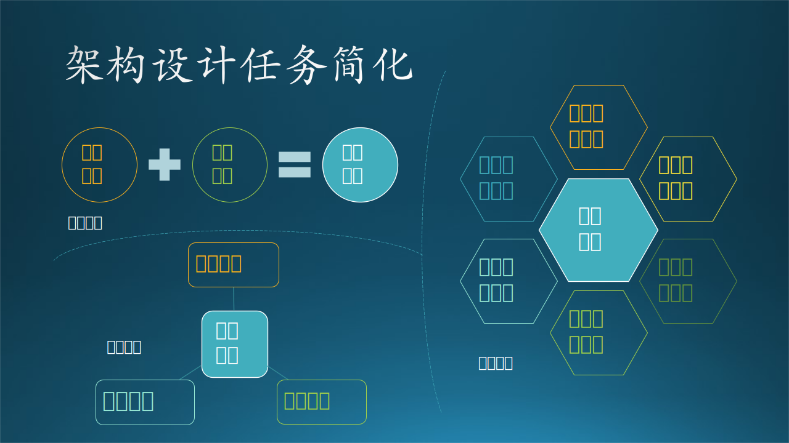

## 13.5 架构设计最佳实践

### 13.5.1 设计任务简化

#### 1. 六视图法

现在读者再回过头来看表 13.4.1，就可以理解这些名词的含义了。我们把它们再次总结成表 13.5.1。

表 13.5.1 架构设计任务与关注点小结

|顺序|设计步骤名称|设计任务|关注点|
|-|-|-|-|
|1|**业务场景架构**|系统划分 + 功能覆盖 + 外部关系|业务齐全，子系统划分合理，用户可以看懂|
|2|**逻辑功能架构**|静态结构 + 功能模块 + 协作关系|功能全面覆盖业务需求，层级划分合理|
|3|**运行过程架构**|进程设定 + 状态转换 + 调用关系|运行过程合理，接口清晰，运行期质量可控|
|4|**数据存储架构**|内容格式 + 存储方式 + 读写控制|业务数据齐全，存储方式可靠，读写性能高|
|5|**软件开发架构**|代码结构 + 依赖关系 + 框架组件|代码文件结构清晰，依赖关系明确|
|6|**物理部署架构**|技术选型 + 节点规划 + 拓扑关系|系统、网络、节点的功能和性能|

按照软件工程的工作流程顺序，可以顺理成章地得到表 13.5.1 中的六个架构设计步骤，我们可以称之为**六视图法**。

$$
\begin{aligned}
架构设计 &= 业务场景架构 + 逻辑功能架构 + 运行过程架构
\\
&+ 数据存储架构 + 软件开发架构 + 物理部署架构
\end{aligned}
\tag{13.5.1}
$$

但是，一般的情况下，开发人员无缘遇到这么复杂的系统，所以我们可以按照下面的简化步骤来做设计。如图 13.5.1 所示。

图 13.5.1 架构设计任务简化

#### 2. 两视图法

有些比较小的系统很难把上述架构图都画出来，可以只有两个元素组成，业务架构 + 技术架构：

$$
\begin{cases}
架构设计 = 业务架构 + 技术架构
\\
业务架构 = 业务场景架构
\\
\begin{aligned}
技术架构 &= 逻辑功能架构 + 运行过程架构 + 数据存储架构 
\\
&+ 软件开发架构 + 物理部署架构
\end{aligned}
\end{cases}
\tag{13.5.2}
$$

其中，业务架构即业务场景架构，技术实现架构的定义是表 13.5.1 中的 2,3,4,5,6 的加和。在第十二章中讲技术架构演化的故事时，基本上就是采用了这种办法。

在这种方法中：
- 程序模块、数据存储、计算节点可以混在一起画，前提是在物理部署中的每个计算节点都可以明确地对应到一个程序模块上。比如在客户端-服务器模式中，客户端计算机运行的是客户访问模块，服务器上运行的是服务模块。
- 运行过程可以不强调，有联系的单元之间画一条线即可。
- 软件开发架构可以不强调，还可以把依赖的框架、组件、中间件画在图中，而无需单独说明代码结构。

#### 3. 三视图法

如果对物理部署架构的要求较高，也可以把它从技术实现架构中拆出来，最后形成三个元素：业务架构、软件架构、硬件架构。

$$
\begin{cases}
架构设计 = 业务架构 + 软件架构 + 硬件架构
\\
业务架构 = 业务场景架构
\\
软件架构 = 逻辑功能架构 + 运行过程架构 + 数据存储架构 + 软件开发架构
\\
硬件架构 = 物理部署架构
\end{cases}
\tag{13.5.3}
$$

同样，软件开发架构可以弱化。这种三视图法比较方便广大读者在任何规模的软件系统设计时使用。

在网络上的大多数架构图中，其实也是不知不觉中使用了这个实践方法，但是绘图的人或者传播的人自己还没有搞清楚，容易误导读者。一个有用的鉴别方法就是：当前后两张图风格不一致，或者项目不吻合时，基本上就是抄袭别人的，传播者按照自己的理解冠名，误人子弟。

#### 4. 其它组合方法

比如另外一种三视图法：业务架构，设计架构（= 逻辑功能 + 运行过程 + 数据存储），实现架构（= 软件开发 + 物理部署）。

如果强调数据的话，用四视图法：业务架构，设计架构（= 逻辑功能 + 运行过程），数据存储，实现架构（= 软件开发 + 物理部署）。

【最佳实践】不管用什么样的组合，也不管最终的视图个数，万变不离其宗，请读者记住最基础的六视图法，只要不遗漏其中的任何一个视图，就不会遗漏关注点，也就会保证设计的完整性。

### 13.5.2 让架构设计走下神坛

本小节中，我们要让架构设计这个高大上的名词走下神坛。为什么这么说呢？

在 13.1 节中，我们设定的目标就是总结出一套方法论，来应用到架构设计中。但由于始终处于软件工程设计范畴，所以这套方法论同样可以用到中小型系统或者概要设计、详细设计中。这也就是为什么我们本章的标题是“概要设计”，但是却讨论了很多“架构设计”。

在表 13.1.2 中已经列出了一些设计的基本概念，在此我们结合 13.4 中学到的关于设计任务与关注点的知识再扩充一下，形成表 13.5.2。

表 13.5.2 各种系统设计的设计任务

|系统设计|架构设计|概要设计|详细设计|
|:-:|-|-|-|
|系统规模|只应用于大型系统|主要应用于中型系统|主要应用于小型系统|
|设计负责人|架构师|技术专家|开发人员|
|用途|确定轮廓，系统分解|确定功能，模块分解|确定细节，函数分解|
|输出文档|架构设计说明书|概要设计说明书|详细设计说明书|
|**设计任务**|关注子系统划分|关注模块功能分配|关注代码实现细节|
|业务场景设计|业务场景架构图|用户与功能之间的关系 (用例图，数据流图)|N/A|
|逻辑功能设计|逻辑功能架构图|各个模块的层次、位置、作用 (类图)|具体的类定义 (对象图)|
|运行过程设计|运行过程架构图|各个模块之间的调用、交互关系 (时序图、协作图、活动图)|详细的状态转换定义 (状态图)|
|数据存储设计|数据存储架构图 (可选)|数据库、数据表和数据文件定义 (类图)|详细的字段定义 (表格)|
|软件开发设计|软件开发架构图 (可选)|代码文件组织、编译、框架选择 (组件图、包图)|N/A|
|物理部署设计|物理部署架构图 (可选)|硬件中部署的软件及物理架构 (部署图)|N/A|

1. 架构设计

    在 13.1 节中也讲过，对于大型系统，我们首先要做子系统划分，然后在此基础上做架构设计，设计任务就是六视图法。在这个层次上，设计元素都是大尺寸的子系统，所以很多细节可以留到后面的概要设计中去做，而只关心各个子系统公共的部分。

    这个阶段要说明产品分哪些应用系统，应用系统间是如何集成的，考虑两点：
    - 子系统间的关系。
    - 可复用的组件或模块进行下沉，沉淀到平台层，为业务组件提供统一的支撑。

    这一阶段的产出是《架构设计说明书》，实际上就是 13.4 节中的内容。当然，除了要画图外，还要给出对应的文字说明。

2. 概要设计

    读者可以看到，概要设计实际上是工作量最大的设计阶段，承上启下，对六个设计任务都有详细的要求。

    这一阶段的产出是《概要设计说明书》，将在 13.6 节中给出。

3. 详细设计

    详细设计只针对具体模块，开发人员不必关系太多的外部的东西，比如可以忽略业务需求；在指定的项目目录中添加代码文件，所以软件开发设计也可以忽略；具体部署到什么地方也不需要知道。

    这一阶段的产出是《详细设计说明书》，将在第十四章中给出。

总体看这三个阶段的任务，从任务量上看是一个枣核形，两头小中间大。第一阶段最关键，需要抽象思维能力和统筹全局的能力；第二阶段最艰巨，需要较深的技术积累、较强的逻辑思维能力和文字表达能力；第三阶段最细致，需要过硬的算法能力和编码能力。

### 13.5.3 原则和误区
分别是合适原则、简单原则、演化原则

4.1 合适原则
“合适优于业界领先”

根据团队人数、团队人员的技术水平选用难度合适的技术

根据业务场景选择合适的技术

4.2 简单原则
“简单优于复杂”

软件领域的复杂性体现在两个方面：

结构的复杂性
结构复杂的系统的特点：组成复杂系统的组件数量更多，同时这些组件之间的关系也更加复杂。

​ 2.逻辑的复杂性

如果想降低结构复杂性，可以降低组件数量，将功能和逻辑聚在一个组件上，但是这带来了新问题：某个组件的逻辑太复杂，一样会带来各种问题。

复杂的电路意味更强大的功能，而复杂的架构却有很多问题的根本原因在于电路一旦设计好后进入生产，就不会再变，复杂性只是在设计时带来影响；
而一个软件系统在投入使用后，后续还有源源不断的需求要实现，因此要不断地修改系统，复杂性在整个系统生命周期中都有很大影响。

4.3 演化原则
“演化优于一步到位”

建筑一旦完成（甚至一旦开建）就不可再变，而软件却需要根据业务的发展不断地变化，因此需要进行演化，一开始业务没那么复杂，性能要求没那么高，就没必要做得太复杂，建议如下：

首先，设计出来的架构要满足当时的业务需要。
其次，架构要不断地在实际应用过程中迭代，保留优秀的设计，修复有缺陷的设计，改正错误的设计，去掉无用的设计，使得架构逐渐完善。
第三，当业务发生变化时，架构要扩展、重构，甚至重写；代码也许会重写，但有价值的经验、教训、逻辑、设计等（类似生物体内的基因）却可以在新架构中延续。
4.4 总结
三个原则其实是一体的，核心就是因为软件系统的复杂就意味着问题，变化才是主题，因此”适当“才是最好地应对变化的方式，而不是“过度”

合适原则第一考虑，优先满足业务需求；
简单原则第二考虑，挑选简单方案快速落地验证；
演进原则第三考虑，适当预测业务发展，感觉预测不准就不预测，等真的出现问题的时候演进即可

### 13.3.7 设计原则

1. 业务平台化
2. 核心业务分离
3. 隔离不同类型
4. 区分主流程、辅助流程

5. 不考虑具体实现
6. 关注用户能看到什么

绘图艺术

https://www.infoq.cn/article/crafting-architectural-diagrams/

设计原则
https://cloud.tencent.com/developer/article/1372372

可靠性
可扩展性
可用性

https://blog.csdn.net/hguisu/article/details/78259898

具体的设计实例：
- 高并发的设计
- 异地灾备的设计
- 消息队列的设计
- 微信系统的设计（点对点通信）
- 微博系统的设计（消息订阅，发布）
- 淘宝系统的设计
- 异地访问延迟
- 高性能
- 微服务
- 语音系统的设计
- 地图系统的设计

设计原则
https://blog.csdn.net/danpu0978/article/details/107274524

设计误区
https://blog.csdn.net/hguisu/article/details/78258430

还想写什么？

1. 原则
2. 误区
3. 概要设计
4. 高并发、可扩展、。。。

介于业务语言与技术语言之间，是对整个系统实现的总体上的架构，他需要指出系统的层次、系统开发的原则、系统各个层次的应用服务，例如，上述系统中可以分为、数据层（资源层）、数据服务层、中间构建服务层、业务逻辑层、表现层，并写明每个层次应用服务。

