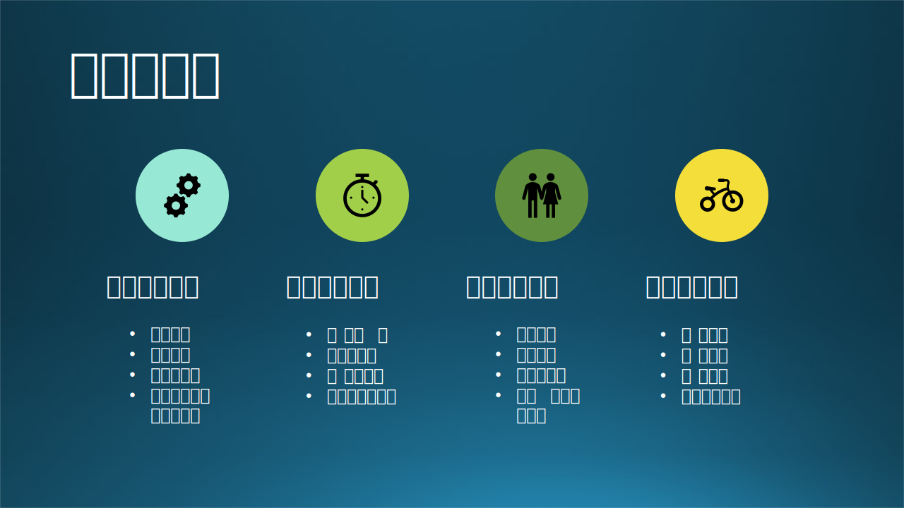

## 13.5 架构设计最佳实践

### 13.5.1 设计任务简化

#### 1. 六视图法

现在读者再回过头来看表 13.4.1，就可以理解这些名词的含义了。我们把它们再次总结成表 13-7。

表 13-7 架构设计任务与关注点小结

|顺序|设计步骤名称|设计任务|关注点|
|-|-|-|-|
|1|**业务场景架构**|系统划分 + 功能覆盖 + 外部关系|业务齐全，子系统划分合理，用户可以看懂|
|2|**逻辑功能架构**|静态结构 + 功能模块 + 协作关系|功能全面覆盖业务需求，层级划分合理|
|3|**运行过程架构**|进程设定 + 状态转换 + 调用关系|运行过程合理，接口清晰，运行期质量可控|
|4|**数据存储架构**|内容格式 + 存储方式 + 读写控制|业务数据齐全，存储方式可靠，读写性能高|
|5|**软件开发架构**|代码结构 + 依赖关系 + 框架组件|代码文件结构清晰，依赖关系明确|
|6|**物理部署架构**|技术选型 + 节点规划 + 拓扑关系|系统、网络、节点的功能和性能|

按照软件工程的工作流程顺序，可以顺理成章地得到表 13.5.1 中的六个架构设计步骤，我们可以称之为**六视图法**，如图 13-21 右侧和式 13.5.1 所示。

$$
\begin{aligned}
架构设计 &= 业务场景架构 + 逻辑功能架构 + 运行过程架构
\\
&+ 数据存储架构 + 软件开发架构 + 物理部署架构
\end{aligned}
\tag{13.5.1}
$$

但是，一般的情况下，开发人员无缘遇到这么复杂的系统，所以我们可以按照下面的简化步骤来做设计。如图 13-21 所示。

图 13-21 架构设计任务简化

#### 2. 两视图法

有些比较小的系统很难把上述架构图区分出来，可以只有两个元素组成：业务架构、技术架构。由此得到式 13.5.2：

$$
\begin{cases}
架构设计 = 业务架构 + 技术架构
\\
业务架构 = 业务场景架构
\\
\begin{aligned}
技术架构 &= 逻辑功能架构 + 运行过程架构 + 数据存储架构 
\\
&+ 软件开发架构 + 物理部署架构
\end{aligned}
\end{cases}
\tag{13.5.2}
$$

其中，业务架构即业务场景架构，技术实现架构的定义是表 13.5.1 中的 2,3,4,5,6 的加和。在第十二章中讲技术架构演化的故事时，基本上就是采用了这种办法。

在这种方法中：
- 程序模块、数据存储、计算节点可以混在一起画，前提是在物理部署中的每个计算节点都可以明确地对应到一个程序模块上。比如在客户端-服务器模式中，客户端计算机运行的是客户访问模块，服务器上运行的是服务模块。
- 运行过程可以不强调，在有联系的单元之间画一条线即可。
- 软件开发可以不强调，还可以把依赖的框架、组件、中间件画在图中，而无需单独说明代码结构。

#### 3. 三视图法

如果对物理部署架构的要求较高，也可以把它从技术实现架构中拆出来，最后形成三个元素：业务架构、软件架构、硬件架构。由此得到式 13.5.3：

$$
\begin{cases}
架构设计 = 业务架构 + 软件架构 + 硬件架构
\\
业务架构 = 业务场景架构
\\
软件架构 = 逻辑功能架构 + 运行过程架构 + 数据存储架构 + 软件开发架构
\\
硬件架构 = 物理部署架构
\end{cases}
\tag{13.5.3}
$$

同样，软件开发架构可以弱化。这种三视图法比较方便广大读者在任何规模的软件系统设计时使用，因为它混合了一堆东西在软件架构里，不特别强调关注点（这也是很多人搞不清的地方）。但是事情都是有两面性的，混淆关注点对于使用者没有好处。

在网络上的大多数架构图中，其实也是不知不觉中使用了这个实践方法，但是绘图的人或者传播的人自己还没有搞清楚，容易误导读者。一个有用的鉴别方法就是：当前后两张图风格或者项目不不一致时，基本上就是抄袭别人的，传播者按照自己的理解冠名，误人子弟。

#### 4. 其它组合方法

比如另外一种三视图法：业务架构，设计架构（= 逻辑功能 + 运行过程 + 数据存储），实现架构（= 软件开发 + 物理部署）。

如果强调数据的话，用四视图法：业务架构，设计架构（= 逻辑功能 + 运行过程），数据存储，实现架构（= 软件开发 + 物理部署），这类似于 TOGAF，但是在命名上比 TOGAF 要清晰很多，而且关注点很明确。

【最佳实践】不管用什么样的组合，也不管最终的视图个数，万变不离其宗，请读者记住最基础的六视图法，只要不遗漏其中的任何一个视图，就不会遗漏关注点，也就会保证设计的完整性。

### 13.5.2 架构设计降维

本小节中，我们要让架构设计这个高大上的名词走下神坛。为什么这么说呢？

在 13.1 节中，我们设定的目标就是总结出一套方法论，来应用到架构设计中。但由于所讨论的问题始终处于软件工程设计范畴，所以**这套方法论同样可以用到中小型系统或者概要设计、甚至详细设计中**。这也就是为什么我们本章的标题是“概要设计”，但是却讨论了很多“架构设计”。

在表 13-2 中已经列出了一些设计的基本概念，在此我们结合 13.4 中学到的关于设计任务与关注点的知识再扩充一下，形成表 13-8，可以看作是表 13-2 的延续。注意，在表 13-8 的设计任务中，我们把“xxxx架构”变成了“xxxx设计”（比如：业务场景**架构** $\rightarrow$ 业务场景**设计**），这样的话，这个设计任务就可以适用于概要设计和详细设计了。

表 13-8 各种系统设计任务

|系统设计|阶段一：架构设计|阶段二：概要设计|阶段三：详细设计|
|:-:|-|-|-|
|设计任务|关注子系统划分|关注模块功能分配|关注代码实现细节|
|**1.业务场景设计**|业务场景架构图|用户与功能之间的关系|用例分析、数据流图|
|**2.逻辑功能设计**|逻辑功能架构图|各个模块的层次、位置、作用|具体的模块功能|
|**3.运行过程设计**|运行过程架构图 (可选)|各个模块之间的调用、交互关系|具体的过程要求|
|**4.数据存储设计**|数据存储架构图 (可选)|数据库数据表数据文件定义|具体的字段和格式|
|**5.软件开发设计**|软件开发架构图 (可选)|代码文件组织、编译、框架选择|具体的开发要求|
|**6.物理部署设计**|物理部署架构图 (可选)|硬件中部署的软件及物理架构|具体的部署要求|

- 总体需要三个阶段：架构设计、概要设计、详细设计。
- 每个阶段需要六个任务，从任务量上看是一个枣核形，两头小中间大：
   - 第一阶段最关键，需要抽象思维能力和统筹全局的能力；
   - 第二阶段最艰巨，需要较深的技术积累、较强的逻辑思维能力和文字表达能力；
   - 第三阶段最细致，需要过硬的算法能力和编码能力。

下面简述这三个阶段的不同。

#### 1. 架构设计

在 13.1 节中也讲过，对于大型系统，我们首先要做子系统划分，然后在此基础上做架构设计，设计任务就是六视图法（或者两视图法、三视图法、其它组合方法）。在这个层次上，设计元素都是大尺寸的子系统，所以很多细节可以留到后面的概要设计中去做，而只关心各个子系统公共的部分。

这个阶段要说明产品分哪些应用系统，应用系统间是如何集成的，考虑两点：
- 子系统间的关系。
- 可复用的组件或模块进行下沉，沉淀到平台层，为业务组件提供统一的支撑。

这一阶段的产出是《架构设计说明书》，实际上就是 13.4 节中的内容。当然，除了要画图外，还要给出对应的文字说明。

#### 2. 概要设计

读者可以看到，概要设计实际上是**工作量最大**的设计阶段，承上启下，对六个设计任务都有详细的要求。

这一阶段的产出是《概要设计说明书》，将在 13.6 节中给出。

#### 3. 详细设计

详细设计只针对具体模块，开发人员不必关系太多的外部的东西，比如可以忽略业务需求；在指定的项目目录中添加代码文件，所以软件开发设计也可以忽略；具体部署到什么地方也不需要知道。

这一阶段的产出是《详细设计说明书》，将在第十四章中给出。

### 13.5.3 原则与误区

图 13-22列出了一些原则与常见误区。

图 13-22 原则与误区

#### 1. 不需要分离关注点，设计元素都画在一张图里

对于一个小系统，确实可以这么做，而大多数人遇到的都是小系统，所以这个说法/做法也没有错。但是对于中型、大型系统，不分离关注点的话，这张图是画不出来的，或者非常非常复杂，像是“清明上河图”。

架构设计不是在描述民间百态，而是帮助架构师/设计师理清思路，从多维度/多角度刨析系统架构，形成多类关注点，这样才能保证不遗漏、不重复，同时降低了复杂度，形成分而治之的局面，并且后续的读者也容易看懂。

一般来讲，人在面对一个复杂的问题域时，不可能在同一时刻既能纵观全局，又能洞察秋毫。因此需要控制自己的视野：考虑全局时，注意其大的组成部分，暂时不详查每一部分的具体的细节：考虑某部分的细节时则暂时撇开其余的部分。

这就是**粒度控制原则**：

- 设计师控制自己的视野，该看世界地图的时候，不要看城市地图。
- 采取分而治之的策略，先对付眼前的麻烦，再解决远方的敌人。
- 一个阶段只关注一个问题，锅里的和碗里的要分开。
- 注意看问题的高度、角度、维度，用高度来控制方向性，用角度来控制全面性，用维度来控制关联性。

#### 2. 设计一个能为 1 亿用户服务的系统

在第十二章中的 12.1 节，我们已经用一个“技术架构演化的故事”来讲述了一个软件系统的发展过程，这虽然是一个故事，但是在软件领域确实普遍存在的事实。最开始的淘宝、京东、微信、微博，也都是只有十几台服务器为几万人服务，谁也不会那么傻一开始就搞几百台服务器在那里蓄势待发。等用户数量增加了，再成倍地增加服务器的数量，扩大系统规模。

所以，我们可以拥有为 1 亿用户服务的系统架构知识，但是不一定能用上。系统讲究“可伸缩性”，很多人只看到了“伸”，没有想到“缩”。现在的云服务如 Azure，为系统伸缩提供了非常便利的条件。

另一方面，有些技术在高并发大容量时才能呈现出优势来，比如吞吐量和稳定性，但是在小规模系统中还不如另外一个简单的架构模式有效。比如事件驱动模式，面对几千用户时，本来可以用管道-过滤器模式来简单实现，可以实现几十毫秒级别的处理速度，但是用事件驱动模式时，至少要花 1 秒的时间。当用户量增至几十万时（可能在该软件生命周期内不会发生），管道-过滤器模式要用10秒，事件驱动模式还是 1 秒。

虽然在 13.1 节的最开始讲架构概念的时候，我们使用了建筑行业来做类比，但是，建筑是永恒的，而软件架构是可以变化的。老板们当然愿意拥有一个为 1 亿用户提供服务的系统，但是架构师不能因此就好高骛远地顺着老板说话，非要把微信、淘宝的架构照抄过来用在校园网上。

这是**循序渐进原则**：

- 大丈夫能屈能伸，系统也要可伸缩，不能只可伸不可缩。
- 随着需求和用户的变化，系统也在不断演化。
- 利用云服务可以有效应对变化。
- 不见兔子不撒鹰，在没有看到有可预期的收入之前，不要大规模投入。

#### 3. 一定要用最新的架构模式来构建服务

第十二章中列出了很多架构模式，有些是传统的，有些是比较新的。

近几年微服务架构盛行，大家都想使用微服务。大多数都看到了它的优点，但忽略了它的缺点，原因是没有用过，不知道风险有多大，只看到了好的一面。

Microsoft Office 套件中的 OneNotes 后台就是用微服务开发的，它像一张白纸，可以在上面任何位置随意写任何支持的格式的文档，比如可以打字、写字、绘图、手绘图，还可以嵌入 Word，Excel 的文档并直接显示出来，就和在人们在纸质的笔记本上用圆珠笔记录东西一样方便，没有任何格式要求。

系统呈现这种便利性的同时，带了的是后台的复杂逻辑，所以项目组决定用微服务架构开发。在开发之初，大家觉得很爽，增加一个新的服务时，根本不用触动旧的代码，而且可以用任何语言编写，只要能部署到微服务平台上并提供 RESTful API 调用接口即可。

渐渐的，当需要维护以前的代码或者系统扩容时，比起单结构的代码来要复杂很多倍，所有东西都要拷贝一份，旧的版本还不能轻易扔掉，因为用户数据存储还是用的旧格式，于是，旧版本越来越多。而新增加的微服务也越来越多，已经不能用简单的 Excel 表来做统计了。

笔者相信，如果让 OneNotes 项目组重新设计系统架构，他们一定会引入别的架构模式（比如插件模式或者黑板模式）。

这是**最佳适合原则**：

- 看清自己的应用的特殊性，形成清醒的自我认知。
- 新旧并举，各种架构模式都有自己的用处，没有好坏之分。
- 不盲目跟风，人云亦云，有自己的分析并形成可操作的步骤。
- 把熟悉的技术应用于新场景，是最事半功倍的做法。

#### 4. 等前期架构设计完善后再开始后续工作

我们又要拿建筑行业来做类比了。在建筑行业里，必须等到前期的设计完全结束，拿到一整套图纸后才能开始后续的工作。而且这套图纸就再也不能改动了，因为所有的建筑材料都是按图纸上的尺寸加工、购买的。

前面我们也说了，建筑是死的，软件是活的。在软件行业中，架构师不能为了体现自己的存在价值而做过度设计，也不能害怕别人挑刺而不停地迭代自己的设计，甚至把属于概要设计的工作也做了，“走别人的路让别人无路可走”。

一名架构师一定是从底层开发做起，慢慢成长起来的，所以 ta 也一定懂得后续的一系列工作该如何做。如果后续的工作有人做，就不要剥夺人家的权力；相反，如果后续的工作没人做，那么架构师也应该可以自己承担，能上能下。但无论如何都是要跟随项目一起走的，一直到系统部署上线运行。所以在前期不必花不必要的时间，非要把架构设计搞得尽善尽美才放手。

笔者以前曾经当过一段时间的专职设计师，只写文档，不写代码。当时就是为了对得起老板的信任，还有责任感（或者是面子），花很长时间把设计文档写得完美无比，每个字都要斟酌像是写书一样，每张图都要画得和机械制图同样的标准。但其实人家负责实现的开发人员也不是傻子，他们有很强的纠错能力。如果有些事情遗漏了，只要在每日例会上补充就好，然后再补到文档里，整个项目不会因为这些就走弯路。

简单的设计不等于是不好的设计，反而是给后面的变化留出空间；完美的设计不等于是好的设计，因为后面可能要修改。另外，简单的设计在初期也可以降低成本，帮老板省钱。

这可以叫做**简单有效原则**：

- 不但有敏捷开发，也有敏捷设计。
- 设计师做好自己分内的事，全程跟随系统开发过程，随时调整。
- 架构设计尽快落地，简洁实用为主，不搭建空中楼阁。
- 一步一个脚印，每一步看似都很简单，但是都是有效的，累加起来就可以走向成功。
