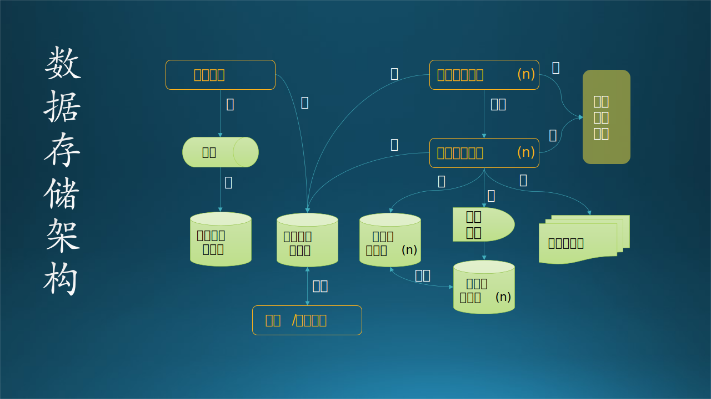
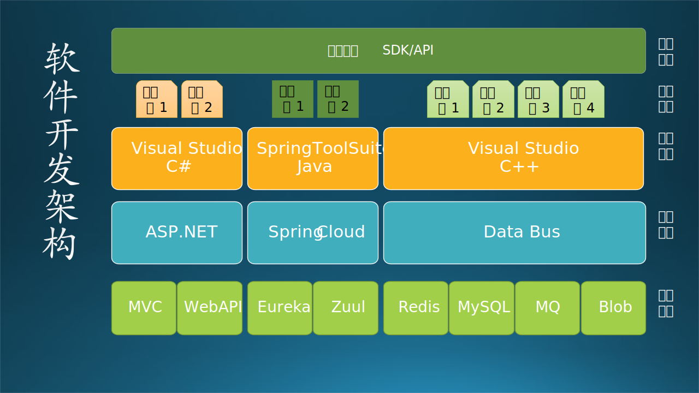
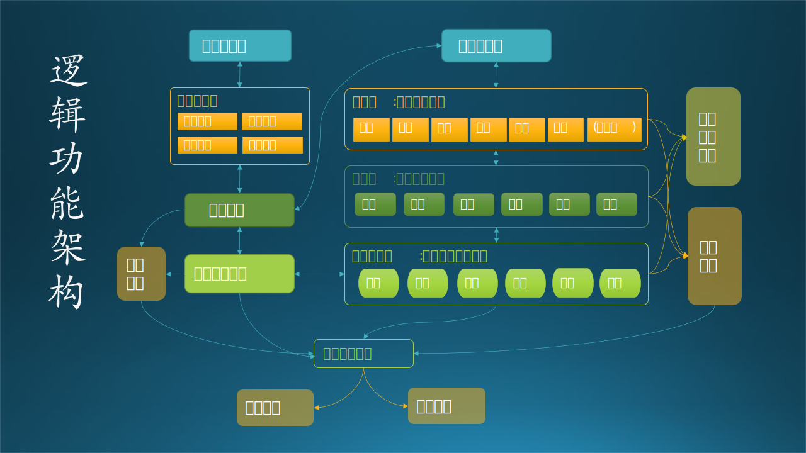

## 13.3 逻辑功能架构

抽取各个子系统中共用的部分

给做概要设计的人看

介于业务语言与技术语言之间，是对整个系统实现的总体上的架构，他需要指出系统的层次、系统开发的原则、系统各个层次的应用服务，例如，上述系统中可以分为、数据层（资源层）、数据服务层、中间构建服务层、业务逻辑层、表现层，并写明每个层次应用服务。

要说明产品分哪些应用系统，应用系统间是如何集成的，考虑两个事情：第一、考虑的是子系统间的关系。第二、考虑将可复用的组件或模块进行下沉，沉淀到平台层，为业务组件提供统一的支撑。

图 13.3.1 逻辑功能架构图

图 13.3.1 应用运行架构图

图 13.3.1 软件开发架构图

图 13.3.1 数据存储架构图

数据类型/来源

数据模型

数据存储/分布

数据流

数据管理

数据（持久化）架构：对存储数据（资源）的架构方法论，其架构原则同应用架构大同小异，即考虑到各个系统应用场景、不同时间段的应用场景对数据进行诸如数据异构、读写分离、数据库或NOSQL的策略、缓存的使用、分布式数据（数据库）策略等等。 数据架构主要解决三个问题：

1. 系统需要什么样的数据；
2. 如何存储这些数据；
3. 它们之间的联系是什么。

图 13.3.1 物理部署架构图

技术选型
物理选型
分布设计
选型管理

开发架构

技术架构：应用架构本身只关心需要哪些应用系统，哪些平台来满足业务目标的需求，而不会关心在整个构建过程中你需要使用哪些技术。技术架构是应接应用架构的技术需求，并根据识别的技术需求，进行技术选型，把各个关键技术和技术之间的关系描述清楚。技术架构解决的问题包括：如何进行纯技术层面的分层、开发框架的选择、开发语言的选择、涉及非功能性需求的技术选择
