## 13.7 Edge浏览器概要设计说明书

在本节中，我们以手机 Edge 浏览器开发为例，书写一份完整的概要设计说明书。以下是正文（这是一个真实的案例），其中有一些用【最佳实践】开头的段落属于笔者的解释性文字。

### 1. 概述（Overview）

#### 1.1 任务概述

由于 Chrome 浏览器的各项指标普遍优于 Edge 浏览器，所以我司决定使用 Chromium 开源软件作为基础，搭建新的 Edge 浏览器。但是在正式开始之前，应该先在手机浏览器上试水，摸索出使用 Chromium 过程中的各种“坑”，验证它的能力。

所以，要使用 Chromium 在 iOS/Android 手机上各开发一个 Edge 浏览器软件，设计相同，以保证用户体验相同。最后在各自的应用市场上架供最终用户下载使用。

手机 Edge 浏览器的业务场景如图 13-23 所示。

【最佳实践】业务场景中的功能要分组，便于对该领域的知识有透彻的理解。

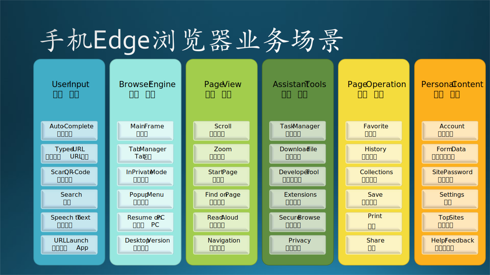

图 13-23 业务场景

从业务场景来看，用户从该 App 的界面上可以看到以下 6 组功能：

（1）用户输入功能

   提供用户在网址栏中的文字、语音、二维码输入功能；如果输入的不是合法的网址，会看作是搜索词；如果输入的是预定义的 URI，可以启动本地的对应 App。

（2）浏览引擎功能

   包括主框架的外观、网页标签（Tab）管理、显示弹出式菜单、进入到私有浏览模式（不留历史记录）、进入大界面的桌面模式。其中，接力到 PC 功能是独有的，可以把手机 Edge 浏览器上的工作用内置协议在 Windows 的 Edge 浏览器上继续显示，而无需重新输入网址。

（3）页面浏览功能

   提供基本的卷滚、缩放、网页上的文字查找、前进后退等页面导航功能；起始页功能可以在打开一个空白网页时，定义缺省的网址；语音朗读功能可以读出网页上的问本内容。

（4）辅助工具集

   辅助工具集中有任务管理器、文件下载管理、开发者工具(F12功能)、对扩展控件的支持、安全浏览、隐私保护等功能。

（5）页面操作管理

   这里可以收藏、查看浏览历史、保存网页到本地、打印、分享等，页面合集可以提供一些特殊的分组内的功能。

（6）个人信息管理

   账号、密码、表单等是为了再次重复在一个网页上登录时，免除重新填写信息和密码的麻烦；常用网站可以定制，方便再次浏览；更多信息可以在设置、帮助里看到，也可以提供用户反馈。

#### 1.2 术语解释（Terminology）

- Chromium：谷歌公司的浏览器开源软件框架，可以在上面进行二次开发，提供定制的用户体验。

- NTP：New Tab Page，打开一个新的空白页面时的逻辑。

- OOBE：第一次启动时的 App 安装设置逻辑。

- Roaming：漫游，用户可以在不同的机器上同步 Edge 浏览器的设置。

- Hub Page：一种比较大的页面切换框架。

- MSA SSO：微软账户的单点登录。

#### 1.3 目标和非目标（Goal/Non-Goal）

目标：
- 使用 Chromium 在 iOS/Android 手机上开发 Edge 浏览器软件。
- 可以兼容国内主流的 Android 手机型号。

非目标：
- 暂不考虑在 PC 上的 Edge 浏览器开发。

#### 1.4 尚未解决的问题（Open Issue）

- 暂不考虑与 PC 端 Edge 浏览器做数据同步的问题。

### 2. 总体设计（Architecture）

#### 2.1 逻辑功能架构

系统的总体设计如图 13-24 所示，该图展示的是该系统的逻辑功能架构。

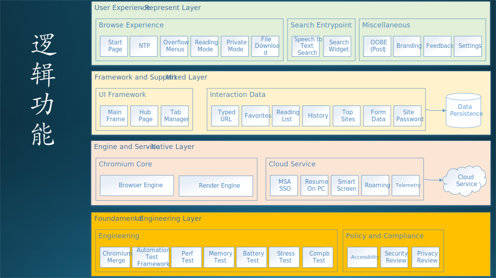

图 13-24 逻辑功能

从上到下一共分为四层，每一层之内由很多模块组成：

（1）用户界面层

   包括三个功能组：一般性的浏览体验，搜索入口，其它辅助功能。这些都是用户可以直接看到或日常使用的交互功能。这一层完全用 Java 语言在 Chromium 外围开发或者修改。

（2）框架和支持层

   提供基础框架供界面层使用，还有很多在交互过程中产生的用户数据，需要保存到本地数据库（文件）中。这一层也是用 Java，需要接触到 Chromium 较深层次的代码中。

（3）引擎和服务层

   本层包括 Chromium 本身提供的浏览、渲染引擎，和需要额外定制的网络服务。其中，前一部分基本上不需要改动，后一部分是完全自定义的，需要在 Chromium 的 C++ 代码中做改动。

（4）基础层

   基础层是一些外围辅助任务，完成非功能需求的质量保证工作，不包括在浏览器 App 的代码内，但是在整个开发过程中是不可或缺的。

【最佳实践】逻辑功能中的功能要分组，这样同一组的功能就可以由同一个/组开发人员来实现，效率最高。但是读者可以看到，这种分组和图 13-23 中的分组不完全相同，或者可以说完全不相同，图 13-24 中会出现很多底层支持的功能模块，用户在页面上是看不到的。

#### 2.2 外部系统

根据图 13-24 右侧边所示，在本软件中，外部系统一共有四种：

- Telemetry Service 外部访问，通过 Asimov SDK 完成（下面有描述）。
- Smart Screen 外部访问，通过加密的 RESTful API 调用完成。
- 漫游数据的访问，通过 OneDrive SDK 完成。
- Bing Service 提供的是搜索服务接口，形式为 RESTful API。

【最佳实践】由于外部接口一旦制定就不能轻易修改，所以接口的细节要描述清楚。除了上述的接口协议外，还需要数据包中的字段或参数的描述，包括：名称、尺寸（字节数）、内容、格式。还要注意 Windows 和 UNIX 系统的字节顺序的区别。

### 3. 运行过程设计

#### 3.1 用户接口

详见《手机Edge浏览器界面设计》文档（本书不提供）。

#### 3.2 运行模块组合

主要的运行模块组合如图 13-25 所示。

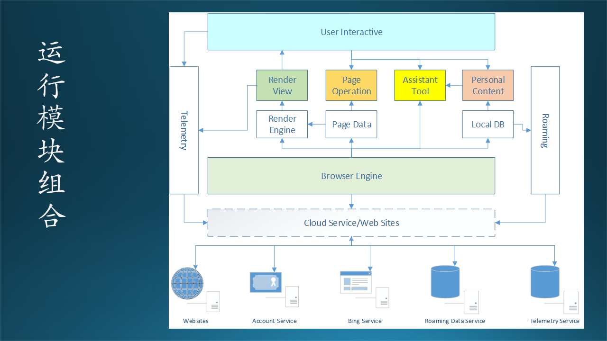

图 13-25 运行模块组合

本图从下向上看：

- 用户指定了网址后，Browser Engine 开始从 Cloud Service/Web Sites 抓取网页内容（Page Data）。
- 传送给 Render Engine 进行渲染，并产生 Render View，显示给用户。
- 这种行为在 Java 层（即业务逻辑层）发生，所以写入了 Telemetry，同时用户的一些其它操作也写入 Telemetry；Telemetry 要上传数据到 Telemetry Service。
- 用户可以在网页上进行页面操作，如保存、打印等等。
- 一些辅助工具（如历史记录、收藏夹、表单数据等）要通过个人数据管理从 Local DB 读取或写入。
- Local DB 的内容定期漫游（ Roaming），也是通过网络传递给远程的漫游数据服务。

#### 3.3 进程/线程

图 13-26 中，展示了页面浏览过程中所需要的主要进程和线程。

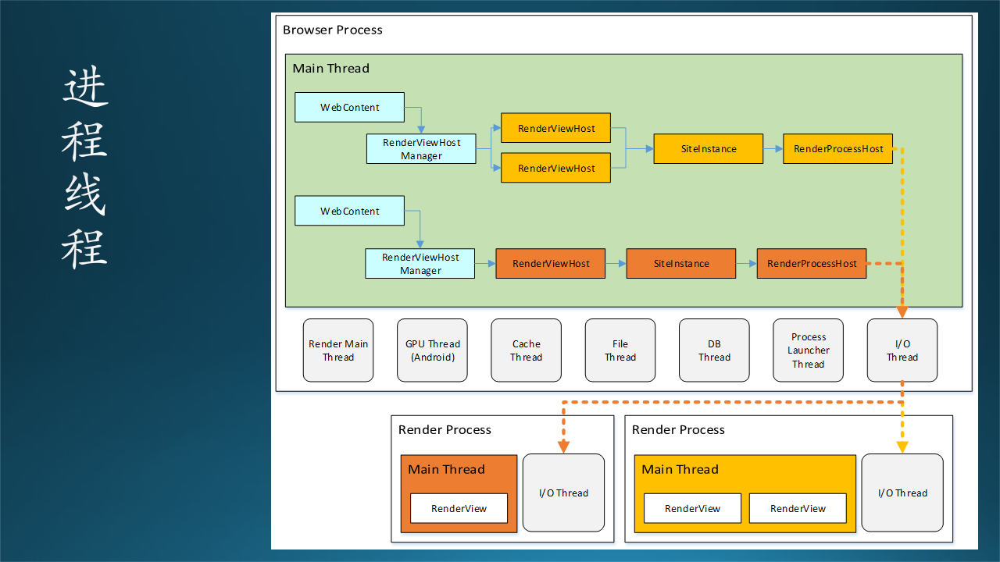

图 13-26 进程/线程设计

其中，有两类主要的进程：

- Browser Process
   
   包括一个主要的 Main Thread，和若干个工作线程完成辅助任务。浏览器把 WebContent 下载后，用 RenderViewHostManager 模块解析内容，然后决定产生几个 RenderViewHost 来做渲染工作，并通过 RenderProcessHost 创建对应的 Render Process 进程来具体执行。
   
- Render Process

   可以是多个进程，红色的 Main Thread 对应着 Browser Process 的 Main Thread 中红色的一个 RenderViewHost，而黄色对应着上方的两个 RenderViewHost，这是为多视图的页面而设计的。每个 WebContent 对应着一个 Render Process。

线程有很多，存活在父进程内，并行地完成独立的任务。如：

- Render Main Thread 完成对 Main Thread 的管理；
- GPU Thread 完成使用 GPU 来做渲染；
- Cache Thread 完成缓存查找或保存工作；
- File Thread 完成文件下载工作；
- DB Thread 完成数据库读写任务；
- Process Launcher Thread 完成启动子进程的工作；
- I/O Thread 完成与 Render Process 的通信工作。

#### 3.4 内部接口

在图 13-27 中，描述了 Java/C++/Cloud 三层之间的漫游机制的内部时序及接口调用关系。

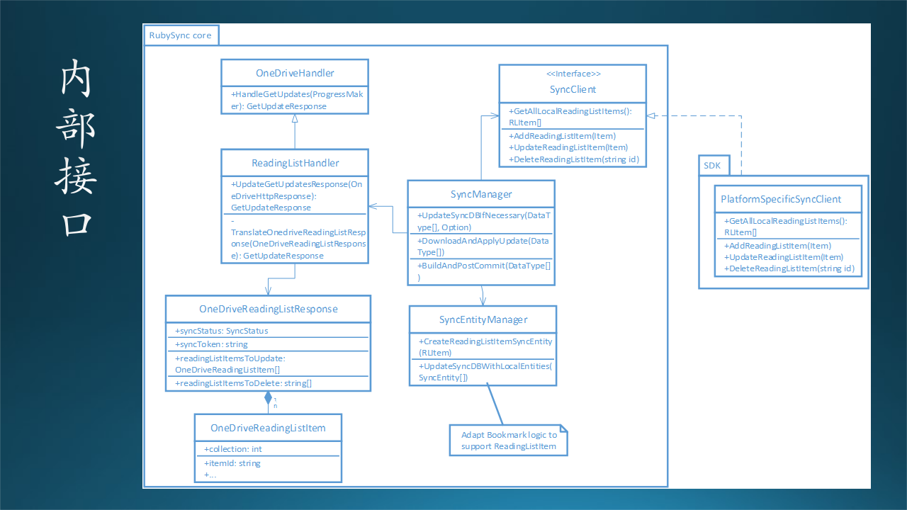

图 13-27 用运行时序图来描述内部接口

（1）UI 界面写入本地数据库；
（2）同时同步到 C++ 层的同步模块；
（3）写入漫游数据库（数据2）；
（4）初始化漫游进程；
（5）从 OneDrive 下载数据1；
（6）数据1返回；
（7）读取漫游数据2；
（8）数据2返回；
（9）合并数据1和数据2；
（10）上传到 OneDrive;
（11）成功；
（12）数据更新成功通知；
（13）更新本地数据库；
（14）清理漫游数据2。

【最佳实践】

- 在上述流程中，可以加入接口描述，如果是对象方法调用，就不用太细致了，留到详细设计再做；如果是远过程调用，可以在此描述。

- 也可以根据图 13-25 运行模块组合中的逻辑来描述内部接口，因为每两个模块之间的连线都可以看作是一个内部接口。

### 4. 数据存储设计

本应用中有很多种数据需要存储，如图 13-28 所示。

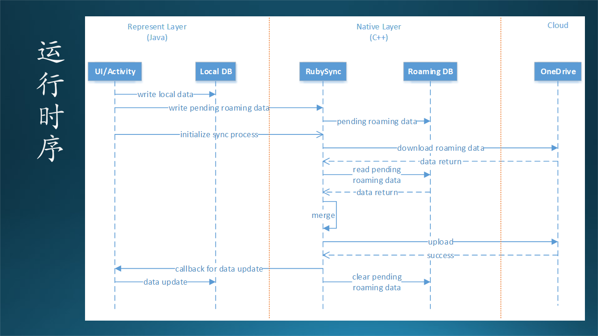

图 13-28 漫游数据的存储处理

以下是需要存储的数据：

- Favorite 收藏夹
- Reading List 阅读列表
- Typed URL 输入过的合法网址
- Password 密码
- Top Sites 常用网站
- Form Data 表单数据

在图 13-28 中，以 Sync Object 的派生类表示。其中橙色的部分是需要加密的。

#### 4.1 数据库设计

使用数据库的地方有两处：

（1）存储上述的 6 种本地数据，发生在 Java 代码层，叫做 Local DB；
（2）这几种本地数据都需要漫游，所以会在 C++ 层同步一份，但这种同步是双向的，如果用户在另外一台机器上使用了 Edge 浏览器并用相同的账号登录，使用记录会同步过来，叫做 Roaming DB。

【最佳实践】这里可以列出每一种数据的表结构。

#### 4.2 数据文件设计

本应用中没有使用数据文件。

#### 4.3 数据结构/接口设计

需要强调的是，有两类数据需要加密，在图 13-29 中用橙色的元素表示：Password 数据和 Form Data 数据，避免明文存储和传输。

在 Java 用户界面层，可以读写本地的 Local DB 数据库，当发生写操作时，会同时向 C++ 层传输相同的数据，保存在 Roaming DB 中，然后由该层的同步机制定时与 OneDrive 同步。该 OneDrive 即用户登录的 MSA 账号所对应的云存储。

在 PC 端（即 Windows 10 Desktop），Edge 浏览器有同样的同步机制。

【最佳实践】如果内存中的数据结构与数据表的结构不同，或者还有一些特殊的设计，可以列在这里。略。

### 5. 软件开发设计

#### 5.1 版本更新策略

由于本项目基于 Chromium，而 Chromium 是一个开源项目，也在持续更新，所以本项目的开发在开始点上使用的是 Chromium 55 版本，但是后期要跟随 Chromium 的更新步伐，因为这些更新可以弥补以前的一些安全漏洞。

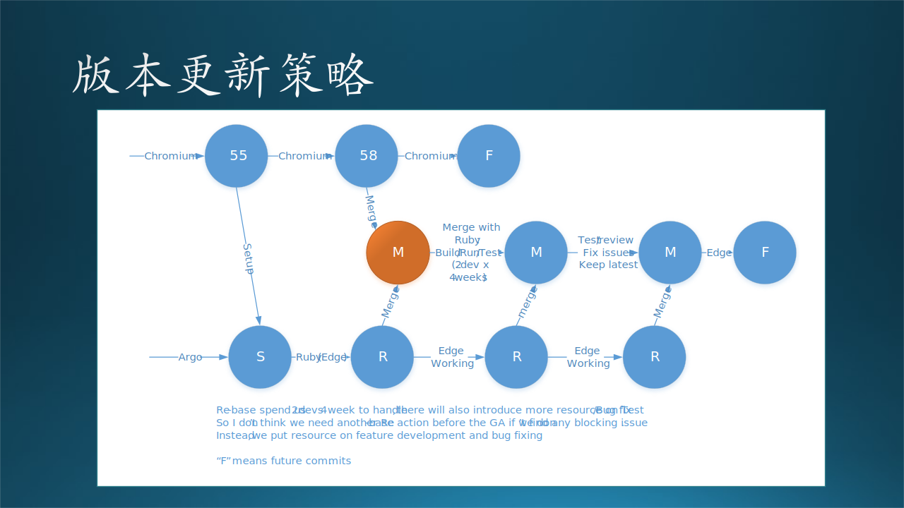

图 13-29 版本更新策略

图 13-29 展示了基线更新（Rebase）的策略，其中各种符合的含义如下：

- S：开始。
- 55，58：Chromium 版本号。
- R：Rebase。
- M：Merge，即把 Chromium 的更新和 Edge 源代码的更新合并。
- F：后续的版本。
- Argo/Ruby：Edge 前身的 code name。

设计者在下方的文字中建议：因为基线更新每次要花费两个开发人员 4 周的工作，而且要花费未知问题修复和全套的测试工作，所以不建议在 GA（最终版本可用）之前再做更新，而是要把时间花在功能开发上。因为更新的好处是未知的，而坏处是已知的。

#### 5.2 代码结构设计

图 13-30 是示意性的软件开发架构（代码结构）设计，与本项目关系不大。

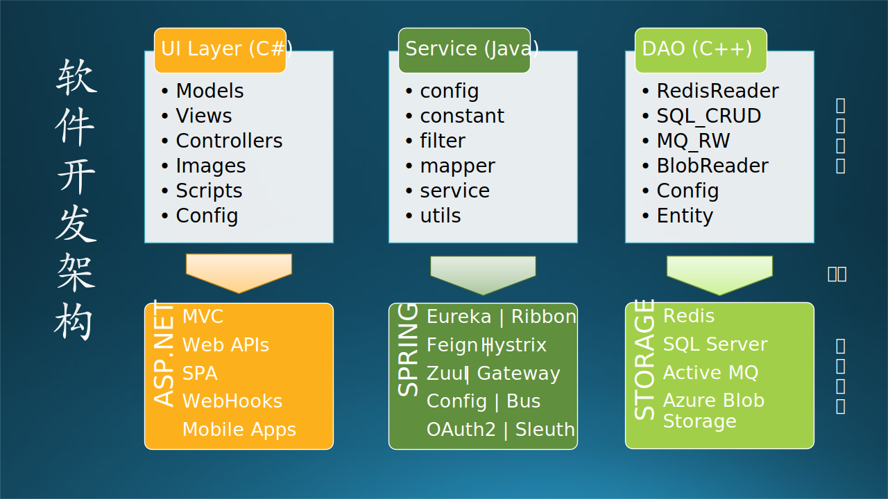

图 13-30 软件开发架构

在图 13-30 中，根据逻辑功能架构的三层设计，把代码组织成了三个大的部分：
- UI Layer 表示层，这一部分（假设）用 C# 来实现，基于 ASP.NET 中的技术框架，如 MVC、WebAPI、SPA、WebHooks、Mobile Apps等等，而代码结构中包含 Models、Views、Controllers 等逻辑代码。
- Service 服务层，这一部分（假设）用 Java 实现，基于 Spring Cloud 中的技术框架，比如 Eureka、Ribbon、Feign 等等，而目录中包含 filter、mapper 等逻辑代码。
- Storage DAO 存储访问层，这一部分（假设）用 C++ 实现，基于 4 种异构的存储技术，如 Redis、SQL Server、Active MQ、Azure Blob Storage等，目录中包含根据具体的存储技术的读写逻辑代码。

### 6. 运行环境设计

#### 6.1 运行环境

App 运行在 iOS 或 Android 智能手机系统上，用户可以在应用商店下载。在运行过程中，需要有互联网的连接。内部测试时，测试人员可以直接安装本地包。

因为本软件运行环境简单，所以下面提供两个额外的设计信息。

#### 6.2 测试环境

本部分可以单独写在《测试设计》中。

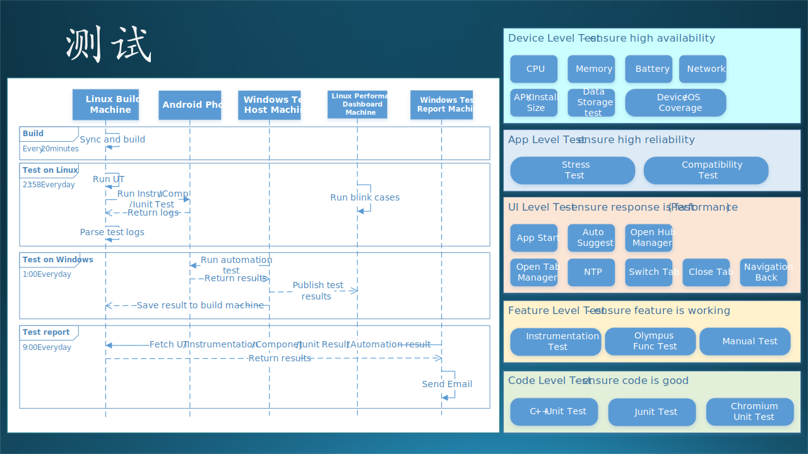

图 13-31 测试策略和自动化测试流程

在图 137.9 右侧，说明了测试栈的结构。从下到上依次为：

- Code Leve Test

  代码级别的测试，主要是由开发人员提供 Unit Test，以保证代码的健壮性。

- Feature Level Test

  功能级别的测试，除了传统的手工测试（Manual Test）外，Olympus Test 是一种自动化测试的代号，Instrumentation Test 是打点测试，看看业务逻辑是否完整。这一层的测试保证所有的功能（feature）都是可用的。

- UI Level Test

  用户界面层的测试，但是目的是测试性能，界面响应速度要维持在正常水平。其内部列出了很多经常用到的功能作为测试点。

- App Level Test

  主要是自动化测试，针对该浏览器软件进行盲测，遍历每个分支，包括压力测试和兼容性测试，以保证其高可靠性。

- Device Level Test

  设备层面的测试，比如监控 CPU、内存、电池、网络、安装包尺寸、数据存储量、各类 Android 操作系统的变种和不同手机厂家的设备等等，以保证软件的高可用性。

在图 13-31 左侧，说明了自动化测试的流程。比如：

- 最上方的测试角色，一共 5 种角色。最终的测试都是 Android 手机上进行。
- 从上到下的一共 4 个测试任务，包括 Build（从源代码编译）、Test on Linux（在 Linux 上测试）、Test on Windows（在 Windows 上测试）、Test Report（生成并发送测试报告）。
- 每个测试任务都有启示时间，运行预先编制好的测试用例，最后发送电子邮件。早晨上班后即可看到测试报告。

#### 6.3 安全设计

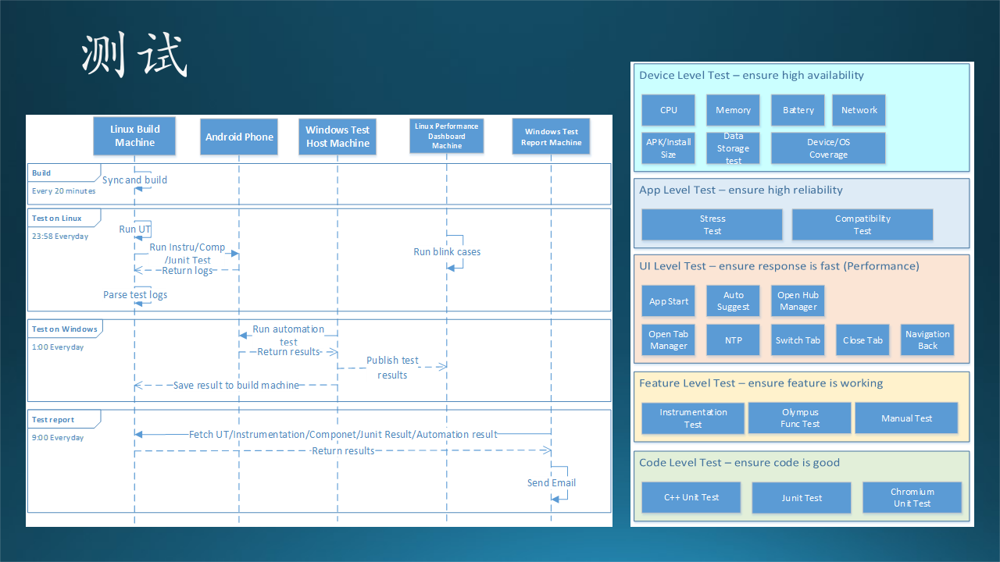

图 13-32 页面安全访问控制

为了保证安全，避免不小心进入钓鱼网站，设计了代号为 Smart Screen 的安全服务，用户的每次页面访问都会经过如下过程（图xxx 中有对应的序号）：

（1）开始访问某个网址；
（2）查询本地字典，该网址是否安全；
（3）判断结果；
（4）正常，继续，否则到 7；
（5）获得网页；
（6）返回给浏览器；
（7）不确定；
（8）把网址传给 Smart Screen Service 进行判别；
（9）判断结果；
（10）正常，继续，否则到 13；
（11）获得网页；
（12）返回给浏览器；
（13）不正常，走异常处理过程；
（14）返回一个警告页给浏览器。

【最佳实践】在详细设计中可以再具体描述加密解密的算法。

### 7. 发布与维护设计

#### 7.1 日志（Telemetry）

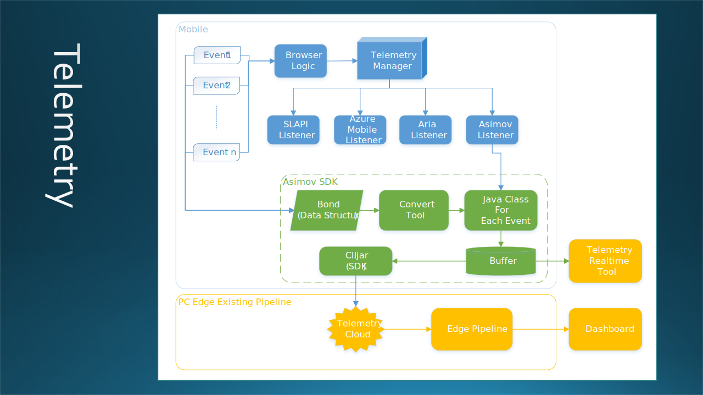

图 13-33 日志流程

已有的 PC 端 Edge 有一套完整的 Pipeline，本软件可以借用，所以需要写入相同的 Telemetry 格式。具体的格式如下：略。

【最佳实践】这里可以描述日志格式，需要注意的是，每条日志都必须有以下几个自动：消息ID，SessionID，时间，内容。由于日志可以记录 Session，所以在另外一条消息中，可以有不同的“消息ID”但相同的 SessionID。略。

在图 13-33 中，手机 Edge 浏览器在运行过程中收集各种事件（Event），通过 Telemetry Manager 写到不同的日志输出（Listner）上，其中，Asimov（阿西莫夫）Listner 可以把日志写入 Asimov SDK 中的缓存，然后再由后台进程传送到云端的日志库中。但是，所有事件必须先进行 Bond（相当于是格式注册）。

Telemetry Realtime Tool 可以帮助实时查看写入的日志格式是否正确。

#### 7.2 试验（Flighting）

由于是新 App，所以准备使用应用商店的 Flight 机制，即有些用户可以看到并下载测试，有些用户看不到。

#### 7.3 计划与安排（Timeline/Work Item）

下表是一个大致的时间安排，分为三个阶段：

- 8 月底，Private Preview，个人预览版，即内部可以开始试用；
- 10 月底，Public Preview，公共预览版，即外部少数用户可以开始试用；
- 12 月底，GA，即 Genaral Availability，正式版本。

表 13-11 计划与安排

|阶段|时间点|功能集|
|-|-|-|
|Private Preview|Aug.|StartPage, NTP, OverflowMenus, Settings, MainFrame, HugPage, TabManager, Telemetry, Favorites, Chromium58, RomaingFramework, AutomationTestFramework|
|Public Preview|Oct.|ReadingMode, PrivateMode, FileDownload, SearchWidget, TypedURL, Reading List, History, SitePassword, ResumeOnPC, SmartScreen, PerformanceTest|
|GA|Dec.|SpeechToTextSearch, OOBE, Branding, TopSites, FormData, Chromium61, MSA SSO, MemoryTest, BatteryTest, StressTest, CompatibilityTest, Accessibility, Security, PrivacyReview|

* 功能集，是按照图 13-24 中的任务来确定的。
* 每个功能需要精确到人（开发人员的名字）和周（多长时间完成）。

#### 7.4 中止机制（Exit Criteria）

暂时没有中止计划。

