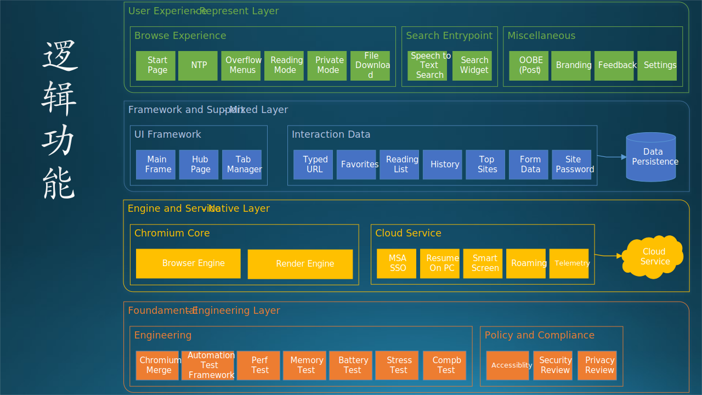
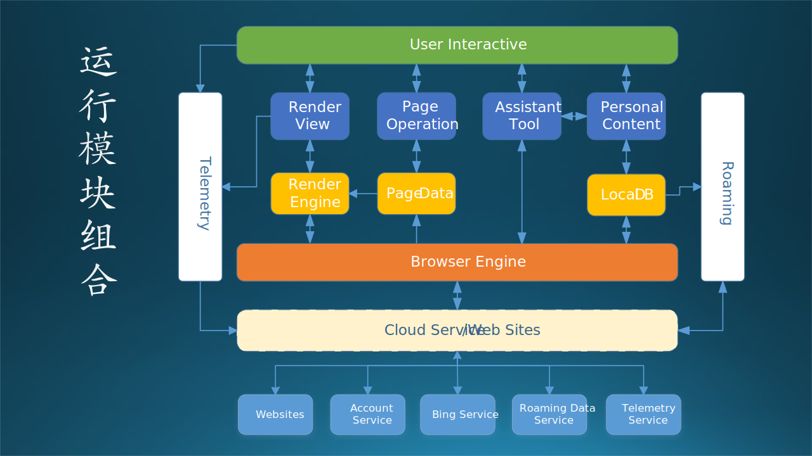
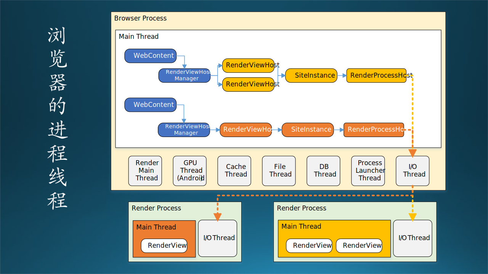
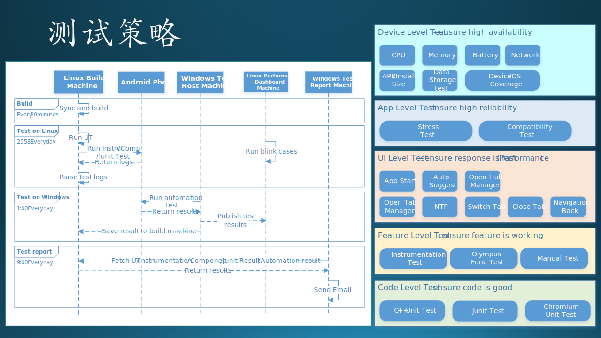
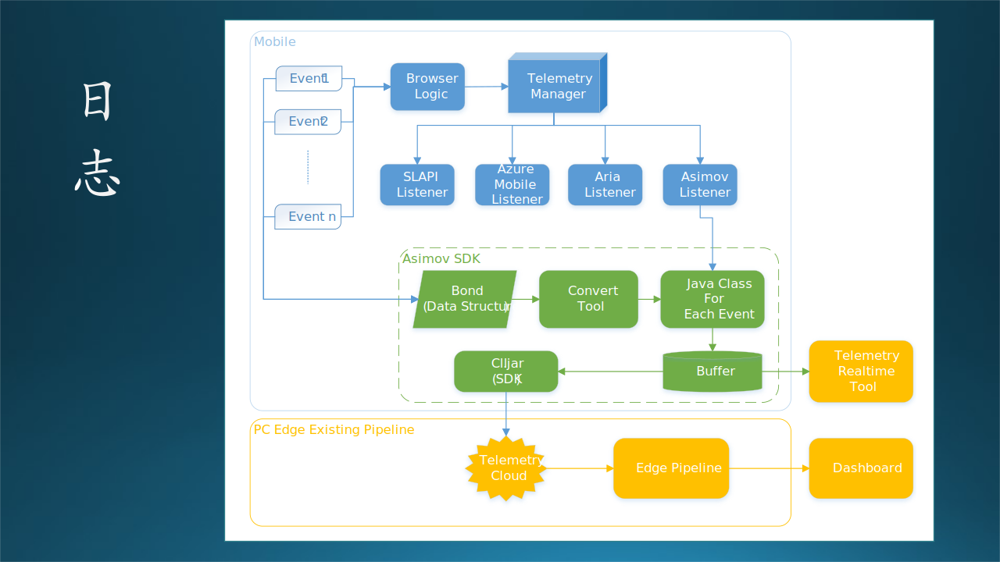

## 13.7 Edge浏览器概要设计说明书

在本节中，我们以手机 Edge 浏览器开发为例，书写一份完整的概要设计说明书。以下是正文（这是一个真实的案例），其中有一些用【最佳实践】开头的段落属于笔者的解释性文字。

#### 1. 概述（Overview）

**1.1 任务概述**

由于 Chrome 浏览器的各项指标普遍优于 Edge 浏览器，所以我司决定使用 Chromium 开源软件作为基础，搭建新的 Edge 浏览器。但是在正式开始之前，应该先在手机浏览器上试水，摸索出使用 Chromium 过程中的各种“坑”，验证它的能力。

所以，要使用 Chromium 在 iOS/Android 手机上各开发一个 Edge 浏览器软件，设计相同，以保证用户体验相同。最后在各自的应用市场上架供最终用户下载使用。

手机 Edge 浏览器的业务场景如图 13.7.1 所示。

图 13.7.1 业务场景

【最佳实践】业务场景中的功能要分组，这样同一组的功能就可以由同一个/组开发人员来实现，效率最高。

**1.2 术语解释（Terminology）**

- Chromium

    谷歌公司的浏览器开源软件框架，可以在上面进行二次开发，提供定制的用户体验。

**1.3 目标和非目标（Goal/Non-Goal）**

目标：
- 使用 Chromium 在 iOS/Android 手机上开发 Edge 浏览器软件。
- 可以兼容国内主流的 Android 手机型号。

非目标：
- 暂不考虑在 PC 上的 Edge 浏览器开发。

**1.4 尚未解决的问题（Open Issue）**

- 暂不考虑与 PC 端 Edge 浏览器做数据同步的问题。

#### 2. 总体设计（Architecture）

图 13.7.2 逻辑功能

#### 3. 运行过程设计

**3.1 用户接口**

详见《手机Edge浏览器界面设计》文档（本书不提供）。

**3.2 运行模块组合**

图 13.7.3 运行模块

说明对系统施加不同的外界运行控制时所引起的各种不同的运行模块组合，说明每种运行所历经的内部模块和支持软件。

如果流程复杂，可以用表格或文字的形式展现，避免绘制复杂的图形。如果绘图，可用流程图、时序图等。

**3.3 进程/线程**

图 13.7.4 进程/线程设计

进程、线程的实现存在于代码中，但是如果不运行起来，非常难以识别。即使运行起来，人们也是无法“看到”其运行过程。

进程、线程设计包括：

- 名称
- 作用
- 生命周期（启动、停止条件）
- 实现机制（进程、线程、服务，或者是 Azure 上提供的一些其它计算服务）
- 运行物理环境（架构设计中的哪个服务器或者子系统）

这一部分用文字描述即可，放在表格内。

**3.4 内部接口**

图 13.7.5 内部接口

内部接口，一般包含以下几种形式：

- 对象方法调用或函数调用
- 进程间通信（管道或者套接字）
- RESTful API
- 消息队列

内部接口众多，只描述大模块之间的接口即可。可以用两种图来表示：分层关系接口图，组件交互时序图。

**3.5 外部接口**

系统访问其它外部系统的出口，或者被外部系统访问的入口，一般是 HTTP 形式。

#### 4. 数据存储设计

数据设计，一般是指对永久存储的数据的设计，包含数据库和数据文件两类。

**4.1 数据库设计**

一般是指关系式数据库。主要涉及的内容包括：

- 表
- 主键、外键、索引
- 存储过程

**4.2 数据文件设计**

一般是从类的属性做序列化得到数据文件，可能包括的数据文件类型有：

- 二进制
- 纯文本
- XML 扩展标记语言
- JSON 对象标记语言

如果是后两者，则格式中自带信息描述，就不用写设计文档了。如果是二进制文件，必须按字节描述文件格式。如果是纯文本格式，一般是按行分开记录，即 \r\n，使用 \tab 或逗号分割字段。

**4.3 数据结构/接口设计**

传统教材并不包含此类别的数据设计要求。

由于计算机软硬件技术的发展，有很多类型的数据是内存或网络中的临时运行用数据，比如：

- 栈
- 堆
- 数据包
- 消息队列

消息队列组件，队列中的数据平时是在内存中的，为了怕丢失任务，所以组件把内存中的数据也存储在了磁盘上。

这类数据如果是绑定在数据发送或接收方的对象上（作为属性），则可以在类设计（属于详细设计范畴）里包含。如果是比较独立的，既不从属于数据发送方，也不从属于数据接收方，则需要单独在这里设计。

#### 5. 项目结构设计

即**软件开发设计**。

用一张表说明，各项需求的实现同各程序模块的分配关系。

#### 6. 运行环境设计

**6.1 运行环境**

App 运行在 iOS 或 Android 智能手机系统上，用户可以在应用商店下载。在运行过程中，需要有互联网的连接。内部测试时，测试人员可以直接安装本地包。

因为本软件运行环境简单，所以下面提供两个额外的设计信息。

**6.2 测试环境**

本部分可以单独写在《测试设计》中。

**6.3 安全设计**

#### 7. 发布与维护设计

**7.1 日志（Telemetry）**

这个工作其实应该是 PM 的工作，定义哪一个用户行为需要记录日志，比如：

- 打开应用
- 点击按钮
- 打开某个网页
- 收藏了某个网页
- 关闭应用

这些日志会最终发送到服务器上，作为用户行为分析的数据源。

**7.2 试验（Flighting）**

由于是新 App，所以准备使用应用商店的 Flight 机制，即有些用户可以看到并下载测试，有些用户看不到。

**7.3 计划与安排（Timeline/Work Item）**

根据项目大小，有可能是多人合作完成，或者是单人独立完成：

- 多人合作
  
  列出分工及计划，如：

  |人员|工作|初步计划|
  |--|--|--|
  |木头|管理子系统|3周|
  |石头|推理子系统|4周|
  |肖哥|训练子系统|5周|
  |毛毛|存储接口模块|2周|

- 单人完成

  列出模块划分、完成时间。

  |模块名称|初步计划|
  |--|--|
  |Azure Blob 数据读写模块|2天|
  |Flask Restful 服务|10天|
  |发送邮件模块|3天|
  |开关 Azure 虚拟机模块|5天|

**7.4 中止机制（Exit Criteria）**

暂时没有中止计划。
