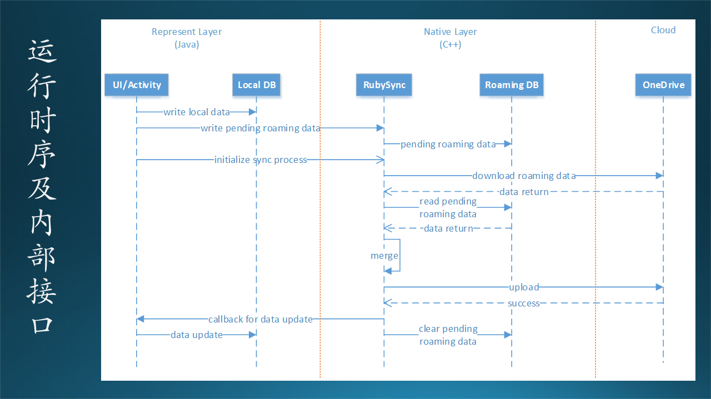
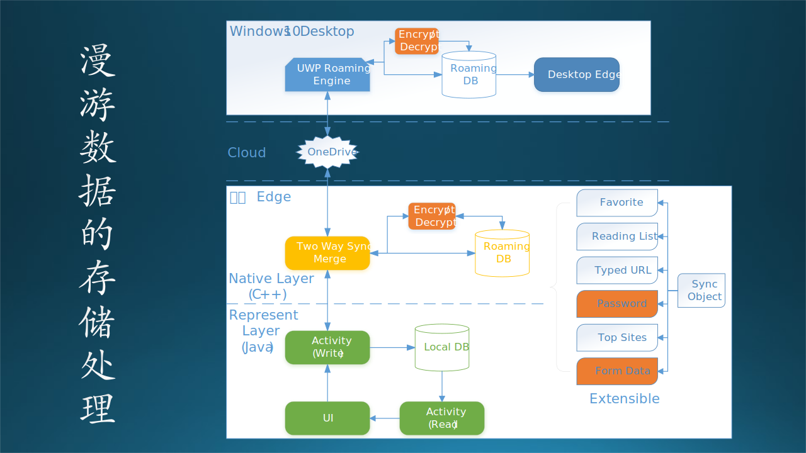
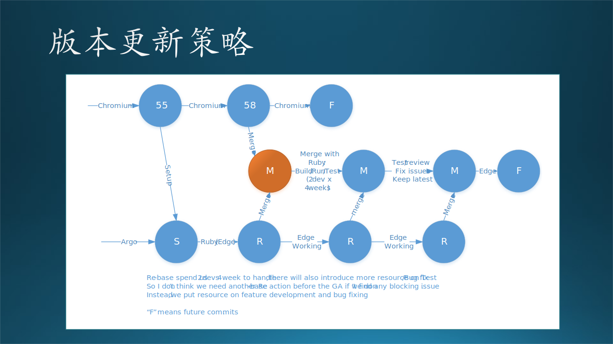
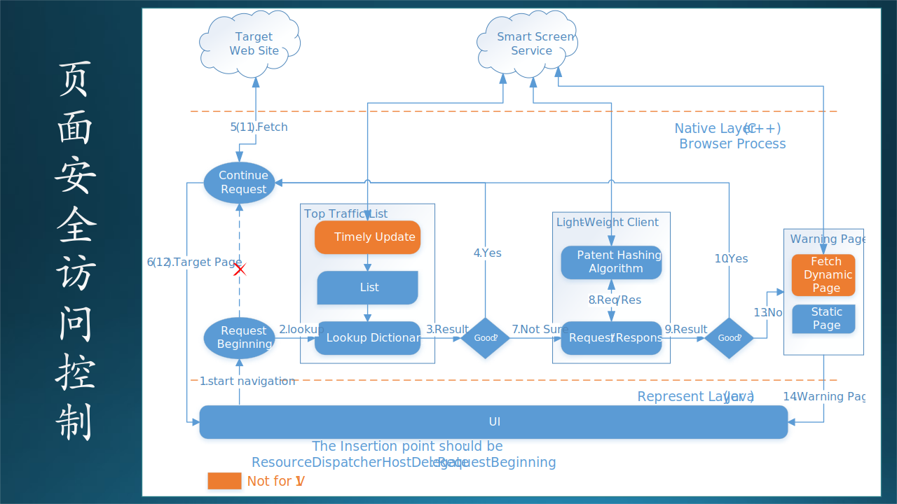
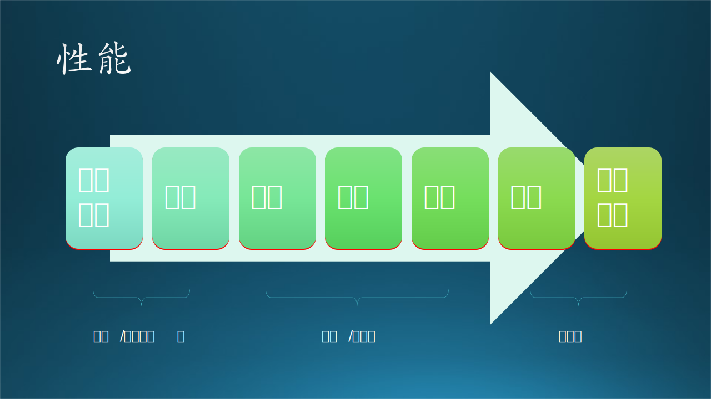

## 13.7 Edge浏览器概要设计说明书

在本节中，我们以手机 Edge 浏览器开发为例，书写一份完整的概要设计说明书。以下是正文（这是一个真实的案例），其中有一些用【最佳实践】开头的段落属于笔者的解释性文字。

### 1. 概述（Overview）

#### 1.1 任务概述

由于 Chrome 浏览器的各项指标普遍优于 Edge 浏览器，所以我司决定使用 Chromium 开源软件作为基础，搭建新的 Edge 浏览器。但是在正式开始之前，应该先在手机浏览器上试水，摸索出使用 Chromium 过程中的各种“坑”，验证它的能力。

所以，要使用 Chromium 在 iOS/Android 手机上各开发一个 Edge 浏览器软件，设计相同，以保证用户体验相同。最后在各自的应用市场上架供最终用户下载使用。

手机 Edge 浏览器的业务场景如图 13.7.1 所示。

【最佳实践】业务场景中的功能要分组，便于对该领域的知识有透彻的理解。

图 13.7.1 业务场景

从业务场景来看，用户从该 App 的界面上可以看到以下 6 组功能：

1. 用户输入功能

   提供用户在网址栏中的文字、语音、二维码输入功能；如果输入的不是合法的网址，会看作是搜索词；如果输入的是预定义的 URI，可以启动本地的对应 App。

2. 浏览引擎功能

   包括主框架的外观、网页标签（Tab）管理、显示弹出式菜单、进入到私有浏览模式（不留历史记录）、进入大界面的桌面模式。其中，接力到 PC 功能是独有的，可以把手机 Edge 浏览器上的工作用内置协议在 Windows 的 Edge 浏览器上继续显示，而无需重新输入网址。

3. 页面浏览功能

   提供基本的卷滚、缩放、网页上的文字查找、前进后退等页面导航功能；起始页功能可以在打开一个空白网页时，定义缺省的网址；语音朗读功能可以读出网页上的问本内容。

4. 辅助工具集

   辅助工具集中有任务管理器、文件下载管理、开发者工具(F12功能)、对扩展控件的支持、安全浏览、隐私保护等功能。

5. 页面操作管理

   这里可以收藏、查看浏览历史、保存网页到本地、打印、分享等，页面合集可以提供一些特殊的分组内的功能。

6. 个人信息管理

   账号、密码、表单等是为了再次重复在一个网页上登录时，免除重新填写信息和密码的麻烦；常用网站可以定制，方便再次浏览；更多信息可以在设置、帮助里看到，也可以提供用户反馈。

#### 1.2 术语解释（Terminology）

- Chromium：谷歌公司的浏览器开源软件框架，可以在上面进行二次开发，提供定制的用户体验。

- NTP：New Tab Page，打开一个新的空白页面时的逻辑。

- OOBE：第一次启动时的 App 安装设置逻辑。

- Roaming：漫游，用户可以在不同的机器上同步 Edge 浏览器的设置。

- Hub Page：一种比较大的页面切换框架。

- MSA SSO：微软账户的单点登录。

#### 1.3 目标和非目标（Goal/Non-Goal）

目标：
- 使用 Chromium 在 iOS/Android 手机上开发 Edge 浏览器软件。
- 可以兼容国内主流的 Android 手机型号。

非目标：
- 暂不考虑在 PC 上的 Edge 浏览器开发。

#### 1.4 尚未解决的问题（Open Issue）

- 暂不考虑与 PC 端 Edge 浏览器做数据同步的问题。

### 2. 总体设计（Architecture）

系统的总体设计如图 13.7.2 所示，该图展示的是该系统的逻辑功能架构。

图 13.7.2 逻辑功能

从上到下一共分为四层：

1. 用户界面层

   包括三个功能组：一般性的浏览体验，搜索入口，其它辅助功能。这些都是用户可以直接看到或日常使用的交互功能。这一层完全用 Java 语言在 Chromium 外围开发或者修改。

2. 框架和支持层

   提供基础框架供界面层使用，还有很多在交互过程中产生的用户数据，需要保存到本地数据库（文件）中。这一层也是用 Java，需要接触到 Chromium 较深层次的代码中。

3. 引擎和服务层

   本层包括 Chromium 本身提供的浏览、渲染引擎，和需要额外定制的网络服务。其中，前一部分基本上不需要改动，后一部分是完全自定义的，需要在 Chromium 的 C++ 代码中做改动。

4. 基础层

   基础层是一些外围辅助任务，完成非功能需求的质量保证工作，不包括在浏览器 App 的代码内，但是在整个开发过程中是不可或缺的。

【最佳实践】逻辑功能中的功能要分组，这样同一组的功能就可以由同一个/组开发人员来实现，效率最高。但是读者可以看到，这种分组和图 13.7.1 中的分组不完全相同，或者可以说完全不相同，图 13.7.2 中会出现很多底层支持的功能模块，用户在页面上是看不到的。

### 3. 运行过程设计

#### 3.1 用户接口

详见《手机Edge浏览器界面设计》文档（本书不提供）。

#### 3.2 运行模块组合

图 13.7.3 运行模块组合

#### 3.3 进程/线程

图 13.7.4 中，展示了页面浏览过程中所需要的主要进程和线程。

图 13.7.4 进程/线程设计

其中，有两类主要的进程：

1. Browser Process
   
   包括一个主要的 Main Thread，和若干个工作线程完成辅助任务。浏览器把 WebContent 下载后，用 RenderViewHostManager 模块解析内容，然后决定产生几个 RenderViewHost 来做渲染工作，并通过 RenderProcessHost 创建对应的 Render Process 进程来具体执行。
   
2. Render Process

   可以是多个进程，红色的 Main Thread 对应着 Browser Process 的 Main Thread 中红色的一个 RenderViewHost，而黄色对应着上方的两个 RenderViewHost，这是为多视图的页面而设计的。每个 WebContent 对应着一个 Render Process。

线程有很多，存活在父进程内，并行地完成独立的任务。如：

- Render Main Thread 完成对 Main Thread 的管理；
- GPU Thread 完成使用 GPU 来做渲染；
- Cache Thread 完成缓存查找或保存工作；
- File Thread 完成文件下载工作；
- DB Thread 完成数据库读写任务；
- Process Launcher Thread 完成启动子进程的工作；
- I/O Thread 完成与 Render Process 的通信工作。

#### 3.4 内部接口

图 13.7.5 内部接口

内部接口，一般包含以下几种形式：

- 对象方法调用或函数调用
- 进程间通信（管道或者套接字）
- RESTful API
- 消息队列

内部接口众多，只描述大模块之间的接口即可。可以用两种图来表示：分层关系接口图，组件交互时序图。

#### 3.5 外部接口

系统访问其它外部系统的出口，或者被外部系统访问的入口，一般是 HTTP 形式。

### 4. 数据存储设计

本应用中有很多种数据需要存储，如图 13.7.7 所示。

图 13.7.7

- Favorite
- Reading List
- Typed URL
- Password
- Top Sites
- Form Data

#### 4.1 数据库设计

一般是指关系式数据库。主要涉及的内容包括：

- 表
- 主键、外键、索引
- 存储过程

#### 4.2 数据文件设计

一般是从类的属性做序列化得到数据文件，可能包括的数据文件类型有：

- 二进制
- 纯文本
- XML 扩展标记语言
- JSON 对象标记语言

如果是后两者，则格式中自带信息描述，就不用写设计文档了。如果是二进制文件，必须按字节描述文件格式。如果是纯文本格式，一般是按行分开记录，即 \r\n，使用 \tab 或逗号分割字段。

#### 4.3 数据结构/接口设计

传统教材并不包含此类别的数据设计要求。

由于计算机软硬件技术的发展，有很多类型的数据是内存或网络中的临时运行用数据，比如：

- 栈
- 堆
- 数据包
- 消息队列

消息队列组件，队列中的数据平时是在内存中的，为了怕丢失任务，所以组件把内存中的数据也存储在了磁盘上。

这类数据如果是绑定在数据发送或接收方的对象上（作为属性），则可以在类设计（属于详细设计范畴）里包含。如果是比较独立的，既不从属于数据发送方，也不从属于数据接收方，则需要单独在这里设计。

### 5. 项目结构设计

即**软件开发设计**。

用一张表说明，各项需求的实现同各程序模块的分配关系。

### 6. 运行环境设计

#### 6.1 运行环境

App 运行在 iOS 或 Android 智能手机系统上，用户可以在应用商店下载。在运行过程中，需要有互联网的连接。内部测试时，测试人员可以直接安装本地包。

因为本软件运行环境简单，所以下面提供两个额外的设计信息。

#### 6.2 测试环境

本部分可以单独写在《测试设计》中。

#### 6.3 安全设计

### 7. 发布与维护设计

#### 7.1 日志（Telemetry）

这个工作其实应该是 PM 的工作，定义哪一个用户行为需要记录日志，比如：

- 打开应用
- 点击按钮
- 打开某个网页
- 收藏了某个网页
- 关闭应用

这些日志会最终发送到服务器上，作为用户行为分析的数据源。

#### 7.2 试验（Flighting）

由于是新 App，所以准备使用应用商店的 Flight 机制，即有些用户可以看到并下载测试，有些用户看不到。

#### 7.3 计划与安排（Timeline/Work Item）

根据项目大小，有可能是多人合作完成，或者是单人独立完成：

- 多人合作
  
  列出分工及计划，如：

  |人员|工作|初步计划|
  |--|--|--|
  |木头|管理子系统|3周|
  |石头|推理子系统|4周|
  |肖哥|训练子系统|5周|
  |毛毛|存储接口模块|2周|

- 单人完成

  列出模块划分、完成时间。

  |模块名称|初步计划|
  |--|--|
  |Azure Blob 数据读写模块|2天|
  |Flask Restful 服务|10天|
  |发送邮件模块|3天|
  |开关 Azure 虚拟机模块|5天|

#### 7.4 中止机制（Exit Criteria）

暂时没有中止计划。
