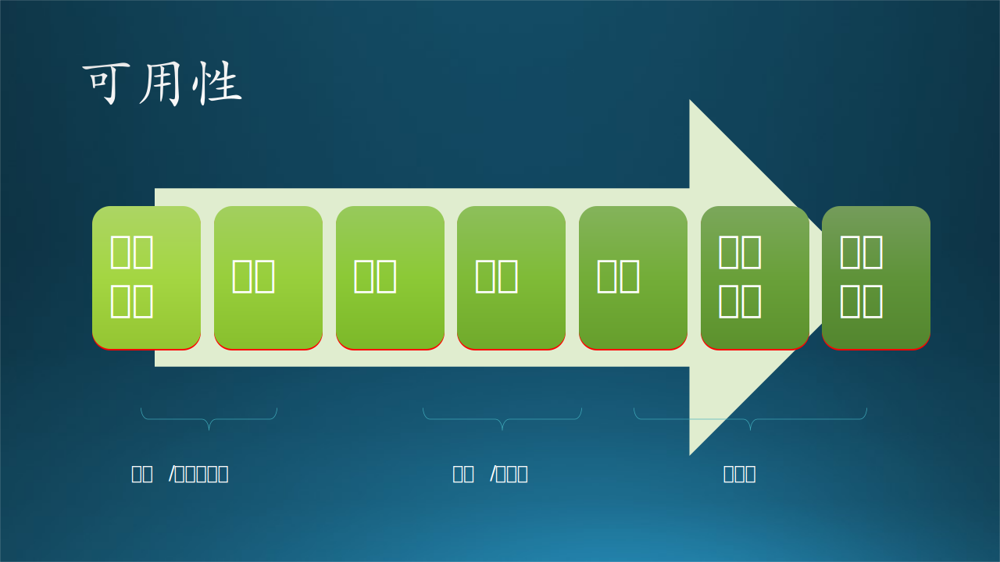

## 13.8 设计的核心目标与实现

软件的开发期和运行期质量目标有很多种，架构设计、概要设计、详细设计都是为了这些质量目标而服务的。而针对规模稍大的面向最终用户运行的软件系统$^{[8,9]}$，我们重点关注以下三个核心目标：

- 性能
- 可用性
- 可扩展性

其它的一些目标在本节的最后一个小节中描述，如规模、安全、成本、自动等。

### 13.8.1 性能（Performance）

软件设计和实现中，性能是每个设计人员和开发人员都要时刻考虑的问题，尤其是针对那种实时运行的线上服务系统而言，能用 20 毫秒完成的任务，就不要用 30 毫秒，可以说性能问题是点点滴滴组成的，做为架构师他看不到也不可能全看到具体的实现代码，所以需要层层把关。

图 13-34 提高性能指标的方法

#### 1. 数据结构

数据结构是最底层的环节。举例来说：当需要经常查找一个数组时，是什么时候用哈希表，什么时候用列表数组？

笔者以前曾经做过试验，当数组元素个数少于 10 个时，用列表数组遍历查找比较快；当元素个数大于 10 个时，用哈希表比较快。因为计算哈希值是需要时间的。

接下来的问题是：有没有比哈希表（即字典）更快的方法？有！那就是利用 ID 直接在内存中定位。比如想获得 ID=3 的数据记录，直接用 DataList[3] 获得即可。这就要求在设计 DataList 时最好是连续的，可以用整数值来表示 ID。

#### 2. 算法

算法和数据结构是相辅相成的，有了数据结构的支持，才有算法的实现。算法要考虑时间复杂度和空间复杂度。如读者都知道的排序算法，其时间复杂度和空间复杂度的比较如表 13-12 所示。

表 13-12 各种排序算法比较

|排序方法|时间复杂度|空间复杂度|稳定性|
|-|-|-|-|
|插入排序|$O(n^2)$|$O(1)$|稳定|
|希尔排序|$O(n^{1.3})$|$O(1)$|不稳定|
|选择排序|$O(n^2)$|$O(1)$|不稳定|
|冒泡排序|$O(n^2)$|$O(1)$|稳定|
|归并排序|$O(n \log n)$|$O(n)$|稳定|
|快速排序|$O(n\log n)$|$O(\log n)$|不稳定|
|堆排序|$O(n\log n)$|$O(1)$|不稳定|
|计数排序|$O(n+k)$|$O(n+k)$|稳定|
|桶排序|$O(n+k)$|$O(n+k)$|稳定|

有了这张表，读者当然可以很容易地选择性能最好的排序方法。但是，在实际应用中很少有如此“单纯”的问题可以轻松得到答案。比如在 2.3 节中的算法问题，实际上是可以用 $O(n)$ 时间复杂度来解决的，而它利用的就是在上面的数据结构中描述的 ID 定位法。

另外，要对代码中的循环语句保持高度的警惕，它很可能就是性能杀手！

举例来说：在一个统计英语词频的代码中，对每一个段落都使用了 str.split() 函数来做分词，因为每个英文单词之间都有空格或者标点符号。在做性能分析时，发现 split() 函数非常慢，占用了 80% 左右的运行时间，而原因是这个函数需要在内存中分配空间来保存 split 的结果，而且由于不能预先知道分配空间的大小，所以会动态地扩容。这听上去很方便、很自动，但实际上空间的分配、释放就是性能杀手，尤其是在成千上万次的循环中。

另外一个例子，是笔者遇到的计算股票交易数据中某个时间段（比如 5 分钟）之内的起始价、终止价、最高值、最低值、交易量等数据。这听上去很容易：找到一个时间段，比如 10:00~10:05，然后遍历每个交易记录即可。但是，问题在于股票的交易频率非常高，每分钟可能有上万次交易，而且股票有上千支，一年中又有 300 多个交易日，这样循环下来，计算量成几何级数增加。笔者的一个实习生用这种方法写的代码，处理一天的数据需要 20 多分钟。

对于这个问题，很多人会使用 Pandas 来承载数据，但是 Pandas 在易用性上的友好会降低它的性能，所以应该采用最原始的 Numpy 数组来加载数据，然后用 numpy.sum()、numpy.max()、numpy.min() 等函数一次搞定一批数据，避免最内层的遍历。笔者用这种方法写的代码处理一天的数据只需要 10 几秒。

#### 3. 并发

对于计算密集型的问题，并发意味着可以利用多颗 CPU 的优势，让它们同时完成不同的任务，即多进程或多线程。但是请注意编程语言的支持情况，如 Python 没有真正的多线程，所有的线程都是在一颗 CPU 上跑的。其它如 C++, JAVA, C# 都可以让多线程在多 CPU 上分享。

多线程编程相对较容易，尤其是在数据共享时在进程内线程间简单地加锁即可，而且系统开销比较小。但是传统的 Linux 系统对线程的支持没有 Windows 系统好，当然主要是因为内核优化和编译器优化上，Linux 还是以进程为主。笔者曾经在 Linux 上用多线程调用系统时间函数时出错，因为该函数要求线程安全。进程的开销比较大，但是相对安全。

所以，在 Windows 上用线程方便一些，在 Linux 上用进程保险一些。但是两者最好都用线程池或进程池机制比较好，避免频繁创建、销毁线程或进程的开销，而且能控制一台机器内线程和进程的总数量。

对于存储密集型的问题，并发意味着可以把数据拷贝到多个副本数据库中，在读取时可以根据负载均衡策略从不同的数据库读取不同的内容。但是在写入时，只能写入主数据库，然后同步到副本数据库，如 12.3.4 节中所讲。

#### 4. 缓存

“用空间换时间”就是缓存策略。缓存有两种：读缓存和写缓存，主要是针对磁盘而言。

读缓存：因为数据量较大时，不能把所有数据都放入内存，只能临时从磁盘读取。由于磁盘读的速度较慢，当遇到频繁读取时，就会有瓶颈产生。此时，可以考虑把常用的那部分数据经过加工处理后放到内存中当作缓存，不需要临时查询数据库。

写缓存：写磁盘的速度比读磁盘的速度还要慢，而且马虎不得，读错一次的话还有机会改正，写错一次就再也没机会。因此写磁盘是一个非常重要但不紧急的任务，所以可以考虑异步缓存，即：先把数据写到内存中的消息队列中，由后台进程从消息队列中读出来，再写入到磁盘数据库中。这种机制仅在刚写完消息队列就要立刻从磁盘里查询时会由于时效性问题而出错，但是不是致命错误，只是有延迟而已。

#### 5. 异步

上面提到了消息队列，使用消息队列有很多好处：

- 提高系统响应速度：接收到一个请求后，写入消息队列的速度非常快（相当于写到了内存中），然后立刻返回成功，后台再慢慢写到数据库中。
- 提供稳定性：因为是异步方式，对服务方的性能和可用性要求不是非常高。
- 消除峰值：大批请求到达后，把并行变成串行（消息队列就是串行），避免系统核心业务受到压力。

和上面的数据结构中讨论的用列表还是哈希表一样，消息队列在系统规模较大时，可以提供较高较稳定的吞吐量；但是规模小时，不如同步方式快。

#### 6. 集群

当我们利用以上手段在单台机器上优化，但是眼看着就要 CPU 达到满负荷时，就需要多台计算机做集群了，这些计算机都具有相同的服务功能。实际上，当单台计算机的负荷达到 70% 左右时，就应该考虑集群。

所谓集群，就是一台机器的多个副本（多台机器）具备相同的能力，由一个负载均衡器来分配任务，负载均衡的算法有很多种，可以分为静态算法和动态算法两类：

- 静态负载均衡算法
  - 轮询（Round Robin）：服务器按照顺序循环接受请求。
  - 随机（Random）：随机选择一台服务器接受请求。
  - 权重（Weight）：给每个服务器分配一个权重值，根据权重来分发请求到不同的机器中。
  - IP哈希（IP Hash）：根据客户端IP计算Hash值取模访问对应服务器。
  - URL哈希（URL Hash）：根据请求的URL地址计算Hash值取模访问对应服务器。
  - 一致性哈希（Consistent Hash ）：采用一致性Hash算法，相同IP或URL请求总是发送到同一服务器。

- 动态负载均衡算法
    - 最少连接数（Least Connection）：将请求分配给最少连接处理的服务器。
    - 最快响应（Fastest Response）：将请求分配给响应时间最快的服务器。
    - 观察（Observed）：以连接数和响应时间的平衡为依据请求服务器。
    - 预测（Predictive）：收集分析当前服务器性能指标，预测下个时间段内性能最佳服务器。
    - 动态性能分配（Dynamic Ratio-APM）：收集服务器各项性能参数，动态调整流量分配。
    - 服务质量（QoS）：根据服务质量选择服务器。
    - 服务类型（ToS）: 根据服务类型选择服务器

#### 7. 分布式

集群能解决大部分问题，但是当一种计算密集型的应用无法在集群上应用时，就要考虑分布式了。不能让多台计算机干一件事，而是把一个大任务分成不同的子任务，让每台计算机做不同的事，然后把结果合并。

比如：神经网络训练，把训练数据等分成若干份，每台计算机上接收一份数据做一次正向计算和一次反向传播，然后把参数训练结果告诉主机；主机把参数做一个平均，再连同数据发送给多台计算机，做下一次训练。

对于数据密集型的应用，存储的高可用性可以用读写分离、分库分表等方式。

### 13.8.2 可用性（Availability）

在软件运行期质量中有两个比较接近的概念：

- 可用性（Availability）：指系统长时间无故障运行的能力，与可靠性相关联。
- 可靠性（Reliability）：软件系统在一定的时间内无故障运行的能力。

用一个简单的计算器应用程序的例子来理解：

- 用户输入在合理范围内的数值时，比如 1+1，总可以返回正确的结果 2，这叫做可靠性；有时候返回 2，有时候返回 3。这叫做不可靠。
- 输入两个 16 位的整数，做加法，应用程序不会由于溢出而宕机，叫做可靠性。宕机了就叫做不可靠。
- 连续使用了 12 个小时后，做任何计算都可以返回及时正确结果且不宕机，叫做可用性；如果中间宕机了，或者返回结果不对了，或者响应很慢了，都叫做不可用。

但是在架构知识领域中，我们通常讲的是可用性，因为可靠性是必须的，可用性是需要额外付出其它成本的，而且可用性对软件运行的要求更高。

图 13-35 提高可用性指标的方法

#### 1. 处理异常

如果想让一个程序永远运行，可以非常小心地在所有可能出现错误的地方都捕捉异常。但是在复杂的运行环境中，这一点很难办到。比如做梦都没想到磁盘满了而导致异常，而在平时的测试中，从来没有把 1T 的硬盘写满过。

#### 2. 监控

最原始的监控方式是工程师们不时地跑到运行的屏幕前，看看应用程序是否还在正常地输出运行信息；“高级”一些的方式是架设一个摄像头，工程师在任何地方可以用手机查看实时视频。这些都属于直接监控，像是坐在监控室里的保安人员。

间接监控可以这么做：一个程序定期发送一些信号出来，比如电子邮件或者即时消息，如果发现很长时间没有收到消息了，在客户或老板找到你之前，赶紧去处理。

#### 3. 守护

一旦程序挂掉，它无法自己重新启动。但是在同一台机器上，我们可以用另外一个程序来做监控，通过查看进程 ID 或者应用名称来检测被监控进程是否存活。

在 Linux 中的守护进程就有这个好处：把它 Kill 掉后，系统可以自动重启它，即守护进程是被系统守护的。在 Windows 中没有这种机制，但是可以做一个非常简单的程序（简单到它不可能出现异常退出的情况）来做监控者，每隔几秒钟做一次检测，如果被监控进程不存在了，就重新启动它。

#### 4. 心跳

当客户端和服务器位于不同的计算机上时，无法使用进程守护机制。比如，有两台服务器用负载均衡的方式为 100 台客户端服务，负载均衡器想知道这两台服务器是否还在工作，可以定时发送心跳信号，如果服务器有应答，说明正常；如果其中一台没有应答，说明挂了，就只能把任务都发送给另外一台服务器。这种方式可以称作失效转移。

心跳信号通常用 TCP 包来实现。在被监控的应用程序进程中开一个线程来监听心跳信号并应答，当该线程的父进程挂掉后，该线程也会被杀掉，就不会产生应答了。如果主进程内的逻辑中有循环，也可以在循环体中应答心跳信号，或者主动发送心跳信号，主动告诉对方“我还活着”。

如同病人心跳停止后仪器报警、医生来除颤一样，心跳机制并不能让远程的进程重启，只能监测。心跳和监控的原理一样，只不过自动化了。

#### 5. 冗余

上面说到有两台服务器为 100 台客户端服务，每台服务器的工作负载达到了 60% 以上。如果很不幸其中一台服务宕机了，另外一台服务器无法承担 120% 的负载，那么**整个系统就不可用了**。

从单个服务上升到系统层面后，我们可以采用冗余机制来提供高可用性。即，在上述的例子中，可以增加一台服务器，平时空闲。当其中一台工作的服务器挂掉后，负载均衡器会把任务分发到空闲的服务器上，这样还是 60% 的工作负载。工程师收到报警后手工处理挂掉的服务，恢复正常后让它处于空闲状态作为冗余。

这种方式也叫做 N+1。如果 N 比较大，意味着故障率影响的服务器的绝对数量也较大，那么可以变成 N+2 或 N+3。

#### 6. 数据备份

对于数据来说，备份是最重要的保持高可用性的方式，一旦数据损坏，连可靠性都不能保证，更不用说可用性了。

日常运维要做冷备份，在运行时数据损坏时，还可以手工恢复。实时业务中通常采用热备份方式，一种是同步热备份，一种是异步热备份。前者对用户的响应比较慢，后者比较快，但有可能在异步写入时失败。所以，关键性的任务都用同步方式，确保万无一失。比如我们在银行柜台办理业务的时候，总会觉得很慢，因为银行数据的同步要求非常高，恨不得把数据写到非洲大陆的服务器去保存一份，避免亚洲大陆的服务器有什么问题。

#### 7. 功能开关

这是不得已才使出的最后一招儿！

当某个服务在特定时间段内涌入了大量的用户，系统资源不堪重负，此时可以暂时关闭一些不关键的任务。比如：每到晚自习时间，作业管理系统会有大量的数据新增和修改，而在白天时的使用量基本为 0，学校没有很强的理由为此增加服务器，那就临时把生活服务中的一些功能关闭。

前面说的是 0 到 1 的硬性开关，还有一种软性开关，叫做限流。学生看教学视频进行复习时，占据了大量的带宽，此时可以用先到先得的原则来限制总在线人数。如果是其它非关键任务，如抽奖，也可以采用随机方式封掉一些用户的请求，直接返回繁忙状态即可。

### 13.8.3 可扩展性（Flexibility）

在软件运行期质量中还有两个比较接近的概念：

- 可扩展性（Flexibility）：软件因适应新需求或需求变化而增加新功能的能力，也称为灵活性。
- 可伸缩性（Scalability）：指当用户数和数据量增加时，软件系统维持高服务质量的能力。例如，通过增加服务器来提高能力。

举例来说，如果一个计算器后台服务程序提供了加减乘除四则运算，可以通过 Web 页面供 100 人同时使用。

- 如果服务器负荷增加，需要很方便地增加新的服务器来供 200 人同时使用，叫做可伸缩性。
- 如果没有那么多人用了，再减掉一台服务器只供 50 人同时使用，也叫做可伸缩性，不会因为少了服务器就不能提供完整功能。
- 如果新增加了乘方、开方的运算，并且在不停止现有服务的情况下升级服务器功能，叫做可扩展性。

可伸缩性一般用于衡量性能指标，这里只讨论可扩展性。

图 13-36 提高可扩展性指标的方法

#### 1. 面向接口

在代码层设计和实现时，面向接口编程，符合开闭原则（OCP - Open/Close Principle）、依赖倒置原则（DIP - Dependency Inversion Pronciple）。一个对象实现了一个接口，说明它拥有了这项技能，就好比无论是奔驰还是奥托，只有价格上的差别，没有驾驶接口上的差别，那么经过培训的司机都可以驾驶它们。

在模块间的交互也是面向接口的，增加新的功能相当于扩展了新的接口，而不是在原有结构上修改，只有增加。另外，接口可以隐藏后面的细节，后台增加了一个新的数据库，只要提供和以前相同的访问接口，就可以什么都不改动。

接口类似于 12.5.1 的代理模式。

#### 2. 模块复用

在做架构设计时，通过全面观察各个业务的功能栈，抽取出具有共性的公共模块，比如日志写入、单点登录、在线支付等等，并把它们在逻辑功能架构中布置在最下方，上方已有的业务都可以使用它们。同样，对于新增加的业务也可以方便地使用这些公共模块，而无需重新开发或者改动已有模块。

模块也有大小之分，拆分的粒度如何掌控呢？应该用下述的单一职责来做指导方针。

#### 3. 单一职责

单一职责可以提高代码的可扩展性。当一个类只有一个职责时，它的变化引起的风险就会降低，因为它不会影响到其他的职责。这样，我们就可以更容易地修改、扩展和维护代码。

到模块级别时，一个模块承担的职责越多，被复用的可能性就越小。所以在上述的模块复用的基础上，应该再次审视该模块是否可以再细分成两个或多个模块，最大限度地提高复用程度。比如“提交作业”模块，从名字上看已经非常原子化了，但是它底层可能还包含“用户验证”、“作业历史”、“成绩排名”等步骤，都应该单独提出来。

#### 4. 即插即用

如同 12.5.3 中的插件模式，新的功能用插件的方式注册到平台（基础业务支持）上，需要平台开放并定义接口规范，新功能实现该接口规范即可接入。上文中的公共模块下沉是本方法的基础，但是还不够，还需要平台上可以有注册的地方以激活新功能。

这就好比在计算机主板上新插了一块声卡，首先要确定声卡是 PCI 接口，而不是老式的 ISA 接口；其次是要在计算机操作系统中安装驱动，在设备注册表中注册，这样应用程序才能通过注册表发现新设备。

#### 5. 事件驱动

如同 12.6.3 节中的例子，所有参与者都是高度松散耦合的，而松耦合是扩展的基础。其实事件驱动也是异步的一种方式，是消息队列的具体应用。在主业务中新增加了一个新的子业务或者业务环节，那么只需要向消息队列中添加一个新的事件源和监听者，而无需修改已有的架构。

消息队列既可以满足伸缩性，也可以满足扩展性。因为它只对容量敏感，对内容不敏感。容量不够时，可以新增加消息队列服务器到已有列表中。

#### 6. 横纵拆分

横向即水平拆分系统，形成典型的三层或多层结构，越靠近下层的模块被复用的次数越多，这是以上面的“模块复用”为基础的。另外，还可以设定“稳定层”和“不稳定层”，新业务所需要的特殊代码加入到不稳定层中，避免所有层都变动带来的风险。

纵向即垂直拆分系统，分割多个独立的业务。比如 13.2 节中的“教师管理”和“教学管理”要各自独立，在增加新的“学生管理”的时候，就不会触碰已有的业务单元，在软件上是不同的模块，在硬件上是不同的机器。

#### 7. 分布服务

仔细审查一个业务流程后，可以把整个流程当作一个服务来看待；也可以把流程拆开成几个子服务，每个子服务都提供好服务接口（一般是 HTTP 或 RESTful 调用），然后通过顺序调用来完成完整业务。

开发好各个子服务后，每个子服务都向服务注册中心注册，使用者通过注册中心获得可用服务列表和能力，然后调用该服务。与上述的即插即用的方式的区别是：即插即用的各个模块之间不能互相通信，必须通过接口和主板通信；而分布服务的各个子服务之间可用直接互相调用（当然要避免循环调用的情况发生）。

有了上述机制后，不同的子服务就可以用微服务或其它容器部署在不同的节点上。当有新的业务时，也用多个子服务实现，增量地部署到已有节点上或者增加新的节点，方便地实现扩展。

### 13.8.4 其它

除了上述的性能、可用性、可扩展性三个重要的目标外，下面的四个目标也需要关注。

#### 1. 成本

架构就是一个无底洞，架构师很聪明，但是老板也不傻，看不到有明确的盈利趋势的话，老板是不会满足架构师的“花钱办大事”欲望的。

以前都需要自己租机房、买硬件、搭网络，现在国内外有很多云供应商，如 Azure，提供了丰富的软硬件平台，在基础设施运维上就给用户节省了不少钱。用户还可以随意选择自己熟悉的、价格合理的计算节点，恰当地满足自己的业务需求。

【最佳实践】租用云平台，随时缩放。清理不受欢迎的业务，降低维护成本。监控服务器运行负载，适当地共用硬件。

#### 2. 规模

如果软件系统满足了市场需求，并且采用了合理的架构，这种情况下的规模扩展是令人高兴的事。初始功能满足用户痛点，用户量逐步增大，数据量必然随之增大。而为了吸引更多的用户，会增加一些新的功能，也会带来规模的扩展。适当地控制扩展速度，密切注视系统运行指标，才能保证性能和可用性。

但是如果采用了不合理的架构，比如误用了微服务模式，或者其它内耗造成了非线性的规模扩展，会带来灾难性后果。

【最佳实践】逐步增加功能，控制规模增长速度，在必要的时候重构系统。

#### 3. 安全

软件系统的安全性体现在保密性、完整性、可用性、可控性、不可否认性五个方面。在软件开发设计中，避免一些基本的安全隐患，就可以防住 90% 的风险。体现在跨站点脚本防范、防 SQL 注入规范、页面组件安全防范、敏感数据安全防范等等。

【最佳实践】对敏感数据存储加密、传输加密。安全认证由独立的模块完成。永远不信任用户的输入。

#### 4. 自动

自动体现在几个方面：软件的自动化测试（Test Bed）、在集成环境的自动化验证（Integrate Bed）、在产品平台的自动化部署（Production Bed）。

在 Bing 搜索服务的工程中，就有上述三个平台：

- 新代码可以随时在 Test Bed 做测试，当然要先经过自己的 Local Box 环境的测试。
- 有把握的可以放到 INT Bed 上做集成测试，以检测复杂环境下的运行效果。
- 最终要部署到 Prod Bed，但是可以随时回滚。

【最佳实践】不要在节假日前夕发布任何新功能，一是避免人心浮躁带来的风险，而是避免假期时系统出现问题带来的加班。

