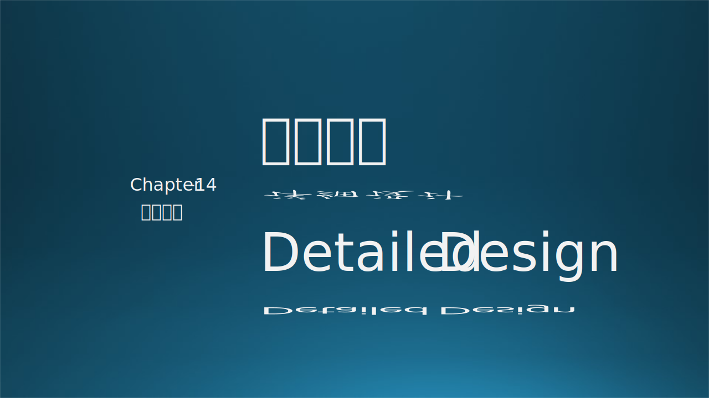
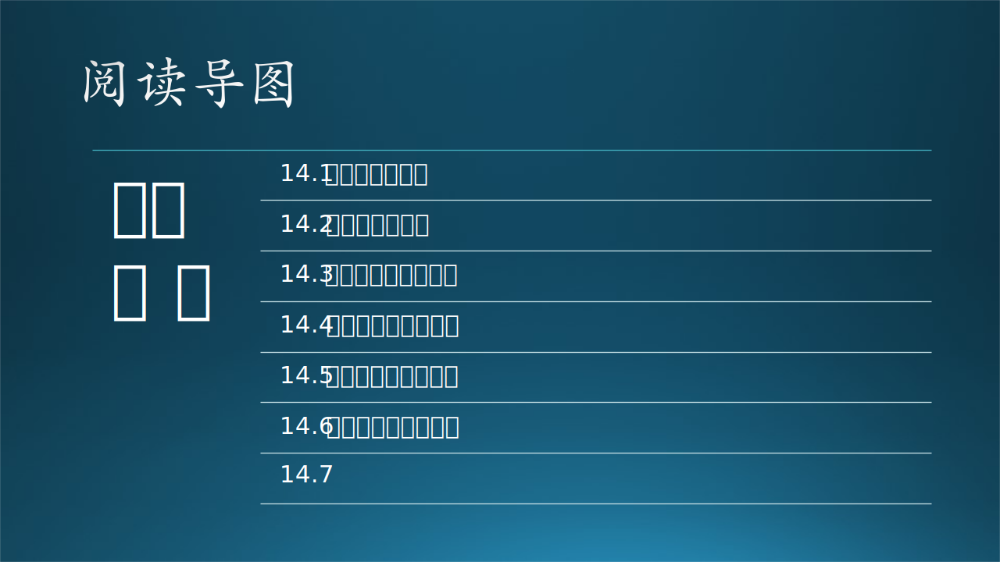

# 第十四章 详细设计

在第十三章中有了架构设计和概要设计的基础知识，在本章中我们首先将回忆软件设计的目标与原则，既在详细设计中需要特别注意的内聚与耦合，以及软件界著名的七个设计原则。其中加入了笔者自己的很多独特观点。然后在后续的连续几个小节内将通过一个真实的小型 AI 系统讲解软件系统从分析到设计的整个过程，是一个概要设计+详细设计的混合实例。

本章的标题虽然是详细设计，但是笔者更赞成用“精细的概要设计”来代替详细设计，只写必要的设计细节。更重要的是，笔者作为本章中实际案例的设计师把自己的设计思考过程呈现给读者，相信会得到事半功倍的讲解效果。

