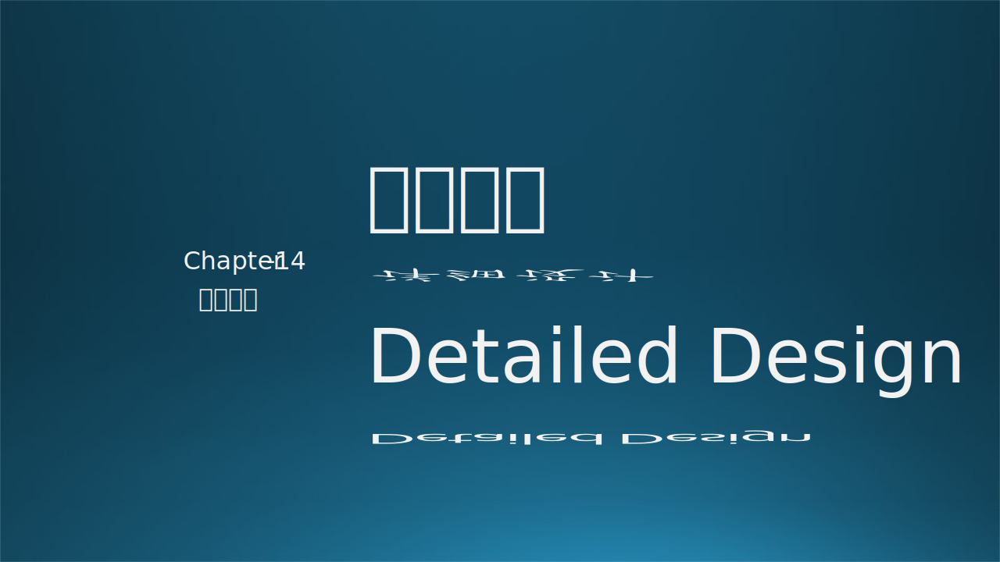
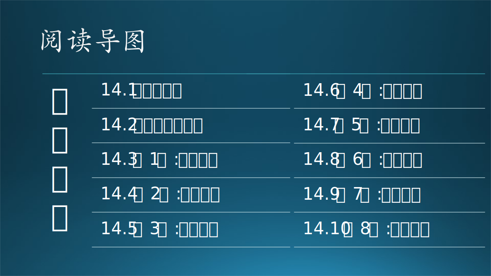

在第十三章中有了架构设计和概要设计的基础知识，在本章中我们首先将直接给出详细设计说明书的模板；然后讲解在详细设计中需要注意的一些设计原则，比如耦合与内聚；而在后续的连续几个小节内将通过一个真实的小型 AI 系统讲解软件系统从分析到设计的整个过程，是一个概要设计+详细设计的混合实例。

### 参考资料

- 《软件工程》，李代平，杨成义，清华大学出版社
- Azure 技术网址
- 《代码中的软件工程》，孟宁，人民邮电出版社
