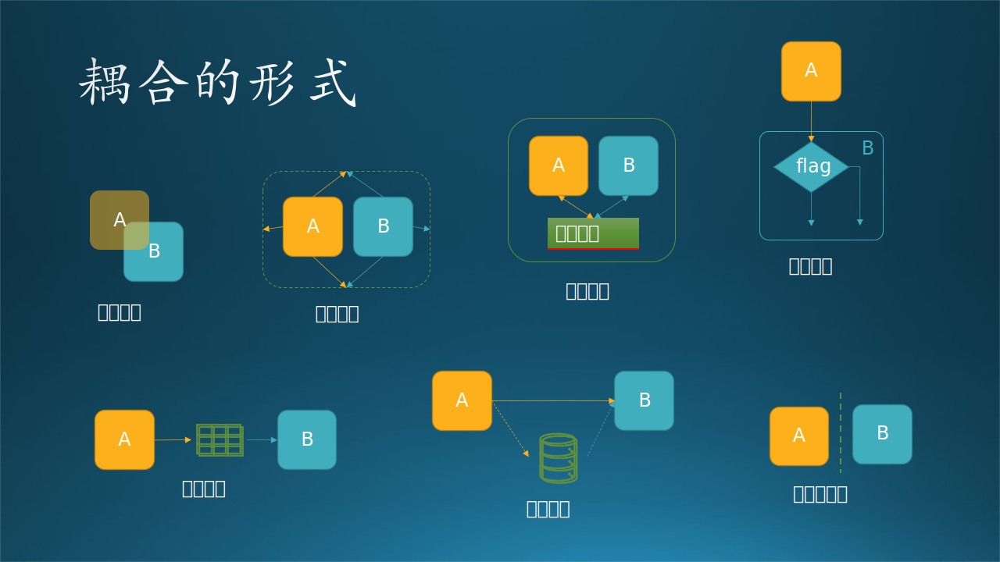

## 14.1 内聚与耦合

这一节的内容都是一些经典的知识，但又是软件设计的根本原则。熟悉的读者可以跳过。

在架构设计、概要设计中，我们常说要注意子系统/模块划分时高内聚低耦合$^{[1]}$，其实对于详细设计也是如此，而且由于有代码和数据结构的存在，从而会体现得更具体。


图 14-1 内聚与耦合

图 14-1 展示了内聚与耦合，右侧为推荐，左侧为不推荐。

### 14.1.1 模块内部的内聚

内聚是模块功能强度的度量，即模块内部各个元素彼此结合的紧密程度。一个模块内部各元素之间的紧密程度越高，则其内聚性越高，模块独立性越好。模块功能越单一，内聚性就越高，模块的独立性就越强。一个模块应该做好一个功能就可以了，不要面面俱到，不然难以维护。

需要说明的一点是，不同程度的内聚之间并非是线性关系的。上面的所有内聚类型中，偶然内聚和逻辑内聚是非常糟糕的内聚，而其它内聚都不错。只不过在不错之中，它们又能分出个高下。

以下按内聚性由低（不推荐）到高（推荐）排列。

#### 1. 偶然内聚

指一个模块内的各个函数或数据之间没有任何联系。

举例：把一推不相关的代码都生硬地组合在一个类里。
```python
add(int a, int b)  # 加法
split(str a, int b)  # 拆分字符串
```

可以想象成一群人在火车站大厅里候车，每个人的出行都是偶然的，大家互相也不认识，各做各事，所以叫做**偶然内聚**。

#### 2. 逻辑内聚

指模块内执行若干个逻辑上相似的功能，通过参数确定该模块完成哪一个功能。

举例：有多个加法运算代码块，分别处理参数为 int 或 float 或 double等。这些代码块之所以聚在一起，只是它们都是为了完成加法运算而已。

```python
add(int a, int b)  # 整数加法
add(float a, float b)  # 浮点数加法
add(double a, double b)  # 双精度浮点数加法
```

可以想象成在候车大厅里的一部分人登上了同一趟列车，**逻辑**上正是因为他们的出发点和目的地相同，所以都汇聚在车厢里。但笔者认为这一条应该是**空间内聚**。

#### 3. 时间内聚

指把需要同时执行的动作组合在一起形成的模块。

举例：类似于利用抽象工厂模式生成一碗粥，你可以先放水，也可以先放米，这两个动作之间没有必然的顺序，但为了生成一碗粥，需要同时执行这两个动作。

```python
a = create_thread(A)  # 创建线程 a, 执行对象 A 的逻辑
b = create_thread(B)  # 创建线程 b, 执行对象 B 的逻辑
thread.join(a, b)  # 等着二者都执行完毕

def A():  # A 的逻辑
   ... # 处理数据

def B():  # B 的逻辑
   ... # 调用外部系统的 API 完成权限认证
```

可以想象成在中午时段，旅客中有些人不想吃泡面，就跑到餐车去吃饭，有几个散客还不得不拼桌吃饭。这个时段就是**时间内聚**。

#### 4. 过程内聚

指一个模块完成多个任务，这些任务必须按照指定的过程执行。

举例：类似操纵数据库。你需要先获得connection对象，然后才能创建statement对象，最后才能执行sql语句。

```python
connection = db.get_connection()
sql = statement(...)
connection.exec(sql)

def db():  # db 类
    ...

def statement():  # statement 类
    ...

def connection():  # connection 类
    ....
```

可以想象成列车员推着小餐车卖盒饭，有一个旅客要买，列车员递给他盒饭，并等他扫码付费，然后旅客要求列车员开发票，列车员记录下座位号，1 小时后送来发票。旅客-列车员实际上产生了**过程内聚**。

#### 5. 通信内聚

指模块内的所有处理函数都在同一个数据结构上操作，或者各处理使用相同的输入数据或者产生相同的输出数据。

举例：有一个三个字段的数据结构数组，第一个函数只处理所有记录的第一个字段，第二个函数只处理所有记录的第二个字段，......，三个函数分别调用完毕后，这个数组才被处理完毕，模块完成处理功能。

可以想象成有些人没有吃饭，到了下午 2 点忽然觉得饿了，于是拿出手机来扫码购买盒饭。在供餐系统中，已经有 20 多位旅客交款后排队等候了，这些旅客在供餐系统的虚拟空间中产生了**通信内聚**。

#### 6. 顺序内聚

指一个模块中的各个函数都密切相关，并且函数必须顺序执行，前一函数的输出就是下一函数的输入。

举例：处理一批原始数据，先去掉含有非法数值的记录，紧接着针对某些字段做加和求平均值的处理并只保留结果字段，然后对该结果字段进行方差统计，最后给出分析结果。这一系列处理方法和顺序都是该针对该数据的特定流程，无法拆开或者复用于其它数据。

可以想象成旅客们吃饱喝足，睡了一会儿，感觉内急，于是纷纷起身去上厕所。但是厕所只允许一次一人使用，所以大家就在门口排队等候，于是产生了**顺序内聚**。

#### 7. 功能内聚

指模块内的所有函数共同作用完成一个功能，缺一不可。

举例：定义一个人的属性，如身高、体重、性别、种族、学历、身份证号码、籍贯、政治面貌等等，必须要全面，不能有遗漏，否则此人就无法被正确描述，或者和其它人混淆。然后还要描述此人的各种相貌特征、行为特征、心理特征等等。

可以想象成在解决内急后，有的旅客提出要打扑克，征得前排旅客的同意后，大家把座椅调整成面对面的，就一起愉快地玩儿起来。这时产生了**功能内聚**。

### 14.1.2 模块之间的耦合

耦合性（Coupling），也叫耦合度，是对模块间关联程度的度量。其耦合性越强，同时表明其独立性越差。模块之间联系少，耦合性就越低，模块之间的相对独立性就越强。模块应该管理好自己的事情就可以了，这样即不会太复杂，也便于专注的完成自己的事情。

对于耦合，如果模块间必须存在耦合，应尽量使用数据耦合，少用控制耦合，限制使用公共耦合的范围，坚决避免使用内容耦合。



图 14-2 耦合的七种形式

耦合的七种形式如图 14-2 所示，以下按耦合性由高（不推荐）到低（推荐）排列。

#### 1. 内容耦合

- A 访问 B 的内部数据。
- A 不通过正常接口而转到 B 的内部逻辑。
- A 和 B 有逻辑、代码重叠（只可能出现在汇编程序中）。
- 一个模块有多个入口（即该模块有多个功能）。

绝对避免使用内容耦合。目前的高级程序设计语言已经不允许有上面列表中第二种和第三种内容耦合形式了，但是第一种和第四种还需要程序员来避免。

#### 2. 公共环境耦合

两个或多个模块通过一个公共数据环境相互作用时，称为公共环境耦合。又可以分为两种情况：

- A 向环境中写数据，B 从环境中读数据。实际上是数据耦合的一种，属于松散耦合。
- A 和/或 B 既要写数据，也要读数据。实际上是控制耦合的一种，属于紧密耦合。

在实践中，通常使用 Linux 的公共环境来传递参数。但是这个环境谁都可以读写，所以非常不安全，除非这个环境中只有你自己的应用程序在运行。

#### 3. 外部耦合

模块间通过全局变量互相协作。

比如：模块 A 和模块 B 通过全局变量 status 来决定自己的行为。
```python
global status = 1  # 可选 1,2,3

model A():
    if status == 1:
        status = 2

model B():
    if status == 2:
        status = 3
```

#### 4. 控制耦合

如果 A 和 B 之间传递的信息中有控制信息，称为控制耦合。它属于中等程度的耦合，增加了系统的复杂程度。

指一个模块调用另一个模块时，传递的是控制变量，被调用模块通过该控制变量的值有选择地执行模块内的某一功能。因此，被调用模块应具有多个功能，哪个功能起作用受调用模块控制。

```python
def foo(a, b, flag):
    if flag:
        return a + b
    else:
        return a * b

bool flag = True  # 逻辑控制变量
result = foo(3.4, 1.5, flag)
```

#### 5. 标记耦合

指两个模块之间传递的是数据结构。

Python 中经常使用的 kwargs 参数实际上就是一个字典数据结构，比如：
```python
kwargs = {"kernel":(3, 3), "stride":(1, 1), "padding": (0, 0)}
convolution(data, kwargs)
```

#### 6. 数据耦合

如果两个模块通过参数交换信息，但是交换的信息仅仅是数据，则成为数据耦合。属于松散耦合。

比如：

- 模块 A 生成了一个文件，把文件的地址告诉模块 B，模块 B 使用该文件做后续处理。常见于技术架构中的管道-过滤器模式。
- 模块 A 在内存中生成了一段数据结构，然后把数据结构指针告诉模块 B。
- 模块 A 只是把一个字符串（比如某个机器的名字或 IP 地址）告诉模块 B。

#### 7. 无直接耦合

指两个模块之间没有直接的关系，它们分别从属于不同模块的控制与调用，它们之间不传递任何消息。

```python
model A(input):
    return result_A

model B(input):
    return result_B

main:
    input = 1
    result_A = A(input)
    result_B = B(result_A)
```
模块 A 和 B 互相不知道，通过主控过程 main 来先后调用它们，把 A 的结果输入 B，当然也有可能不到用 B 而调用其它模块。
