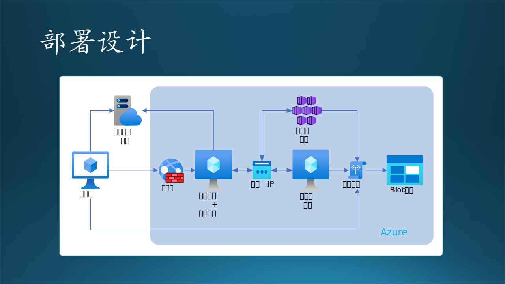

## 14.10 实现设计

### 14.10.1 开发设计

本系统的开发设计就不详述了，表 14-10 给出了一个概览。

表 14-10 开发设计概览

||运行环境|代码语言|第三方程序支持|
|--|-|--|-------|
|客户端模块|Windows 7|批处理文件|AzCopy.exe, curl.exe|
|控制中心|Windows 10| Python | Flask|
|模型管理模块| Windows 10| Python |第三方开源软件 ML-flow|
|推理子系统| Ubuntu 20.0| Python |Mongo DB, PyTorch, LightGBM|
|训练子系统| Windows主控 + Linux集群节点| Python| Mongo DB, PyTorch, LightGBM|

### 14.10.2 部署设计

图 14-24 物理部署设计

图 14-24 是物理部署设计，没有按照 UML 的标准部署图来绘制，因为 UML 部署图的图例不直观（不好看）。在阴影区域内的是 Azure 网络中的各种计算节点。

#### 0. 外部邮件系统

使用免费的 Hotmail/Outlook 邮箱发送通知邮件。

#### 1. 客户端

要求客户自己准了一台 Windows 7 计算机，对 CPU、内存、硬盘的要求都不高，取决于数据文件大小。可用连接互联网。

#### 2. 控制中心 + 模型管理

D16 v3，16 核 CPU，64G 内存，400G 临时存储。

该机器安装控制中心代码，使用 Python 写的。由于负载很低，同时安装了模型管理模块，是第三方的 ML-Flow。

#### 3. 推理子系统

E64-16s v3，504G 内存，64 核 CPU，864G 临时存储。此机器上只允许推理子系统。平时关机，使用前被控制中心用程序控制开机，推理结束后被控制关机。

使用虚拟机规模集构建可缩放的应用程序。通过 Azure 现成虚拟机和预留实例减少云支出。通过 Azure 专用主机构建私有云。在 Azure 中运行任务关键型应用程序以提高复原能力。

#### 4. 训练子系统

Azure Kubernetes 服务，2 个主控单元。最多预留 40 个节点，每个节点都是一台 NV6s v3, 112G 内存，336G 临时存储，1 块 V100 GPU。平时只有主控单元开机，集群关机，训练前收到控制中心通知后，主控单元打开集群，训练完毕后关闭集群。

由于应用程序扩展到跨多个服务器部署的多个容器，因此对其进行操作变得更加复杂。为了管理这种复杂性，Kubernetes 提供了一个开放源代码 API，用于控制这些容器的运行方式和位置。

Kubernetes 会根据虚拟机的可用计算资源和每个容器的资源要求，协调一组虚拟机并安排容器在这些虚拟机上运行。容器分组为 Pod (Kubernetes 的基本操作单位)，这些 Pod 可缩放到所需的状态。

Kubernetes 还会自动管理服务发现、合并负载均衡、跟踪资源分配并根据计算利用率进行缩放。此外，它还会检查单个资源的运行状态，并通过自动重启或复制容器使应用自行修复

#### 5. 存储

Azure Blob 存储服务，无限容量。

Blob 存储用于：

- 直接向浏览器提供图像或文档。
- 存储文件以供分布式访问。
- 对视频和音频进行流式处理。
- 向日志文件进行写入。
- 存储用于备份和还原、灾难恢复及存档的数据。
- 存储数据以供本地或 Azure 托管服务执行分析。

容器对一组 blob 进行组织，类似于文件系统中的目录。一个存储帐户可以包含无限数量的容器，一个容器可以存储无限数量的 Blob。

容器名称必须是有效的 DNS 名称，因为它是用于对容器或其 Blob 进行寻址的唯一 URI（统一资源标识符）的一部分。

Azure 存储支持三种类型的 Blob：

- 块 Blob 存储文本和二进制数据。块 Blob 由可以分别管理的数据块构成。块 blob 最多可存储约 190.7 TiB。
- 与块 Blob 一样，追加 Blob 也由块构成，但针对追加操作进行了优化。追加 Blob 非常适用于诸如记录来自虚拟机的数据之类的场景。
- 页 Blob 用于存储最大 8 TiB 的随机访问文件。页 blob 存储虚拟硬盘 (VHD) 文件并作为 Azure 虚拟机的磁盘。

#### 6. 网络

给控制中心申请了公网 IP，可以被客户端访问。在内部使用私有网路，连接控制中心、模型管理、训练子系统、推理子系统。

Azure 虚拟网络 (VNet) 是 Azure 中专用网络的基本构建块。使用 VNet 可以：

- Azure 资源之间的通信：可以将虚拟机和多个其他类型的 Azure 资源（例如 Azure 应用服务环境、Azure Kubernetes 服务 (AKS) 和 Azure 虚拟机规模集）部署到虚拟网络。若要查看可部署到虚拟网络的 Azure 资源的完整列表，请参阅虚拟网络服务集成。
- 相互通信：可以互相连接虚拟网络，使虚拟网络中的资源能够通过虚拟网络对等互连相互进行通信。连接的虚拟网络可以在相同或不同的 Azure 区域中。有关详细信息，请参阅虚拟网络对等互连。
- 与 Internet 通信：默认情况下，VNet 中的所有资源都可以与 Internet 进行出站通信。可以通过分配公共 IP 地址或公共负载均衡器来与资源进行入站通信。还可以使用公共 IP 地址或公共负载均衡器来管理出站连接。
与本地网络通信：可以使用 VPN 网关或 ExpressRoute 将本地计算机和网络连接到虚拟网络。

#### 7. 安全

在控制中心前加了防火墙，以保证控制中心不被攻击。

Azure 防火墙是一种云原生的智能网络防火墙安全服务，用于为 Azure 中运行的云工作负载提供最高水平的威胁防护。它是一个服务形式的完全有状态防火墙，具有内置的高可用性和不受限制的云可伸缩性。它提供东西流量和南北流量检查。
