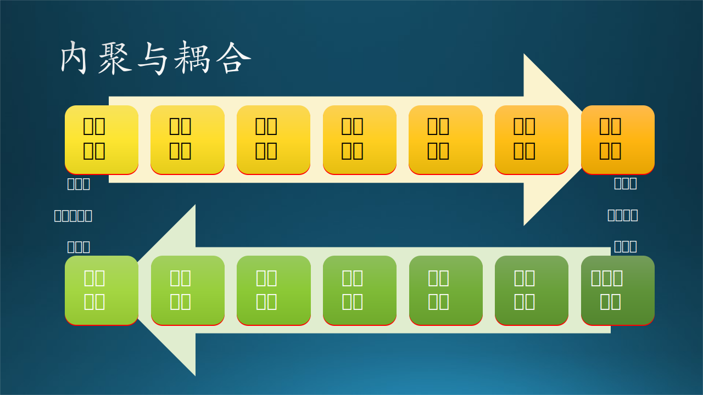

## 14.2 设计原则与实例

这一节的内容都是一些经典的知识，熟悉的读者可以跳过。

在架构设计、概要设计中，我们常说要注意子系统/模块划分时高内聚低耦合，其实对于详细设计也是如此，而且由于有代码和数据结构的存在，从而会体现得更具体。



图 14.2.1 内聚与耦合

图 14.2.1 展示了内聚与耦合，右侧为推荐，左侧为不推荐。

### 14.2.1 模块的内聚

内聚是模块功能强度的度量，即模块内部各个元素彼此结合的紧密程度。一个模块内部各元素之间的紧密程度越高，则其内聚性越高，模块独立性越好。

模块功能越单一，内聚性就越高，模块的独立性就越强。一个模块应该做好一个功能就可以了，不要面面俱到，不然难以维护。

需要说明的一点是，不同程度的内聚之间并非是线性关系的。上面的所有内聚类型中，偶然内聚和逻辑内聚是非常糟糕的内聚，而其它内聚都不错。只不过在不错之中，它们又能分出个高下。

以下按内聚性由低（不推荐）到高（推荐）排列。


#### 1. 偶然内聚

指一个模块内的各个函数或数据之间没有任何联系。

举例：把一推不相关的代码都生硬地组合在一个类里。
```
add(int a, int b)  # 加法
split(str a, int b)  # 拆分字符串
```

可以想象成一群人在火车站大厅里候车，每个人的出行都是偶然的，大家互相也不认识，所以叫做**偶然内聚**。

#### 2. 逻辑内聚

指模块内执行若干个逻辑上相似的功能，通过参数确定该模块完成哪一个功能。

举例：有多个加法运算代码块，分别处理参数为 int 或 float 或 double等。这些代码块之所以聚在一起，只是它们都是为了完成加法运算而已。

```
add(int a, int b)  # 整数加法
add(float a, float b)  # 浮点数加法
add(double a, double b)  # 双精度浮点数加法
```

在候车大厅里的一部分人登上了同一趟列车，**逻辑**上正是因为他们的出发点和目的地相同，所以都汇聚在车厢里。但笔者认为这一条应该是**空间内聚**。

#### 3. 时间内聚

指把需要同时执行的动作组合在一起形成的模块。

举例：类似于利用抽象工厂模式生成一碗粥，你可以先放水，也可以先放米，这两个动作之间没有必然的顺序，但为了生成一碗粥，需要同时执行这两个动作。

```
a = create_thread(A)  # 创建线程 a, 执行对象 A 的逻辑
b = create_thread(B)  # 创建线程 b, 执行对象 B 的逻辑
thread.join(a, b)  # 等着二者都执行完毕

def A():  # A 的逻辑
   ... # 处理数据

def B():  # B 的逻辑
   ... # 调用外部系统的 API 完成权限认证
```

在中午时段，旅客中有些人不想吃泡面，就跑到餐车去吃饭，有几个散客还不得不拼桌吃饭。这个时段就是**时间内聚**。

#### 4. 过程内聚

指一个模块完成多个任务，这些任务必须按照指定的过程执行。

举例：类似操纵数据库。你需要先获得connection对象，然后才能创建statement对象，最后才能执行sql语句。

```
connection = db.get_connection()
sql = statement(...)
connection.exec(sql)

def db():  # db 类
    ...

def statement():  # statement 类
    ...

def connection():  # connection 类
    ....
```

列车员推着小餐车卖盒饭，左侧有一个旅客要买，列车员递给他盒饭，并等他扫码付费，可是这位旅客。此时，另外一侧也有个旅客要买，并很快

坐在车头方向的旅客先买到了盒饭，而坐在车尾方向的旅客不得不等着列车员推到自己座位旁边时再挑选盒饭，但是发现 20 块钱的盒饭已经卖完了，只有 60 块钱一盒的了。在这个过程中，旅客 A-列车员-旅客 B，实际上产生了**过程内聚**。

#### 5. 通信内聚

指模块内的所有处理函数都在同一个数据结构上操作，或者各处理使用相同的输入数据或者产生相同的输出数据。

举例：有一个三个字段的数据结构数组，第一个函数只处理所有记录的第一个字段，第二个函数只处理所有记录的第二个字段，......，三个函数分别调用完毕后，这个数组才被处理完毕，模块完成处理功能。

有些人没有吃饭，到了 2 点忽然觉得饿了，于是拿出手机来扫码购买盒饭。在供餐系统中，已经有 20 多位旅客交款后排队等候了，这些旅客在供餐系统的虚拟空间中产生了**通信内聚**。

#### 6. 顺序内聚

指一个模块中的各个函数都密切相关，并且函数必须顺序执行，前一函数的输出就是下一函数的输入。

举例：处理一批原始数据，先去掉含有非法数值的记录，紧接着针对某些字段做加和求平均值的处理并只保留结果字段，然后对该结果字段进行方差统计，最后给出分析结果。这一系列处理方法和顺序都是该针对该数据的特定流程，无法拆开或者复用于其它数据。

吃饱喝足，睡了一会儿，旅客们感觉内急，于是纷纷起身去上厕所。但是厕所只允许一次一人使用，所以大家就在门口排队等候，于是产生了**顺序内聚**。

#### 7. 功能内聚

指模块内的所有函数共同作用完成一个功能，缺一不可。

举例：定义一个人的属性，如身高、体重、性别、种族、学历、身份证号码、籍贯、政治面貌等等，必须要全面，不能有遗漏，否则此人就无法被正确描述，或者和其它人混淆。然后还要描述此人的各种相貌特征、行为特征、心理特征等等。

解决内急后，有的旅客提出要打扑克，征得前排旅客的同意后，大家把座椅调整成面对面的，就一起愉快地玩儿起来。这时产生了**功能内聚**。

### 14.2.2 模块的耦合

模块之间联系少，耦合性就越低，模块之间的相对独立性就越强。模块应该管理好自己的事情就可以了，这样即不会太复杂，也便于专注的完成自己的事情。

对于耦合，如果模块间必须存在耦合，应尽量使用数据耦合，少用控制耦合，限制使用公共耦合的范围，坚决避免使用内容耦合。

以下按耦合性由高（不推荐）到低（推荐）排列。

https://zhuanlan.zhihu.com/p/36165067 例子

#### 1. 内容耦合

- A 访问 B 的内部数据。
- A 不通过正常接口而转到 B 的内部逻辑。
- A 和 B 有逻辑、代码重叠（只可能出现在汇编程序中）。
- 一个模块有多个入口（即该模块有多个功能）。

绝对避免使用内容耦合。目前的高级程序设计语言已经不允许有第二种和第三种内容耦合形式了，但是第一种和第四种还需要程序员来避免。

#### 2. 公共环境耦合

两个或多个模块通过一个公共数据环境相互作用时，称为公共环境耦合。又可以分为两种情况：

- A 向环境中写数据，B 从环境中读数据。实际上是数据耦合的一种，属于松散耦合。
- A 和/或 B 既要写数据，也要读数据。实际上是控制耦合的一种，属于紧密耦合。

#### 3. 外部耦合

模块间通过软件之外的环境联结。
（如I/O将模块耦合到特定的设备、格式、通信协议上）

#### 4. 控制耦合

如果 A 和 B 之间传递的信息中有控制信息，称为控制耦合。它属于中等程度的耦合，增加了系统的复杂程度。

指一个模块调用另一个模块时，传递的是控制变量，被调用模块通过该控制变量的值有选择地执行模块内的某一功能。因此，被调用模块应具有多个功能，哪个功能起作用受调用模块控制。
（类似于计算工资模块，调用它的模块先区别是普通员工还是经理，进而生成控制变量，传递给计算工资模块进而选择其中一种计算功能）


#### 5. 标记耦合

指两个模块之间传递的是数据结构。
（类似于高级语言中的引用传递）

#### 6. 数据耦合

如果两个模块通过参数交换信息，但是交换的信息仅仅是数据，则成为数据耦合。属于松散耦合。

比如：

- 模块 A 生成了一个文件，把文件的地址告诉模块 B，模块 B 使用该文件做后续处理。常见于技术架构中的管道-过滤器模式。
- 模块 A 在内存中生成了一段数据结构，然后把数据结构指针告诉模块 B。
- 模块 A 只是把一个字符串（比如某个机器的名字或 IP 地址）告诉模块 B。

#### 7. 无直接耦合

指两个模块之间没有直接的关系，它们分别从属于不同模块的控制与调用，它们之间不传递任何消息。

### 14.2.3 七个原则

#### 1. 单一职责原则

Single Responsibility Principle

#### 2. 开闭原则

Open Closed Principle

#### 3. 里氏替换原则

Liskov Subtitution Principle

#### 4. 迪米特法则

Law of Demeter

#### 5. 接口隔离原则

Interface Segregation Principle

#### 6. 依赖倒置原则

Dependence Inversion Principle

#### 7. 合成复用原则

### 14.2.4 详细设计实例

如果没有概要设计，是无法进行详细设计的。有一个特例是，在已有系统的上的修补，比如新增加一个功能模块，由于对这个系统非常熟悉了，但是又找不到该系统的原始的概要设计，此时可以直接给出该新增模块的详细设计。

在本章后续几小节中，我们将会用一个实例来介绍详细设计的各种关注点。由于该系统没有概要设计，所以我们将采用概要设计+详细设计的混合方式来介绍。

【最佳实践】根据敏捷原则，尽量减少文档数量，只写必要的。所以笔者推荐：
- 当遇到小型系统时，只写稍微概要（粗略）一些的详细设计，而不写概要设计。所谓粗略，就是不必画类和对象图、每个模块的流程图等等。
- 当遇到中型系统时，只写稍微详细（精细）一些的概要设计，而不写详细设计。所谓精细，就是要写一些架构设计方面的内容，也要有一些主要模块的描述，上下兼顾。
- 遇到大系统时，要写架构设计，目的是进行系统分解，然后对于每个子系统按中型系统对待。


在本章中，，最开始的两个小节会复习一下需求分析的内容，以便和后面的系统设计形成完整的上下文。这个实际案例并不复杂，规模偏小，但是却正好可以用于讲解，而且是现代软件工程中常见的 AI 模型落地的应用。


|步骤：|1.描述原始功能|2.提取静态结构|3.捕捉动态行为|4.计划代码结构|5.制定部署方案|
|--|--|--|--|--|--|
|功能分解法|功能|子功能|功能接口|
|结构化分析法|系统关系图，顶层数据流图|数据存储，端点|数据处理，数据流|
|信息建模法|原始信息|对象和属性|关系类型，关联对象|
|面向对象法|功能模型|对象模型|动态模型|
|RUP 4+1 view|Scenario View|逻辑视图|进程视图|开发视图|物理视图|
|图例类型|用例图|静态图|行为图|构件图|部署图|
|UML图例|用例图|类图、对象图|活动图，顺序图，协作图，状态图|组件图|配置图|
|作用|从外部用户的角度描述系统的功能，并指出功能的执行者|初步分析后得出系统中的各个行为主体|从不同侧面描述客户系统的状态和行为|描述软件实现代码的组成|描述软件实现系统的组成和分布状况||
|其它图例|数据流图，鲁棒图|包图，关联图，E-R图，结构图|

